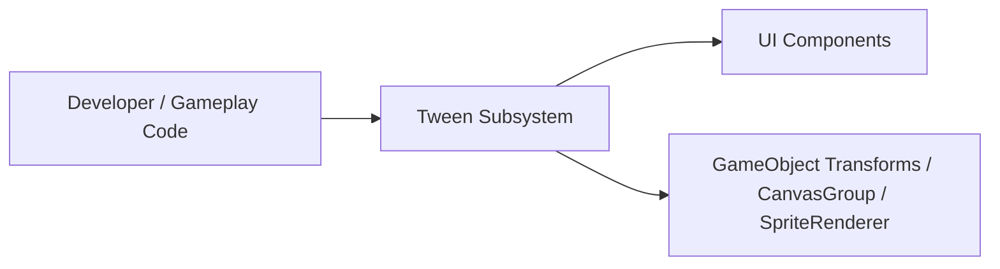
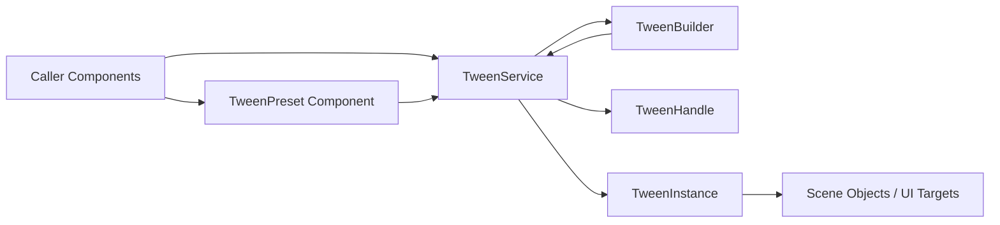
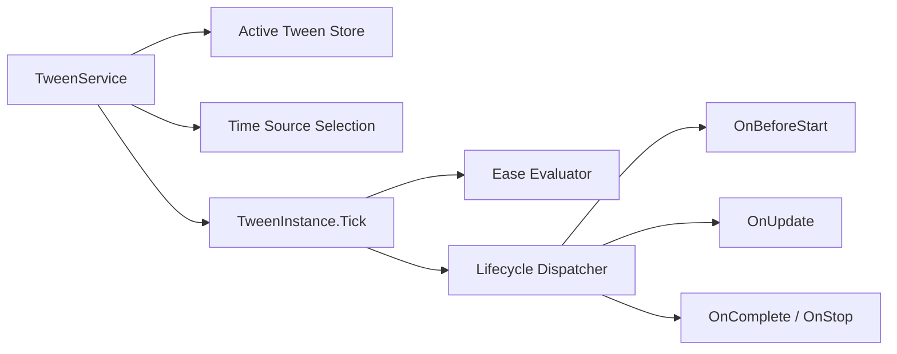
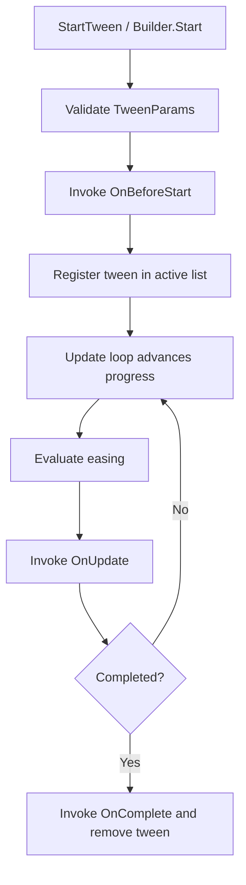

# Tween Service Plan (v1)

## Goal
Introduce a small internal tween system for UI and simple presentation effects (fade, slide, scale) without Animator Controller overhead.

This plan targets:
- callback-driven tween updates during effect duration
- optional easing + progress values passed to callback
- events before start and after end
- component-level default easing/duration with simple `Start/Pause/Stop` calls
- optional fluent builder API

No chaining/sequences in v1.

## Recommended Approach
Use a **lightweight in-project TweenService** (not external package for now).

Why this is optimal now:
- requirements are small and clear
- avoids adding third-party dependency and migration cost
- keeps behavior explicit and debuggable
- easy to extend later (sequence, loops, delays, yoyo, async wrappers)

If future requirements grow significantly (complex timelines, editor tooling, advanced sequencing), add an adapter layer and optionally switch backend to DOTween later without changing gameplay/UI call sites.

## Proposed Runtime Design

### 1. Core Types
- `TweenParams` (immutable data): duration, easing, use unscaled time, callbacks/events.
- `TweenHandle` (runtime control): `Pause()`, `Resume()`, `Stop()`, `IsRunning`, `IsPaused`.
- `TweenService` (MonoBehaviour service, exposed as `G.Tween`): thin Unity-facing shell that only owns and updates active tweens.
- `TweenInstance` (plain C# runtime object): holds tween state, advances progress, and dispatches lifecycle callbacks.
- `Ease` static formulas + `EaseType` enum.

### 2. Callback Model
- `OnBeforeStart` (event): called once before first update tick.
- `OnUpdate(float eased, float progress)`:
  - `progress` = linear 0..1
  - `eased` = eased 0..1
- `OnComplete` (event): called once when tween reaches end.
- `OnStop` (optional event): called when manually stopped before completion.

This satisfies both:
- simple mode: ignore `eased`, use only `progress`
- advanced mode: use `eased` for final value interpolation

### 2.1 Service Thinness Rule
Keep `TweenService` intentionally thin.

`TweenService` should only:
- create `TweenInstance` objects
- store active instances
- select scaled vs unscaled delta time
- forward `Pause/Resume/Stop` through handles
- remove completed/stopped tweens

`TweenService` should not:
- contain easing formulas
- contain lifecycle decision logic beyond list management
- directly implement tween progression rules
- become a generic animation manager

This keeps Unity integration simple and makes the core tween behavior easy to test in edit mode.

### 3. Per-Component Defaults (Your #4)
Add reusable component such as `TweenPreset`:
- serialized defaults: `duration`, `easeType`, `useUnscaledTime`
- runtime methods: `Play(Action<float,float> onUpdate)`, `Pause()`, `Resume()`, `Stop()`

This lets designers set easing once in Inspector and game code only triggers start/stop/pause.

### 4. Optional Builder (Your #5)
Add fluent builder as thin wrapper over `TweenParams`.

Example shape:
- `G.Tween.New()`
- `.Duration(0.2f)`
- `.Ease(EaseType.OutCubic)`
- `.UnscaledTime(true)`
- `.OnBeforeStart(...)`
- `.OnUpdate((eased, progress) => ...)`
- `.OnComplete(...)`
- `.Start()`

Builder should stay optional. Core API must remain available without it.

### 5. Builder Entry Recommendation
Do not make `duration` and `onUpdate` mandatory in the only `New()` signature.

Recommended shape:
- keep `New()` parameterless for extension-friendly fluent setup
- add convenience overload `New(float duration, Action<float, float> onUpdate)` for the common case
- validate required fields in `Start()`

Why:
- future extension is easier if the default entry point does not hardcode today's minimum field set
- later you may want alternate tween kinds that do not fit the same callback shape cleanly
- required-parameter constructors are fine for `TweenParams`, but less flexible for a builder API

Practical recommendation:
- `StartTween(TweenParams params)` should require valid `Duration` and `OnUpdate`
- `TweenService.New()` should stay parameterless
- `TweenService.New(float duration, Action<float, float> onUpdate)` can exist as sugar

## Suggested File Placement
Based on current project layout:
- `Assets/Game/Core/Services/Tween/TweenService.cs`
- `Assets/Game/Core/Services/Tween/TweenHandle.cs`
- `Assets/Game/Core/Services/Tween/TweenParams.cs`
- `Assets/Game/Core/Services/Tween/TweenInstance.cs`
- `Assets/Game/Core/Services/Tween/Ease.cs`
- `Assets/Game/Core/Services/Tween/TweenBuilder.cs` (optional)
- `Assets/Game/Core/UI/TweenPreset.cs` (or feature-local if only used by specific UI module)

Bootstrap integration:
- add `public static TweenService Tween { get; internal set; }` to `G`
- create service in `GInit` via `GetOrCreate<TweenService>("TweenService")`
- avoid `[SerializeField]` config in service itself (per project rule)

## Basic API Sketch
```csharp
public enum EaseType {
    Linear,
    InQuad,
    OutQuad,
    InOutQuad,
    InCubic,
    OutCubic,
    InOutCubic
}

public readonly struct TweenParams {
    public readonly float Duration;
    public readonly EaseType EaseType;
    public readonly bool UseUnscaledTime;
    public readonly Action OnBeforeStart;
    public readonly Action<float, float> OnUpdate; // eased, progress
    public readonly Action OnComplete;
    public readonly Action OnStop;
}

public sealed class TweenHandle {
    public bool IsRunning { get; }
    public bool IsPaused { get; }
    public void Pause() { }
    public void Resume() { }
    public void Stop() { }
}

public sealed class TweenService : MonoBehaviour {
    public TweenHandle StartTween(TweenParams tweenParams) { }
    public TweenBuilder New() { }
    public TweenBuilder New(float duration, Action<float, float> onUpdate) { }
}
```

## Usage Examples

### A) Fade In (simple)
```csharp
G.Tween.StartTween(new TweenParams(
    duration: 0.25f,
    easeType: EaseType.Linear,
    useUnscaledTime: true,
    onBeforeStart: () => { canvasGroup.alpha = 0f; },
    onUpdate: (eased, progress) => { canvasGroup.alpha = progress; },
    onComplete: () => { canvasGroup.alpha = 1f; },
    onStop: null
));
```

### B) Scale Pop (eased)
```csharp
G.Tween.StartTween(new TweenParams(
    duration: 0.18f,
    easeType: EaseType.OutCubic,
    useUnscaledTime: true,
    onBeforeStart: null,
    onUpdate: (eased, progress) => {
        float s = Mathf.LerpUnclamped(0.8f, 1f, eased);
        target.localScale = new Vector3(s, s, 1f);
    },
    onComplete: null,
    onStop: null
));
```

### C) Builder Sugar
```csharp
G.Tween
    .New(0.18f, (eased, progress) => {
        float s = Mathf.LerpUnclamped(0.8f, 1f, eased);
        target.localScale = new Vector3(s, s, 1f);
    })
    .Ease(EaseType.OutCubic)
    .UnscaledTime(true)
    .OnBeforeStart(() => { target.localScale = Vector3.one * 0.8f; })
    .OnComplete(() => { target.localScale = Vector3.one; })
    .Start();
```

## C4 Diagrams (Corrected)

### C4 Level 1 (Context)


### C4 Level 2 (Container)


### C4 Level 3 (Component)


## Runtime Lifecycle (Non-C4)


## Implementation Stages
1. **Stage 1 (MVP, recommended now)**
   - `TweenService`, `TweenParams`, `TweenHandle`, `TweenInstance`, `EaseType + Ease`
   - start/pause/resume/stop
   - before-start + complete events
2. **Stage 2**
   - `TweenPreset` component for Inspector defaults
   - optional `TweenBuilder` fluent API
3. **Stage 3 (if needed later)**
   - sequence/chaining
   - delay, loops, yoyo
   - cancellation tokens / async wrappers

## Important Notes For This Project
- Prefer `useUnscaledTime = true` for menus and pause UI effects.
- For pixel-perfect UI movement, snap final values (and optionally per-frame values) to integer/pixel grid where needed.
- Keep tween usage out of core gameplay physics movement unless explicitly intended.
- Do not rename serialized fields casually in tween preset components after adoption.

## Test Strategy
This design is straightforward to test if `TweenService` stays thin and `TweenInstance` owns the actual tween logic.

Recommended test split:
- **Edit Mode unit tests** for `Ease` formulas
- **Edit Mode unit tests** for `TweenInstance.Tick(deltaTime)`
- minimal **Edit Mode tests** for `TweenHandle`
- optional small integration test for `TweenService` list management

Key cases to cover:
- `OnBeforeStart` is called once
- `OnUpdate` receives expected `progress` and `eased` values
- `OnComplete` fires once at end
- `OnStop` fires on manual stop
- pause/resume preserves progress correctly
- zero-duration tween completes immediately
- invalid `TweenParams` are rejected predictably
- `useUnscaledTime` selection is respected by the service

Testing rule:
- put progression rules in `TweenInstance`
- keep `TweenService` limited to Unity-facing orchestration
- avoid hiding core behavior inside `MonoBehaviour.Update()` only

With that structure, tests are not complicated. Most of them are deterministic edit mode tests and do not need scene setup or frame-based Play Mode execution.

## Decision Summary
For current scope, implement a **small internal TweenService** with optional builder and preset component.
Keep `TweenService` thin and put tween progression in `TweenInstance`.
It covers all listed requirements with minimal risk and keeps a clean upgrade path for future advanced animation needs.
