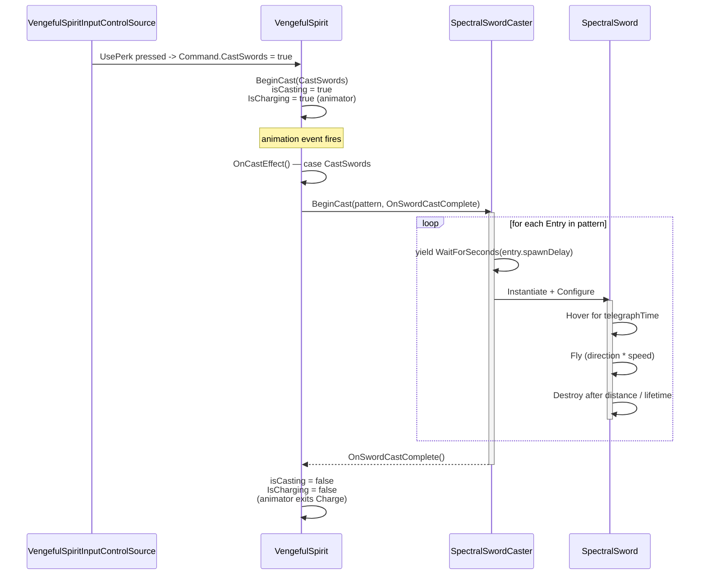

# 10 - Spectral Swords (Vengeful Spirit)

## Goal

Give the Vengeful Spirit boss a ranged "spectral swords" attack: while the boss
charges, a row of ghostly swords materializes above the play area with a small
per-sword delay, hovers briefly to telegraph, then flies diagonally across the
screen. Swords ignore the level (no environment collision) but damage the
player on contact.

Patterns and counts must be swappable so subsequent boss stages can fire
different waves (more swords, mirrored direction, alternating telegraphs, etc.)
without code changes.

## Behaviour Summary

1. Trigger: input source observes `UsePerk` and emits a `CastSwords` flag in
   the command struct.
2. The boss enters the existing **Charge** state (`isCasting = true`,
   `IsCharging` animator bool true). Movement is locked.
3. A **caster coroutine** materializes swords in sequence. Each sword:
   - spawns above the camera at a deterministic lateral offset,
   - hovers in place for a short telegraph time,
   - then flies diagonally across the screen,
   - despawns after travelling its configured distance or after a lifetime
     timeout.
4. Once the spawn sequence ends and the last sword has launched, the boss
   exits the Charge state (`isCasting = false`).
5. Swords have only a trigger collider + a `Damager` (SingleHit, Player layer).
   They do not collide with the level.

## Current State (What to Reuse)

| System | File | Reused for |
|---|---|---|
| Cast lifecycle (`isCasting`, `BeginCast`, `OnCastEffect`, `OnCastAnimationEnd`) | `Assets/Game/Features/Bosses/VengefulSpirit/VengefulSpirit.cs` | Sword cast slots into the existing cast pattern, just with a new `VengefulSpiritCastAction` value. |
| Animator parameter `IsCharging` | `Anim/_VengefulSpiritSprites.controller` | Re-used as-is. The Charge state is already a loop, perfect for a multi-second cast. |
| Input action `UsePerk` | `Assets/Game/System/InputActions.cs` (autogenerated) | Already exists (`S` / gamepad RT). No `.inputactions` change required. |
| `Damager` / `Damageable` (`DamagerType.SingleHit`, `targetLayers`, `destroyOnContact`) | `Assets/Game/Core/Components/Damage/{Damager,Damageable}.cs` | Each sword carries a Damager pointed at the Player layer. |
| Camera bounds via `Camera.main.orthographicSize` | Same pattern as `ParallaxLayer` | Compute "above-screen" spawn line. |

What is **not** reused:
- `ProjectileBase` is geared toward straight ricocheting bullets and forces a
  Rigidbody2D model. Swords have a hover phase and ignore the level entirely,
  so a small bespoke `SpectralSword` MonoBehaviour is simpler than fighting
  `ProjectileBase`'s movement abstraction.
- No object pool exists in the project; sword counts are small (single-digit
  per cast), direct `Instantiate` / `Destroy` is fine — same convention as the
  shield and the existing trap projectiles.

## Architecture

The feature lives under the boss's feature folder, isolated in a sub-package:

```
Assets/Game/Features/Bosses/VengefulSpirit/SpectralSwords/
    SpectralSword.cs            -- runtime MonoBehaviour on the sword prefab
    SpectralSwordCaster.cs      -- MonoBehaviour on the boss; orchestrates a cast
    SpectralSwordPattern.cs     -- ScriptableObject describing a single wave
    SpectralSword.prefab        -- sword sprite + trigger collider + Damager + SpectralSword
    Patterns/
        Wave_Stage1.asset       -- default pattern (e.g. 4 swords, left-to-right)
        Wave_Stage2.asset       -- denser pattern, used in stage 2
```

Responsibility split:

| Concern | Owner |
|---|---|
| Per-sword runtime (hover -> fly -> despawn) | `SpectralSword` |
| Wave authoring data (count, spacing, timings, directions) | `SpectralSwordPattern` (ScriptableObject) |
| Spawn sequencing, coroutine timing, completion callback | `SpectralSwordCaster` |
| Cast trigger, isCasting/animator gating, dispatch | `VengefulSpirit` (existing cast plumbing) |
| Reading `UsePerk` and emitting the command flag | `VengefulSpiritInputControlSource` |

The boss controller stays thin: it just selects a pattern and asks the caster
to run it. The caster is a separate component so the boss class doesn't grow
yet another coroutine and another set of serialized fields per stage.

## Cast Flow



Cast completion is **driven by the caster**, not by `OnCastAnimationEnd`. The
Charge state loops, so the C# side decides when it ends. The existing
`OnCastAnimationEnd` hook stays untouched (still used by the Shield cast).

## Component Details

### `SpectralSwordPattern` (ScriptableObject)

Authoring asset that fully describes a wave. A `[CreateAssetMenu]` entry under
"Vengeful Spirit / Spectral Sword Pattern" produces tuning-friendly assets.

```csharp
// Assets/Game/Features/Bosses/VengefulSpirit/SpectralSwords/SpectralSwordPattern.cs
[CreateAssetMenu(menuName = "Vengeful Spirit/Spectral Sword Pattern")]
public class SpectralSwordPattern : ScriptableObject {
    [Serializable]
    public struct Entry {
        [Tooltip("Delay BEFORE this sword spawns, measured from the previous spawn (or cast start for the first).")]
        public float spawnDelay;

        [Tooltip("Horizontal offset from the camera centre at spawn time, in world units.")]
        public float lateralOffset;

        [Tooltip("Vertical offset above the visible camera top edge, in world units.")]
        public float verticalOffset;

        [Tooltip("Telegraph hover duration before the sword starts flying.")]
        public float telegraphTime;

        [Tooltip("Normalized fly direction (will be normalised at runtime). Typical: (1, -1) or (-1, -1).")]
        public Vector2 flightDirection;

        [Tooltip("Per-entry speed override. <= 0 falls back to pattern default.")]
        public float flightSpeedOverride;
    }

    [SerializeField] private Entry[] entries;
    [SerializeField] private float defaultFlightSpeed = 12f;
    [SerializeField] private float defaultMaxTravelDistance = 24f;
    [SerializeField] private float defaultLifetime = 4f;

    public IReadOnlyList<Entry> Entries => entries;
    public float DefaultFlightSpeed => defaultFlightSpeed;
    public float DefaultMaxTravelDistance => defaultMaxTravelDistance;
    public float DefaultLifetime => defaultLifetime;
}
```

**Why ScriptableObject:** different stages can ship a different
`SpectralSwordPattern` asset without code, and patterns are shareable across
boss instances. Per-entry overrides keep the common case (uniform speed/range)
terse while still allowing one-off tweaks.

A few canonical example assets to ship:

- `Wave_Stage1.asset` — 4 entries, evenly spaced lateral offsets across the
  screen width, identical telegraph time, all flying `(1, -1)` (down-right).
- `Wave_Stage2.asset` — 6 entries, alternating telegraph times for a
  staggered look, mixed `(1,-1)` / `(-1,-1)` directions.

### `SpectralSword` (MonoBehaviour)

```csharp
// Assets/Game/Features/Bosses/VengefulSpirit/SpectralSwords/SpectralSword.cs
[RequireComponent(typeof(Collider2D), typeof(Damager))]
public class SpectralSword : MonoBehaviour {
    [SerializeField] private SpriteRenderer spriteRenderer;
    [SerializeField] private float fadeInTime = 0.1f;
    [SerializeField] private float fadeOutTime = 0.2f;

    private Vector2 flightDirection;
    private float flightSpeed;
    private float telegraphTime;
    private float maxTravelDistance;
    private float lifetime;

    private float elapsed;
    private float travelled;
    private bool isFlying;
    private Vector2 spawnPosition;

    public void Configure(Vector2 direction, float speed, float telegraph, float maxDistance, float life) {
        flightDirection   = direction.sqrMagnitude > 0f ? direction.normalized : Vector2.down;
        flightSpeed       = speed;
        telegraphTime     = telegraph;
        maxTravelDistance = maxDistance;
        lifetime          = life;
        spawnPosition     = transform.position;
    }

    private void Update() {
        elapsed += Time.deltaTime;

        if (!isFlying) {
            if (elapsed >= telegraphTime) {
                isFlying = true;
            }
            return;
        }

        Vector2 step = flightDirection * (flightSpeed * Time.deltaTime);
        transform.position += (Vector3)step;
        travelled += step.magnitude;

        if (travelled >= maxTravelDistance || elapsed >= telegraphTime + lifetime) {
            Destroy(gameObject);
        }
    }
}
```

**Prefab setup (`SpectralSword.prefab`):**
- Sprite (ghostly sword art)
- `BoxCollider2D`, `isTrigger = true`, sized to the sword silhouette
- `Damager`, `type = SingleHit`, `damage = 1` (tunable), `targetLayers = Player`,
  `destroyOnContact = false` (the sword should keep flying so it can reach the
  ground; the Damager's `SingleHit` already prevents repeat hits)
- **No** `Rigidbody2D` — the sword moves via `transform.position` and ignores
  the level entirely. Trigger collisions still work without one.
- `SpectralSword` script

Optionally a small fade-in / fade-out via `spriteRenderer` driven by the
`elapsed` timer. (Skipping the fades is fine for stage 1.)

### `SpectralSwordCaster` (MonoBehaviour on the boss)

```csharp
// Assets/Game/Features/Bosses/VengefulSpirit/SpectralSwords/SpectralSwordCaster.cs
public class SpectralSwordCaster : MonoBehaviour {
    [SerializeField] private GameObject swordPrefab;
    [SerializeField] private SpectralSwordPattern defaultPattern;

    [Tooltip("Extra vertical headroom above the camera top edge for the spawn line.")]
    [SerializeField] private float spawnHeadroom = 1.5f;

    private Coroutine activeCast;

    public bool IsCasting => activeCast != null;
    public SpectralSwordPattern DefaultPattern => defaultPattern;

    public void BeginCast(SpectralSwordPattern pattern, Action onComplete) {
        if (activeCast != null) {
            return;
        }
        activeCast = StartCoroutine(RunWave(pattern != null ? pattern : defaultPattern, onComplete));
    }

    private IEnumerator RunWave(SpectralSwordPattern pattern, Action onComplete) {
        Camera cam = Camera.main;
        foreach (var entry in pattern.Entries) {
            if (entry.spawnDelay > 0f) {
                yield return new WaitForSeconds(entry.spawnDelay);
            }
            SpawnOne(cam, pattern, entry);
        }
        activeCast = null;
        onComplete?.Invoke();
    }

    private void SpawnOne(Camera cam, SpectralSwordPattern pattern, SpectralSwordPattern.Entry entry) {
        Vector3 camPos = cam != null ? cam.transform.position : Vector3.zero;
        float halfHeight = cam != null ? cam.orthographicSize : 5f;
        Vector3 spawnPos = new Vector3(
            camPos.x + entry.lateralOffset,
            camPos.y + halfHeight + spawnHeadroom + entry.verticalOffset,
            0f);

        GameObject go = Instantiate(swordPrefab, spawnPos, Quaternion.identity);
        SpectralSword sword = go.GetComponent<SpectralSword>();
        float speed = entry.flightSpeedOverride > 0f ? entry.flightSpeedOverride : pattern.DefaultFlightSpeed;
        sword.Configure(
            entry.flightDirection,
            speed,
            entry.telegraphTime,
            pattern.DefaultMaxTravelDistance,
            pattern.DefaultLifetime);
    }
}
```

**Notes:**
- `Camera.main` is already the convention used by `ParallaxLayer`; matching
  it avoids introducing a new camera helper.
- `IsCasting` lets the boss controller short-circuit re-entry while a wave is
  in flight (defence in depth — `BeginCast` already guards itself).
- The caster does **not** know about `isCasting` / animator parameters — it
  signals completion via the `onComplete` callback so all animator/state
  bookkeeping stays in `VengefulSpirit`.

### `VengefulSpirit` changes

1. Extend the cast-action enum:

   ```csharp
   internal enum VengefulSpiritCastAction {
       None,
       SpawnShield,
       CastSwords
   }
   ```

2. New serialized reference (does not break existing prefab wiring — the
   field defaults to null until assigned in the inspector):

   ```csharp
   [SerializeField]
   private SpectralSwordCaster swordCaster;

   [Tooltip("Pattern used by the default sword cast. Per-stage AI may pass a different pattern at runtime.")]
   [SerializeField]
   private SpectralSwordPattern defaultSwordPattern;
   ```

3. Route the new command flag:

   ```csharp
   if (value.CastSwords) {
       BeginCast(VengefulSpiritCastAction.CastSwords);
       return;
   }
   ```

4. Dispatch in the existing `OnCastEffect` switch:

   ```csharp
   case VengefulSpiritCastAction.CastSwords:
       if (swordCaster != null) {
           SpectralSwordPattern pattern = defaultSwordPattern != null
               ? defaultSwordPattern
               : swordCaster.DefaultPattern;
           swordCaster.BeginCast(pattern, OnSwordCastComplete);
       } else {
           OnSwordCastComplete(); // never strand the cast if wiring is missing
       }
       break;
   ```

5. New private method that ends the cast when the wave finishes:

   ```csharp
   private void OnSwordCastComplete() {
       isCasting = false;
       pendingCastAction = VengefulSpiritCastAction.None;
   }
   ```

`OnCastAnimationEnd` is unchanged. Shield casting still completes through it;
sword casting completes through `OnSwordCastComplete`. Either path is safe to
call multiple times because both just clear the flags.

### `VengefulSpiritCommand` changes

Add a third one-shot flag and update the constructor:

```csharp
public struct VengefulSpiritCommand {
    public readonly int XDirection;
    public readonly int YDirection;
    public readonly bool Attack;
    public readonly bool SpawnShield;
    public readonly bool CastSwords;

    public VengefulSpiritCommand(int xDirection, int yDirection, bool attack, bool spawnShield, bool castSwords) {
        XDirection = xDirection;
        YDirection = yDirection;
        Attack = attack;
        SpawnShield = spawnShield;
        CastSwords = castSwords;
    }
}
```

The struct is `internal`/`public` to the feature — there is currently a single
producer (`VengefulSpiritInputControlSource`) and a single consumer
(`VengefulSpirit`), so the constructor signature change is contained.

### `VengefulSpiritInputControlSource` changes

```csharp
private void Update() {
    Vector2 move = playerActions.Move.ReadValue<Vector2>();
    int x = Math.Sign(move.x);
    int y = Math.Sign(move.y);

    bool attack      = playerActions.Interact.WasPressedThisFrame();
    bool spawnShield = playerActions.UseItem.WasPressedThisFrame();
    bool castSwords  = playerActions.UsePerk.WasPressedThisFrame();

    currentCommand = new VengefulSpiritCommand(x, y, attack, spawnShield, castSwords);
}
```

Update the doc-comment block at the top to list the new mapping
(`UsePerk -> spawn spectral swords (S key)`).

## Pattern Variability

Stage support is purely data:

- The boss serializes a single `defaultSwordPattern`.
- A future AI / stage controller can call `swordCaster.BeginCast(stage2Pattern, …)`
  directly, bypassing the default. (No code change needed in `VengefulSpirit`
  beyond exposing a method that takes a pattern, if/when that's wanted.)
- Each entry can be authored independently, so patterns can encode:
  - **straight line, even spacing** — uniform `lateralOffset`, identical
    `spawnDelay`, identical `flightDirection`,
  - **mirrored sweep** — same as above with `flightDirection.x` flipped,
  - **stagger / Christmas tree** — varying `verticalOffset` and/or
    `telegraphTime`,
  - **converging volley** — alternating `flightDirection` per entry.

If patterns later need *runtime* selection (e.g. random per cast, or
health-based), it is a small follow-up: replace the single `defaultSwordPattern`
on the boss with `SpectralSwordPattern[]` and a chooser. Not designing this in
yet — three similar lines of selection logic are easier to add when the second
caller actually exists.

## Camera-Relative Spawn Positioning

```
camera top edge Y    = camPos.y + cam.orthographicSize
sword spawn Y        = camera top + spawnHeadroom + entry.verticalOffset
sword spawn X        = camPos.x + entry.lateralOffset
```

`spawnHeadroom` (default ~1.5 world units) keeps swords off-screen at spawn
even at the lowest expected zoom. Lateral offsets are author-controlled rather
than derived from aspect ratio because pixel-perfect rendering pins the camera
to a fixed reference resolution (480x270, per project notes), so absolute
world-unit offsets are stable across machines.

If a future need arises to span the full visible width regardless of aspect,
the pattern can store offsets as `[-1..+1]` normalised values and the caster
can multiply by `cam.orthographicSize * cam.aspect`. Skipping this until
needed.

## Damage / Hit Behaviour

- Sword prefab carries `Damager` with `type = SingleHit` and a Player layer
  mask. `SingleHit` tracks targets in a `HashSet<Damageable>`, so the same
  sword cannot double-hit even if it spends multiple frames overlapping.
- `Damageable.invulnerabilityTime` on the hero (default 0.5s) handles
  multi-sword overlap from a single wave: the player can still be hit by the
  next sword once the i-frame window expires.
- No `Rigidbody2D` on the sword means the trigger fires from the hero's
  `Rigidbody2D + Damageable` side. This is consistent with hazards like the
  shooting traps' projectiles: at least one side of the trigger pair has a
  Rigidbody.

## Edge Cases

| Case | Behaviour |
|---|---|
| Boss takes a hit during the cast | `OnHit` trigger fires the existing Hit animation; the cast coroutine keeps running (the swords already exist in flight, killing them mid-air would be confusing). Acceptable for stage 1; revisit if boss-hit-cancels-cast becomes a design pillar. |
| Boss dies during the cast | `CheckDamageState` already clears `isCasting`. Add one line: `swordCaster?.CancelActiveCast()` to stop the spawn coroutine. Already-spawned swords keep flying; they belong to the world, not the boss. |
| `Camera.main` is null | Caster falls back to spawning relative to its own transform position with `halfHeight = 5f`. Logged once if needed; not a runtime crash. |
| `swordPrefab` or `defaultSwordPattern` not wired | `OnSwordCastComplete()` is invoked immediately so the boss never gets stuck in `isCasting = true`. |
| Player invulnerable when sword passes through | Damager `SingleHit` records the hero in its set, so even after invulnerability ends, that specific sword cannot land a second hit. Next sword in the wave can. |
| Multiple casts triggered in quick succession | `BeginCast(...)` on the boss already early-returns when `isCasting` is true. The caster's own `IsCasting` guard is a second-line defence. |

## Implementation Stages

### Stage 1 — Data & sword

1. Create `SpectralSwordPattern.cs` (ScriptableObject + `Entry` struct).
2. Create `SpectralSword.cs`.
3. Create `SpectralSword.prefab` — sprite + trigger collider + Damager
   (SingleHit, Player layer) + `SpectralSword` component.
4. Author one `Wave_Stage1.asset` for smoke testing.

### Stage 2 — Caster

5. Create `SpectralSwordCaster.cs`.
6. Add `SpectralSwordCaster` component to the Vengeful Spirit prefab; wire
   `swordPrefab` + `defaultPattern`.

### Stage 3 — Boss + input wiring

7. Extend `VengefulSpiritCastAction` enum with `CastSwords`.
8. Extend `VengefulSpiritCommand` with `CastSwords` flag (constructor signature
   change).
9. Update `VengefulSpiritInputControlSource.Update()` to read `UsePerk` and
   pass `castSwords` into the command. Update the class doc-comment.
10. Update `VengefulSpirit.ExecuteCommand()` to route `CastSwords`.
11. Add `[SerializeField] SpectralSwordCaster swordCaster` and
    `[SerializeField] SpectralSwordPattern defaultSwordPattern` to
    `VengefulSpirit`. Wire both in the prefab inspector.
12. Add `OnSwordCastComplete()` method and the `CastSwords` case in the
    `OnCastEffect()` switch.
13. Smoke test: press `UsePerk`, boss enters Charge, swords spawn, cast ends.

### Stage 4 — Polish

14. Optional fade-in / fade-out on `SpectralSword` driven by `elapsed`.
15. Optional sound hooks: charge loop SFX (already exists if the shield uses
    one), per-sword spawn SFX, fly SFX. Use the existing audio service.
16. Author `Wave_Stage2.asset` once stage-2 AI exists.

## Tuning Parameters

| Parameter | Location | Default | Notes |
|---|---|---|---|
| `defaultFlightSpeed` | `SpectralSwordPattern` | 12 | World units per second. |
| `defaultMaxTravelDistance` | `SpectralSwordPattern` | 24 | Despawn distance. |
| `defaultLifetime` | `SpectralSwordPattern` | 4 | Hard cap from end-of-telegraph; covers cases where the sword somehow can't accumulate distance. |
| `Entry.spawnDelay` | `SpectralSwordPattern.Entry` | 0.15 | Time between consecutive sword spawns. |
| `Entry.telegraphTime` | `SpectralSwordPattern.Entry` | 0.4 | Hover time before flight. |
| `Entry.flightDirection` | `SpectralSwordPattern.Entry` | (1, -1) | Normalised at runtime. |
| `Entry.lateralOffset` | `SpectralSwordPattern.Entry` | per entry | World units relative to camera centre. |
| `spawnHeadroom` | `SpectralSwordCaster` | 1.5 | Extra height above camera top. |
| `damage` | `Damager` on prefab | 1 | Tune against player HP. |
| `invulnerabilityTime` | `Damageable` on hero (existing) | 0.5 | Already configured. |

## Files Summary

### New files

| File | Purpose |
|---|---|
| `Assets/Game/Features/Bosses/VengefulSpirit/SpectralSwords/SpectralSword.cs` | Per-sword runtime (hover -> fly -> despawn). |
| `Assets/Game/Features/Bosses/VengefulSpirit/SpectralSwords/SpectralSwordCaster.cs` | Coroutine-based wave runner on the boss. |
| `Assets/Game/Features/Bosses/VengefulSpirit/SpectralSwords/SpectralSwordPattern.cs` | ScriptableObject describing a wave. |

### Modified files

| File | Change |
|---|---|
| `Assets/Game/Features/Bosses/VengefulSpirit/VengefulSpirit.cs` | Add `CastSwords` to `VengefulSpiritCastAction`, route command flag, dispatch in `OnCastEffect`, add `OnSwordCastComplete`, two new serialized fields. |
| `Assets/Game/Features/Bosses/VengefulSpirit/VengefulSpiritInputControlSource.cs` | Read `UsePerk`, pass into the new command flag, update doc-comment. |
| The `VengefulSpiritCommand` struct | New `CastSwords` field, constructor signature update (single producer + consumer, contained change). |

### New assets (created in Unity Editor — manual prerequisites)

| Asset | Notes |
|---|---|
| `SpectralSword.prefab` | Sprite + trigger collider + Damager (SingleHit, Player layer) + `SpectralSword` component. |
| `Patterns/Wave_Stage1.asset` | Initial pattern. |
| Sword sprite | Ghostly sword art (existing pixel-art workflow). |
| Vengeful Spirit prefab updates | Add `SpectralSwordCaster` component and wire `swordCaster` + `defaultSwordPattern` on `VengefulSpirit`. |

## Risks and Mitigations

**Constructor signature change on `VengefulSpiritCommand`.**
The struct is private to the feature; only `VengefulSpiritInputControlSource`
constructs it and only `VengefulSpirit` reads it. The compiler catches both
sites in one pass. Future control sources will adopt the new signature
naturally.

**Cast end-of-life desync (animator vs C#).**
The Charge state loops, so the animator never self-terminates. The boss exits
Charge by setting `isCasting = false`, which clears `IsCharging`, which
triggers the existing transition out of Charge. As long as
`OnSwordCastComplete()` runs, the animator follows. Death already calls the
same path.

**Spawn position depends on `Camera.main`.**
Existing project code (`ParallaxLayer`) already does this. If the camera tag
ever moves to a non-main camera, both systems break together — there is no
new dependency.

**Patterns balloon as more stages ship.**
Patterns are data assets, not code. New ones cost zero compile time and live
under `SpectralSwords/Patterns/`. If the count exceeds ~10 and authoring
becomes painful, introduce a custom inspector — not before.

**Swords pass through walls (intended) but also through the floor.**
Acceptable: each sword has both a max distance and a lifetime, so it cannot
linger off-screen. Tune `defaultMaxTravelDistance` to a touch beyond the
on-screen diagonal so swords disappear shortly after leaving view.
