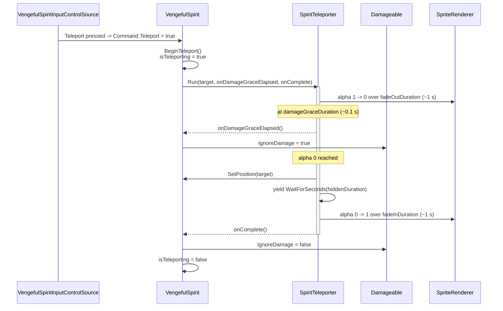
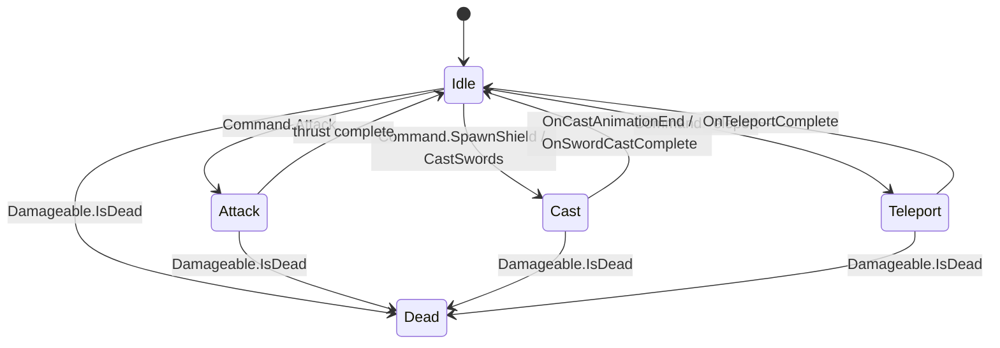

# 2026-04-30 - Spirit Disappear (Vengeful Spirit)

## Goal

Give the Vengeful Spirit boss a teleport action. The boss fades out smoothly
over ~1 s, stays invisible for a short window, then re-materialises at one of
several **predefined** locations by fading back in over ~1 s. The boss can
still be hit during the very first slice of the fade-out (~0.1 s) — after
that the `Damageable` is disabled so the boss is immune for the remainder of
the disappear/hidden/reappear phases.

The teleport set is author-driven — designers wire a list of named anchor
transforms in the inspector, mirroring the existing `SpectralSwordAnchor` /
`SpectralSwordAnchorBinding` pattern, so future AI / stage scripts can select a
specific destination by name without code changes.

## Behaviour Summary

**Pre-condition:** the teleport is only ever initiated while the boss is in
the idle / free-movement state — never during an attack thrust, a shield
cast, or a sword cast. The control source (AI or debug input) is responsible
for not requesting a teleport in those situations; the boss controller just
checks the same `isAttacking` / `isCasting` gates that already guard every
other action and silently drops the flag if one is set.

1. **Trigger.** The control source emits a one-shot `Teleport` flag in the
   command struct (debug input or AI). The boss is, by contract, idle or
   moving when this fires.
2. **Lock.** The boss enters a new `isTeleporting` state. Velocity is **not**
   reset, and movement input keeps flowing through `ApplyMovement` so the
   spirit can coast, redirect, or stop based on the command. Action flags
   (Attack / SpawnShield / CastSwords) are skipped — by contract the control
   source stops sending them, and the boss gates defensively if any arrive.
3. **Fade out (~1 s).** Sprite alpha lerps smoothly from 1 to 0.
   - For the first `damageGraceDuration` (~0.1 s) the `Damageable` is still
     active, so a well-timed last hit can still land.
   - At `damageGraceDuration` elapsed, `Damageable.IgnoreDamage` is set to
     `true` and stays set for the rest of the sequence.
4. **Reposition.** The instant the fade-out completes (alpha = 0), the boss
   transform is moved to the chosen destination anchor's world position.
5. **Hidden window (~2 s, tunable).** Sprite stays at alpha 0. Boss does not
   move, does not act, does not take damage.
6. **Fade in (~1 s).** Sprite alpha lerps smoothly from 0 to 1.
7. **Release.** `IgnoreDamage` is cleared, `isTeleporting` is cleared, and the
   boss returns to normal command processing.

Total default duration: `1.0 + 2.0 + 1.0 = 4.0 s` (each phase tunable in the
inspector).

## Current State (What to Reuse)

| System | File | Reused for |
|---|---|---|
| Action lock pattern (`isCasting`, `isAttacking`, gating in `ExecuteCommand`) | `Assets/Game/Features/Bosses/VengefulSpirit/VengefulSpirit.cs` | `isTeleporting` slots into the same gate chain. |
| Death-cancels-action plumbing (`CheckDamageState`) | Same file | One additional reset (`isTeleporting = false`, alpha = 1). |
| `Damageable.IgnoreDamage` | `Assets/Game/Core/Components/Damage/Damageable.cs` | Public bool already exists for "ignore damage during cutscenes/death". Toggled on `damageGraceDuration` after fade-out begins, off when fade-in completes. |
| Named-anchor binding pattern (`SpectralSwordAnchorBinding`) | `Assets/Game/Features/Bosses/VengefulSpirit/SpectralSwords/SpectralSwordAnchorBinding.cs` | New `TeleportAnchorBinding` mirrors it: free-form name + Transform reference. |
| Command-struct fan-in | `VengefulSpiritCommand` | One new flag (`Teleport`). |
| Input action `SwitchItem` (or `Jump`) | `InputActions.cs` | Debug stand-in for the teleport trigger; no `.inputactions` change. |

What is **not** reused:
- The animator. There is no "disappear" animation state and stage 1 does not
  need one — fading a sprite by lerping `SpriteRenderer.color.a` is simpler
  and animation-controller-free. The existing Idle clip can keep playing
  underneath while the sprite fades out and back in.
- The cast lifecycle (`isCasting` / `OnCastEffect` / `OnCastAnimationEnd`). A
  teleport is not gated on an animation event, so reusing the cast hooks
  would require adding a fake animation just to time the dispatch.
  `isTeleporting` is its own coroutine-driven phase machine.

## Architecture

The feature lives under the boss's feature folder, isolated in a sub-package:

```
Assets/Game/Features/Bosses/VengefulSpirit/Teleport/
    SpiritTeleporter.cs          -- coroutine-based teleport runner on the boss
    TeleportAnchor.cs            -- marker MonoBehaviour on each destination GameObject
    TeleportAnchorBinding.cs     -- inspector-authored {name, TeleportAnchor} entry
```

Responsibility split:

| Concern | Owner |
|---|---|
| Teleport sequence (fade out → reposition → hide → fade in) | `SpiritTeleporter` |
| Damage-grace callback during fade-out | `SpiritTeleporter` (fires `onDamageGraceElapsed` ~0.1 s into fade-out) |
| Authoring data (named destination transforms) | `TeleportAnchorBinding[]` on the boss prefab |
| Command flag, action gate, completion handling | `VengefulSpirit` (existing pattern) |
| Reading the trigger and emitting the flag | `VengefulSpiritInputControlSource` |
| Damage immunity toggle (`IgnoreDamage = true/false`) | `VengefulSpirit` (driven by teleporter callbacks) |

The teleporter is a separate component for the same reason the sword caster
is: keeps `VengefulSpirit` thin, isolates the coroutine + sprite-fade logic,
and lets stage-2 AI invoke it directly with a chosen destination.

## Sequence



## State Machine (Boss Action Gate)



Death cancels every other state, including teleport. Death restores the
sprite alpha to 1 so the death animation is visible — see *Edge Cases*.

## Component Details

### `TeleportAnchor` and `TeleportAnchorBinding`

`TeleportAnchor` is a tiny marker MonoBehaviour that designers drop on an
empty GameObject at each desired destination. It carries no data; the boss
reads `transform.position` when it relocates. The component exists (rather
than wiring a raw `Transform`) so editor gizmos can mark every teleport spot
in the scene view, mirroring the `SpectralSwordSpawnAnchor` convention.

```csharp
// Assets/Game/Features/Bosses/VengefulSpirit/Teleport/TeleportAnchor.cs
using UnityEngine;

namespace Game.Features.Bosses.VengefulSpirit.Teleport {
    public class TeleportAnchor : MonoBehaviour {
#if UNITY_EDITOR
        private void OnDrawGizmos() {
            // Cross-and-circle marker + name label so anchors are visible in the
            // scene view even when their GameObjects are unselected.
        }
#endif
    }
}
```

```csharp
// Assets/Game/Features/Bosses/VengefulSpirit/Teleport/TeleportAnchorBinding.cs
using System;

namespace Game.Features.Bosses.VengefulSpirit.Teleport {
    [Serializable]
    public struct TeleportAnchorBinding {
        public string name;
        public TeleportAnchor anchor;
    }
}
```

Mirrors `SpectralSwordAnchorBinding` so designers don't learn a new shape.

### `SpiritTeleporter` (MonoBehaviour on the boss)

```csharp
// Assets/Game/Features/Bosses/VengefulSpirit/Teleport/SpiritTeleporter.cs
using System;
using System.Collections;
using UnityEngine;

namespace Game.Features.Bosses.VengefulSpirit.Teleport {
    /// <summary>
    /// Drives the spirit's teleport sequence: fade out, reposition, hide, fade in.
    /// The boss controller owns all action-gating; this component is a pure
    /// coroutine runner that calls back when the sequence ends.
    /// </summary>
    public class SpiritTeleporter : MonoBehaviour {
        [SerializeField] private SpriteRenderer spriteRenderer;
        [SerializeField] private Transform teleportRoot; // usually the boss root transform

        [Header("Timings")]
        [Tooltip("How long the boss takes to fade to alpha 0 (the 'disappear' phase).")]
        [SerializeField] private float fadeOutDuration = 1.0f;

        [Tooltip("Time from the start of the fade-out at which the boss becomes damage-immune. " +
                 "Until this elapses, the boss can still take a final hit. Must be <= fadeOutDuration.")]
        [SerializeField] private float damageGraceDuration = 0.1f;

        [Tooltip("Time spent fully hidden (alpha 0) before fading back in.")]
        [SerializeField] private float hiddenDuration = 2.0f;

        [Tooltip("How long the boss takes to fade from alpha 0 back to 1 (the 'reappear' phase).")]
        [SerializeField] private float fadeInDuration = 1.0f;

        private Coroutine activeRun;
        public bool IsRunning => activeRun != null;

        /// <summary>
        /// Runs the full disappear/reposition/reappear sequence.
        /// <paramref name="onDamageGraceElapsed"/> fires once, partway through the
        /// fade-out, when the boss should become damage-immune.
        /// <paramref name="onComplete"/> fires once when alpha is fully restored.
        /// </summary>
        public void Run(Vector3 destination, Action onDamageGraceElapsed, Action onComplete) {
            if (activeRun != null) {
                return;
            }
            activeRun = StartCoroutine(RunSequence(destination, onDamageGraceElapsed, onComplete));
        }

        public void Cancel() {
            if (activeRun != null) {
                StopCoroutine(activeRun);
                activeRun = null;
            }
            // Always restore visibility so we never leave the boss invisible.
            SetAlpha(1f);
        }

        private IEnumerator RunSequence(Vector3 destination, Action onDamageGraceElapsed, Action onComplete) {
            yield return FadeOutWithGrace(onDamageGraceElapsed);

            // Reposition while invisible — no visual seam.
            teleportRoot.position = destination;

            if (hiddenDuration > 0f) {
                yield return new WaitForSeconds(hiddenDuration);
            }

            yield return Fade(0f, 1f, fadeInDuration);

            activeRun = null;
            onComplete?.Invoke();
        }

        // Single fade pass that also fires the grace callback at the right moment.
        // Splitting this into two Fade(...) calls would double-write alpha at the
        // boundary and risk a 1-frame visual hiccup, hence the inline loop.
        private IEnumerator FadeOutWithGrace(Action onDamageGraceElapsed) {
            float grace = Mathf.Clamp(damageGraceDuration, 0f, fadeOutDuration);
            bool graceFired = false;

            if (fadeOutDuration <= 0f) {
                SetAlpha(0f);
                if (!graceFired) {
                    onDamageGraceElapsed?.Invoke();
                }
                yield break;
            }

            float t = 0f;
            while (t < fadeOutDuration) {
                t += Time.deltaTime;
                SetAlpha(Mathf.Lerp(1f, 0f, t / fadeOutDuration));
                if (!graceFired && t >= grace) {
                    graceFired = true;
                    onDamageGraceElapsed?.Invoke();
                }
                yield return null;
            }
            SetAlpha(0f);
            if (!graceFired) {
                onDamageGraceElapsed?.Invoke();
            }
        }

        private IEnumerator Fade(float from, float to, float duration) {
            if (duration <= 0f) {
                SetAlpha(to);
                yield break;
            }
            float t = 0f;
            while (t < duration) {
                t += Time.deltaTime;
                SetAlpha(Mathf.Lerp(from, to, t / duration));
                yield return null;
            }
            SetAlpha(to);
        }

        private void SetAlpha(float a) {
            if (spriteRenderer == null) {
                return;
            }
            Color c = spriteRenderer.color;
            c.a = a;
            spriteRenderer.color = c;
        }
    }
}
```

**Notes:**
- The teleporter does **not** know about `isTeleporting` or `IgnoreDamage` —
  it signals completion via the `onComplete` callback so all action-gating
  bookkeeping stays in `VengefulSpirit`. Same split as `SpectralSwordCaster`.
- `SetAlpha` writes the full color (with the existing RGB) so any tinting
  applied by `Damageable.DisplayInvulnerability` flashes is preserved during
  fade. While teleporting, `IgnoreDamage` is true, so the invulnerability
  flash is not running anyway — this is just defensive.
- `Cancel()` always snaps alpha back to 1. Death and scene unloads must call
  it (see *Edge Cases*).

### `VengefulSpirit` changes

1. New command flag — extend `VengefulSpiritCommand`:

   ```csharp
   public struct VengefulSpiritCommand {
       public readonly int XDirection;
       public readonly int YDirection;
       public readonly bool Attack;
       public readonly bool SpawnShield;
       public readonly bool CastSwords;
       public readonly bool Teleport;

       public VengefulSpiritCommand(int xDirection, int yDirection, bool attack,
                                    bool spawnShield, bool castSwords, bool teleport) {
           XDirection   = xDirection;
           YDirection   = yDirection;
           Attack       = attack;
           SpawnShield  = spawnShield;
           CastSwords   = castSwords;
           Teleport     = teleport;
       }
   }
   ```

   The struct has a single producer (`VengefulSpiritInputControlSource`) and a
   single consumer (`VengefulSpirit`), so the constructor signature change is
   contained and compiler-checked.

2. New serialized fields:

   ```csharp
   [Header("Teleport")]
   [SerializeField]
   private SpiritTeleporter teleporter;

   [Tooltip("Predefined teleport destinations. AI / debug picks one by name; if no name " +
            "is supplied, a random anchor different from the current location is used.")]
   [SerializeField]
   private TeleportAnchorBinding[] teleportAnchors;
   ```

3. New runtime flag and gate in `ExecuteCommand`. While teleporting, the
   boss still processes the **movement** portion of the command (so the
   spirit can coast, change direction, or stop based on input) but skips
   the action flags entirely. This matters because the boss's Rigidbody2D
   has linear drag — without `ApplyMovement` pumping velocity each frame,
   drag would stop the boss within a fraction of a second. By contract
   the control source doesn't send Attack/SpawnShield/CastSwords during a
   teleport; the `!isTeleporting` gate is defensive.

   ```csharp
   private bool isTeleporting;

   private void ExecuteCommand() {
       if (isAttacking) { UpdateAttackThrust(); return; }
       if (isCasting)   { StopMovement(); return; }
       // ...read command...
       if (!isTeleporting) {
           if (value.Attack)      { BeginAttack(); return; }
           if (value.SpawnShield) { BeginCast(VengefulSpiritCastAction.SpawnShield); return; }
           if (value.CastSwords)  { BeginCast(VengefulSpiritCastAction.CastSwords); return; }
           if (value.Teleport)    { BeginTeleport(); return; }
       }
       ApplyMovement(value.XDirection, value.YDirection);
   }
   ```

4. Begin / damage-grace / complete:

   ```csharp
   private void BeginTeleport() {
       TeleportAnchor target = PickTeleportDestination();
       if (target == null || teleporter == null) {
           return; // Nothing wired -- silently no-op rather than locking the boss.
       }

       isTeleporting = true;
       // Velocity is intentionally NOT reset here.

       // IgnoreDamage is NOT flipped here -- the boss can still take a final
       // hit during the first ~0.1 s of the fade-out. The teleporter calls
       // OnTeleportDamageGraceElapsed() once that grace window expires.
       teleporter.Run(target.transform.position, OnTeleportDamageGraceElapsed, OnTeleportComplete);
   }

   private void OnTeleportDamageGraceElapsed() {
       if (damageable != null) {
           damageable.IgnoreDamage = true;
       }
   }

   private void OnTeleportComplete() {
       isTeleporting = false;
       if (damageable != null) {
           damageable.IgnoreDamage = false;
       }
   }
   ```

5. Public API for AI / scripted destinations (parallel to `GetSwordAnchor`):

   ```csharp
   /// <summary>
   /// Returns the teleport anchor wired for the given name, or <c>null</c>
   /// if no entry matches. Case-sensitive.
   /// </summary>
   public TeleportAnchor GetTeleportAnchor(string name) {
       if (teleportAnchors == null || string.IsNullOrEmpty(name)) {
           return null;
       }
       for (int i = 0; i < teleportAnchors.Length; i++) {
           if (teleportAnchors[i].name == name) {
               return teleportAnchors[i].anchor;
           }
       }
       return null;
   }
   ```

   `BeginTeleport()` uses an internal `PickTeleportDestination()` helper that
   returns a random anchor different from the closest one to the boss's
   current position. Cheap O(N) scan over the small (~3-6) anchor list:

   ```csharp
   private Transform PickTeleportDestination() {
       if (teleportAnchors == null || teleportAnchors.Length == 0) {
           return null;
       }

       // Find the anchor closest to the boss's current position; we want to
       // pick anything else to make the teleport read as a real relocation.
       int closestIndex = -1;
       float closestSqr = float.PositiveInfinity;
       for (int i = 0; i < teleportAnchors.Length; i++) {
           Transform a = teleportAnchors[i].anchor;
           if (a == null) { continue; }
           float d = (a.position - transform.position).sqrMagnitude;
           if (d < closestSqr) { closestSqr = d; closestIndex = i; }
       }

       // Build a candidate list excluding the closest anchor.
       int candidateCount = 0;
       for (int i = 0; i < teleportAnchors.Length; i++) {
           if (i == closestIndex) { continue; }
           if (teleportAnchors[i].anchor != null) { candidateCount++; }
       }

       if (candidateCount == 0) {
           // Only one anchor wired (or all the rest are null) -- fall back to it.
           return closestIndex >= 0 ? teleportAnchors[closestIndex].anchor : null;
       }

       int pick = UnityEngine.Random.Range(0, candidateCount);
       int seen = 0;
       for (int i = 0; i < teleportAnchors.Length; i++) {
           if (i == closestIndex) { continue; }
           Transform a = teleportAnchors[i].anchor;
           if (a == null) { continue; }
           if (seen == pick) { return a; }
           seen++;
       }

       return null; // unreachable
   }
   ```

6. Death / cleanup — extend `CheckDamageState`:

   ```csharp
   if (damageable.IsDead && !isDead) {
       isDead = true;
       diedThisFrame = true;
       isCasting = false;
       pendingCastAction = VengefulSpiritCastAction.None;
       isAttacking = false;
       isAttackDecelerating = false;
       attackElapsed = 0f;
       isTeleporting = false;            // NEW
       if (teleporter != null) {
           teleporter.Cancel();          // NEW: snaps alpha back to 1
       }
       CancelAllSwordCasts();
       StopMovement();
   }
   ```

   Without `Cancel()`, dying mid-fade-out would leave the death animation
   playing on a transparent sprite.

`OnCastAnimationEnd`, `OnCastEffect`, attack thrust, and shield spawn are all
unchanged.

### `VengefulSpiritInputControlSource` changes

Pick one of the still-unused player actions as the debug stand-in. `SwitchItem`
is the cleanest choice (currently unused on the boss), or `Jump`. Spec uses
`SwitchItem`:

```csharp
private void Update() {
    Vector2 move = playerActions.Move.ReadValue<Vector2>();
    int x = Math.Sign(move.x);
    int y = Math.Sign(move.y);

    bool attack      = playerActions.Interact.WasPressedThisFrame();
    bool spawnShield = playerActions.UseItem.WasPressedThisFrame();
    bool castSwords  = playerActions.UsePerk.WasPressedThisFrame();
    bool teleport    = playerActions.SwitchItem.WasPressedThisFrame();

    currentCommand = new VengefulSpiritCommand(x, y, attack, spawnShield, castSwords, teleport);
}
```

Update the doc-comment block at the top of the class to list the new mapping.

## Facing

The boss has a `Facing2D` component that mirrors the sprite via `localScale.x`
based on `SetByX`. After teleporting:

- **Default (stage 1):** keep current facing untouched. The boss will face
  whichever direction it last moved before the teleport. Fine for prototyping.
- **Better (stage 2 polish):** flip facing toward the player at the moment of
  reposition (between fade-out and hidden phase). One line in `BeginTeleport`
  after a player-position lookup. Out of scope for the initial implementation
  — boss-room AI doesn't have a player reference yet.
- **Author-controlled (alternative):** add a per-anchor `bool faceLeft` flag
  to `TeleportAnchorBinding` so the designer pins facing per spot. Cheap if
  needed, skipped until requested.

## Damage Immunity Window

The immunity does **not** cover the whole sequence. Per design:

- **Fade-out, first `damageGraceDuration` (~0.1 s):** `IgnoreDamage = false`.
  The boss is still mostly visible (alpha ≈ 0.9 at the end of the grace),
  and a player who landed a hit just before the teleport started should
  still see that hit count. This is the "punish the trigger" window.
- **Fade-out, remaining ~0.9 s:** `IgnoreDamage = true`. The teleporter
  fires `onDamageGraceElapsed` and the boss flips immune for the rest of
  the disappear.
- **Hidden:** `IgnoreDamage = true`. Boss is invisible; damaging it would
  feel like a glitch.
- **Fade-in (~1 s):** `IgnoreDamage = true`. Boss is rematerialising; letting
  the player damage a half-translucent target reads as "you can hit me but
  I'm still ghost" which is visually confusing.
- **End of fade-in:** `IgnoreDamage = false` via `OnTeleportComplete`.

The grace duration is exposed on `SpiritTeleporter` as `damageGraceDuration`
and clamped to `[0, fadeOutDuration]` at runtime. Setting it to 0 makes the
boss immune from frame 1 of the teleport (closer to a classic boss "blink").
Setting it equal to `fadeOutDuration` makes the boss vulnerable through the
entire fade-out.

The body collider stays **enabled** throughout. `Damageable.IgnoreDamage`
short-circuits damage at the point of `TryTakeDamage`, so trigger collisions
still fire but no health is removed once immunity is on. If the player
walking into an invisible boss feels wrong in playtest, disable the collider
during the hidden phase only — note this as follow-up rather than designing
it in now.

## Edge Cases

| Case | Behaviour |
|---|---|
| Teleport requested while already teleporting | `BeginTeleport` early-returns because `isTeleporting` gates `ExecuteCommand` upstream. The teleporter's own `IsRunning` guard is a second-line defence. |
| Teleport requested mid-attack or mid-cast | Should not happen — the control source contract is that teleport only fires from idle/moving. If it ever does (debug bind, AI bug), the existing `isAttacking` / `isCasting` gates earlier in `ExecuteCommand` silently drop the flag that frame; no state corruption. |
| Boss tries to start an attack / shield / sword cast while teleporting | `isTeleporting` short-circuits the command before any of those flags are checked. Other actions cannot interrupt the teleport sequence. |
| Boss takes a hit during the fade-out grace window | Intended behaviour — the boss can still be hit during the first ~0.1 s of fade-out. The Hit animation plays under the fade. After `damageGraceDuration` elapses, the boss becomes immune for the rest of the sequence. |
| Boss takes a hit at exactly `damageGraceDuration` | Resolved by ordering: `IgnoreDamage` is flipped from inside the teleporter coroutine before the next frame's `Update` polls input. Damage cannot land on the same frame that flips the gate. |
| Boss dies during teleport | `CheckDamageState` clears `isTeleporting` and calls `teleporter.Cancel()`. Alpha snaps to 1 so the Death animation is visible. Already-running coroutine is stopped. |
| `teleporter` or `teleportAnchors` not wired | `BeginTeleport` returns silently without locking the boss. No-op rather than soft-locking — same defensive policy as the sword cast on missing anchors. |
| Single anchor wired | `PickTeleportDestination` falls back to that single anchor. The teleport plays end-to-end but the boss reappears in the same spot — degenerate but not broken. Authors get visible "nothing changed" feedback, which is the right signal that more anchors need wiring. |
| Sprite renderer reference null | `SetAlpha` no-ops; the teleport still runs (reposition happens, timing still elapses) but with no fade visual. Logged once during validation if needed. |
| Anchor `Transform` removed at runtime | `PickTeleportDestination` skips null entries. If every anchor is null, `BeginTeleport` returns silently. |

## Open Questions

- **Per-anchor facing.** Out of scope for stage 1. Resolved by adding a
  `faceLeft` field to `TeleportAnchorBinding` if/when needed.
- **Attack telegraph on reappear.** Should reappearing into a melee thrust
  feel different from reappearing into idle? Stage-2 AI question; the cast
  + teleport actions don't compose yet anyway.
- **VFX.** Particle burst on disappear and on reappear would sell the move
  better. Not blocking — the fade alone is readable. Add as polish (Stage 4).

## Implementation Stages

### Stage 1 - Data & teleporter

1. Create `TeleportAnchorBinding.cs`.
2. Create `SpiritTeleporter.cs`.

### Stage 2 - Boss + input wiring

3. Extend `VengefulSpiritCommand` with `Teleport` flag (constructor signature
   change). Single producer/consumer — compiler will catch both sites.
4. Update `VengefulSpiritInputControlSource.Update()` to read `SwitchItem` and
   pass `teleport` into the command. Update the class doc-comment.
5. Add `[SerializeField] SpiritTeleporter teleporter` and
   `[SerializeField] TeleportAnchorBinding[] teleportAnchors` to
   `VengefulSpirit`. Add `isTeleporting` field.
6. Update `ExecuteCommand` with the new gate and the `Teleport` route.
7. Implement `BeginTeleport`, `OnTeleportDamageGraceElapsed`,
   `OnTeleportComplete`, `GetTeleportAnchor`, and `PickTeleportDestination`.
8. Extend `CheckDamageState` to cancel teleport on death.

### Stage 3 - Editor wiring (manual prerequisites)

9. On `VengefulSpirit.prefab`: add a `SpiritTeleporter` component. Wire its
   `spriteRenderer` to the boss's `SpriteRenderer` and its `teleportRoot` to
   the boss's root transform.
10. In the boss-room scene (or the boss prefab if anchors live on it): create
    3-5 empty GameObjects positioned at the desired teleport spots, add a
    `TeleportAnchor` component to each, and wire them into `teleportAnchors`
    on the `VengefulSpirit` component with descriptive names (e.g. `Center`,
    `Left`, `Right`, `High`).
11. Smoke test in Play Mode: press the bound key, boss fades out smoothly
    over ~1 s, repositions while invisible, holds, fades back in over ~1 s.
    Confirm the boss can still be hit during the very first slice of the
    fade-out (~0.1 s) and is immune for the remainder of the sequence.

### Stage 4 - Polish (optional)

12. Particle / flash VFX on disappear and reappear.
13. SFX hooks: short whoosh on fade-out, hum during hidden, materialise on
    fade-in. Use the existing audio service.
14. Per-anchor facing (`faceLeft` flag on `TeleportAnchorBinding`) if
    reappear-direction becomes important.

## Tuning Parameters

| Parameter | Location | Default | Notes |
|---|---|---|---|
| `fadeOutDuration` | `SpiritTeleporter` | 1.0 | Smooth disappear. |
| `damageGraceDuration` | `SpiritTeleporter` | 0.1 | Time from start of fade-out before `IgnoreDamage` flips on. Clamped to `[0, fadeOutDuration]`. |
| `hiddenDuration` | `SpiritTeleporter` | 2.0 | "Several seconds" — feels right for telegraphing the relocation without dragging. |
| `fadeInDuration` | `SpiritTeleporter` | 1.0 | Smooth reappear. |
| Teleport input | `VengefulSpiritInputControlSource` | `SwitchItem` | Debug only; future dedicated `BossTeleport` action. |
| Anchor count | `teleportAnchors` array | 3-5 | Authoring guidance — too few and the teleport feels samey, too many and it loses readability. |

## Files Summary

### New files

| File | Purpose |
|---|---|
| `Assets/Game/Features/Bosses/VengefulSpirit/Teleport/SpiritTeleporter.cs` | Coroutine-driven fade-out / reposition / hide / fade-in runner. |
| `Assets/Game/Features/Bosses/VengefulSpirit/Teleport/TeleportAnchor.cs` | Marker MonoBehaviour placed on each destination GameObject; carries an editor gizmo. |
| `Assets/Game/Features/Bosses/VengefulSpirit/Teleport/TeleportAnchorBinding.cs` | `[Serializable] {name, TeleportAnchor anchor}` entry for the inspector. |

### Modified files

| File | Change |
|---|---|
| `Assets/Game/Features/Bosses/VengefulSpirit/VengefulSpirit.cs` | New `Teleport` route in `ExecuteCommand`, `isTeleporting` gate, `BeginTeleport` / `OnTeleportDamageGraceElapsed` / `OnTeleportComplete` / `GetTeleportAnchor` / `PickTeleportDestination`, two new serialized fields, `CheckDamageState` cancel hook. |
| `Assets/Game/Features/Bosses/VengefulSpirit/VengefulSpiritInputControlSource.cs` | Read the chosen debug input, pass `teleport` into the command, update doc-comment. |
| The `VengefulSpiritCommand` struct | New `Teleport` field, constructor signature update (single producer + consumer, contained change). |

### New assets (created in Unity Editor — manual prerequisites)

| Asset | Notes |
|---|---|
| Empty GameObject anchors in boss room scene/prefab | 3-5 transforms at desired teleport positions, each with a `TeleportAnchor` component, named (`Center`, `Left`, `Right`, etc.). |
| `VengefulSpirit.prefab` updates | Add `SpiritTeleporter` component, wire `spriteRenderer` + `teleportRoot`, populate `teleportAnchors` on `VengefulSpirit`. |

## Risks and Mitigations

**Constructor signature change on `VengefulSpiritCommand`.**
Same risk as the spectral-swords addition (10): contained to one producer
and one consumer; compiler-enforced. Future control sources will adopt the
new signature naturally.

**Boss disappears but never reappears (soft lock).**
Three independent guards prevent it: (a) `BeginTeleport` early-returns when
wiring is missing — no state flips; (b) `OnTeleportComplete` always restores
`IgnoreDamage` and `isTeleporting`; (c) death cancels the coroutine and snaps
alpha back to 1. If a coroutine somehow exits without invoking the callback
(it can't with the current code, but if `RunSequence` were modified to early-
return), `isTeleporting` would stay true forever — an editor playmode test
that triggers teleport, takes damage during the grace window, kills the boss,
and checks `isTeleporting == false` and `IgnoreDamage == false` afterwards is
a reasonable defence as the file evolves.

**Damage-grace callback never fires.**
If `damageGraceDuration > fadeOutDuration` somehow (designer typo,
deserialised garbage), the teleporter clamps the value at runtime and still
fires the grace callback at the end of the fade-out. If `fadeOutDuration` is
0, the boss is immune from frame 1 — degenerate but well-defined. The grace
callback is fired exactly once per `Run()` invocation regardless.

**Sprite alpha leaks between systems.**
`Damageable.DisplayInvulnerability` writes to `spriteRenderer.color` for the
hit-flash effect. While `IgnoreDamage` is set, the invulnerability timer is
forced to 0 each `LateUpdate` (see `Damageable.LateUpdate`), so the flash
cannot run. The teleport's alpha writes are the only color authority during
the sequence. After teleport ends, normal damage flow resumes — no manual
reset needed beyond `IgnoreDamage = false`.

**Body collider stays enabled while invisible.**
By design (see *Damage Immunity Window*). Acceptable for stage 1; revisit
only if playtest shows the player bumping into the invisible boss feels
wrong.

**Predefined anchors are scene-specific.**
Anchors are scene transforms wired into the boss-room scene (or the boss
prefab if the boss owns its arena). If the boss is reused across scenes,
each scene's instance must wire its own anchors. Same pattern the existing
`SpectralSwordSpawnAnchor` uses — no new scene-management problem introduced.
