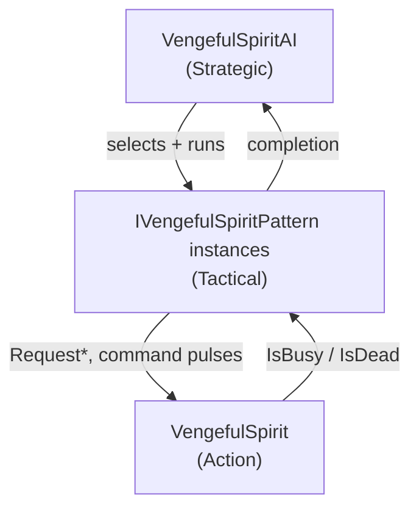

# Plan: Enhance Vengeful Spirit Boss Behavior

Spec: `Assets/Docs/Planning/2026-05-09-enhance-boss-behavior.md`

## Context

The current Vengeful Spirit AI works but mixes strategic decisions (phase, cadence, pacing)
with tactical pattern coroutines (Reposition+Slash, ShieldBash, SwordWall, TripleTeleport,
TeleportStrike, StandoffSwordWave) inline in `VengefulSpiritAI.cs`. Patterns are picked by
weighted random with cooldowns, with no per-pattern usage caps and no formal "cycle" concept.

The new spec asks for a stricter three-layer model with named, reusable tactical patterns
(`CommonAttackPattern`, `BlinkAttackPattern`, `ChargeAttackPattern`, `SpiritSwordsPattern`,
`SpawnShieldPattern`), a cycle-based selection model with per-pattern caps, and two new
attacks: **Charge Attack** (Phase 2 only) and **Blink Attack** (teleport-behind + telegraph
+ common attack). Phase 2 must open with a forced **Spawn Shield** at the central anchor.

The action layer (`VengefulSpirit.cs`) is already well factored — it owns physics,
animation, casts, teleports, sword/shield spawning, and exposes a clean
`Request*`/command-pulse API. It needs additions for the charge attack lifecycle and an
explicit common-attack damage window.

## Decisions

- **Pattern style**: separate POCO pattern classes implementing `IVengefulSpiritPattern`.
- **Common-attack damage**: explicit window via a child `AttackDamager` (Damager + trigger
  collider) toggled by `OnAttackHitStart` / `OnAttackHitEnd` animation events on
  `Attack.anim`. Replaces the implicit thrust-contact behavior.
- **Animator parameter**: **keep** the existing `isChargingAttack` bool. Treat the spec's
  `isChargeAttackStarted` wording as advisory; new code uses the existing parameter to
  avoid the rename + animator transition rewrite.
- **Cycle reset**: reset when all per-pattern caps are exhausted **OR** when no pattern
  has been runnable for one cadence interval (anti-deadlock).

## Current state — what's already in place

Action layer (`VengefulSpirit.cs`, ~785 lines) already covers:
- Move via `VengefulSpiritCommand` from a pluggable `VengefulSpiritControlSource`.
- Common attack thrust (`BeginAttack`, ramp + damp velocity), driven by `OnAttack` trigger.
- Casting lifecycle (`BeginCast` → animation event `OnCastEffect` → `OnCastAnimationEnd`).
- Sword wave timing via internal `SwordCastChargeRoutine` (independent of clip length).
- Teleport via `SpiritTeleporter.Run` with damage-grace callback and shield fader pause.
- Shield spawn / track / detach / disengage from `BossFightService`.
- Anchor lookup helpers: `GetSwordAnchor(name)`, `GetTeleportAnchor(name)`,
  `EnumerateSwordAnchors()`, `EnumerateTeleportAnchors()`.
- `IsBusy` busy-flag plumbing (combination of `isAttacking || isCasting || isTeleporting`).
- Dies cleanly: cancels coroutines, snaps teleporter, detaches shield, disengages fight.

Strategic + tactical (mixed) layer (`VengefulSpiritAI.cs`, ~1080 lines):
- Two-phase AI; phase shift on HP fraction.
- Phase shift sequence: teleport to `Center` + sword wave (will change to **shield** per new spec).
- Cadence + cooldown gating (`meleeCooldown`, `shieldRespawnCooldown`,
  `phase2ReactiveTeleportCooldown`).
- Burst movement system + force-move overrides for melee approach.
- Anchor pick helpers: same-side / opposite-side sword anchors, behind-player /
  farthest-from-player / random teleport anchors.
- Reactive teleport when player is close after a recent hit (Phase 2 only).

What is missing relative to the new spec:
- No **named patterns** matching the spec's vocabulary (CommonAttack / BlinkAttack /
  ChargeAttack / SpiritSwords / SpawnShield).
- No **cycle** with per-pattern usage caps.
- No "max 2 common attacks in a row, then forced reposition".
- No **Charge Attack** (action-layer flow + `isChargeAttackStarted` bool + dash damager).
- No explicit common-attack damage window (the current attack is a thrust; damage relies on
  contact via the boss body collider, not a controlled hit window).
- Phase-2 opener is a sword wave; spec wants it to be **Spawn Shield** at center.

## Recommended architecture

Three layers, with patterns extracted into their own POCO classes (per spec). One folder, one
file per pattern, plus a small interface and a context struct.



### Layer 1: Action layer — `VengefulSpirit.cs`

Additions:
- **Charge attack lifecycle.** New methods: `RequestChargeAttack(TeleportAnchor from, TeleportAnchor to)`
  driving:
  1. Teleport to `from` (uses existing `SpiritTeleporter`).
  2. Hold `isChargeAttackStarted = true` for `chargeWindUpDuration` (ChargeAttack1 plays;
    boss is still, no damage).
  3. Set `isChargeAttackStarted = false`, enable a child **dash damager**, and apply a
    horizontal velocity toward `to` for `chargeDuration` (or until reaching `to.x`).
    ChargeAttack2 plays during this phase.
  4. Disable dash damager, idle for `chargeIdleDuration` (1s).
  5. Teleport to a different anchor (the strategic layer chooses; or do it via a separate
    teleport request from the pattern).
- **Common-attack damage window.** Two viable options — pick (b):
  - (a) Inline timer: `attackDamageWindowStart` + `attackDamageWindowDuration` flip
    `attackDamager.enabled` inside `UpdateAttackThrust`.
  - (b) Animation events on `Attack.anim` calling new `OnAttackHitStart()` /
    `OnAttackHitEnd()` methods which toggle a child damager. Cleanest visual coupling, no
    duplicate magic numbers between code and clip.
- **Charge dash damager** lives on a child GameObject under the boss; the action layer
  enables it only during the dash phase.
- **Animator parameter (no rename).** Use the existing `isChargingAttack` bool from
  `VengefulSpiritAnimKeys` for the charge-attack windup. The spec's
  `isChargeAttackStarted` name is treated as advisory only — new code reads/writes
  `isChargingAttack` so no controller rewrite is needed.
- **Cancellation safety.** `CheckDamageState()` (death path) must also stop any in-flight
  charge dash and disable the dash damager.

`IsBusy` becomes: `isAttacking || isCasting || isTeleporting || isCharging`.

Public API the patterns will call (additions in **bold**):
- `RequestSwordCast(string anchorName)` — already exists.
- `RequestTeleport(TeleportAnchor target)` — already exists.
- **`RequestChargeAttack(TeleportAnchor from, TeleportAnchor to)`**.
- **`RequestSpawnShield()`** — convenience equivalent to a one-frame `pendingSpawnShield`
  pulse, mirroring the existing `RequestSwordCast` / `RequestTeleport` style. The current AI
  pulses a flag through `currentCommand` instead; switching to a Request method is more
  consistent and avoids the per-frame pulse/clear dance.
- **`RequestCommonAttack()`** — same pattern (replaces `pendingAttack` pulse).
- Existing `IsBusy` / `IsDead` / `HasActiveShield` for gating.

The command struct path is kept for the **debug input source** only; AI no longer touches
`pendingAttack`/`pendingSpawnShield`.

### Layer 2: Tactical layer — pattern POCOs

New folder: `Assets/Game/Features/Bosses/VengefulSpirit/AI/Patterns/`

Files:
- `IVengefulSpiritPattern.cs` — interface.
- `VengefulSpiritPatternContext.cs` — struct/class with `boss`, `playerTransform`, `phase`,
  `cycleState`, plus convenience accessors.
- `CommonAttackPattern.cs`
- `BlinkAttackPattern.cs`
- `ChargeAttackPattern.cs`
- `SpiritSwordsPattern.cs`
- `SpawnShieldPattern.cs`

Interface:

```csharp
public interface IVengefulSpiritPattern {
    string Id { get; }
    bool CanRun(VengefulSpiritPatternContext ctx);
    IEnumerator Run(VengefulSpiritPatternContext ctx);
    void OnCycleReset();
}
```

Each pattern:
- Holds its own per-cycle counter (`usedThisCycle`) and reads phase-aware caps from the
  context (which forwards from `VengefulSpiritAI` serialized fields).
- `CanRun` returns false when its phase cap is reached, when prerequisites are missing
  (e.g. `ChargeAttackPattern` needs both ground anchors), or when the boss is in a state
  that forbids it (e.g. `SpawnShieldPattern` checks `boss.HasActiveShield`).
- `Run` drives the boss via `Request*` calls and waits via the same `WaitForBusyCycle`
  helper (lifted into `VengefulSpiritPatternContext` or a static `BossWait` utility).
- `OnCycleReset` zeroes `usedThisCycle`.

Pattern detail summary:

- **CommonAttackPattern** — drift toward player up to `attackReachDistance` (or use the
  reach trigger child object), then `RequestCommonAttack()`, await busy cycle. Increments
  `ctx.cycleState.consecutiveCommonAttacks`.
- **BlinkAttackPattern** — teleport to anchor behind player (existing
  `PickTeleportAnchorBehindPlayer` logic moved into context), wait `blinkTelegraphDelay`
  seconds for telegraph, then `RequestCommonAttack()`. Resets the consecutive-common
  counter (it counts as a teleport-then-attack, not a "spam in a row").
- **ChargeAttackPattern** — pick the further of two ground anchors (named e.g.
  `ChargeLeft` / `ChargeRight`) as the start, the other as the end, then
  `RequestChargeAttack(start, end)`. `CanRun` is `phase == Two` and both anchors are wired.
- **SpiritSwordsPattern** — phase-aware anchor selection: phase 1 picks one of two anchor
  groups by name; phase 2 fires both in sequence with `phase2SwordWallSpacing` delay.
- **SpawnShieldPattern** — `RequestSpawnShield()`, await busy cycle. The strategic layer
  prepends a teleport to the `Center` anchor before invoking this pattern as the phase-2
  opener; no special-case logic inside the pattern itself.

### Layer 3: Strategic layer — `VengefulSpiritAI.cs`

Slimmed and re-shaped:
- Owns `phase`, `cycleState`, `pattern list per phase`, `lastPatternId`,
  `consecutiveCommonAttacks`, cadence timer, shield-respawn timer.
- On `OnEnable`: build pattern lists (or build once on `Awake`), reset cycle.
- Each tick: if no pattern running and boss not busy and cadence elapsed, **PickNextPattern**.
- **PickNextPattern** algorithm (cycle-based, deterministic over a cycle):
  1. From the phase-allowed list, select patterns that `CanRun(ctx)` and have not
     exhausted their per-phase cap.
  2. Filter out a pattern matching `lastPatternId` if alternatives exist
     (prevents immediate repetition).
  3. If `consecutiveCommonAttacks >= 2`, exclude `CommonAttackPattern` and prefer a pattern
     that involves a teleport (BlinkAttack / SpiritSwords / ChargeAttack / EscapeTeleport).
  4. Pick remaining by weight (all weight 1 by default; weights are serialized per-phase).
  5. Run the pattern, increment its counter, set `lastPatternId`.
  6. If after running, all patterns are exhausted (or the configured "cycle done"
     condition is met), call `OnCycleReset()` on each pattern and reset
     `consecutiveCommonAttacks` / `cycleState`.
- **Phase shift**: HP threshold trips a one-shot sequence:
  1. Stop active pattern (cancel coroutine).
  2. Wait for `boss.IsBusy == false`.
  3. Teleport to `Center` anchor (`boss.RequestTeleport`).
  4. Run **`SpawnShieldPattern`** as the forced opener.
  5. Set `phase = Two`, reset cycle counters.
- **Death**: stop pattern coroutine, clear forces, drop reactive logic — already half-done.
- Reactive-teleport behavior — keep existing logic, but treat the reactive teleport as a
  one-off action (not a counted pattern).

`VengefulSpiritAI` shrinks from ~1080 lines toward ~300–400 lines, with the rest moving
into patterns and helpers.

### "Cycle" definition

Picked the simpler of the two spec options:
- A **cycle** is a span where each phase-allowed pattern can be used up to its per-phase
  cap. The cycle resets when **all caps are exhausted or no pattern is currently runnable
  for at least one full cadence interval**. This avoids deadlocks if the player is
  unreachable or every gated pattern fails its preconditions.
- Per-pattern caps live on `VengefulSpiritAI` as serialized phase tables, not on the pattern
  classes — designers tune them in the inspector for the boss instance, not in code.

## Files to create

- `Assets/Game/Features/Bosses/VengefulSpirit/AI/Patterns/IVengefulSpiritPattern.cs`
- `Assets/Game/Features/Bosses/VengefulSpirit/AI/Patterns/VengefulSpiritPatternContext.cs`
- `Assets/Game/Features/Bosses/VengefulSpirit/AI/Patterns/CommonAttackPattern.cs`
- `Assets/Game/Features/Bosses/VengefulSpirit/AI/Patterns/BlinkAttackPattern.cs`
- `Assets/Game/Features/Bosses/VengefulSpirit/AI/Patterns/ChargeAttackPattern.cs`
- `Assets/Game/Features/Bosses/VengefulSpirit/AI/Patterns/SpiritSwordsPattern.cs`
- `Assets/Game/Features/Bosses/VengefulSpirit/AI/Patterns/SpawnShieldPattern.cs`
- `Assets/Game/Features/Bosses/VengefulSpirit/AI/VengefulSpiritCycleState.cs`

## Files to modify

- `Assets/Game/Features/Bosses/VengefulSpirit/VengefulSpirit.cs` — add charge-attack
  lifecycle, `RequestChargeAttack`, `RequestSpawnShield`, `RequestCommonAttack`, common-attack
  damage window hooks, `isChargeAttackStarted` rename, `IsCharging` flag.
- `Assets/Game/Features/Bosses/VengefulSpirit/VengefulSpiritAI.cs` — replace inline pattern
  coroutines with the pattern-list selector; keep movement burst, reactive teleport,
  proximity tracking, hit tracking.

## Files unchanged but worth noting

- `SpiritTeleporter.cs`, `SpectralSwordSpawnAnchor.cs`, `SpectralShield.cs`,
  `TeleportAnchor.cs`, `*Binding.cs` — no changes needed.

## Manual Unity Editor steps (not editable from code)

1. **Animator transitions** in `Anim/_VengefulSpiritAnim.controller`: wire transitions
   Idle → ChargeAttack1 (`isChargingAttack` true) and ChargeAttack1 → ChargeAttack2
   (`isChargingAttack` false), then ChargeAttack2 → Idle on a normalized exit condition or
   a separate trigger. Reuses the existing `isChargingAttack` parameter; no rename.
2. **Animation events on `Attack.anim`**: add `OnAttackHitStart` and `OnAttackHitEnd`
   events at the active hit frames.
3. **Add child GameObject `AttackDamager`** under the boss prefab, with a `BoxCollider2D`
   (trigger) sized to the melee reach and a `Damager` component. Disable by default.
4. **Add child GameObject `ChargeDamager`** under the boss prefab, with a `BoxCollider2D`
   (trigger) along the dash path and a `Damager` component. Disable by default.
5. **Optional reach helper**: child GameObject `AttackReach` with a (non-damaging) trigger
   collider sized to `attackReachDistance`. The `CommonAttackPattern` can ask the boss
   whether the reach is overlapping the player instead of measuring distance.
6. **Scene anchors** in `BossSkeletonRoom` (and wire into the boss prefab's
   `teleportAnchors` array):
   - `Center` (already referenced by phase-shift sequence — verify it exists).
   - `ChargeLeft`, `ChargeRight` (lower ground-level points for charge attack).
   - Any high casting points needed for `SpiritSwordsPattern`.
7. **Sword anchors**: ensure phase-1 has at least 2 anchor groups (the spec says "one of
   two") and phase-2 fires both in sequence.

## Build sequence

1. **Action layer changes** (`VengefulSpirit.cs`): add `IsCharging`, `RequestChargeAttack`,
   `RequestCommonAttack`, `RequestSpawnShield`, `OnAttackHitStart`/`OnAttackHitEnd`, charge
   coroutine, animator-key rename. Keep command struct + flag-pulse path for input source.
   Build the boss prefab with the new damager children **before** committing the script
   change so the project still compiles & opens cleanly.
2. **Pattern infrastructure**: `IVengefulSpiritPattern`, `VengefulSpiritPatternContext`,
   `VengefulSpiritCycleState`.
3. **Pattern implementations** one at a time. Each is independently testable from a small
   debug entry point (or just by temporarily forcing a single pattern in `VengefulSpiritAI`).
4. **Strategic refactor**: replace inline coroutines in `VengefulSpiritAI` with the pattern
   selector. Wire the phase-2 forced opener (teleport-to-Center + SpawnShieldPattern).
   Preserve movement burst, reactive teleport, hit tracking.
5. **Wire new fields** in the boss prefab inspector (charge anchors, telegraph delays,
   cycle weights, damager children, reach distance).

## Verification

- Open `BossSkeletonRoom`, enter Play. Phase 1: confirm Common Attack runs at most twice in
  a row; confirm SpiritSwords and BlinkAttack fire once per cycle; confirm cycle resets.
- Damage the boss past 50% HP. Confirm: pattern interrupts cleanly → boss teleports to
  `Center` → spawns shield → enters Phase 2.
- Phase 2: confirm Charge Attack fires once per cycle, with no damage during ChargeAttack1
  windup, then damage applied during the dash. Confirm shield is not respawned in the
  middle of the cycle.
- Kill the boss mid-pattern (each pattern type) and confirm: no damage is dealt after
  death, no stuck animations, no leaked coroutines, shield is destroyed, BossFightService
  disengages.
- Disable the player (or place them out of reach) and confirm the boss idles instead of
  throwing exceptions — patterns that need a player should `CanRun = false` or short-circuit.

## Alternative (simpler) approach

If the pattern-class architecture feels heavy for a single boss, the same behavior can be
implemented with **inline pattern methods on `VengefulSpiritAI`** plus a small `PatternMeta`
struct array (id, phase, cap, weight, runner-delegate, reset-delegate). This:
- Removes the new `Patterns/` folder, interface, and context type.
- Keeps everything in one file (~500 lines).
- Loses the spec's requested "metadata exposed by patterns" surface but still enforces
  per-phase caps + cycle reset + last-pattern guard via the table.

Functional outcome is identical; the pattern-class approach wins on extensibility and
readability per pattern, the inline approach wins on file count and ceremony. Recommend the
pattern-class approach since the spec specifically describes `IVengefulSpiritPattern` and
the project already has at least one similar split (`SpectralSwordPattern` ScriptableObjects).

## Risks

- **Damager component placement.** The boss prefab currently has no Damager — its melee
  damage is implicit thrust contact. Adding controlled damagers is a behavior change: the
  player will only be hurt during the active attack window, not from passively colliding
  with the boss. This is what the spec wants but is worth confirming.
- **Animator transitions** for ChargeAttack1 → ChargeAttack2 require manual editor work; if
  miswired, the charge will visually stall. Plan for designer iteration here.
- **Anchor authoring.** Two charge anchors at the same ground height must be present in any
  scene the boss is dropped into; the pattern should `CanRun = false` (and log once) when
  they are missing, not throw.
- **Animation events on `Attack.anim`** must point at the new method names; Unity logs but
  does not error on missing events, so a typo silently disables the damage window.

## Remaining loose end

- **Charge anchor names** — proposed `ChargeLeft` / `ChargeRight`. The pattern reads them
  by name from `boss.GetTeleportAnchor`, so a designer can rename without code changes;
  flag if a different convention is preferred so the inspector defaults match.
