# Create Plus — Architecture

This document describes the architecture of the **implemented** Create Plus solution (Phase 1 / MVP).
Create Plus is an additional, searchable, configurable creation palette for the Unity Editor. It sits
alongside Unity's built-in Create menu and never modifies or replaces it.

For usage, see [`../README.md`](../README.md). For the roadmap and task breakdown, see [`plan.md`](plan.md).

---

## 1. Goals and constraints

| Goal | How the architecture serves it |
| --- | --- |
| Faster, searchable creation | Curated panels + groups + substring search over a flat command list |
| Configurable per user | Favorites, pins, hidden, collapsed groups, recent, usage — all persisted |
| Keep rare items reachable but hidden | Collapsible groups; pinned items survive collapse; hide/show |
| Package-ready (future UPM) | Isolated editor-only assembly, no runtime/third-party deps |
| Swap UI later (IMGUI → UI Toolkit) | Core and view model have **zero** dependency on any UI toolkit |
| Never lose commands | Unknown/unimplemented commands are visible placeholders, never dropped |

**Hard constraints honored:** editor-only; C#; namespaces; K&R braces; no leading-underscore fields; no
reflection-heavy hacks in the MVP; no Odin/third-party; does not touch Unity's Create menu.

---

## 2. C4 — System context

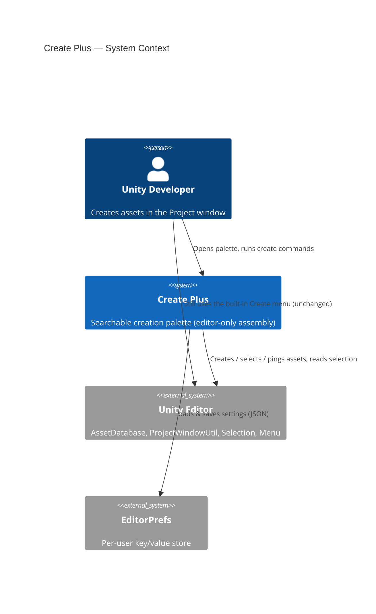

Create Plus is a thin layer over Unity's own asset-creation APIs. It adds organization, search and
per-user state; the actual asset creation delegates to `AssetDatabase` and friends.

---

## 3. C4 — Components

The whole system is one assembly (`CreatePlus.Editor`) organized into three layers. The dependency rule
is strict: **UI → Core**, **Commands → Core**, and **Core depends on nothing in UI or Commands**.

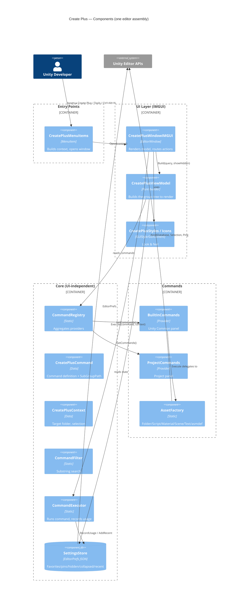

### Layer responsibilities

- **Core** — the brain. Command model, registry + provider interface, settings storage, search,
  execution, context. No `GUILayout`, `EditorGUILayout`, or `VisualElement` anywhere.
- **Commands** — *what* can be created. Static providers contribute `CreatePlusCommand`s; concrete
  asset creation lives in `CreatePlusAssetFactory`.
- **UI** — *how* it looks. `CreatePlusViewModel` turns Core state into a renderable tree;
  `CreatePlusWindowIMGUI` draws it and routes clicks/keys back into Core.
- **Entry Points** — *where* it opens from. Build a `CreatePlusContext`, then call `Open`.

---

## 4. Domain model

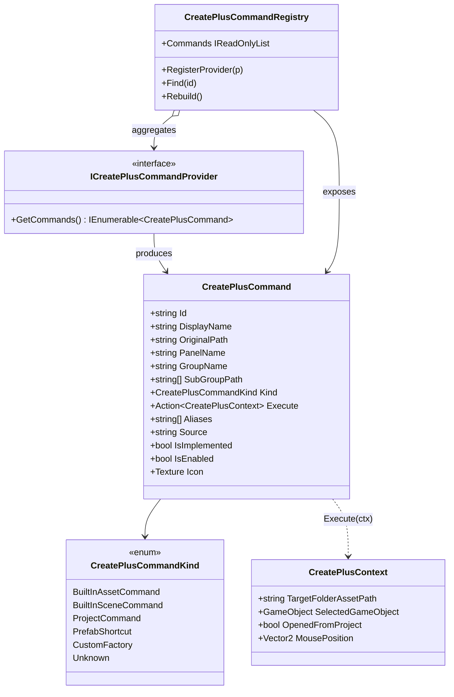

### Identity and state separation (key design decision)

`CreatePlusCommand` is the **immutable definition** of a command. Per-user *mutable* state
(favorite / pinned / hidden / usage / last-used) is **not** stored on the command — it lives in
`CreatePlusSettings`, keyed by the stable `Id`. This lets the registry be rebuilt at any time
(e.g. when discovery is added) without losing user data, and keeps the model serialization-free.

- Good ids: `builtin.asset.folder`, `builtin.tmp.font-asset`, `project.config`.
- The display name is **never** the id.

---

## 5. The group tree (familiar Unity hierarchy)

Unity's menu has no first-class "group" object — submenus are implied by `/` in the path. Create Plus
reproduces this: a command carries `SubGroupPath` (e.g. `["TextMeshPro"]`) describing where it sits
*inside* its curated group. The view model expands these into an arbitrarily deep, collapsible tree.

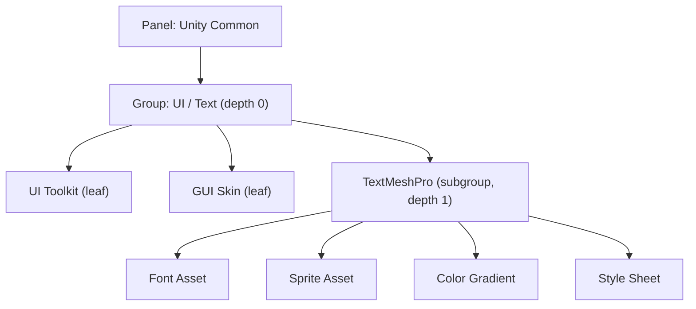

Two curated levels (**Panel → Group**) are Create Plus's own organization; **everything below a group
comes from the native submenu hierarchy** via `SubGroupPath`. A subgroup is never executable (matching
Unity — you can't "run" a submenu); only leaves run.

`CreatePlusViewModel.GroupNode` properties:

- `Commands` — direct leaves at this node.
- `SubGroups` — nested child nodes.
- `Pinned` — pinned leaves bubbled up from the **whole subtree** (so a pinned `TextMeshPro/Font Asset`
  still shows when "UI / Text" is collapsed).
- `TotalCount` — subtree leaf count (shown in the header, e.g. `TextMeshPro (4)`).

### Collapse-default policy

`CreatePlusSettingsStore.IsGroupCollapsed(key, defaultCollapsed)` returns the user override if present,
else the caller's default. The *policy* (which groups start collapsed) lives in the view model because
it knows the hierarchy:

- Depth 0: collapsed only if the group key is in `DefaultCollapsedTopGroups`
  (Animation/Audio/Timeline, UI/Text, Packages/Tools, Advanced/Rare).
- Depth ≥ 1 (every nested subgroup): collapsed by default, to keep the palette tidy.
- Favorites: expanded; Recent: collapsed.

---

## 6. Settings and persistence

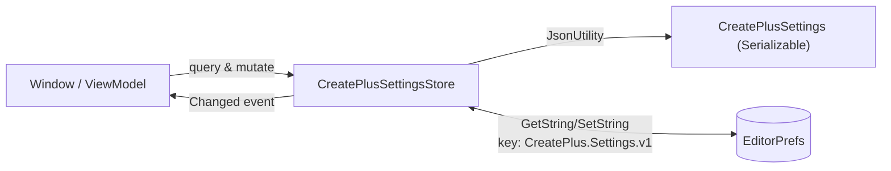

- Single source of truth for state; UI never reads/writes the settings object or stores state in
  controls.
- `CreatePlusSettings` uses parallel `List`s (favorites, pinned, hidden, recent) and a
  `List<UsageEntry>` because `JsonUtility` cannot serialize dictionaries. Collapsed overrides are two
  parallel lists (`collapsedOverrideKeys` / `collapsedOverrideValues`).
- Every mutation calls `Save()` and raises `Changed`, which the window subscribes to for repaint.
- `ResetCommand(id)` clears one command's state; `ResetAll()` wipes the key.

Future migration to `UserSettings/CreatePlus.user.json` changes only `Load`/`Save` — callers are
unaffected (the `v1` suffix in the key makes versioning explicit).

---

## 7. Runtime flows

### 7.1 Opening the palette

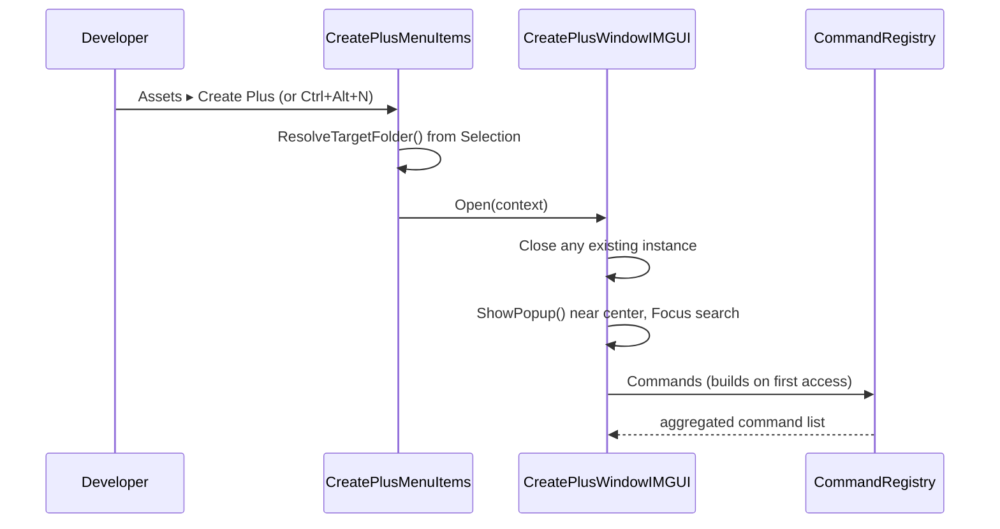

`ResolveTargetFolder`: selected folder → use it; selected file → its parent; nothing → `Assets`.

### 7.2 Rendering one frame

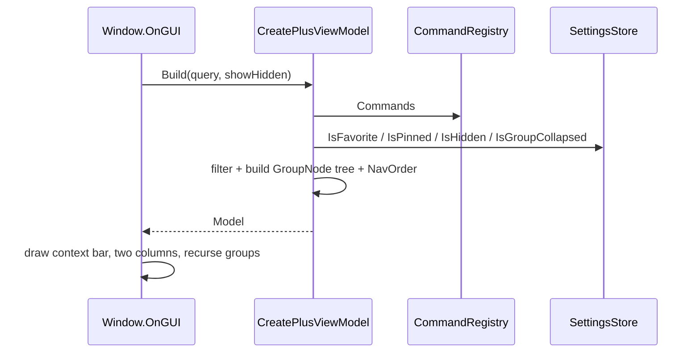

The model is rebuilt every frame (cheap: a few dozen commands). Search re-filters and force-expands all
nesting; empty branches are hidden.

### 7.3 Executing a command

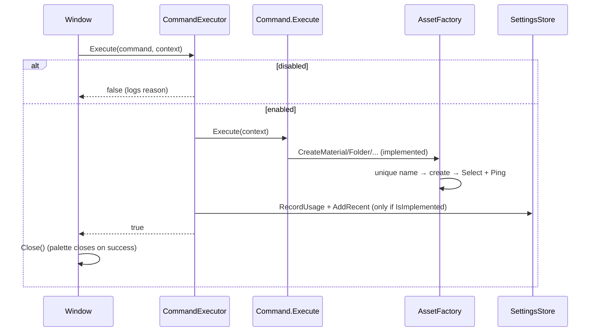

Placeholder (unimplemented) commands log
`Create Plus command is registered but execution is not implemented yet: <path>`, return `false`, and
the palette **stays open**. Exceptions are caught and logged, never crash.

---

## 8. Window behavior and lifecycle

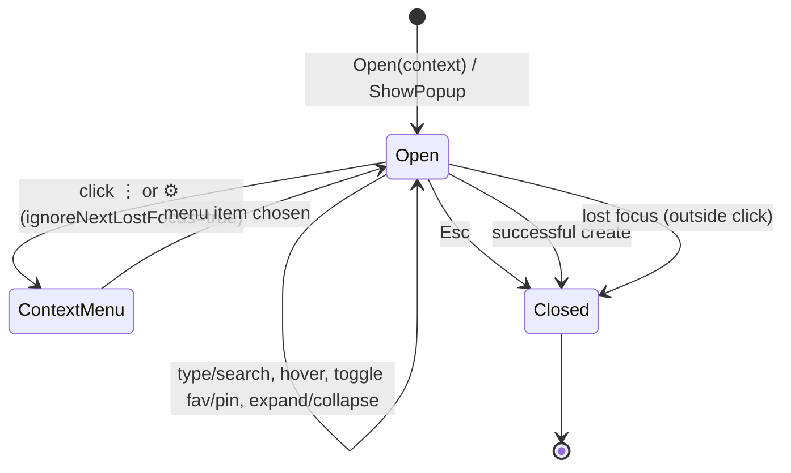

- One borderless popup (`ShowPopup`), placed near the editor center, sized 760×520.
- Asymmetric two-column layout: left ≈ 38 % (Quick Access + Project), right ≈ 62 % (Unity Common).
- Closes on Esc, on success, and on outside click (`OnLostFocus`). A guard
  (`ignoreNextLostFocus`) prevents closing when the app's own `GenericMenu` (⋮ / ⚙) steals focus.
- Keyboard: search focused on open; Up/Down move the selection through `Model.NavOrder` (intercepted
  before the text field consumes them); Enter runs the selection / first match; Esc closes.

---

## 9. Extensibility

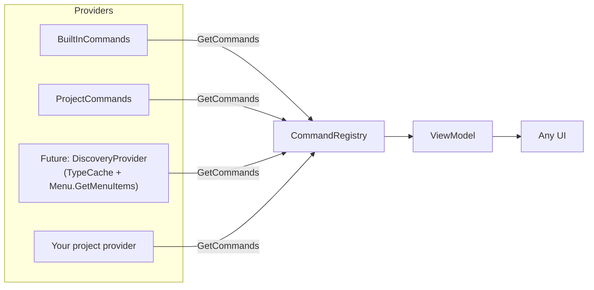

`ICreatePlusCommandProvider` is the single extension seam. Register before first open:

```csharp
CreatePlusCommandRegistry.RegisterProvider(new MyProvider());
```

The registry de-dupes by `Id`, warns on duplicates/missing ids, and **never silently drops** a
command. This is where Phase-3 automatic discovery plugs in: discovered `Assets/Create/...` paths split
directly into `SubGroupPath` and render through the same tree with no UI changes.

---

## 10. Why a future UI Toolkit window is a drop-in

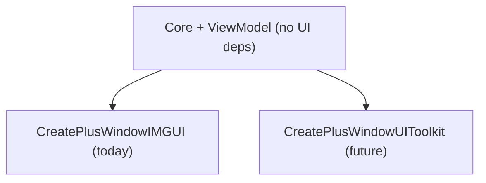

The view model returns plain data (`Model` → `PanelView` → `GroupNode` → `CreatePlusCommand`). A UI
Toolkit window would bind the same `Model`, call the same `CreatePlusCommandExecutor` and
`CreatePlusSettingsStore`, and reuse registry, filtering, context and execution unchanged. Only
`CreatePlusStyles`/`CreatePlusIcons` and the window class are IMGUI-specific.

---

## 11. File layout

```
Assets/Editor/CreatePlus/
  CreatePlus.asmdef            # editor-only assembly "CreatePlus.Editor"
  README.md
  Docs/
    architecture.md            # this file
    plan.md
  Editor/
    CreatePlusMenuItems.cs     # entry points (menu + shortcut)
    Core/
      CreatePlusCommand.cs
      CreatePlusCommandKind.cs
      CreatePlusContext.cs
      ICreatePlusCommandProvider.cs
      CreatePlusCommandRegistry.cs
      CreatePlusSettings.cs
      CreatePlusSettingsStore.cs
      CreatePlusCommandFilter.cs
      CreatePlusCommandExecutor.cs
    Commands/
      CreatePlusBuiltInCommands.cs
      CreatePlusProjectCommands.cs
      CreatePlusAssetFactory.cs
    UI/
      CreatePlusViewModel.cs
      CreatePlusWindowIMGUI.cs
      CreatePlusStyles.cs
      CreatePlusIcons.cs
```

---

## 12. Implemented vs. placeholder

| Area | Status |
| --- | --- |
| Folder, C# Script, Material, Scene, Text, Assembly Definition / Reference | **Real execution** |
| All other Unity Common + all Project commands | Visible **placeholders** (log, no-op) |
| Favorites, pins, hidden, collapsed, recent, usage | Implemented + persisted |
| Search / filter, nested subgroups, keyboard nav | Implemented |
| Automatic discovery, Hierarchy/Scene View, UI Toolkit | Not yet (see `plan.md`) |

---

## 13. Verification

The assembly is isolated, so it is **not** part of `Assembly-CSharp-Editor`. It is compile-checked
offline by harvesting `-r:`/`-define:` lines from Unity's editor `.rsp`, building a fresh response file
with only the Create Plus sources, and invoking Unity's bundled Roslyn (`csc.dll`). Exclude any
`-r:` line pointing at `CreatePlus.Editor.dll` to avoid a self-reference (CS0436). Current result:
**0 errors, 0 warnings**.
