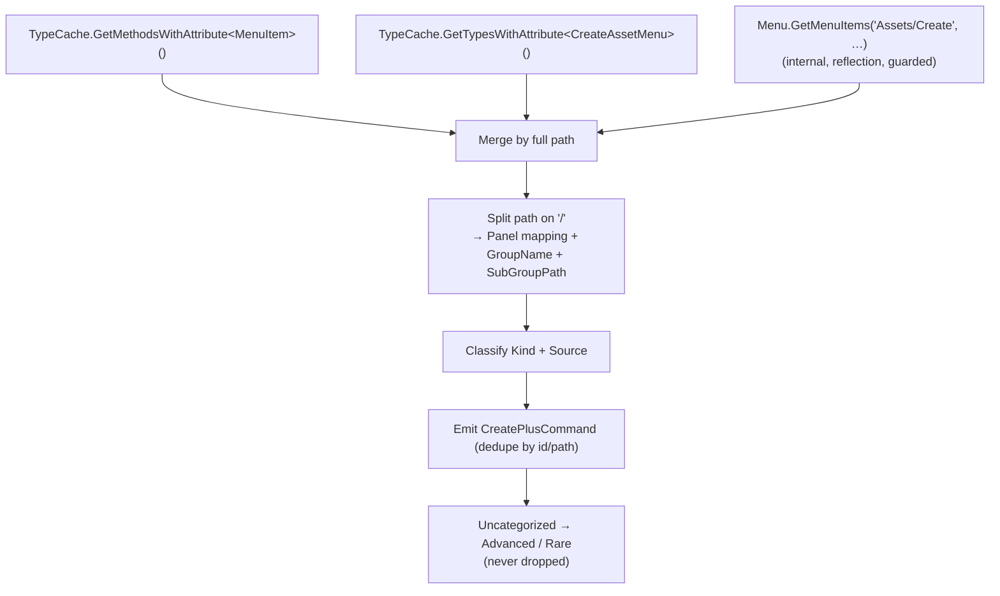

# Create Plus — Implementation Plan

Roadmap and task breakdown for Create Plus. Phase 1 (MVP) is **implemented**; Phases 2–3 are planned.
For the architecture of what exists today, see [`architecture.md`](architecture.md).

Status legend: ✅ done · 🔶 partial · ⬜ planned.

---

## 1. Scope and principles

Create Plus is an **additional** creation palette — it does not modify or replace Unity's built-in
Create menu. Every phase must preserve these invariants:

- Core (registry, settings, context, filter, execution, search) stays free of IMGUI / UI Toolkit.
- Settings live in `CreatePlusSettingsStore`, keyed by stable command `Id` — never on UI controls.
- Commands are never silently dropped; unknown/unimplemented ones are visible placeholders.
- Editor-only, no runtime or third-party dependencies; one isolated assembly (`CreatePlus.Editor`).
- No reflection-heavy hacks in the MVP (reflection is allowed only behind a guarded fallback in the
  Phase-3 discovery provider).

---

## 2. Phase 1 — MVP (implemented)

### 2.1 Delivered work items

| # | Item | Status | Notes |
| --- | --- | --- | --- |
| 1 | Editor-only assembly definition | ✅ | `CreatePlus.asmdef` → `CreatePlus.Editor`, Editor platform only |
| 2 | UI-independent command model | ✅ | `CreatePlusCommand`, `CreatePlusCommandKind`, `SubGroupPath` |
| 3 | Execution context | ✅ | `CreatePlusContext` (target folder + project flag for MVP) |
| 4 | Provider interface + registry | ✅ | `ICreatePlusCommandProvider`, `CreatePlusCommandRegistry` (dedupe by id) |
| 5 | Settings model + store | ✅ | `CreatePlusSettings` + `CreatePlusSettingsStore` (EditorPrefs JSON, `Changed` event) |
| 6 | Search / filter | ✅ | `CreatePlusCommandFilter` — substring over name/path/group/source/kind/aliases |
| 7 | Executor | ✅ | `CreatePlusCommandExecutor` — runs, catches, records usage/recent on success |
| 8 | Built-in command provider | ✅ | `CreatePlusBuiltInCommands` (Unity Common) |
| 9 | Project command provider | ✅ | `CreatePlusProjectCommands` (Project) |
| 10 | Asset creation | ✅ | Folder, C# Script, Material, Scene, Text, Assembly Definition / Reference |
| 11 | View model (group tree) | ✅ | `CreatePlusViewModel` — N-level `GroupNode` tree + `NavOrder` |
| 12 | IMGUI palette window | ✅ | `CreatePlusWindowIMGUI` (borderless popup, two columns) |
| 13 | Styles + icons | ✅ | `CreatePlusStyles`, `CreatePlusIcons` (icon-with-text fallback) |
| 14 | Entry points | ✅ | `Assets/Create Plus`, `Tools/Create Plus/Open`, `Ctrl+Alt+N` |
| 15 | Favorites / Pin / Hide | ✅ | Inline buttons + ⋮ menu |
| 16 | Collapsible nested groups | ✅ | Per-node collapse state; pinned items survive collapse |
| 17 | Recent + usage | ✅ | Last 5; usage counters |
| 18 | Docs | ✅ | `README.md`, `Docs/architecture.md`, `Docs/plan.md` |

### 2.2 Acceptance-criteria mapping

| Criterion | Met by |
| --- | --- |
| Tools ▸ Create Plus ▸ Open shows palette | `CreatePlusMenuItems.OpenFromTools` |
| Assets ▸ Create Plus works | `CreatePlusMenuItems.OpenFromProject` (priority −100) |
| Shows Quick Access / Search / Project / Unity Common | `DrawLeftColumn` / `DrawRightColumn` |
| Right column larger than left | left ≈ 38 %, right ≈ 62 % |
| Groups expand/collapse + state saved | `DrawFoldout` → `SettingsStore.SetGroupCollapsed` |
| Search filters commands | `Build(query)` → `CommandFilter` |
| Favorites toggle | star button / ⋮ → `ToggleFavorite` |
| Pin toggle + visible when collapsed | pin button + `GroupNode.Pinned` mini-rows |
| Folder / C# Script / Material / Scene / Text create | `CreatePlusAssetFactory` |
| Recent + usage update | `CommandExecutor` → `AddRecent` / `RecordUsage` |
| Closes on Esc / on success | `HandleKeyboard` / `ExecuteCommand` |
| Compiles clean | verified offline (0 errors / 0 warnings) |
| Core independent of UI | no IMGUI/UI Toolkit types in Core or ViewModel |

### 2.3 Known MVP limitations (intentional)

- Only the 7 listed asset types execute for real; everything else is a logging placeholder.
- Command list is a **static** registry (no automatic discovery yet).
- Project-window context only (`TargetFolderAssetPath`, `OpenedFromProject`).
- Borderless-popup keyboard focus can be platform-dependent (worth an interactive check).
- `EditorApplication.ExecuteMenuItem` is **not** used yet (deferred to Phase 2 — see 3.1).

---

## 3. Phase 2 — Depth and polish

Goal: make more commands actually work, improve discoverability and keyboard UX, without changing the
Core contracts.

### 3.1 More real execution

- ⬜ **Execute via menu path fallback.** For placeholder commands whose `OriginalPath` is a real leaf
  menu item, run `EditorApplication.ExecuteMenuItem(OriginalPath)` (public API, not reflection). It
  respects the current Project selection, so assets land in the right folder.
  - Add `bool TryExecuteMenuItem` path in the executor; if it returns false, fall back to the logging
    placeholder. Set `IsImplemented` accordingly at discovery time.
  - Submenu paths (e.g. `Assets/Create/TextMeshPro`) are **not** executable — only leaves.
- ⬜ Add more native asset creators to `CreatePlusAssetFactory` where a clean API exists
  (Animator Controller, Render Texture, Audio Mixer, Physics Material 2D, …).

### 3.2 Commands UX

- ⬜ Better icons per `Kind` / per asset type (extend `CreatePlusIcons.GetCommandIcon`).
- ⬜ Disabled-state rendering: dim + tooltip with `DisabledReason` (model already supports it).
- ⬜ "Frequent" block in Quick Access driven by `UsageCount` (data already persisted).
- ⬜ Hidden management UI: the gear menu already toggles "Show Hidden"; add inline unhide affordance.
- ⬜ Search highlighting (highlight matched substring) and optional flattened result list in the right
    column while searching.

### 3.3 Keyboard / navigation

- ⬜ Tab / Shift+Tab between panels; Ctrl+1/2/3 to focus a panel.
- ⬜ Arrow navigation that also expands/collapses the focused group (Left/Right).
- ⬜ Scroll-to-selection so keyboard navigation never moves the selection off-screen.

### 3.4 Settings

- ⬜ Migrate persistence to `UserSettings/CreatePlus.user.json` (change only `Load`/`Save`).
- ⬜ Import / export settings (JSON) for sharing curated palettes.

---

## 4. Phase 3 — Automatic discovery, contexts, package

### 4.1 Menu discovery provider (the big one)

Replace hand-written placeholders with a real `ICreatePlusCommandProvider` that discovers the actual
Create menu, mapping native submenus into the `SubGroupPath` tree.

- ⬜ **Primary (supported, no reflection):** `TypeCache.GetMethodsWithAttribute<MenuItem>()` +
  `TypeCache.GetTypesWithAttribute<CreateAssetMenu>()`. Covers project + package managed commands.
- ⬜ **Supplement (guarded reflection):** internal `UnityEditor.Menu.GetMenuItems("Assets/Create", …)`
  inside `try/catch` to recover native C++ items `TypeCache` cannot see. On failure, fall back to the
  static seed list — never throw.
- ⬜ **Path → tree mapping:** strip `Assets/Create/`, split the rest on `/`. Map the first segment to a
  panel/group via a curated table (TextMeshPro→UI/Text, 2D→2D/Level, etc.); remaining segments become
  `SubGroupPath`. Unmapped first segments go to **Advanced / Rare** (Uncategorized) so nothing is lost.
- ⬜ Stable id derivation from the full path (slugify), so settings survive across discovery rebuilds.
- ⬜ Preserve native `priority` for ordering within a node where available.

### 4.2 Seed-data nesting (incremental, can land before full discovery)

- 🔶 `TextMeshPro` already modeled as a nested subgroup (4 leaves) — proves the tree.
- ⬜ Model `2D` and `Graphics / Rendering` submenus as nested subgroups in the seed data for a richer
    demo until discovery replaces them.

### 4.3 Additional contexts

- ⬜ **Hierarchy**: `GameObject/Create Plus` menu; context with `OpenedFromHierarchy` + selected GO.
- ⬜ **Scene View**: open via a modified right-click (e.g. Shift+Right-Click) or hotkey — **never**
    hijack plain right-click (Unity uses it for navigation). Instantiate at mouse world position.
- ⬜ Scene-object commands (`BuiltInSceneCommand`) with `Undo` support.

### 4.4 Providers & power features

- ⬜ Project-defined factories, prefab-creation shortcuts (`PrefabShortcut`), drag-and-drop favorites.
- ⬜ Custom user groups; alias editing.

### 4.5 UI Toolkit window

- ⬜ `CreatePlusWindowUIToolkit` + `CreatePlus.uxml` / `CreatePlus.uss`, binding the **same** `Model`,
  executor and settings store. No Core changes expected.

### 4.6 UPM extraction

- ⬜ Create `Packages/com.company.create-plus/` with a `package.json` (editor-only layout).
- ⬜ Move `Editor/`, `Docs/` and the asmdef (move each `.meta` with its file to keep GUIDs).
- ⬜ Set namespace/company; verify no project-specific references remain.

---

## 5. Cross-cutting concerns

### 5.1 Testing

- ⬜ EditMode tests for Core (no UI): registry dedupe; filter matching (the spec's `mat`/`shader`/
  `anim`/`tile`/`addr` examples); settings round-trip (favorite/pin/hide/collapse/recent/usage);
  view-model tree construction + `NavOrder`; collapse-default policy.
- ⬜ Asset-factory tests against a temp folder: unique naming, identifier-safe script/asmdef names,
  select + ping, no disturbance to open scenes.
- Manual: open flows, keyboard, outside-click close, ⋮ / ⚙ menus not closing the popup.

### 5.2 Risks & mitigations

| Risk | Mitigation |
| --- | --- |
| `Menu.GetMenuItems` is internal and may change | Guard in `try/catch`; static seed fallback; isolate in one provider |
| Borderless popup focus quirks | `Focus()` + `FocusTextInControl`; `ShowUtility` fallback if needed |
| `GenericMenu` steals focus → closes popup | `ignoreNextLostFocus` guard around ⋮ / ⚙ |
| Discovery floods the palette | Curated panel/group mapping; Advanced/Rare bucket; `log()` anything dropped |
| Settings drift after id changes | Stable, path-derived ids; `v1` key for explicit migration |

### 5.3 Definition of done (per phase)

- Compiles with **0 errors / 0 warnings** (offline Roslyn check or in-editor).
- Core has no IMGUI / UI Toolkit references.
- No regressions to existing acceptance criteria (§2.2).
- New persisted state is versioned and survives a registry rebuild.

---

## 6. Suggested execution order

```mermaid
flowchart LR
    P1["Phase 1 ✅ MVP"] --> A["2.1 ExecuteMenuItem fallback"]
    A --> B["2.2 Disabled states + icons + Frequent"]
    B --> C["4.1 Discovery provider"]
    C --> D["4.2 richer nesting via discovery"]
    D --> E["2.3 keyboard polish + scroll-to-selection"]
    E --> F["4.3 Hierarchy / Scene View"]
    F --> G["4.5 UI Toolkit window"]
    G --> H["4.6 UPM extraction"]
```

Rationale: unlocking real execution (`ExecuteMenuItem`) gives the most user value fastest; discovery
then replaces the static seed; contexts and the UI Toolkit rewrite come once the Core has proven stable
behind two consumers' worth of requirements.
