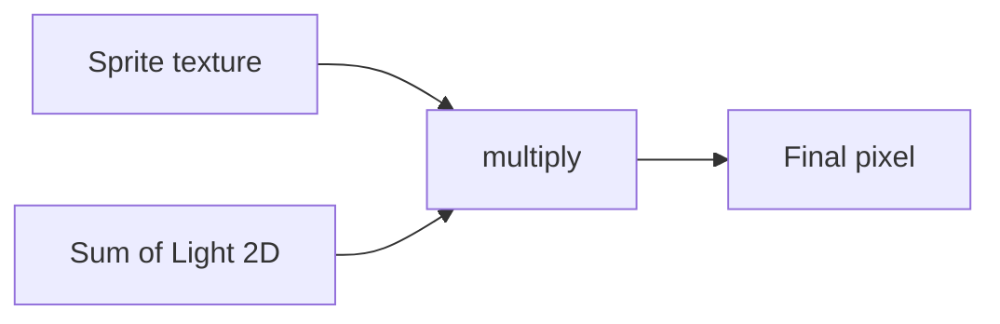
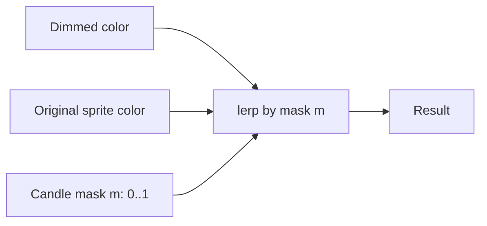

# Custom 2D Lighting: "Reveal" Lights for Pixel Art

A guide to a lighting model where light sources (candles, torches, lamps)
**reveal the original sprite colors** instead of **adding brightness on top of
them**. The goal: a light looks subtle (or invisible) in already-bright scenes,
but pulls dark areas back up to normal — and it can *never* blow out into a flat
white spot.

This document is written for someone new to Unity's 2D lighting. It starts from
how the built-in lighting works, explains *why* the naive setup over-burns, then
builds up the alternative model with the math, a shader sketch, and the
trade-offs.

> Status: **design draft.** No code in the project implements this yet. This is
> a reference for if/when we decide to build it.

---

## 1. Background: how URP 2D lighting actually works

Unity's Universal Render Pipeline (URP) has a **2D Renderer**. Sprites that use a
*lit* material (e.g. `Sprite-Lit-Default`) are not drawn at their raw texture
color. Instead, the renderer first draws all the **Light 2D** components into
off-screen **light textures**, then the sprite shader combines the sprite's
texture color with the light value for that pixel.

The simplified rule for one pixel is:

```
finalColor = spriteColor × accumulatedLight
```

- `spriteColor` — the raw color from the sprite's texture (its *albedo*).
- `accumulatedLight` — the sum of every light hitting that pixel, in the same
  **Blend Style** (more on blend styles in section 5).

Two facts that matter for everything below:

1. **Lights add together.** Two lights of `1.0` give `2.0`. This is *additive*
   blending, the default.
2. **A white global light at intensity 1.0 means `accumulatedLight = 1.0`
   everywhere.** And `spriteColor × 1.0 = spriteColor`, so the scene shows the
   original sprite colors. That is exactly the look we want for a "bright" scene.



---

## 2. The problem: why a candle blows out to white

Say a scene is fully lit: one **Global Light 2D**, white, intensity `1.0`. Every
pixel already has `accumulatedLight = 1.0`, which reproduces the sprite colors
perfectly.

Now drop a candle (a **Spot Light 2D**) into the scene. Additive blending means
the candle *adds* its value on top:

```
center of candle: accumulatedLight = 1.0 (global) + 1.0 (candle) = 2.0
finalColor       = spriteColor × 2.0   →  clamped to white
```

Anything above `1.0` clamps to white on screen, so you get a hard white disc. The
candle destroys the art instead of lighting it.

**The key insight:** a white global light leaves *zero headroom*. `1.0` is already
the maximum useful value (it reproduces the sprite). Any light added after that
can only push past the ceiling and burn out. You physically cannot brighten an
already-fully-bright pixel — there is nothing brighter than "the real sprite
color" in this model.

So the requirement — *subtle in bright scenes, strong in dark scenes, never
over-burning* — cannot come from plain additive light at a white base. We need a
different rule.

---

## 3. The idea: light as a "reveal", not an "add"

Reframe what a candle does. Instead of *adding brightness*, the candle **reveals
the original sprite color** in the area it touches.

Picture two versions of every pixel:

- **Dimmed** — the scene after the global/ambient light has darkened it
  (`spriteColor × global`). This is what an unlit area looks like.
- **Original** — the raw sprite color (`spriteColor`), i.e. "fully and correctly
  lit."

The candle produces a soft **mask** `m` (1 at the center, fading to 0 at the
edge — the same falloff shape a real spot light has). We then **blend between the
two versions** using that mask:

```
result = lerp(dimmed, original, m)
```

- `m = 0` (outside the light) → `dimmed`: the area stays as dark as the global
  light made it.
- `m = 1` (center of the light) → `original`: the area shows its true sprite
  color, no brighter.
- in-between → a smooth blend.

Because the brightest possible result is the *original sprite color*, the light
**cannot over-burn.** There is a hard ceiling, and it is exactly the look we want.



---

## 4. The math: why this auto-solves the bright/dark problem

This is the part worth understanding, because it shows the behavior is *automatic*
— you do not tune the candle per scene.

Define:

| Symbol | Meaning                                              |
|--------|------------------------------------------------------|
| `A`    | original sprite albedo (raw texture color)           |
| `g`    | global lighting factor, `0..1` (≈1 bright, ≈0.2 dark)|
| `S`    | scene after global light, `S = A · g`                |
| `m`    | candle mask, `0..1`                                  |

The reveal shader computes `result = lerp(S, A, m)`. Substitute `S = A · g` and
expand:

```
result = lerp(A·g, A, m)
       = A·g + m · (A − A·g)
       = A · (g + m·(1 − g))
       = A · lerp(g, 1, m)
```

So the **effective lighting factor** is `lerp(g, 1, m)`, which always lands
between `g` and `1`. Two consequences fall out for free:

1. **It can never exceed 1.0**, so the result can never exceed the original
   sprite color → **no white spot, ever.**
2. **The visible strength of the candle is `A · (1 − g) · m`** — proportional to
   `(1 − g)`:
   - Bright scene: `g ≈ 1`, so `(1 − g) ≈ 0` → the candle does almost nothing.
     **Subtle, as desired.**
   - Dark scene: `g` is small, so `(1 − g)` is large → the candle strongly pulls
     the area back to normal. **Strong, as desired.**

The same candle prefab, with no per-scene changes, is quiet in the light and
powerful in the dark. That is the whole point.

> **Conceptual takeaway:** this "reveal" model is mathematically just an *additive
> light that fills the lighting factor up toward 1.0 and then clamps there.* The
> missing clamp is exactly why plain additive light burns out. We are not
> inventing new physics — we are adding the ceiling that the default lacks.

---

## 5. Implementing it in URP's 2D renderer

You need two things in the shader for a given pixel: the **dimmed color** and a
**candle mask**. The clean way to get the mask is to let URP's own lights draw it
for you, into a channel you can read separately.

### 5.1 Give candles their own Blend Style

Open the **2D Renderer Data** asset (the one referenced by the URP Renderer). It
has a list of **Light Blend Styles**. Each blend style is an independent light
buffer with its own **Blend Mode** (`Additive`, `Multiply`, or `Subtractive`) and
a **Mask Texture Channel**.

- Keep the **global/ambient** light on blend style 0 (or compute ambient in the
  shader directly — see 5.2).
- Put **candles** on a *separate* blend style. Each `Light 2D` has a **Blend
  Style** dropdown — point your candle prefabs at this one.

Because the candle now lives in its own buffer, the sprite shader can sample
*just the candle contribution* and use it as the mask `m`. You also inherit the
real spot falloff, inner/outer radius, and spot angle from the `Light 2D`
component — "same light laws, same spot shape" with no hand-written distance math.

### 5.2 A custom Sprite-Lit shader

Stock `Sprite-Lit-Default` only knows how to *multiply*. To `lerp` toward the
original albedo you need a custom lit sprite shader — easiest as a **Shader
Graph** using the **2D lighting / 2D Light Texture** nodes, or hand-written HLSL.
The core fragment logic:

```hlsl
// A      : sprite texture color (original albedo), from SampleSpriteTexture(uv)
// ambient: global/ambient lighting factor (0..1) — a uniform, or sampled
//          from the global blend style's light texture
// m      : candle blend-style light value at this pixel, clamped to 0..1

half3 dimmed = A.rgb * ambient;       // scene after the global light
half3 target = A.rgb * warmTint;      // original color, optionally tinted warm
half3 result = lerp(dimmed, target, saturate(m));

return half4(result, A.a);
```

In Shader Graph the same thing is: sample the sprite texture, multiply by the
ambient factor for `dimmed`, build `target`, then a **Lerp** node driven by the
candle light texture (a **2D Light Texture** node bound to the candle blend
style).

Whether you read `ambient` from a global `Light 2D` or just pass it as a material/
global uniform is your call. Computing it yourself in the shader is often simpler
because it keeps both terms (`dimmed` and `target`) under your control.

### 5.3 Adding the warm candle tint

A real candle is slightly yellow. Bias the `target` toward warm:

```hlsl
half3 warmTint = half3(1.05, 1.0, 0.85);   // a touch more red, less blue
half3 target   = A.rgb * warmTint;
```

At the center (`m = 1`) the result is `A · warmTint`, a mild warm glow. Note that
a channel slightly above `1.0` *re-introduces* a little over-burn on that channel
— keep the boost small, or `saturate()` the result, to stay in control.

### 5.4 Multiple candles overlapping

Several candles in one area would each contribute a mask. Two safe options:

- Combine masks with `saturate(m1 + m2 + …)` in the shader (they share one blend
  style buffer, so this often happens for you).
- Set each candle `Light 2D`'s **Overlap Operation** to **Alpha Blend** instead
  of **Additive**, so overlapping pools don't stack past `1.0`.

---

## 6. Pixel-art considerations

This is a pixel-art project, so guard the presentation (see the Pixel Art Rules in
`AGENTS.md`):

- **Smooth falloff vs. crisp pixels.** The mask is a smooth gradient, so the lit
  edge is a soft ramp — the same look any 2D light gives. If you want the light to
  read as discrete pixel steps, **quantize the mask**:

  ```hlsl
  m = floor(m * steps) / steps;   // e.g. steps = 4 for chunky banding
  ```

- **Light texture resolution.** Each blend style renders at a scale you can lower,
  which makes the light naturally chunkier and cheaper.
- **No sub-pixel wobble.** Keep light positions and the camera pixel-perfect;
  don't let the mask animate in a way that shimmers between pixels.

---

## 7. Cheaper alternative: no custom shader

If a project-wide custom material is too much, you can approximate the same result
with **stock URP** and zero shader work:

1. **Dim the global light per scene:** `g < 1` (high in bright scenes, low in dark
   ones). This creates the headroom that was missing in section 2.
2. **Candle as a normal additive `Light 2D`**, intensity roughly `(1 − g)`, so its
   center lands near `1.0`.
3. **Set HDR Emulation Scale low (≈1)** in the 2D Renderer Data so values clamp
   hard at `1.0` instead of going over-bright.

This mimics `lerp(g, 1, m)` and clamps near the original color. It gets you ~90%
of the way. What you lose compared to the custom shader:

- You tune candle intensity **per scene** instead of getting it automatically.
- The warm tint and the exact clamp point are less precise.

For a first pass or a few hand-placed lights, this is usually good enough.

---

## 8. Trade-offs summary

| Approach                         | Over-burns? | Auto bright/dark | Cost                                  |
|----------------------------------|-------------|------------------|---------------------------------------|
| White global + additive candle   | **Yes**     | No               | Free (but wrong look)                 |
| Dim global + additive + clamp    | No (clamped)| Partly (tune it) | Free, per-scene tuning                |
| Reveal shader (`lerp` to albedo) | **No**      | **Yes**          | Custom Sprite-Lit material everywhere |

Things to weigh before building the reveal shader:

- **Every lit sprite must use the custom material.** That's a project-wide swap to
  set up and maintain.
- **You partly re-implement lighting.** Normal maps, 2D shadows, and volumetrics
  from URP's light system won't apply to the reveal term unless you wire them in.
  You only get the falloff *mask* for free.
- **It's still cheap to run** — it's a couple of extra texture samples and a lerp
  per pixel.

---

## 9. References and tutorials

Official Unity manual (verified, start here):

- **2D Lights overview & Light 2D properties** —
  <https://docs.unity3d.com/Manual/urp/2DLightProperties.html>
  (Light types, Intensity, Blend Style, **Overlap Operation**.)
- **2D Renderer Data & Light Blend Styles** —
  <https://docs.unity3d.com/Manual/urp/2DRendererData-overview.html>
  (Where you add the dedicated candle blend style.)
- **Blend Modes in 2D lighting** —
  <https://docs.unity3d.com/Manual/urp/2d-light-blend-modes.html>
  (Additive / Multiply / Subtractive explained.)
- **HDR Emulation Scale** —
  <https://docs.unity3d.com/Manual/urp/HDREmulationScale.html>
  (Controls the over-bright range and banding — relevant to the section 7 trick.)

For the custom shader:

- **Shader Graph manual — 2D lighting / "2D Light Texture" node.** Look up this
  node in the Shader Graph package docs for your installed URP version; it is how
  you sample a specific blend style's light buffer as the mask `m`.
- **Unity Learn — 2D lighting tutorials.** Search "2D lighting" on
  <https://learn.unity.com> for the official intro projects.

Community tutorials worth searching for (titles, not pinned URLs, since these move):

- "URP 2D lights getting started" — for the basic Light 2D setup and blend styles.
- "Unity 2D custom lit sprite shader / Shader Graph 2D lighting" — for reading the
  light texture inside a sprite shader, which is the heart of section 5.

> When following any tutorial, confirm it targets **URP 2D** and a URP version
> close to ours — the 2D lighting API changed across URP versions (e.g. the
> Parametric light type was deprecated, and blend-style options moved around).
