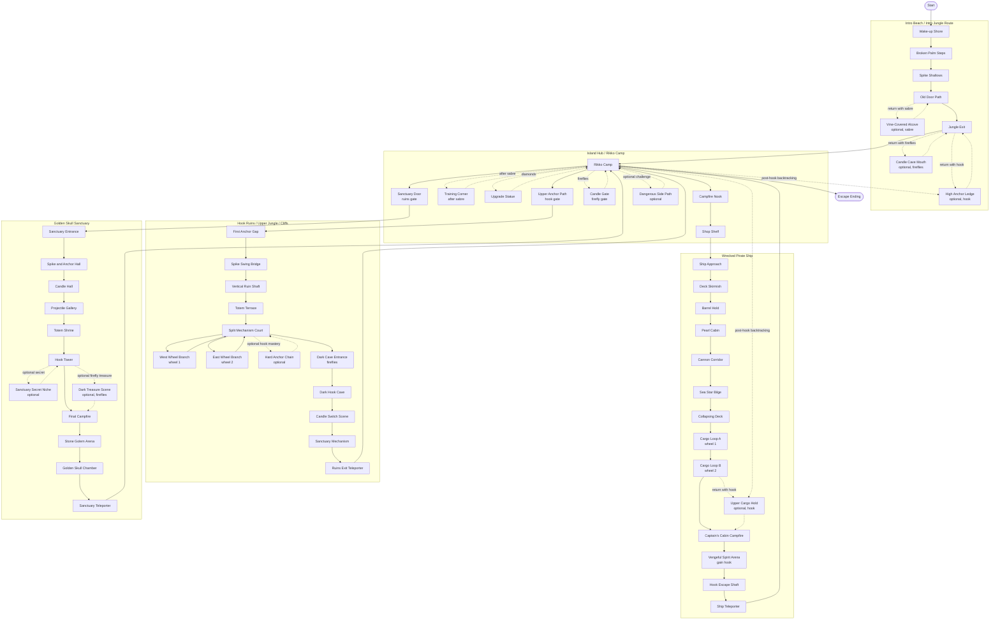

# Scene Traversal

This document summarizes the scenes from `docs/walkthrough-plan.md` as a
production inventory and traversal diagram.

Terminology follows `docs/walkthrough-plan.md`:

- Location: a logically connected set of scenes in one biome or place.
- Scene: a Unity scene and the main planning unit inside a location.
- Point of interest (POI): a smaller meaningful spot inside a scene, such as a
  key item, tutorial setup, enemy encounter, puzzle, secret, campfire, or reward.

## Scene Development List

The detailed challenge and reward breakdown for each location is in
`docs/walkthrough-plan.md`.

### Intro Beach / Intro Jungle Route

1. Wake-up Shore - start scene with flat movement and coin collection.
2. Broken Palm Steps - short jump and one-way platform tutorial.
3. Spike Shallows - first readable spike hazard with safe retry space.
4. Old Door Path - simple switch or permanent door progression.
5. Vine-Covered Alcove - optional sabre-gated POI with coins, rum, or a chest.
6. High Anchor Ledge - optional hook-gated POI with a diamond.
7. Candle Cave Mouth - optional firefly-gated POI with a candle puzzle reward.
8. Jungle Exit - final intro platforming scene leading to the hub.

### Island Hub / Rikko Camp

1. Rikko Camp - main NPC, Golden Skull objective, and later ending return.
2. Campfire Nook - checkpoint, rest, and recovery POI.
3. Training Corner - sabre practice POI after weapon acquisition.
4. Upgrade Statue - diamond upgrade POI.
5. Shop Shelf - Rikko shop POI for supplies and optional perks.
6. Upper Anchor Path - hook-gated scene leading toward the ruins.
7. Candle Gate - firefly-gated scene or shortcut.
8. Sanctuary Door - sealed final-location gate opened by ruins mechanisms.
9. Dangerous Side Path - optional difficult POI with diamonds and supplies.

### Wrecked Pirate Ship

1. Ship Approach - entry scene and sabre pickup or sabre confirmation.
2. Deck Skirmish - first walking shark melee encounter.
3. Barrel Hold - movable and breakable barrel puzzle scene.
4. Pearl Cabin - shell projectile-reading scene.
5. Cannon Corridor - cannon timing and cover scene.
6. Sea Star Bilge - charge-enemy scene in a constrained corridor.
7. Collapsing Deck - one-way fall into the lower hold.
8. Cargo Loop A - mixed shark and shell encounter, first steering wheel.
9. Cargo Loop B - cannon and barrel-cover encounter, second steering wheel.
10. Upper Cargo Hold - optional hook-gated POI with diamond and parrot option.
11. Captain's Cabin Campfire - pre-boss checkpoint and supply scene.
12. Vengeful Spirit Arena - first boss scene and grappling hook reward.
13. Hook Escape Shaft - required first hook traversal after the boss.
14. Ship Teleporter - fast-return scene back to the hub.

### Hook Ruins / Upper Jungle / Cliffs

1. First Anchor Gap - safe single-swing hook tutorial scene.
2. Spike Swing Bridge - hook traversal over real spike danger.
3. Vertical Ruin Shaft - chained anchor climb scene.
4. Totem Terrace - hook movement under ranged totem pressure.
5. Split Mechanism Court - central scene that branches to two wheel routes.
6. West Wheel Branch - shell plus hook traversal, steering wheel 1.
7. East Wheel Branch - floor-pressure encounter, steering wheel 2.
8. Hard Anchor Chain - optional hook mastery POI with a diamond.
9. Dark Cave Entrance - first firefly-readable dark scene.
10. Dark Hook Cave - fireflies reveal anchors for hook traversal.
11. Candle Switch Scene - fireflies light unreachable candles to open a door.
12. Ruins Exit Teleporter - fast-return scene to the hub.
13. Sanctuary Mechanism - final ruins objective that opens the sanctuary.

### Golden Skull Sanctuary

1. Sanctuary Entrance - final location entry with stone doors and light combat.
2. Spike and Anchor Hall - late-game hook precision scene.
3. Candle Hall - final firefly candle sequence.
4. Projectile Gallery - layered shell and cannon pressure scene.
5. Totem Shrine - spawned-threat management scene.
6. Hook Tower - vertical traversal with danger below.
7. Sanctuary Secret Niche - optional hook or firefly POI with a diamond.
8. Dark Treasure Scene - optional high-risk firefly treasure scene.
9. Final Campfire - final checkpoint and preparation scene.
10. Stone Golem Arena - final boss scene.
11. Golden Skull Chamber - quiet quest reward scene.
12. Sanctuary Teleporter - fast-return scene to Rikko Camp.

## Scene Traversal Diagram

Solid arrows show the main route. Dashed arrows show optional POI branches or
backtracking routes that can be taken after the required ability is unlocked.

