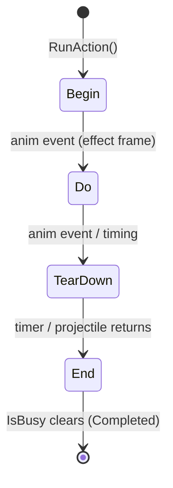

# Stone Golem Boss

Physics-bound melee bruiser. Walks toward the player (it cannot fly or teleport), swings a
melee attack up close, and has two ranged options: a detachable hand and a beam. Implemented in
`Assets/Game/Features/Bosses/StoneGolem/`.

## Architecture

Three layers, each a MonoBehaviour-per-component (the project's boss convention):

- **Controller** — `StoneGolem` (root). Runs one action at a time, relays animation events to the
  active action, and provides physics locomotion. Holds **no** per-action logic.
- **Actions** — `EnemyAction` subclasses on child objects (`Actions/…`). Each owns its triggers,
  damager, prefab, and lifecycle.
- **Selector** — `StoneGolemAI` (root). Picks an action on a cadence, otherwise walks the golem
  toward the player.

```
StoneGolem (root)        ← StoneGolem + StoneGolemAI + Animator/Rigidbody2D/Facing2D
├── Actions
│   ├── MeleeAction
│   ├── HandShootAction   (ProjectileShootAction)
│   └── BeamShootAction   (ProjectileShootAction)
├── MeleeDamager
├── HandSpawnPos
├── BeamSpawnPos
└── HandShootArea
```

`EnemyAction` (`Bosses/_Shared/EnemyAction.cs`) is shared so future bosses reuse it.

## Action lifecycle

Every action runs the same four steps. Frame-accurate moments (open/close a damage window,
spawn frame) come from **animation events**; the **end is code-owned** (a timer or the
projectile's return), so a missing end event can never soft-lock the boss. A per-action
`maxDuration` safety cap force-completes a stuck action.



Animation events are relayed generically: clips call `OnActionDo` / `OnActionTearDown` on the
controller, which forwards to the active action. Adding a new action never adds a method to the
controller.

## Actions

| Action | Start trigger | Do (effect frame) | Tear down | Ends when |
|--------|---------------|-------------------|-----------|-----------|
| Melee | `onMeleeAttack` | enable `MeleeDamager` | disable `MeleeDamager` | hold timer elapses |
| Hand shoot | `onShootHand` | spawn hand, fly out in facing dir | — | hand returns (then `onShootHandEnd`) |
| Beam shoot | `onCastBeam` | spawn beam, fly out in facing dir | — | beam returns |

Hand and beam are two configured instances of `ProjectileShootAction`; the projectile
(`StoneGolemProjectile`) flies straight out, reverses, and returns to its spawn point, then the
action despawns it. They share one class because their behavior is currently identical — split
into subclasses only if they diverge.

## Action selection

`StoneGolemAI` re-evaluates on a cadence when the golem is free, in priority order:

| Priority | Condition | Action |
|----------|-----------|--------|
| 1 | Player overlaps `HandShootArea` | Hand shoot |
| 2 | Player within `meleeRange` (horizontal) | Melee |
| 3 | otherwise | Beam shoot |

Between picks (and when no action is chosen) the golem walks toward the player to close distance.

## Tuning knobs

| Field | Component | Meaning |
|-------|-----------|---------|
| `moveSpeed` | StoneGolem | Horizontal walk speed |
| `cadence` | StoneGolemAI | Minimum time between action picks |
| `meleeRange` | StoneGolemAI | Distance under which melee is preferred |
| `warmupDelay` | StoneGolemAI | Delay before the golem starts acting |
| `holdDuration` | MeleeAction | How long a swing locks the golem |
| `speed` / `travelDistance` | StoneGolemProjectile | Hand/beam reach and pace |
| `maxDuration` | EnemyAction | Safety cap before force-completing |

## Out of scope

- Weighted pattern-pool AI (the `BossPatternSlot` machinery used by Vengeful Spirit) — the
  selector here is condition + cadence only.
- Shield cast (leftover `ShieldCast` animator state is unused).
- A dedicated walk/Move animation and phase transitions.
