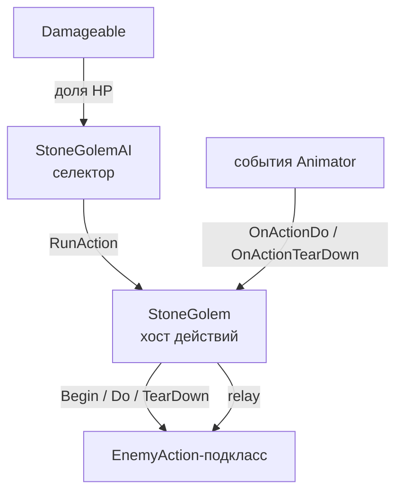
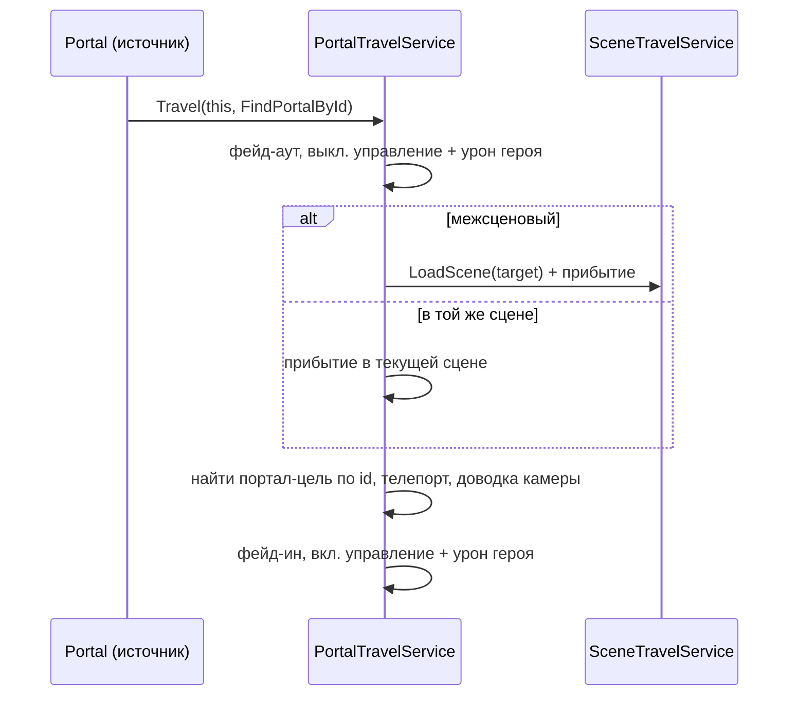

# Сопроводительная записка к работе

Документ описывает изменения, внесённые в проект в ветке `develop`, начиная с
коммита `6c2f1b42` («Docs: Add initial docs with location specs») и до текущего
состояния ветки. За этот период (≈ 17 мая — 16 июня 2026 г., 83 коммита) проект
из набора отдельных прототипных сцен и заготовок механик был доведён до состояния
небольшой, но цельной приключенческой игры — 2D pixel-art платформер/лёгкая
метроидвания про юнгу-пирата, выбравшегося на странный остров.

Записка объясняет не только геймплейные механики, но и технические особенности их
реализации, а также инфраструктуру и инструментарий, разработанные попутно.

> Масштаб правок: 1230 файлов (включая ассеты — спрайты, сцены, звуки), из них
> ~274 файла исходного кода C# (+19 800 / −3 200 строк). Ниже описаны логические
> группы изменений и затронутые системы.

---

## Содержание

1. [Концепция игры и структура мира](#1-концепция-игры-и-структура-мира)
2. [Движение и управление героем](#2-движение-и-управление-героем)
3. [Грэпплинг-крюк (traversal-механика)](#3-грэпплинг-крюк)
4. [Перетаскивание бочек](#4-перетаскивание-бочек)
5. [Боссы](#5-боссы)
6. [Враги, бой и лут](#6-враги-бой-и-лут)
7. [Интерактивные объекты и пропсы](#7-интерактивные-объекты-и-пропсы)
8. [Перемещение между сценами: единый фреймворк порталов](#8-перемещение-между-сценами)
9. [Сохранение состояния сцены](#9-сохранение-состояния-сцены)
10. [Глобальное состояние игрока и важные баг-фиксы](#10-глобальное-состояние-игрока)
11. [Диалоговая система](#11-диалоговая-система)
12. [Музыка и звук](#12-музыка-и-звук)
13. [Камера](#13-камера)
14. [Интерфейс, меню и сохранения прохождения](#14-интерфейс-меню-и-сохранения)
15. [Отладочные инструменты](#15-отладочные-инструменты)
16. [Редакторский инструментарий](#16-редакторский-инструментарий)
17. [Контент: уровни, тайлсеты, концовка](#17-контент)
18. [Автотесты](#18-автотесты)
19. [Сквозные технические принципы](#19-сквозные-технические-принципы)

---

## 1. Концепция игры и структура мира

Игра — компактная приключенческая метроидвания с одним центральным хабом,
несколькими связанными локациями, лёгким бэктрекингом, разблокируемыми
способностями перемещения, двумя боссами, секретами и одной концовкой.

Реализованы локации с двойными названиями (внутреннее / игровое EN / RU):

| Локация (разработка) | Игровое имя EN | Игровое имя RU |
|---|---|---|
| Intro Beach / Jungle | Driftwood Shore | Коряжий Берег |
| Island Hub / Rikko Camp | Warmrocks | Тёплые Камни |
| Wrecked Pirate Ship | The Wrong Ship | Неправильный Корабль |
| Golden Skull Sanctuary | Skullkeeper Hollow | Лощина Сторожа Черепа |

> Отдельная локация «крюк-руины» (по первоначальному плану — Cloud Mountain) как
> самостоятельная локация не делалась: связанный с крюком контент сейчас размещён
> отдельными сценами в составе Warmrocks.

Критический путь прохождения: найти торговца-ящера Рикко, который указывает герою на **Капитана
Клаца** → получить саблю (после этого становится доступен Капитан Клац) →
исследовать затонувший корабль → победить Мстительного Духа → получить
грэпплинг-крюк → вернуться в хаб → посетит капитана Клаца, получить от него наводку → открыть святилище →
победить Каменного Голема → забрать Золотой Череп → отдать его Капитану Клацу →
покинуть остров.

---

## 2. Движение и управление героем

Базовое управление героем переработано и расширено. Все правки локальны для
`PlayerController` и сделаны так, чтобы не ломать существующую «физику ощущения».

**Управление скоростью с разгоном.** Горизонтальное движение получило плавный
разгон/торможение вместо мгновенной установки скорости. Параметры тюнинга вынесены
в инспектор в единицах «время до эффекта» (например, время выхода на максимальную
скорость), а не в виде ускорений — это принятое в проекте соглашение для удобства
настройки дизайнером.

**Атака в воздухе.** Добавлена обычная атака саблей в прыжке/падении — раньше атака
была доступна только на земле.

**Спрыгивание сквозь one-way платформы по таймеру.** Реализован «дроп» сквозь
платформу одностороннего коллизирования: при нажатии «вниз+прыжок» коллизия с
платформой временно игнорируется на короткий таймер, после чего восстанавливается.
Таймерная схема надёжнее, чем переключение слоёв «на выход из коллайдера», и не
залипает.

**Маленький прыжок при сходе с one-way платформы.** При спрыгивании с края
односторонней платформы герой получает небольшой вертикальный импульс — это
убирает «прилипание» к краю и делает сход с платформ читаемым.

**Падение в воду и респаун.** Вода (`Water` + `PlayerController.FallIntoWater`)
не наносит урон: при входе в триггер воды герой «булькает» у поверхности (верхняя
грань коллайдера воды), а затем респаунится в последней безопасной точке на земле.
Поверхность вычисляется как `collider.bounds.max.y`, целевые слои фильтруются
маской. Вода вынесена в отдельную папку `Features/Props/Water` вместе с бликами
(`WaterReflex`).

Существующие перки (маска неуязвимости, попугай-компаньон) сохранены; новая
крюк-способность встроена в ту же систему перков (см. раздел 3).

---

## 3. Грэпплинг-крюк

Крюк — ключевая traversal-способность, открываемая после первого босса.

**Поведение.** Крюк действует только в радиусе вокруг героя, только в воздухе
(в прыжке/падении) и только если в этом радиусе, в секторе по направлению взгляда,
есть «якорь» (`GrapplingHookAnchor`). По нажатию снаряд летит к ближайшему якорю и
цепляется; герой висит на верёвке и раскачивается как маятник — горизонтальный ввод
подкручивает качание, а «вверх/вниз» укорачивает/удлиняет верёвку (подтягивание).
**Крюк отцепляется не по отпусканию кнопки, а при одном из событий: нажат прыжок
(импульс качания при этом сохраняется), герой получил урон, герой коснулся земли,
либо якорь уничтожен.**

**Техническая реализация.** Выбрана гибридная схема:

- **Физика качания** — единственный `DistanceJoint2D` от Rigidbody2D героя к мировой
  точке якоря, с `maxDistanceOnly = true` (верёвка, а не жёсткий стержень: можно
  быть ближе длины — это даёт естественный провис и маятник). Это устойчивее, чем
  цепочка из физических звеньев, которая «дребезжала» бы при большой массе (10) и
  сильной гравитации (−40) проекта. Маятник на joint'е **сохранён** (не упрощён),
  и поверх него добавлены: подкрутка качания силой (`AddForce`), линейное затухание
  (`drag`) на время виса, «подтягивание/спуск» по верёвке вводом вверх/вниз
  (меняется `joint.distance`) и «подбор» длины — пока герой ещё падает к якорю,
  длина верёвки укорачивается под его реальную дистанцию и фиксируется в момент
  первого натяжения, чтобы верёвка не «выпирала» сквозь героя.
- **Визуал верёвки** (`GrapplingHookRope`) — собственная Verlet-симуляция: концы
  пришпилены к кончику крюка и герою, промежуточные точки считаются интегрированием
  с затуханием и несколькими проходами distance-constraint. Рендерится цепочкой
  маленьких спрайтов (pixel-perfect), без `LineRenderer`.
- **Состояние** управляется FSM из трёх состояний `Idle → Shooting → Attached` на
  базе проектного `SimpleStateMachine<T>`, с принудительным аварийным выходом в
  `Idle` из любого состояния (перечисленные выше события отцепления).
- **Снаряд** (`GrapplingHookProjectile`) — кинематический Rigidbody2D, движется
  `MovePosition` в `FixedUpdate`.

**Интеграция с героем — минимальная и изолированная:** способность вынесена в
отдельный `MonoBehaviour` на префабе героя (по образцу `DragAbility`), а в
`PlayerController` добавлен только флаг/метод `SetHookSwingMode` и охранное условие
в `CheckHorizontalMovement`, чтобы прямое управление скоростью не боролось с
joint'ом. Якоря лежат на отдельном физическом слое `HookAnchors`.

---

## 4. Перетаскивание бочек

Бочки — это головоломочное препятствие: герой подходит, зажимает «Взаимодействие»
и тянет/толкает бочку. Прежняя реализация на динамической физике (`FixedJoint2D` +
трение/масса) была **полностью переписана на кинематическую, raycast-driven модель**.

Почему переписали: физический солвер порождал пять системных проблем — бочка
«висла» на краю уступа, скорость драга нельзя было задать числом, толчок нижней
бочки из-под верхней был ненадёжным, джойнты рвались от лишней силы и терялись при
падении с уступа.

**Новая модель:**

- Каждая бочка — **кинематический Rigidbody2D**. Вертикальное движение (гравитация,
  падение) принадлежит компоненту `BarrelMotor`; горизонтальное — только во время
  драга и принадлежит координатору `DragAbility` («конвой»).
- `BarrelMotor` определяет «на земле» тремя лучами `MultiRayCaster` (как у героя),
  падает через `Rigidbody2D.Cast` вниз с остановкой за субпиксельный `SkinWidth` до
  поверхности, а на земле «оседает» к единой высоте покоя.
- Обойдена особенность физического движка. Если бочка хоть чуть-чуть перекрывает
  другой коллайдер, проверка движения (`Rigidbody2D.Cast`) во **всех** направлениях
  возвращает «препятствие на нулевом расстоянии» — то есть бочка кажется
  «заблокированной отовсюду» и её нельзя ни толкнуть, ни опустить. Чтобы этого не
  было, заведено правило «бочка никогда не перекрывает соседний коллайдер»: каждая
  бочка держит субпиксельный зазор `SkinWidth`, стопка плавно «оседает» к единой
  высоте, а нулевые попадания при падении игнорируются.
- Маска препятствий обязательно включает `Ground` **и** `DynamicObjects`, иначе
  бочки не штабелируются.
- `DragAbility` каждый `FixedUpdate` делает «лок-степ»: считает шаг, клампит его
  кастами и героя, и нижней бочки, двигает обе на один и тот же `allowedDx` — связь
  логическая (ссылка), без джойнта. Стопка из 3 бочек считается слишком тяжёлой,
  чтобы её тянуть, — драг такой стопки просто не запускается, бочки не двигаются.
  Падающую бочку нельзя толкать (горизонтальный шаг = 0), а драг продолжается, пока
  точка захвата перекрывает бочку (есть «coyote»-льгота от мерцания граунд-чека).

Скорости драга (`dragSpeedSingle` / `dragSpeedStacked`) теперь — обычные числа
units/sec в инспекторе.

---

## 5. Боссы

### 5.1 Мстительный Дух (Vengeful Spirit) — доработка

Первый босс на корабле получил доработки поведения и сцену появления
(`BossEncounterStateSaver`, intro-кат-сцена), флаг победы `VengefulSpiritDefeated`
и выдачу награды (крюк). Босс служит «воротами» к грэпплинг-крюку.

### 5.2 Каменный Голем (Stone Golem) — новый финальный босс

Крупнейшая новая система. Это **двухфазный** босс в одной комнате, которая
разрушается на середине боя.

**Архитектура** повторяет паттерн action/selector существующих боссов (тактические
паттерны реализованы как MonoBehaviour на префабе босса):

- `EnemyAction` (`_Shared/EnemyAction.cs`) — общий жизненный цикл действия
  Begin → Do → TearDown → Complete с защитным `maxDuration`. Каждая атака —
  отдельный компонент-подкласс.
- `StoneGolem` — хост: владеет действиями, гоняет по одному за раз, ретранслирует
  события аниматора, предоставляет локомоцию и атомарные «способности тела».
- `StoneGolemAI` — селектор: на заданной частоте выбирает следующее действие по
  дальности/условиям, по взвешенным **пулам на фазу**.

**Набор атак:** ближний реактивный контрудар, летающая рука (запуск/возврат с
уроном на обоих участках), лазерный луч с фиксированной разверткой −40°→+40°
(80°; по данным префаба), удар по земле с падающими камнями, фаза-2-атаки —
лазерный крест (3 вращающихся луча, равномерно по 120° вокруг общей оси —
упрощено для простоты) и каменная волна (поднимающиеся из земли шипы двумя
фронтами).

**Фазовый переход.** При 50% HP срабатывает «усиленный удар по земле» —
скриптовая кат-сцена: голем разбивает пол уровня 1, и босс с игроком падают на
нижний уровень той же комнаты; камера переключается на больший confiner. Триггер —
однократное пересечение фиксированного порога `Health/maxHealth = 0.5` (флаг-защёлка
гарантирует, что переход сработает только один раз).

**Навигация по арене.** Точки-якоря (`StoneGolemAnchorPoint`) расставляются в
сцене как маркеры с рёбрами-связями (Move / Jump / HorzJump). `StoneGolemNavGraph`
строит граф и ищет путь алгоритмом Дейкстры; перемещение между уровнями —
параболические прыжки/перелёты с easing (`SmoothStep`) для «тяжёлой левитации».
Преследование игрока (`PursuePlayer`) перепланирует маршрут на каждом узле и по
таймеру против живой позиции игрока.

**Общие технические решения босса:**

- «Слэм» в землю (`StoneGolem.SlamToGround`) — атомарная способность хоста
  (свободное падение до коллизии со слоем `Ground` + эффекты удара), переиспользуется
  тремя вызовами (интро, удар по земле, перелом пола), каждый со своими
  `SlamSettings`. Принцип: «атомарные способности тела — на хосте, тактический тюнинг
  — на паттерне».
- «Шар»-состояние управляется `SetImmune` (имя берётся из анимации): мгновенный сбор
  в шар (маленький коллайдер, гравитация в ноль) и анимационно-управляемое
  «разворачивание» с фолбэк-таймаутом события.
- Сопутствующие сущности: `StoneGolemBeam`, `StoneGolemProjectile` (рука),
  `FallingStone` (падающие камни с самоочисткой), `StoneDebrisPlayer`, кастомный
  инспектор отладочных кнопок (`StoneGolemDebugControls`), `GolemSceneDirector`,
  `GolemEncounterStateSaver`, интро-триггер `StoneGolemIntro` (старт боя по подбору
  фальш-черепа).

Тюнинг всех атак выражен «в секундах-до-эффекта», экспонирован в инспектор.

---

## 6. Враги, бой и лут

**Доработанный `LootDropper`.** Источник лута (сундук, бочка, враг) несёт
собственный список «префаб + количество», без общих loot-таблиц и без случайности в
том, *что* падает (рандомизируется только разлёт). Два API: `DropLoot()` роняет весь
список, `DropLoot(int)` — N копий первого элемента (для расчётных величин — монеты,
теряемые при смерти). Оба ничего не делают во время `IsRestoring`, чтобы открытые/
уничтоженные объекты не дропали лут повторно. Лут добавлен всем врагам и разрушаемым
опасностям.

**Искры удара для всех попаданий.** Эффект искр (`HitEffectPlacement`) теперь
показывается на всех попаданиях, а не только на части — единообразная боевая
обратная связь.

**Вертикальный импульс Пинки.** Если ударить «Пинки» во время его переката, он
**не получает урон**, а подбрасывается вверх. Это даёт игроку возможность отбить
накатывающего Пинки и избежать урона, не прибегая к прыжку.

---

## 7. Интерактивные объекты и пропсы

**Двери, замки и шлюз-решётка.** Введён общий «шов» условного взаимодействия
`IInteractionGate` в `InteractableBase`: гейт вызывается *до* `onInteract` и может
разрешить (`Allow`), отклонить с обратной связью (`Reject`) или отложить
(`Deferred`) активацию. Первый потребитель — `KeyLock`: дверь без ключа не
открывается (звук «заперто»), с ключом — ключ расходуется, играет звук «поворота» и
дверь открывается с задержкой; разблокировка **персистентна** на всё прохождение
(`KeyLockStateSaver`, тип `Persistent`), иначе после расхода одноразового ключа
игрок бы залочился. Добавлены `KeyLock` на все деревянные двери и `Portcullis`
(решётка).

**Бочки** — см. раздел 4 (кинематическая переработка, разрушаемый вариант с лутом).

**Вода** — см. раздел 2 (погружение и респаун).

**`RevealMask`** — компонент-маска, скрывающая части уровня (для секретов/
постепенного раскрытия).

**`ActivateSwitchableAfterDelay`** — активация переключаемого объекта с задержкой
(для последовательностей механизмов).

**Тотемы** — сохранение состояния тотемов между визитами.

**Свеча** добавлена в боссовую локацию (атмосфера + музыкальная пауза при входе в
боссовую комнату).

**Корабль и концовка.** Добавлены `Ship`, `ShipDepartureCutscene` (кат-сцена
отплытия) и `CreditsRoll` для финальной сцены — герой покидает остров.

---

## 8. Перемещение между сценами

Все способы перехода между точками/сценами сведены в **единый фреймворк
`Features/Portals`**.

**Единая модель `IPortal`.** Каждый портал — одновременно и триггер со ссылкой
(`PortalLink`: целевая сцена + id целевого портала), и адресуемая точка прибытия.
Переход односторонний (A → B; двусторонность = дать B ссылку на A). Кросс-сценовый
переход не может использовать прямую ссылку на объект (целевая сцена ещё не
загружена) — поэтому цель резолвится **по id** после загрузки, что уже умеет
`PortalTravelService`.

Под общий интерфейс приведены разные «виды» порталов через реестр `PortalKind`,
который одной регистрацией включает выпадающий список связей, валидатор, окно смены
id, гизмо и починку ссылок:

- `Entrance` / `EntranceHorizontal` — кинематографические входы/выходы с
  авто-проходкой героя при входе и выходе (рефакторинг дверей и входов).
- `Door` (+ `Portcullis`) — двери как порталы.
- `Portal` — простой не-кинематографический телепорт (бывший `PortalController`),
  унифицирован и переведён на кросс-сценовые переходы через `PortalTravelService`
  (с фейдом 0.25с, как у двери/входа).

Перемещение между сценами в целом владеет `SceneTravelService`, который испускает
событие `BeforeUnload` (на него подписана система сохранения состояния — раздел 9) и
флаг `IsTransitioning` (используется музыкой — раздел 12).

---

## 9. Сохранение состояния сцены

Состояние объектов сцены, переживающее переходы между сценами и отдых у костра,
обслуживает `SceneStateService` по паттерну **`StateRoot` + компонент-saver**.

**Принцип.** На объект вешается `StateRoot` (стабильный `SaveId`, тип, флаг
`SkipSave`) и один/несколько saver'ов-сиблингов. Захват состояния происходит на
выгрузке сцены (`Capture`), восстановление — в `StateRoot.Start()` следующей загрузки.
Критичные/редкие изменения (разрушение объекта) **немедленно** пушатся через
`PushSlot`, потому что уничтоженный объект уже не доживёт до выгрузки.

**Два типа:** `Session` (сбрасывается при отдыхе/смерти — ослабленные враги,
сдвинутые бочки) и `Persistent` (на всё прохождение — открытые двери, разрушенные
пропсы).

**Ключевание по GUID сцены** (а не имени файла), через `SceneCatalog`, чтобы данные
переживали переименования/перемещения сцен.

Встроенные saver'ы: `TransformStateSaver`, `DestructionStateSaver`,
`DamageableStateSaver`, `SwitchStateSaver`, `SwitchableStateSaver`, и новые
`KeyLockStateSaver`, `CameraConfinerStateSaver`, а также боссовые
`BossEncounterStateSaver` / `GolemEncounterStateSaver`.

**Правило для разрушаемых объектов:** `Damageable.onDeath` должен вызывать
`DestructionStateSaver.MarkDestroyedAndDestroy`, а не голый `Destroy` — иначе
разрушение не сохранится.

Сопутствующий инструментарий — авто-присвоение `SaveId` при сохранении сцены,
обнаружение дублей id (при копировании Ctrl+D), окно Scene Tools для валидации/
починки (раздел 16).

---

## 10. Глобальное состояние игрока

Глобальный прогресс игрока (флаг вооружённости `IsArmed`, уровни апгрейдов
здоровья/урона, текущее HP, инвентарь, событийные флаги и просмотренные узлы
диалогов) живёт **не** в посценовых saver'ах, а в in-memory `PlayerState` у
`DontDestroyOnLoad`-`GameManager` (`G.Game.playerState`). `PlayerController`
переприменяет его на каждой загрузке сцены.

**Исправлены два серьёзных бага:**

1. Сбрасывались событийные флаги и просмотренные диалоги после смерти/отдыха.
2. Пропадала сабля (`IsArmed`), а также HP и уровни статов при смене сцены — потому
   что глобальное состояние «прокатывалось» через посценовый снапшот, и вход в
   *более старую* сцену восстанавливал устаревший снимок поверх живого значения.

Правило: **никогда не гонять глобальное состояние игрока через посценовый saver**.
Исторический виновник — посценовый `PlayerStateSaver` на герое — удалён; у героя
теперь нет ни `StateRoot`, ни saver'а.

---

## 11. Диалоговая система

Диалоги — data-driven графы в `Resources/Dialogs/<id>.json` (текст — ключи
локализации, резолвятся в рантайме).

**Условный вход в диалог.** Добавлены **правила входа** (`DialogEntryRule`):
упорядоченный список, диалог открывается на первом правиле, чьи условия проходят и
чья нода не является «израсходованным» one-shot'ом; иначе — фолбэк на `entryNodeId`.
Ноды с пометкой `once` записываются в `PlayerState.seenDialogNodes` и больше не
выбираются.

**Чистая, тестируемая логика.** Вычисление условий вынесено в
`DialogConditionEvaluator`, выбор входной ноды — в `DialogEntryResolver` (обе без
сайд-эффектов), что позволило покрыть их юнит-тестами (раздел 18). Поддержаны
условия `HasItem` / `DoesNotHaveItem` / `FlagSet` / `FlagNotSet` / `IsArmed` и
действия `GiveItem` / `RemoveItem` / `SetFlag` / `ClearFlag` / `OpenShop`. Квесты
моделируются флагами, без отдельной квест-подсистемы.

**Локализация.** Все диалоги переведены на английский (строковые таблицы
локализации).

---

## 12. Музыка и звук

Фоновой музыкой владеет центральный `AudioService` (`G.Audio`), переживающий загрузки
сцен.

- **`LevelEntryPoint`** — посценовый компонент с музыкальным `AudioCue`; на `Start`
  вызывает `SetLevelMusic`. Музыка **не** останавливается на destroy, чтобы
  переживать выгрузку и продолжаться в следующей сцене.
- **Та же дорожка между сценами** продолжает играть без перезапуска (guard-проверка);
  другая — последовательный кросс-фейд; `null` — фейд в тишину. Длительности фейдов —
  в `MainConfig`.
- **`MusicZone`** — триггер-зона, перекрывающая музыку сцены, пока игрок внутри.
  Перекрытия образуют **стек** (последняя вошедшая зона побеждает), пустой cue = зона
  тишины («тишина побеждает»).
- **Корректный переход между сценами из зоны.** При `IsTransitioning` смены музыки
  *откладываются* (`RequestMusicApply` помечает «грязным», `AudioService.Update`
  применяет финальную дорожку один раз по завершении перехода) — это убирает «тресканье»
  A→B при появлении внутри зоны.

Все звуки перенесены в каталог `Content/Sounds`. Добавлены музыка уровней,
пещерная музыка, музыка финального босса; музыка играет между сценами; при входе в
боссовую комнату музыка останавливается.

---

## 13. Камера

- **`CameraConfinerSelector`** и **`SwapCameraConfinerShape`** — выбор/смена формы
  конфайнера камеры (используется, в частности, при переломе пола в бою с Големом:
  переключение на больший confiner для нижнего уровня).
- **`CameraConfinerStateSaver`** — персист выбранной формы конфайнера между визитами.
- **`CameraShakeSettings`** — параметризованная тряска камеры (удары слэма и т. п.).

---

## 14. Интерфейс, меню и сохранения

**HUD.** `HudRoot` централизует корневой UI; HUD прячется в кат-сценах.
`FadeWhenPlayerNearby` гасит элемент (например, подобранный предмет), когда он
перекрывает игрока. Исправлен показ актуального числа монет при загрузке сцены.

**Главное меню: Continue / New Game.**

- **Continue** показывается только если есть точка отдыха (`G.Checkpoint.Current.HasValue`)
  и переиспользует существующий путь респауна у костра
  (`PlayerController.RespawnAtCheckpointNow`).
- **New Game** при наличии сохранения открывает `ConfirmDialog` (переиспользуемое
  окно да/нет) и выполняет полный сброс in-memory: `GameManager.ResetPlayerState()` +
  `CheckpointService.Reset()` + `SceneStateService.ResetAll()`.
- Все переходы (Continue, New Game, Exit to Menu) идут через единый
  `SceneTransition.FadeToScene` (фейд-аут → работа «под чёрным экраном» → закрытие
  меню → загрузка → фейд-ин). Фейды на `realtimeSinceStartup`, поэтому работают при
  `Time.timeScale = 0`.

**Модель сохранения — in-session.** Дискового сохранения нет: всё состояние живёт в
`DontDestroyOnLoad`-сервисах и переживает выход в меню в пределах одного запуска;
после полного перезапуска приложения доступен только New Game.

**Прогрессия.** Реализованы: `CheckpointService` (активный чекпойнт, открытые костры,
флаги ожидающего респауна), полное восстановление здоровья после смерти, сохранение
флагов игрока на всё прохождение, полный перезапуск уровня при гибели от каменного
голема, начисление награды/крюка из бонусного сундука.

---

## 15. Отладочные инструменты

Введён общий загрузчик `DebugSystemsLoader`, применяющий включённые в `MainConfig`
отладочные системы на старте и выводящий единичное предупреждение, если что-то
активно («disable before shipping»). Это разделяет *конфигурацию данных* и *флаг
включения* (последний — в `MainConfig`, не на самом ассете).

- **`DebugInventoryConfig`** (+ кастомный инспектор) — глобальный SO начального
  инвентаря; в Play-mode инспектор работает как **живой редактор** инвентаря
  (`G.Game.playerState.InventoryModel`), показывая иконки/количества с
  Add/Remove. Заменил посценовый `DebugInitialInventory`.
- **`DebugStatsConfig`** (+ инспектор) — отладочные статы; добавлен живой инспектор
  в Play-mode.
- **`DebugFlagConfig`** (+ инспектор) — просмотр/правка живых событийных флагов
  игрока.

---

## 16. Редакторский инструментарий

Значительная часть работы — собственные инструменты Unity Editor, ускоряющие сборку
контента. Все они компилируются в `Assembly-CSharp-Editor` (лежат под папками
`Editor/`).

**Scene Topology (`Tools/Scene Topology`).** Read-only визуализация графа порталов по
всем сценам из Build Settings: карточки-миниатюры в масштабе confiner'а сцены, связи
вход↔вход задают приблизительное пространственное выравнивание, кросс-сценовые
дверные связи рисуются пунктиром. Даёт базовое представление о структуре мира, но
пока сыровато и требует доработки.

**Scene Tools (`Tools/Scene Tools`).** Окно для прогона посценовых операций
(валидация/починка) над одной или многими сценами (в т. ч. закрытыми: открыть →
операция → сохранить → закрыть). Расширяемый фреймворк: операция — это класс
`ISceneOperation`, обнаруживаемый через `TypeCache` (без центрального реестра).
Первые операции — *Validate / Fix StateRoot Ids* (поиск и починка дублирующихся
`SaveId`). Сделано как прототип: в дальнейшем все посценовые операции планируется
перевести в это окно.

**Sprite Tools.** UI-слой пакетного окна pivot/именования спрайтов переписан с IMGUI
на **UI Toolkit** (UXML + USS + контроллер), с живым превью и реактивными
enable-состояниями. UI-агностичное ядро (`SpriteNaming`, `SpriteSheetRows`,
`SpriteImportOps`) не менялось.

**Object Brush.** Окно «кисти» для расстановки префабов в сцену переработано:
введены **биомы** (несколько ассетов-палитр одновременно) и **парентинг по
соглашению имени World-root** (вложенный `parentPath` относительно корня `World`)
вместо посценовых ссылок на трансформы. Конфигурация структуры вынесена в отдельное
окно `ObjectBrushConfigWindow`.

**Прочее редакторское:**

- `PolygonCollider2DGridSnapEditor` — выравнивание точек polygon-коллайдера по сетке.
- Полный набор редакторских помощников порталов: валидатор, окно смены id, реестр
  `PortalKind`, отрисовка связей, починка ссылок, кэш порталов сцены и его инвалидатор.
- `GizmoUtils`, кастомные инспекторы (`DragAbilityInspector` и др.).

---

## 17. Контент

- **Локации** собраны и связаны (см. раздел 1):
  Driftwood Shore, Warmrocks (хаб Рикко + корабль Капитана Клаца + двор апгрейдов +
  опциональный боковой путь; сюда же вынесены отдельные сцены с крюк-контентом),
  The Wrong Ship (с падением в трюм), Skullkeeper Hollow
  (святилище с финальным боссом).
- **Финальный уровень `NoSailLand`** с кораблём и **эндгейм-сцена** (кат-сцена
  отплытия + титры).
- **Новые тайлсеты:** каменный (применён в пещерных сценах) и песчаный (первый и
  последний уровни).
- **Вода и блики** на сценах.
- Полировка множества сцен, конфайнеров, расстановки врагов; перевод всех диалогов на
  английский; добавлены музыкальные зоны.

---

## 18. Автотесты

Чистая (UI-агностичная, без сайд-эффектов) логика покрыта Edit-mode юнит-тестами
(`Assets/Game/Editor/Tests/`):

- `Dialog/DialogConditionEvaluatorTests`, `Dialog/DialogEntryResolverTests`,
  `Dialog/PlayerStateSeenNodeTests` — условия и выбор входной ноды диалогов.
- `Hero/PlayerStateArmedTests` — корректность флага вооружённости.
- `Checkpoint/CheckpointServiceTests` — логика чекпойнтов.
- `Portal/PortalTests` — резолв порталов.

Тестируемость — следствие принципа «выносить чистую логику из MonoBehaviour'ов в
обычные классы» (см. резолверы диалогов, навигационный граф голема).

---

## 19. Сквозные технические принципы

В работе выдержан ряд архитектурных принципов проекта:

- **Глобальные сервисы через `G`.** Сервисы (аудио, перемещение по сценам,
  сохранение состояния, чекпойнты, бой с боссом, экран/фейды, меню) создаются
  динамически в `GInit` и доступны через статический `G`. Их конфигурация **не**
  использует `[SerializeField]` (поля были бы пусты) — общие ссылки лежат на
  `MainConfig` (`Resources/Configs/MainConfig`) и читаются в `Init()`.
- **Тюнинг «в секундах-до-эффекта».** Параметры выставляются как время достижения
  эффекта (`speedBuildUpTime`, `timeToMaxFallSpeed`), а не как ускорения/коэффициенты
  — так дизайнеру понятнее.
- **Композиция вместо наследования и «менеджеров».** Способности героя (драг, крюк) —
  отдельные `MonoBehaviour`, подключаемые опционально; правки `PlayerController`
  минимальны и спрятаны за флагами (`isDragging`, `isHookSwinging`). Тактика босса —
  компоненты-действия. Гейты взаимодействия — маленькие компонуемые компоненты.
- **Pixel-perfect сохранён.** Кинематические `MovePosition`, субпиксельные зазоры
  `SkinWidth`, спрайтовая верёвка вместо `LineRenderer`, выключенная интерполяция —
  всё ради читаемой пиксельной картинки.

---

*Записка отражает состояние ветки `develop` на 16 июня 2026 г.*
