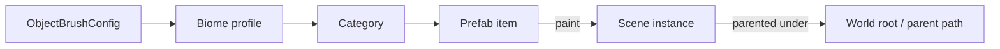

# Object Brush — Tool Summary & Ideas

The **Object Brush** is a custom Editor tool for quickly painting prefab instances
into the Scene view, tailored to this 2D pixel-art project. This note summarises
what it does today, how it compares to free tools in the Unity ecosystem, and
ideas for growing it into a fully convenient 2D placement tool.

Related files: `Assets/Game/Editor/ObjectBrush/`
(`ObjectBrushWindow`, `ObjectBrushConfig`, `ObjectBrushProfile`,
`ObjectBrushConfigWindow`, `ObjectBrushUtility`).

Open it from **Tools → Object Brush** (configuration: **Tools → Object Brush Configuration**).

---

## What it does today

- **Palette organised as Biome → Category → Items.** Biomes are
  `ObjectBrushProfile` assets referenced by the shared `ObjectBrushConfig`;
  several biomes are shown at once.
- **Two palette modes:** a read-only preview grid for picking (View) and an
  editable per-category list for assigning prefabs (Edit).
- **Name filter** over palette items.
- **Smart parenting:** placed objects are nested under
  `<World root>/<category parent path>`, creating missing transforms on the way.
- **Grid snapping** with configurable grid size; holding `Ctrl` temporarily
  inverts snapping.
- **Live ghost preview** of the active prefab under the cursor (sprites dimmed,
  colliders disabled).
- **Auto-naming** of placed instances with an incrementing index.
- **Scene-view hotkeys** (while the Scene view is focused):
  `\` toggles painting, `[` / `]` select previous / next item, cycling across
  every item in all biomes. Selecting an item scrolls the palette to it and
  expands its foldouts.

---

## Why a custom tool

Free placement tools in the Unity ecosystem are mostly either **3D / collider-surface
oriented** or **simpler than what this project needs** (no biome/category grouping,
no project-specific parenting). The built-in **GameObject Brush** is grid/Tilemap
bound. So a small, tailored Editor window gives more control over the 2D workflow
than the off-the-shelf options.

### Comparison with free alternatives

| Tool | 2D | License | Has | Missing vs. Object Brush |
|------|----|---------|-----|--------------------------|
| **acoppes / unity-gameobject-brush** | Yes (2D-first) | MIT | Palette window + brush, layer-aware preview | Random distribution, flip/scale, grid snap, parenting (per roadmap) |
| **Orange-Panda / Prefab-Painter** | Yes (2D + 3D) | MIT | Brush placement **and erase** | Biomes/categories, parenting |
| **YAPP / Prefabshop / robertrumney** | Partial | MIT | General brushes, scatter | Mostly 3D / collider-oriented |
| **Polybrush** (official, Package Manager) | 3D-leaning | Free | Prefab scatter on meshes | Built for 3D surfaces |
| **GameObject Brush** (2D Tilemap Extras) | Yes | Free | Paint prefabs on a grid, random set, auto-parent to Grid | Tied to Tilemap/Grid, no biomes/categories |
| **Prefab Brush+** (Asset Store, free) | Works in 2D | Free (closed) | Collider-surface painting, randomisation | Built for 3D colliders |

**Takeaway:** the current Object Brush is already more capable for this project's
pipeline than the free options. Adopting one would be a downgrade; continuing to
grow our own — and borrowing ideas from the MIT projects — is the better path.

---

## Ideas to make it more convenient (2D-focused)

Roughly ordered by usefulness:

1. **Erase mode** — right-click / modifier deletes the painted instance under the
   cursor (Orange-Panda's tool has this). Biggest speed-up for level edits.
2. **Drag-to-paint** — continuous placement while the left button is held, with a
   configurable minimum spacing between instances.
3. **Per-placement randomisation** — random rotation, scale, and **flip on X**
   (important for 2D so decor does not look stamped).
4. **Scatter / area brush** — place several instances within a radius per click.
5. **Sorting Layer / Order in Layer** — set or auto-increment 2D draw order on
   placement.
6. **Eyedropper (pick from scene)** — set the active prefab by clicking an existing
   placed instance.
7. **Sprites directly in the palette** — not only prefabs, for fast decoration.

All of these fit the current architecture as local additions, mostly in
`ObjectBrushWindow.OnSceneGUI` / `PlaceObject`.

---

## References

- [acoppes/unity-gameobject-brush (GitHub, MIT)](https://github.com/acoppes/unity-gameobject-brush)
- [Orange-Panda/Prefab-Painter (GitHub, MIT)](https://github.com/Orange-Panda/Prefab-Painter)
- [YAPP — Yet Another Prefab Painter (Unity Discussions)](https://discussions.unity.com/t/free-yapp-yet-another-prefab-painter-open-source-github/766667)
- [Raptorij/Prefabshop (GitHub)](https://github.com/Raptorij/Prefabshop)
- [Polybrush (com.unity.polybrush, GitHub mirror)](https://github.com/needle-mirror/com.unity.polybrush)
- [GameObject Brush — 2D Tilemap Extras (Unity docs)](https://docs.unity3d.com/Packages/com.unity.2d.tilemap.extras@3.0/manual/GameObjectBrush.html)
- [Prefab Brush+ (Unity Asset Store, free)](https://assetstore.unity.com/packages/tools/utilities/prefab-brush-44846)
