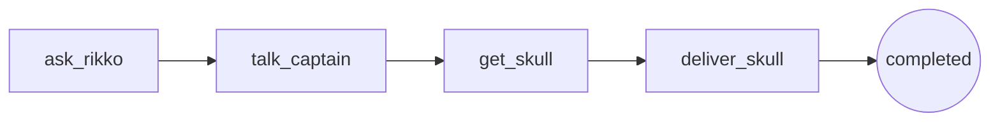
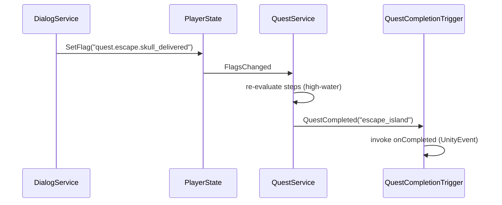
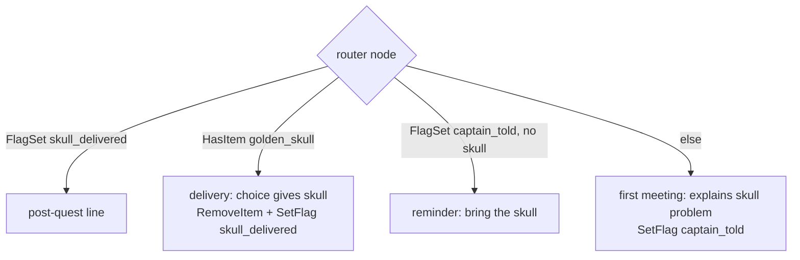

# Quest System (Light Layer) — Design Spec

Date: 2026-06-07
Status: approved design, not yet implemented

## Goal

Support chained NPC quests, starting with the island-escape quest:

1. Player meets Rikko, asks how to get off the island.
2. Rikko points to Captain Claw.
3. Captain Claw says the Golden Skull keeps him from leaving.
4. Player fetches the Golden Skull and brings it to Captain Claw.
5. Captain Claw sails away with the player (cutscene — out of scope, binding point provided).

## Approach: derived quest state over flags

No new persistent state. Quest progress is **derived** by evaluating step conditions
against existing `PlayerState` flags and inventory. The flags/items *are* the state;
dialogs keep using the existing `SetFlag` / `GiveItem` / `RemoveItem` actions and need
no new action types.

Rejected alternatives:

- **Explicit quest state machine** (service-owned step index, `StartQuest`/`AdvanceQuest`
  dialog actions) — two sources of truth that can desync, new persistence plumbing;
  overkill for internal-tracking-only scope.
- **Flag naming convention only** (no service) — nothing queryable as "a quest", no
  completion event to bind the ending sequence to.

## Quest definitions (JSON)

Location: `Assets/Game/Resources/Quests/<questId>.json`, mirroring the dialog JSON pattern.

```json
{
  "questId": "escape_island",
  "steps": [
    { "stepId": "ask_rikko",     "completedWhen": [{ "type": "FlagSet", "stringParam": "quest.escape.rikko_told" }] },
    { "stepId": "talk_captain",  "completedWhen": [{ "type": "FlagSet", "stringParam": "quest.escape.captain_told" }] },
    { "stepId": "get_skull",     "completedWhen": [{ "type": "HasItem", "stringParam": "golden_skull" }] },
    { "stepId": "deliver_skull", "completedWhen": [{ "type": "FlagSet", "stringParam": "quest.escape.skull_delivered" }] }
  ]
}
```

Step conditions reuse the existing `DialogCondition` shape and evaluator
(`HasItem`, `DoesNotHaveItem`, `FlagSet`, `FlagNotSet`) — no new condition language.

### Evaluation rule: high-water mark

Progress = the **highest-index completed step**; the current step is the one after it.
The quest is completed when the last step's conditions are met. Evaluation is stateless —
it relies on the last step's condition being a persistent flag, not on remembering past states.

Rationale: a plain "first incomplete step" scan regresses. After delivering the skull,
`RemoveItem golden_skull` makes the `get_skull` condition (`HasItem`) false again, and
the quest would jump back. With the high-water rule, `deliver_skull`'s flag keeps the
quest completed regardless of earlier conditions turning false.



## New code

| Unit | Location | Purpose |
|---|---|---|
| `QuestDef`, `QuestStep` | `Assets/Game/Core/Models/Quest/` | Serializable quest data model |
| `QuestLoader` | `Assets/Game/Core/Models/Quest/` | Loads/parses quest JSON from `Resources/Quests/`, follows `DialogLoader`/`DialogParser` pattern |
| `QuestService` | `Assets/Game/Core/Services/Quest/QuestService.cs` | Derives quest state, raises events; registered as `G.Quest` in `GInit` |
| `QuestCompletionTrigger` | `Assets/Game/Features/Quests/` | Scene component bridging quest completion to `UnityEvent` |
| `PlayerState.FlagsChanged` | existing `PlayerState.cs` | New `event Action`, fired from `SetFlag`/`ClearFlag` on actual change |

### QuestService API

```csharp
string GetCurrentStepId(string questId);   // null/empty when quest completed
bool IsCompleted(string questId);
event Action<string> QuestProgressChanged; // questId
event Action<string> QuestCompleted;       // questId
```

- `MonoBehaviour` created by `GInit` (`GetOrCreate<QuestService>`), `Init()` loads all
  quest defs via `Resources.LoadAll` from `Resources/Quests/`.
- Per service rules: **no `[SerializeField]`**; it needs no config references.
- Subscribes to `PlayerState.FlagsChanged` and `InventoryModel.OnChange`; on change,
  re-evaluates all quests and fires `QuestProgressChanged` / `QuestCompleted` on diff.
- Implementation check: confirm the `playerState` instance is not replaced mid-session;
  if it can be, re-subscribe on replacement.



### QuestCompletionTrigger — cutscene binding point

```csharp
[SerializeField] private string questId;
[SerializeField] private bool fireIfAlreadyCompleted;
[SerializeField] private UnityEvent onCompleted;
```

Subscribes to `G.Quest.QuestCompleted` in `OnEnable`; if `fireIfAlreadyCompleted` and the
quest is already complete on enable, fires immediately. This is where the existing ship
and Captain Claw get bound later: place the trigger in the captain's scene, set
`questId = escape_island`, wire `onCompleted` to the component that starts the
sail-away sequence.

## Quest content (data only, no new mechanics)

### Golden Skull item

- New `golden_skull` entry in `ItemIds` and the items def asset.
- Placed in the world as a `Collectable` (existing component). Verify pickup
  persistence during implementation (collected skull must not respawn).

### `rikko.json` (edit)

Add a choice to the greeting node: *"How do I get off this island?"*, visible while
`quest.escape.rikko_told` is **not** set. Leads to a node where Rikko points to Captain
Claw, with `onEnterActions: [SetFlag quest.escape.rikko_told]`.

### `captain_claw.json` (new)

Router entry node: no lines, auto-continue choices with empty `textKey`. Conditions must
be **mutually exclusive** — `DialogService` auto-continues only when exactly one choice
is visible.



The captain explains the skull even if the player has not talked to Rikko yet
(no hard gate on `rikko_told`) — finding him first should not dead-end.

### Localization

New `textKey` entries for all new lines/choices in the locale files, plus the
`dialog.captain_claw.speaker.captain_claw` speaker name key.

## Manual Unity Editor steps

- Place the Golden Skull `Collectable` in a scene; assign sprite (placeholder OK).
- Add/point a `DialogNPC` on the existing Captain Claw with `dialogId: captain_claw`.
- Add `QuestCompletionTrigger` to the captain's scene; wire `onCompleted` to the
  future cutscene starter.
- Items def asset entry for `golden_skull`.

## Out of scope

- The sail-away cutscene itself (ship/captain animation, input lockout).
- Any quest UI (HUD objective, journal).
- Quest markers above NPCs.
- Non-linear/branching quests (the high-water rule assumes linear steps).

## Verification

- Offline compile check (Bee `.rsp` + bundled `csc`).
- Manual playtest: talk to Rikko → talk to Captain → pick up skull → deliver →
  `QuestCompleted("escape_island")` fires (observed via trigger/log), and the captain's
  dialog shows the post-quest branch on re-talk.
- Regression: existing Rikko shop dialog still works; flags survive scene transitions.
