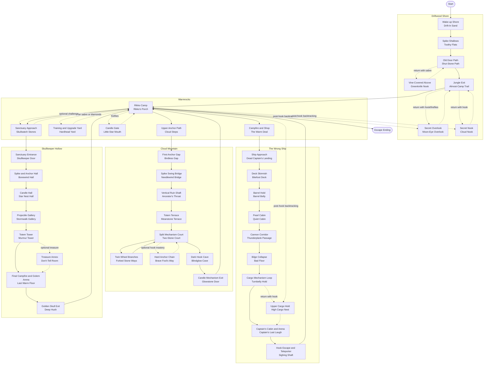

# Scene Traversal Lite

This document summarizes the lite scene plan from
`docs/walkthrough-plan-lite.md` as a production inventory and traversal diagram.
It keeps the same critical path as `docs/scene-traversal.md`, but uses roughly
30% fewer scenes per location.

Development scene names are kept first. Player-facing map names are shown in
parentheses as `EN / RU`.

## Scene Development List

### Intro Beach / Intro Jungle Route

Map location: Driftwood Shore / Коряжий Берег.

1. Wake-up Shore (Drift-In Sand / Приблудный Песок) - flat movement, first coins, and small jump steps.
2. Spike Shallows (Toothy Flats / Зубастые Плиты) - first spike hazard with safe retry space.
3. Old Door Path (Shut-Stone Path / Тропа Запертого Камня) - simple switch or permanent door progression.
4. Vine-Covered Alcove (Greenknife Nook / Угол Зелёных Ножей) - optional sabre-gated POI blocked by sharp greenknife vines.
5. Secret Overlook (Moon-Eye Overlook / Лунный Глаз) - optional hook and firefly POIs combined.
6. Secret Nook (Cloud Nook / Облачный Угол) - optional hook-entry secret reward pocket.
7. Jungle Exit (Almost-Camp Trail / Тропа Почти-Там) - final intro platforming scene leading to the hub.

### Island Hub / Rikko Camp

Map location: Warmrocks / Тёплые Камни.

1. Rikko Camp (Rikko's Porch / Крыльцо Рикко) - main NPC, Golden Skull objective, and ending return.
2. Campfire and Shop (The Warm Deal / Тёплая Сделка) - campfire, teleporter, supplies, and optional perks.
3. Training and Upgrade Yard (Hardhead Yard / Твердолобый Двор) - training dummy and diamond upgrade statue.
4. Upper Anchor Path (Cloud Steps / Облачные Ступени) - hook-gated route to the ruins.
5. Candle Gate (Little-Star Mouth / Пасть Малых Звёзд) - firefly-gated shortcut or reward POI.
6. Sanctuary Approach (Skullwatch Stones / Камни Черепьего Дозора) - sanctuary door plus dangerous optional side path.

### Wrecked Pirate Ship

Map location: The Wrong Ship / Не Тот Корабль.

1. Ship Approach (Dead Captain's Landing / Пристань Мёртвого Капитана) - entry scene and sabre pickup or confirmation.
2. Deck Skirmish (Bitefoot Deck / Кусающая Палуба) - first walking shark melee encounter.
3. Barrel Hold (Barrel Belly / Бочечное Брюхо) - movable and breakable barrel POIs.
4. Pearl Cabin (Quiet Cabin / Тихая Каюта) - shell projectile-reading scene.
5. Cannon Corridor (Thunderplank Passage / Проход Громовых Досок) - cannon timing and barrel cover.
6. Bilge Collapse (Bad Floor / Плохой Пол) - sea star encounter and one-way fall into lower hold.
7. Cargo Mechanism Loop (Turnbelly Hold / Вертящее Брюхо) - mixed combat and two steering wheel POIs.
8. Upper Cargo Hold (High Cargo Nest / Высокое Грузовое Гнездо) - optional hook-gated reward branch.
9. Captain's Cabin and Arena (Captain's Last Laugh / Последний Смех Капитана) - pre-boss campfire, supplies, and Vengeful Spirit.
10. Hook Escape and Teleporter (Sighing Shaft / Вздыхающая Шахта) - first hook climb and fast return to hub.

### Hook Ruins / Upper Jungle / Cliffs

Map location: Cloud Mountain / Облачная Гора.

1. First Anchor Gap (Birdless Gap / Провал Без Птиц) - safe single-swing hook tutorial.
2. Spike Swing Bridge (Needlewind Bridge / Мост Иголочного Ветра) - hook traversal over spikes.
3. Vertical Ruin Shaft (Ancestor's Throat / Горло Предков) - chained anchor climb.
4. Totem Terrace (Meanstone Terrace / Злокаменная Терраса) - ranged pressure during hook traversal.
5. Split Mechanism Court (Two-Stone Court / Двор Двух Камней) - central branch point for ruin mechanisms.
6. Twin Wheel Branches (Forked Stone Ways / Раздвоенные Каменные Пути) - west and east wheel routes combined.
7. Hard Anchor Chain (Brave Fool's Way / Путь Храброго Дурака) - optional hook mastery reward branch.
8. Dark Hook Cave (Blindglow Cave / Пещера Слепого Света) - dark traversal with firefly-revealed anchors.
9. Candle Mechanism Exit (Glowstone Door / Дверь Светящегося Камня) - candle puzzle, sanctuary mechanism, and teleporter.

### Golden Skull Sanctuary

Map location: Skullkeeper Hollow / Лощина Сторожа Черепа.

1. Sanctuary Entrance (Skullkeeper Door / Дверь Сторожа Черепа) - stone doors and light combat.
2. Spike and Anchor Hall (Bonewind Hall / Зал Костяного Ветра) - late-game hook precision.
3. Candle Hall (Star Nest Hall / Зал Звёздного Гнезда) - final firefly candle sequence.
4. Projectile Gallery (Stormwalk Gallery / Галерея Бродячей Бури) - layered shell and cannon pressure.
5. Totem Tower (Murmur Tower / Башня Шёпота) - spawned threats plus vertical hook traversal.
6. Treasure Annex (Don't-Tell Room / Комната Не-Скажу) - optional secret niche and dark treasure POIs.
7. Final Campfire and Golem Arena (Last Warm Floor / Последний Тёплый Пол) - final checkpoint and Stone Golem boss.
8. Golden Skull Exit (Deep Hush / Глубокая Тишь) - Golden Skull chamber and sanctuary teleporter.

## Scene Traversal Diagram

Solid arrows show the main route. Dashed arrows show optional POI branches or
backtracking routes that can be taken after the required ability is unlocked.

