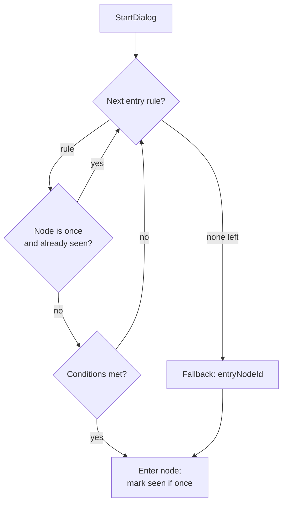

# Dialog Conditional Entry Implementation Plan

> **For agentic workers:** REQUIRED SUB-SKILL: Use superpowers:subagent-driven-development (recommended) or superpowers:executing-plans to implement this plan task-by-task. Steps use checkbox (`- [ ]`) syntax for tracking.

**Goal:** Let a dialog open at a different node depending on player state (first vs. repeat talk, one-shot sabre reaction, quest progress) instead of always starting at a fixed node.

**Architecture:** Add an ordered list of *entry rules* to `DialogDef`. A pure `DialogEntryResolver` picks the first rule whose conditions pass and whose target node isn't a spent one-shot, falling back to the existing `entryNodeId`. One-shot nodes are marked `once` and tracked in `PlayerState.seenDialogNodes`. Quest state is modelled with existing flags. Condition evaluation is extracted into a pure `DialogConditionEvaluator` shared by the resolver and the existing choice-filtering code, which makes the new logic unit-testable without Unity singletons.

**Tech Stack:** Unity 2D (C#), default `Assembly-CSharp` (no asmdefs), Unity Test Framework (NUnit, EditMode), Unity Localization (string tables synced via Google Sheets), `JsonUtility` for dialog JSON.

---

## Conventions for this plan

- **Braces & style:** K&R, always braces, English comments (see `AGENTS.md`).
- **Commits:** The project owner commits manually. Each task ends at a **Checkpoint** (tests green, changes staged). **Do not run `git commit`** unless the user asks. `git add` for staging is fine.
- **New files & `.meta`:** When Unity imports a new `.cs`/`.json` file it generates a sibling `.meta`. Stage the `.meta` together with its file. Never hand-write or delete a `.meta`.
- **Running EditMode tests:** Open **Window ▸ General ▸ Test Runner**, switch to the **EditMode** tab, let Unity recompile, then run the named test class. (CLI equivalent: `Unity -batchmode -runTests -testPlatform EditMode -projectPath . -testFilter "<ClassName>"`.)
- **Offline compile check (optional, faster than launching Unity):** see `memory/reference_offline_unity_compile_check.md` — compile via `Library/Bee/artifacts` `.rsp` + bundled `csc`. Tests still must run inside Unity.
- **Do not edit localization `.asset` files directly** (serialized data). Localization entries are added through the Localization Tables window or the Google Sheet, listed as manual Editor steps.

## File structure

**Create:**
- `Assets/Game/Core/Models/Dialog/DialogEntryRule.cs` — entry-rule data model.
- `Assets/Game/Core/Services/Dialog/DialogConditionEvaluator.cs` — pure condition evaluation (moved out of `DialogService`), plus the new `IsArmed` case.
- `Assets/Game/Core/Services/Dialog/DialogEntryResolver.cs` — pure entry-node resolution + `SeenKey` helper.
- `Assets/Game/Editor/Tests/Dialog/PlayerStateSeenNodeTests.cs` — tests for seen-node tracking.
- `Assets/Game/Editor/Tests/Dialog/DialogConditionEvaluatorTests.cs` — tests for condition evaluation incl. `IsArmed`.
- `Assets/Game/Editor/Tests/Dialog/DialogEntryResolverTests.cs` — tests for entry resolution.
- `Assets/Game/Resources/Dialogs/captainclack.json` — new quest-giver dialog.
- `docs/system/dialog-system.md` — system documentation.

**Modify:**
- `Assets/Game/Core/Models/Dialog/DialogDef.cs` — add `entryRules`.
- `Assets/Game/Core/Models/Dialog/DialogNode.cs` — add `once`.
- `Assets/Game/Core/Models/Dialog/DialogCondition.cs` — add `IsArmed` enum value.
- `Assets/Game/Features/Hero/PlayerState.cs` — add `seenDialogNodes` + accessors/restore for flags & seen nodes.
- `Assets/Game/Core/Services/Dialog/DialogService.cs` — use resolver + evaluator; mark seen on enter.
- `Assets/Game/Core/Services/SceneState/Savers/PlayerStateSaver.cs` — persist flags & seen nodes.
- `Assets/Game/Resources/Dialogs/rikko.json` — restructure into intro / sabre_reaction / common.

---

## Task 1: Data model additions

**Files:**
- Create: `Assets/Game/Core/Models/Dialog/DialogEntryRule.cs`
- Modify: `Assets/Game/Core/Models/Dialog/DialogNode.cs`
- Modify: `Assets/Game/Core/Models/Dialog/DialogDef.cs`
- Modify: `Assets/Game/Core/Models/Dialog/DialogCondition.cs`

These are plain serializable data holders; they are exercised by the unit tests in Tasks 2–4. This task only needs to compile.

- [ ] **Step 1: Create `DialogEntryRule.cs`**

```csharp
using System;

namespace Game.Core.Models.Dialog {
    /// <summary>
    /// A conditional entry point for a dialog. The dialog opens at the first rule
    /// whose conditions are met and whose target node is not a spent one-shot.
    /// </summary>
    [Serializable]
    public class DialogEntryRule {
        public string nodeId;
        public DialogCondition[] conditions;
    }
}
```

- [ ] **Step 2: Add `once` to `DialogNode.cs`**

Replace the whole file with:

```csharp
using System;

namespace Game.Core.Models.Dialog {
    [Serializable]
    public class DialogNode {
        public string nodeId;
        public string speaker;
        public bool once;
        public DialogLine[] lines;
        public DialogChoice[] choices;
        public DialogAction[] onEnterActions;
    }
}
```

- [ ] **Step 3: Add `entryRules` to `DialogDef.cs`**

Replace the whole file with:

```csharp
using System;

namespace Game.Core.Models.Dialog {
    [Serializable]
    public class DialogDef {
        public string dialogId;
        public string entryNodeId;
        public DialogEntryRule[] entryRules;
        public DialogNode[] nodes;
    }
}
```

- [ ] **Step 4: Add `IsArmed` to `DialogCondition.cs`**

Replace the whole file with:

```csharp
using System;

namespace Game.Core.Models.Dialog {
    public enum ConditionType {
        HasItem,
        DoesNotHaveItem,
        FlagSet,
        FlagNotSet,
        IsArmed,
    }

    [Serializable]
    public class DialogCondition {
        public ConditionType type;
        public string stringParam;
        public int intParam;
    }
}
```

> Note: `IsArmed` is appended **after** the existing values so the integer values of `HasItem`..`FlagNotSet` are unchanged. `DialogParser` maps the enum name automatically, so no parser change is needed.

- [ ] **Step 5: Checkpoint**

Let Unity recompile (or run the offline compile check). Expected: no compile errors. Stage the changed/created files plus the new `.meta`:

```bash
git add "Assets/Game/Core/Models/Dialog/DialogEntryRule.cs" "Assets/Game/Core/Models/Dialog/DialogEntryRule.cs.meta" "Assets/Game/Core/Models/Dialog/DialogNode.cs" "Assets/Game/Core/Models/Dialog/DialogDef.cs" "Assets/Game/Core/Models/Dialog/DialogCondition.cs"
```

---

## Task 2: Seen-node tracking on `PlayerState`

**Files:**
- Modify: `Assets/Game/Features/Hero/PlayerState.cs`
- Test: `Assets/Game/Editor/Tests/Dialog/PlayerStateSeenNodeTests.cs`

- [ ] **Step 1: Write the failing test**

Create `Assets/Game/Editor/Tests/Dialog/PlayerStateSeenNodeTests.cs`:

```csharp
using Game.Configs;
using Game.Features.Characters.Hero;
using NUnit.Framework;
using UnityEngine;

namespace Game.Editor.Tests.Dialog {
    public class PlayerStateSeenNodeTests {
        private PlayerState NewState() {
            var config = ScriptableObject.CreateInstance<PlayerConfig>();
            return new PlayerState(config);
        }

        [Test]
        public void HasSeenNode_UnknownKey_ReturnsFalse() {
            var state = NewState();
            Assert.IsFalse(state.HasSeenNode("rikko.intro"));
        }

        [Test]
        public void MarkNodeSeen_ThenHasSeenNode_ReturnsTrue() {
            var state = NewState();
            state.MarkNodeSeen("rikko.intro");
            Assert.IsTrue(state.HasSeenNode("rikko.intro"));
        }

        [Test]
        public void MarkNodeSeen_IsIdempotent() {
            var state = NewState();
            state.MarkNodeSeen("rikko.intro");
            state.MarkNodeSeen("rikko.intro");
            Assert.AreEqual(1, state.SeenDialogNodes.Count);
        }

        [Test]
        public void RestoreSeenDialogNodes_ReplacesContents() {
            var state = NewState();
            state.MarkNodeSeen("old.node");
            state.RestoreSeenDialogNodes(new[] { "a.b", "c.d" });
            Assert.IsFalse(state.HasSeenNode("old.node"));
            Assert.IsTrue(state.HasSeenNode("a.b"));
            Assert.IsTrue(state.HasSeenNode("c.d"));
        }
    }
}
```

- [ ] **Step 2: Run the test to verify it fails**

Run the `PlayerStateSeenNodeTests` class in the EditMode Test Runner.
Expected: compile error / FAIL — `HasSeenNode`, `MarkNodeSeen`, `SeenDialogNodes`, `RestoreSeenDialogNodes` do not exist.

- [ ] **Step 3: Implement the members on `PlayerState`**

In `Assets/Game/Features/Hero/PlayerState.cs`, add a serialized field next to the existing `flags` field (after the `flags` declaration on line ~15):

```csharp
        [SerializeField]
        private List<string> seenDialogNodes = new();
```

Then add these members near the existing `HasFlag`/`SetFlag`/`ClearFlag` methods:

```csharp
        /// <summary>All raised flags. Exposed for persistence.</summary>
        public IReadOnlyList<string> Flags => flags;

        /// <summary>Global keys ("dialogId.nodeId") of one-shot dialog nodes already shown.</summary>
        public IReadOnlyList<string> SeenDialogNodes => seenDialogNodes;

        public bool HasSeenNode(string key) {
            return seenDialogNodes.Contains(key);
        }

        public void MarkNodeSeen(string key) {
            if (!seenDialogNodes.Contains(key)) {
                seenDialogNodes.Add(key);
            }
        }

        /// <summary>Replaces all flags with the given set (used by save/restore).</summary>
        public void RestoreFlags(IEnumerable<string> values) {
            flags.Clear();
            flags.AddRange(values);
        }

        /// <summary>Replaces all seen-node keys with the given set (used by save/restore).</summary>
        public void RestoreSeenDialogNodes(IEnumerable<string> values) {
            seenDialogNodes.Clear();
            seenDialogNodes.AddRange(values);
        }
```

> `System.Collections.Generic` is already imported at the top of the file, so `IEnumerable` and `IReadOnlyList` are available.

- [ ] **Step 4: Run the test to verify it passes**

Run `PlayerStateSeenNodeTests` in the EditMode Test Runner.
Expected: all 4 tests PASS.

- [ ] **Step 5: Checkpoint**

Stage:

```bash
git add "Assets/Game/Features/Hero/PlayerState.cs" "Assets/Game/Editor/Tests/Dialog/PlayerStateSeenNodeTests.cs" "Assets/Game/Editor/Tests/Dialog/PlayerStateSeenNodeTests.cs.meta"
```

---

## Task 3: Extract `DialogConditionEvaluator` and add `IsArmed`

**Files:**
- Create: `Assets/Game/Core/Services/Dialog/DialogConditionEvaluator.cs`
- Modify: `Assets/Game/Core/Services/Dialog/DialogService.cs`
- Test: `Assets/Game/Editor/Tests/Dialog/DialogConditionEvaluatorTests.cs`

This moves the existing private `AreConditionsMet` / `EvaluateCondition` out of `DialogService` into a pure, testable static class, and adds the `IsArmed` case.

- [ ] **Step 1: Write the failing test**

Create `Assets/Game/Editor/Tests/Dialog/DialogConditionEvaluatorTests.cs`:

```csharp
using Game.Configs;
using Game.Core.Models.Dialog;
using Game.Core.Services.Dialog;
using Game.Features.Characters.Hero;
using NUnit.Framework;
using UnityEngine;

namespace Game.Editor.Tests.Dialog {
    public class DialogConditionEvaluatorTests {
        private PlayerState NewState() {
            return new PlayerState(ScriptableObject.CreateInstance<PlayerConfig>());
        }

        private static DialogCondition Cond(ConditionType type, string s = null) {
            return new DialogCondition { type = type, stringParam = s };
        }

        [Test]
        public void NullConditions_AreMet() {
            Assert.IsTrue(DialogConditionEvaluator.AreConditionsMet(null, NewState()));
        }

        [Test]
        public void EmptyConditions_AreMet() {
            Assert.IsTrue(DialogConditionEvaluator.AreConditionsMet(new DialogCondition[0], NewState()));
        }

        [Test]
        public void FlagSet_TrueWhenFlagPresent() {
            var state = NewState();
            state.SetFlag("quest_started");
            Assert.IsTrue(DialogConditionEvaluator.AreConditionsMet(
                new[] { Cond(ConditionType.FlagSet, "quest_started") }, state));
        }

        [Test]
        public void FlagNotSet_TrueWhenFlagAbsent() {
            var state = NewState();
            Assert.IsTrue(DialogConditionEvaluator.AreConditionsMet(
                new[] { Cond(ConditionType.FlagNotSet, "quest_started") }, state));
        }

        [Test]
        public void IsArmed_TrueOnlyWhenArmed() {
            var state = NewState();
            var conds = new[] { Cond(ConditionType.IsArmed) };
            Assert.IsFalse(DialogConditionEvaluator.AreConditionsMet(conds, state));
            state.IsArmed = true;
            Assert.IsTrue(DialogConditionEvaluator.AreConditionsMet(conds, state));
        }

        [Test]
        public void AllConditionsMustPass() {
            var state = NewState();
            state.IsArmed = true; // first passes, second fails
            var conds = new[] { Cond(ConditionType.IsArmed), Cond(ConditionType.FlagSet, "missing") };
            Assert.IsFalse(DialogConditionEvaluator.AreConditionsMet(conds, state));
        }
    }
}
```

- [ ] **Step 2: Run the test to verify it fails**

Run `DialogConditionEvaluatorTests` in the EditMode Test Runner.
Expected: compile error / FAIL — `DialogConditionEvaluator` does not exist.

- [ ] **Step 3: Create `DialogConditionEvaluator.cs`**

```csharp
using Game.Core.Models.Dialog;
using Game.Features.Characters.Hero;
using UnityEngine;

namespace Game.Core.Services.Dialog {
    /// <summary>
    /// Pure evaluation of dialog conditions against the current player state.
    /// Shared by entry-rule resolution and choice filtering.
    /// </summary>
    public static class DialogConditionEvaluator {
        public static bool AreConditionsMet(DialogCondition[] conditions, PlayerState state) {
            if (conditions == null || conditions.Length == 0) {
                return true;
            }

            for (int i = 0; i < conditions.Length; i++) {
                if (!EvaluateCondition(conditions[i], state)) {
                    return false;
                }
            }

            return true;
        }

        private static bool EvaluateCondition(DialogCondition cond, PlayerState state) {
            switch (cond.type) {
                case ConditionType.HasItem:
                    var minCount = Mathf.Max(cond.intParam, 1);
                    return state.InventoryModel.GetCount(cond.stringParam) >= minCount;

                case ConditionType.DoesNotHaveItem:
                    // If intParam is set, treat this as "has fewer than N items" for dialog fallback branches.
                    var maxCountExclusive = Mathf.Max(cond.intParam, 1);
                    return state.InventoryModel.GetCount(cond.stringParam) < maxCountExclusive;

                case ConditionType.FlagSet:
                    return state.HasFlag(cond.stringParam);

                case ConditionType.FlagNotSet:
                    return !state.HasFlag(cond.stringParam);

                case ConditionType.IsArmed:
                    return state.IsArmed;

                default:
                    Debug.LogWarning($"DialogConditionEvaluator: unknown condition type '{cond.type}'.");
                    return false;
            }
        }
    }
}
```

- [ ] **Step 4: Point `DialogService` at the evaluator and delete the moved code**

In `Assets/Game/Core/Services/Dialog/DialogService.cs`:

a) In `FilterVisibleChoices`, change the condition check from:

```csharp
                if (AreConditionsMet(choices[i].conditions, state)) {
```

to:

```csharp
                if (DialogConditionEvaluator.AreConditionsMet(choices[i].conditions, state)) {
```

b) Delete the now-unused private static methods `AreConditionsMet(DialogCondition[], PlayerState)` and `EvaluateCondition(DialogCondition, PlayerState)` from `DialogService` (the whole two methods, lines ~305–340 in the current file).

> `DialogService` is already in namespace `Game.Core.Services.Dialog`, so `DialogConditionEvaluator` needs no extra `using`.

- [ ] **Step 5: Run tests to verify they pass**

Run `DialogConditionEvaluatorTests` (and re-run `PlayerStateSeenNodeTests`) in the EditMode Test Runner.
Expected: all PASS, project compiles.

- [ ] **Step 6: Checkpoint**

```bash
git add "Assets/Game/Core/Services/Dialog/DialogConditionEvaluator.cs" "Assets/Game/Core/Services/Dialog/DialogConditionEvaluator.cs.meta" "Assets/Game/Core/Services/Dialog/DialogService.cs" "Assets/Game/Editor/Tests/Dialog/DialogConditionEvaluatorTests.cs" "Assets/Game/Editor/Tests/Dialog/DialogConditionEvaluatorTests.cs.meta"
```

---

## Task 4: `DialogEntryResolver` (the core)

**Files:**
- Create: `Assets/Game/Core/Services/Dialog/DialogEntryResolver.cs`
- Test: `Assets/Game/Editor/Tests/Dialog/DialogEntryResolverTests.cs`

- [ ] **Step 1: Write the failing test**

Create `Assets/Game/Editor/Tests/Dialog/DialogEntryResolverTests.cs`:

```csharp
using Game.Configs;
using Game.Core.Models.Dialog;
using Game.Core.Services.Dialog;
using Game.Features.Characters.Hero;
using NUnit.Framework;
using UnityEngine;

namespace Game.Editor.Tests.Dialog {
    public class DialogEntryResolverTests {
        private PlayerState NewState() {
            return new PlayerState(ScriptableObject.CreateInstance<PlayerConfig>());
        }

        private static DialogNode Node(string id, bool once = false) {
            return new DialogNode { nodeId = id, once = once };
        }

        private static DialogEntryRule Rule(string nodeId, params DialogCondition[] conditions) {
            return new DialogEntryRule { nodeId = nodeId, conditions = conditions };
        }

        private static DialogCondition Cond(ConditionType type, string s = null) {
            return new DialogCondition { type = type, stringParam = s };
        }

        // dialogId "d", nodes intro(once)/sabre(once)/common, mirroring the Rikko layout.
        private static DialogDef Def(params DialogEntryRule[] rules) {
            return new DialogDef {
                dialogId = "d",
                entryNodeId = "common",
                entryRules = rules,
                nodes = new[] { Node("intro", once: true), Node("sabre", once: true), Node("common") }
            };
        }

        [Test]
        public void NoEntryRules_ReturnsEntryNodeId() {
            var def = Def();
            def.entryRules = null;
            Assert.AreEqual("common", DialogEntryResolver.Resolve(def, NewState()));
        }

        [Test]
        public void NoRuleMatches_FallsBackToEntryNodeId() {
            // Only a rule gated on a flag that is not set.
            var def = Def(Rule("intro", Cond(ConditionType.FlagSet, "never")));
            // intro is once but unseen; its condition fails, so fall back.
            Assert.AreEqual("common", DialogEntryResolver.Resolve(def, NewState()));
        }

        [Test]
        public void FirstUnseenUnconditionalRule_Wins() {
            var def = Def(Rule("intro"), Rule("sabre", Cond(ConditionType.IsArmed)), Rule("common"));
            Assert.AreEqual("intro", DialogEntryResolver.Resolve(def, NewState()));
        }

        [Test]
        public void SpentOnceNode_IsSkipped() {
            var def = Def(Rule("intro"), Rule("sabre", Cond(ConditionType.IsArmed)), Rule("common"));
            var state = NewState();
            state.MarkNodeSeen(DialogEntryResolver.SeenKey("d", "intro"));
            // intro spent, not armed -> falls through to common.
            Assert.AreEqual("common", DialogEntryResolver.Resolve(def, state));
        }

        [Test]
        public void SabreRule_FiresWhenArmedAndIntroSpent() {
            var def = Def(Rule("intro"), Rule("sabre", Cond(ConditionType.IsArmed)), Rule("common"));
            var state = NewState();
            state.MarkNodeSeen(DialogEntryResolver.SeenKey("d", "intro"));
            state.IsArmed = true;
            Assert.AreEqual("sabre", DialogEntryResolver.Resolve(def, state));
        }

        [Test]
        public void SpentSabre_FallsThroughToCommon() {
            var def = Def(Rule("intro"), Rule("sabre", Cond(ConditionType.IsArmed)), Rule("common"));
            var state = NewState();
            state.MarkNodeSeen(DialogEntryResolver.SeenKey("d", "intro"));
            state.MarkNodeSeen(DialogEntryResolver.SeenKey("d", "sabre"));
            state.IsArmed = true;
            Assert.AreEqual("common", DialogEntryResolver.Resolve(def, state));
        }

        [Test]
        public void RuleWithMissingNode_IsSkipped() {
            var def = Def(Rule("ghost"), Rule("common"));
            Assert.AreEqual("common", DialogEntryResolver.Resolve(def, NewState()));
        }

        [Test]
        public void SeenKey_CombinesDialogAndNode() {
            Assert.AreEqual("d.intro", DialogEntryResolver.SeenKey("d", "intro"));
        }
    }
}
```

- [ ] **Step 2: Run the test to verify it fails**

Run `DialogEntryResolverTests` in the EditMode Test Runner.
Expected: compile error / FAIL — `DialogEntryResolver` does not exist.

- [ ] **Step 3: Create `DialogEntryResolver.cs`**

```csharp
using Game.Core.Models.Dialog;
using Game.Features.Characters.Hero;

namespace Game.Core.Services.Dialog {
    /// <summary>
    /// Picks the node a dialog should open at, based on player state.
    /// Walks entry rules in order and returns the first whose conditions pass and
    /// whose target node is not a spent one-shot. Falls back to <see cref="DialogDef.entryNodeId"/>.
    /// </summary>
    public static class DialogEntryResolver {
        public static string Resolve(DialogDef def, PlayerState state) {
            if (def.entryRules != null) {
                for (int i = 0; i < def.entryRules.Length; i++) {
                    var rule = def.entryRules[i];
                    var node = FindNode(def, rule.nodeId);
                    if (node == null) {
                        continue;
                    }

                    if (node.once && state.HasSeenNode(SeenKey(def.dialogId, rule.nodeId))) {
                        continue;
                    }

                    if (DialogConditionEvaluator.AreConditionsMet(rule.conditions, state)) {
                        return rule.nodeId;
                    }
                }
            }

            return def.entryNodeId;
        }

        /// <summary>Global key for a one-shot node, unique across dialogs.</summary>
        public static string SeenKey(string dialogId, string nodeId) {
            return $"{dialogId}.{nodeId}";
        }

        private static DialogNode FindNode(DialogDef def, string nodeId) {
            if (def.nodes == null) {
                return null;
            }

            for (int i = 0; i < def.nodes.Length; i++) {
                if (def.nodes[i].nodeId == nodeId) {
                    return def.nodes[i];
                }
            }

            return null;
        }
    }
}
```

- [ ] **Step 4: Run the test to verify it passes**

Run `DialogEntryResolverTests` in the EditMode Test Runner.
Expected: all 8 tests PASS.

- [ ] **Step 5: Checkpoint**

```bash
git add "Assets/Game/Core/Services/Dialog/DialogEntryResolver.cs" "Assets/Game/Core/Services/Dialog/DialogEntryResolver.cs.meta" "Assets/Game/Editor/Tests/Dialog/DialogEntryResolverTests.cs" "Assets/Game/Editor/Tests/Dialog/DialogEntryResolverTests.cs.meta"
```

---

## Task 5: Wire `DialogService` to the resolver and mark nodes seen

**Files:**
- Modify: `Assets/Game/Core/Services/Dialog/DialogService.cs`

There is no new unit test here (the logic lives in the already-tested resolver; this is the integration wiring). Verification is the manual play-test in Task 7.

- [ ] **Step 1: Resolve the entry node in `StartDialog`**

In `StartDialog`, replace:

```csharp
            G.Menu.OpenMenu(G.Config.DialogPanel);
            EnterNode(currentDialog.entryNodeId);
```

with:

```csharp
            G.Menu.OpenMenu(G.Config.DialogPanel);
            EnterNode(DialogEntryResolver.Resolve(currentDialog, G.Game.playerState));
```

- [ ] **Step 2: Mark one-shot nodes seen on enter**

In `EnterNode`, immediately after the null-check block that ends with `return;` (right before `currentLineIndex = 0;`), insert:

```csharp
            if (currentNode.once) {
                G.Game.playerState.MarkNodeSeen(
                    DialogEntryResolver.SeenKey(currentDialog.dialogId, currentNode.nodeId));
            }
```

For reference, the method should now read:

```csharp
        private void EnterNode(string nodeId) {
            currentNode = FindNode(nodeId);

            if (currentNode == null) {
                Debug.LogError($"DialogService: node '{nodeId}' not found in dialog '{currentDialog.dialogId}'.");
                EndDialog();
                return;
            }

            if (currentNode.once) {
                G.Game.playerState.MarkNodeSeen(
                    DialogEntryResolver.SeenKey(currentDialog.dialogId, currentNode.nodeId));
            }

            currentLineIndex = 0;
            showingChoices = false;
            visibleChoices = null;
            isCurrentLineFullyRevealed = false;

            ExecuteActions(currentNode.onEnterActions);
            ...
        }
```

- [ ] **Step 3: Verify compile + existing tests stay green**

Let Unity recompile. Run the full EditMode `Dialog` test folder.
Expected: compiles; all dialog tests PASS.

- [ ] **Step 4: Checkpoint**

```bash
git add "Assets/Game/Core/Services/Dialog/DialogService.cs"
```

---

## Task 6: Persist flags and seen nodes

**Files:**
- Modify: `Assets/Game/Core/Services/SceneState/Savers/PlayerStateSaver.cs`

This closes the pre-existing gap where `flags` were never saved, and persists the new `seenDialogNodes`. Both are stored as newline-joined strings via the existing `IStateWriter.SetString` / `IStateReader.TryGetString`.

- [ ] **Step 1: Add the keys and a split helper**

In `PlayerStateSaver`, add to the existing `const` block:

```csharp
        private const string KeyFlags = "flags";
        private const string KeySeenNodes = "seenNodes";
        private const string ListSeparator = "\n";
```

Add a private helper inside the class:

```csharp
        private static string[] SplitList(string value) {
            if (string.IsNullOrEmpty(value)) {
                return System.Array.Empty<string>();
            }

            return value.Split(new[] { ListSeparator }, System.StringSplitOptions.RemoveEmptyEntries);
        }
```

- [ ] **Step 2: Write the values in `Capture`**

At the end of `Capture`, after `w.SetFloat(KeyCurrentHealth, state.currentHealth);`, add:

```csharp
            w.SetString(KeyFlags, string.Join(ListSeparator, state.Flags));
            w.SetString(KeySeenNodes, string.Join(ListSeparator, state.SeenDialogNodes));
```

- [ ] **Step 3: Read the values in `Restore`**

At the end of `Restore`, before the two `controller.*` calls at the bottom, add:

```csharp
            if (r.TryGetString(KeyFlags, out var flagsStr)) {
                state.RestoreFlags(SplitList(flagsStr));
            }

            if (r.TryGetString(KeySeenNodes, out var seenStr)) {
                state.RestoreSeenDialogNodes(SplitList(seenStr));
            }
```

> `string.Join(string, IEnumerable<string>)` and `IReadOnlyList<string>` work directly with the `state.Flags` / `state.SeenDialogNodes` accessors added in Task 2.

- [ ] **Step 4: Verify compile**

Let Unity recompile (or run the offline compile check).
Expected: no errors. (No unit test — covered by the play-test save/reload check in Task 7, Step 5.)

- [ ] **Step 5: Checkpoint**

```bash
git add "Assets/Game/Core/Services/SceneState/Savers/PlayerStateSaver.cs"
```

---

## Task 7: Restructure the Rikko dialog

**Files:**
- Modify: `Assets/Game/Resources/Dialogs/rikko.json`
- Manual Editor step: add localization keys to the **Dialogs** string table.

Models the draft: a one-shot intro, a one-shot sabre reaction, and a repeating common dialog with the shop. The intro is a short Rikko/Hero exchange built from alternating single-speaker nodes chained by empty auto-continue choices (the existing convention: a single choice with an empty `textKey` auto-advances).

- [ ] **Step 1: Replace `rikko.json`**

```json
{
  "dialogId": "rikko",
  "entryNodeId": "common",
  "entryRules": [
    { "nodeId": "intro_1" },
    { "nodeId": "sabre_reaction", "conditions": [ { "type": "IsArmed" } ] },
    { "nodeId": "common" }
  ],
  "nodes": [
    {
      "nodeId": "intro_1",
      "speaker": "rikko",
      "once": true,
      "lines": [
        { "textKey": "dialog.rikko.intro.r1", "soundId": "speech1" }
      ],
      "choices": [ { "textKey": "", "nextNodeId": "intro_2" } ]
    },
    {
      "nodeId": "intro_2",
      "speaker": "hero",
      "lines": [
        { "textKey": "dialog.rikko.intro.h1", "soundId": "speech1" }
      ],
      "choices": [ { "textKey": "", "nextNodeId": "intro_3" } ]
    },
    {
      "nodeId": "intro_3",
      "speaker": "rikko",
      "lines": [
        { "textKey": "dialog.rikko.intro.r2", "soundId": "speech2" }
      ],
      "choices": [ { "textKey": "", "nextNodeId": "intro_4" } ]
    },
    {
      "nodeId": "intro_4",
      "speaker": "hero",
      "lines": [
        { "textKey": "dialog.rikko.intro.h2", "soundId": "speech1" }
      ],
      "choices": [ { "textKey": "", "nextNodeId": "intro_5" } ]
    },
    {
      "nodeId": "intro_5",
      "speaker": "rikko",
      "lines": [
        { "textKey": "dialog.rikko.intro.r3", "soundId": "speech1" },
        { "textKey": "dialog.rikko.intro.r4", "soundId": "speech2" }
      ],
      "choices": [ { "textKey": "", "nextNodeId": "intro_6" } ]
    },
    {
      "nodeId": "intro_6",
      "speaker": "hero",
      "lines": [
        { "textKey": "dialog.rikko.intro.h3", "soundId": "speech1" }
      ],
      "choices": [ { "textKey": "", "nextNodeId": "intro_7" } ]
    },
    {
      "nodeId": "intro_7",
      "speaker": "rikko",
      "lines": [
        { "textKey": "dialog.rikko.intro.r5", "soundId": "speech1" },
        { "textKey": "dialog.rikko.intro.r6", "soundId": "speech2" },
        { "textKey": "dialog.rikko.intro.r7", "soundId": "speech3" }
      ],
      "choices": [ { "textKey": "", "nextNodeId": "common" } ]
    },
    {
      "nodeId": "sabre_reaction",
      "speaker": "rikko",
      "once": true,
      "lines": [
        { "textKey": "dialog.rikko.sabre.r1", "soundId": "speech2" }
      ],
      "choices": [ { "textKey": "", "nextNodeId": "common" } ]
    },
    {
      "nodeId": "common",
      "speaker": "rikko",
      "lines": [
        { "textKey": "dialog.rikko.common.line_01", "soundId": "speech1" }
      ],
      "choices": [
        { "textKey": "dialog.rikko.common.choice_shop", "actions": [ { "type": "OpenShop", "stringParam": "RikkoShopDef" } ] },
        { "textKey": "dialog.rikko.common.choice_decline", "nextNodeId": "decline" }
      ]
    },
    {
      "nodeId": "decline",
      "speaker": "rikko",
      "lines": [
        { "textKey": "dialog.rikko.decline.line_01", "soundId": "speech3" }
      ],
      "choices": []
    }
  ]
}
```

- [ ] **Step 2: Add localization keys (manual Editor step)**

In Unity: **Window ▸ Asset Management ▸ Localization Tables ▸ Dialogs** (or via the Google Sheet, then **Pull**). Add these keys with RU (from the draft) and EN values. Do **not** edit the `.asset` files by hand.

| Key | RU | EN |
|---|---|---|
| `dialog.rikko.speaker.rikko` | Рикко | Rikko |
| `dialog.rikko.speaker.hero` | Герой | Hero |
| `dialog.rikko.intro.r1` | Эй, путешештвенничек... подходи ближе, не штешняйшя. Ты откуда такой вжялшя? | Hey, little traveler... come closer, don't be shy. Where did you wash up from? |
| `dialog.rikko.intro.h1` | Я не помню. Проснулся на пляже, весь в водорослях. | I don't remember. I woke up on the beach, covered in seaweed. |
| `dialog.rikko.intro.r2` | Так вот откуда штолько мушора вынешло на берег! Похоже твоему кораблю конечш! | So that's where all that junk on the shore came from! Looks like your ship is done for! |
| `dialog.rikko.intro.h2` | Похоже на то... Как мне отсюда выбраться? | Looks like it... How do I get off this island? |
| `dialog.rikko.intro.r3` | Не жнаю, никогда не думал об этом. Но можешь шпросить Капитана Клаца. Он на противоположной штороне оштрова. | Dunno, never thought about it. But you could ask Captain Clack. He's on the far side of the island. |
| `dialog.rikko.intro.r4` | Только так ты туда не попадёшь. Жарошли преграждают путь, беж шабли никак. | Only you won't get there like that. The thickets block the way — no chance without a sabre. |
| `dialog.rikko.intro.h3` | И где мне её достать? | And where do I get one? |
| `dialog.rikko.intro.r5` | Можешь проверичь Неправильный Корабль, только туда тоже прошто так не попадёшь. | You could check the Wrong Ship — though you won't just stroll in there either. |
| `dialog.rikko.intro.r6` | Нужен ключ. И по шшашливой шлучайношти, я могу тебе его продачь. Шам я туда вше равно не пойду - там кто-то рычит! | You need a key. And by happy chance, I can sell you one. I'm not going in there myself — something's growling in there! |
| `dialog.rikko.intro.r7` | Впрошем, у меня ешть вешши на любой вкуш - режушие, клююшие и те, о которых луше не шпрашивать. | Anyway, I've got wares for every taste — sharp ones, clicky ones, and ones best not asked about. |
| `dialog.rikko.sabre.r1` | Какой оштрый клинок! Штавлю швой хвошт - им ты шможешь пробрачша череж любые жарошли! | What a sharp blade! I'd bet my tail — with that you can cut through any thicket! |
| `dialog.rikko.common.line_01` | Хочешь глянучь на товары? | Want to take a look at the goods? |
| `dialog.rikko.common.choice_shop` | Покажи что у тебя есть. | Show me what you've got. |
| `dialog.rikko.common.choice_decline` | Не сейчас. | Not now. |
| `dialog.rikko.decline.line_01` | Ну и как хошшь, шухопутный. | Suit yourself, landlubber. |

> The old `dialog.rikko.greeting.*` / `dialog.rikko.farewell.*` keys are no longer referenced. Leave them in the table (harmless) or remove them via the Localization Tables window — do not edit the `.asset` directly.

- [ ] **Step 3: Play-test the first conversation**

Enter Play mode, walk to Rikko, interact.
Expected: the intro plays (Rikko/Hero exchange auto-advancing), ending on the shop/decline choices. Choosing "Show me what you've got" closes the dialog and opens the Rikko shop.

- [ ] **Step 4: Play-test the repeat + sabre cases**

- Talk to Rikko again (no sabre): expected the **common** line + choices, no intro.
- Acquire/equip the sabre, then talk: expected the one-shot **sabre reaction**, then it flows into the common shop line.
- Talk once more: expected only the **common** dialog (no intro, no sabre reaction).

- [ ] **Step 5: Verify persistence**

After seeing the intro, trigger a save/restore (e.g. die to a checkpoint / reload the scene via a portal). Talk to Rikko again.
Expected: intro does **not** replay (seen-node state survived restore).

- [ ] **Step 6: Checkpoint**

```bash
git add "Assets/Game/Resources/Dialogs/rikko.json"
```

(Localization `.asset` changes are committed by the user as part of their normal L10n/Google-Sheets workflow.)

---

## Task 8: Add the Captain Clack quest dialog

**Files:**
- Create: `Assets/Game/Resources/Dialogs/captainclack.json`
- Manual Editor step: add localization keys + place/point a `DialogNPC` at Captain Clack.

Demonstrates quest-state-dependent entry using flags (`quest_skull_started`, `quest_skull_done`) and the existing `HasItem "GoldenSkull"` (the `GoldenSkull` item already exists in `ItemIds`).

- [ ] **Step 1: Create `captainclack.json`**

```json
{
  "dialogId": "captainclack",
  "entryNodeId": "reminder",
  "entryRules": [
    { "nodeId": "final", "conditions": [ { "type": "HasItem", "stringParam": "GoldenSkull" } ] },
    { "nodeId": "intro_1" },
    { "nodeId": "reminder", "conditions": [ { "type": "FlagSet", "stringParam": "quest_skull_started" } ] }
  ],
  "nodes": [
    {
      "nodeId": "intro_1",
      "speaker": "clack",
      "once": true,
      "onEnterActions": [ { "type": "SetFlag", "stringParam": "quest_skull_started" } ],
      "lines": [
        { "textKey": "dialog.clack.intro.c1", "soundId": "speech1" }
      ],
      "choices": [ { "textKey": "", "nextNodeId": "intro_2" } ]
    },
    {
      "nodeId": "intro_2",
      "speaker": "hero",
      "lines": [ { "textKey": "dialog.clack.intro.h1", "soundId": "speech1" } ],
      "choices": [ { "textKey": "", "nextNodeId": "intro_3" } ]
    },
    {
      "nodeId": "intro_3",
      "speaker": "clack",
      "lines": [
        { "textKey": "dialog.clack.intro.c2", "soundId": "speech1" },
        { "textKey": "dialog.clack.intro.c3", "soundId": "speech2" }
      ],
      "choices": [ { "textKey": "", "nextNodeId": "intro_4" } ]
    },
    {
      "nodeId": "intro_4",
      "speaker": "hero",
      "lines": [ { "textKey": "dialog.clack.intro.h2", "soundId": "speech1" } ],
      "choices": [ { "textKey": "", "nextNodeId": "intro_5" } ]
    },
    {
      "nodeId": "intro_5",
      "speaker": "clack",
      "lines": [ { "textKey": "dialog.clack.intro.c4", "soundId": "speech3" } ],
      "choices": []
    },
    {
      "nodeId": "reminder",
      "speaker": "clack",
      "lines": [
        { "textKey": "dialog.clack.reminder.c1", "soundId": "speech1" },
        { "textKey": "dialog.clack.reminder.c2", "soundId": "speech2" }
      ],
      "choices": []
    },
    {
      "nodeId": "final",
      "speaker": "clack",
      "once": true,
      "onEnterActions": [
        { "type": "RemoveItem", "stringParam": "GoldenSkull", "intParam": 1 },
        { "type": "SetFlag", "stringParam": "quest_skull_done" }
      ],
      "lines": [
        { "textKey": "dialog.clack.final.c1", "soundId": "speech1" }
      ],
      "choices": [ { "textKey": "", "nextNodeId": "final_2" } ]
    },
    {
      "nodeId": "final_2",
      "speaker": "hero",
      "lines": [ { "textKey": "dialog.clack.final.h1", "soundId": "speech1" } ],
      "choices": [ { "textKey": "", "nextNodeId": "final_3" } ]
    },
    {
      "nodeId": "final_3",
      "speaker": "clack",
      "lines": [
        { "textKey": "dialog.clack.final.c2", "soundId": "speech2" },
        { "textKey": "dialog.clack.final.c3", "soundId": "speech3" }
      ],
      "choices": []
    }
  ]
}
```

> `final` is ordered first so it wins as soon as the player carries the Golden Skull, regardless of whether `intro` was seen. `intro_1` is `once` and sets `quest_skull_started` on enter; once spent, the `reminder` rule (gated on that flag) takes over until the skull is brought.

- [ ] **Step 2: Add localization keys (manual Editor step)**

Add to the **Dialogs** string table (RU from the draft; EN as below):

| Key | RU | EN |
|---|---|---|
| `dialog.captainclack.speaker.clack` | Капитан Клац | Captain Clack |
| `dialog.captainclack.speaker.hero` | Герой | Hero |
| `dialog.clack.intro.c1` | Эй, сухопутный! Ищешь корабль или просто любуешься моими парусами? | Hey, landlubber! Looking for a ship, or just admiring my sails? |
| `dialog.clack.intro.h1` | И то и другое! Я хочу уплыть с острова. | Both! I want to sail away from this island. |
| `dialog.clack.intro.c2` | Охотно бы помог. Я и сам не прочь снова увидеть горизонт, да остров нас не отпускает. | I'd gladly help. I'd love to see the horizon again myself, but the island won't let us go. |
| `dialog.clack.intro.c3` | Каждый корабль, что уходит в море, к рассвету возвращается сюда. Мой дед говорил: в сердце острова лежит Золотой Череп. Он и держит нас на привязи. | Every ship that sails out returns here by dawn. My grandfather said: in the heart of the island lies the Golden Skull. It keeps us tethered. |
| `dialog.clack.intro.h2` | Тогда я найду его. | Then I'll find it. |
| `dialog.clack.intro.c4` | Принеси мне Череп, малыш. И я отвезу тебя туда, куда дует любой попутный ветер. | Bring me the Skull, kid. And I'll take you wherever a fair wind blows. |
| `dialog.clack.reminder.c1` | Без Золотого Черепа море снова выплюнет нас на этот берег. | Without the Golden Skull, the sea will just spit us back onto this shore. |
| `dialog.clack.reminder.c2` | Принеси его мне, и мой корабль доставит тебя куда пожелаешь. | Bring it to me, and my ship will carry you wherever you wish. |
| `dialog.clack.final.c1` | Что у тебя там?.. Клянусь приливом, это Золотой Череп! | What've you got there?.. By the tide, it's the Golden Skull! |
| `dialog.clack.final.h1` | Я нашёл его! Теперь мы сможем уплыть? | I found it! Can we sail away now? |
| `dialog.clack.final.c2` | Ещё как сможем! Ветер свежий, море свободно, а мой корабль давно рвётся в путь. | We sure can! The wind is fresh, the sea is open, and my ship's been itching to go. |
| `dialog.clack.final.c3` | Поднимайся на борт, малыш. Назови курс — и капитан Клац доставит тебя куда пожелаешь! | Climb aboard, kid. Name your course — and Captain Clack will take you wherever you please! |

> Speaker key uses the dialog id (`dialog.captainclack.speaker.<id>`) because `DialogService.ResolveSpeakerName` builds `dialog.{dialogId}.speaker.{speakerId}`; the line keys use the shorter `dialog.clack.*` prefix purely for readability — only `textKey` strings need to match the table, the prefix is free-form.

- [ ] **Step 3: Place / wire the Captain Clack NPC (manual Editor step)**

On the Captain Clack character object (the existing one on the far side of the island, or a new GameObject with a `DialogNPC` component + an `InteractableBase` trigger like Rikko's), set the `DialogNPC.dialogId` field to `captainclack`. Follow how Rikko's NPC is set up in its scene/prefab.

- [ ] **Step 4: Play-test the quest flow**

- First talk: intro plays, quest flag set.
- Talk again without the skull: reminder plays.
- Give yourself a `GoldenSkull` (via `DebugInitialInventory` or a debug add) and talk: the final dialog plays, the skull is consumed, `quest_skull_done` is set.

- [ ] **Step 5: Checkpoint**

```bash
git add "Assets/Game/Resources/Dialogs/captainclack.json" "Assets/Game/Resources/Dialogs/captainclack.json.meta"
```

(NPC prefab/scene wiring and localization `.asset` changes are committed by the user with their normal workflow.)

---

## Task 9: System documentation

**Files:**
- Create: `docs/system/dialog-system.md`

- [ ] **Step 1: Write the doc**

````markdown
# Dialog System

Data-driven branching dialogs. Definitions live in `Assets/Game/Resources/Dialogs/<id>.json`
as locale-agnostic graphs (text is localization keys, resolved at runtime). `DialogNPC`
starts a dialog by id; `DialogService` drives it.

## Concepts

- **DialogDef** — a graph: `dialogId`, `entryNodeId` (fallback), `entryRules`, `nodes`.
- **DialogNode** — `speaker`, `once`, `lines[]`, `choices[]`, `onEnterActions[]`.
- **DialogChoice** — `textKey`, `nextNodeId`, `conditions[]`, `actions[]`.
  A single choice with an empty `textKey` auto-advances (used to chain scripted lines).
- **Entry rules** — ordered; the dialog opens at the first rule whose conditions pass and
  whose target node is not a spent one-shot. Falls back to `entryNodeId`.
- **once** — when a node marked `once` is entered, its global key `"<dialogId>.<nodeId>"`
  is recorded in `PlayerState.seenDialogNodes`; entry resolution then skips it.
- **Conditions** — `HasItem`, `DoesNotHaveItem`, `FlagSet`, `FlagNotSet`, `IsArmed`.
- **Actions** — `GiveItem`, `RemoveItem`, `SetFlag`, `ClearFlag`, `OpenShop`.
- **Quests** — modelled as flags (e.g. `quest_skull_started`, `quest_skull_done`); no
  dedicated quest subsystem.

## Resolution flow



## Code map

- `Core/Models/Dialog/` — data model (`DialogDef`, `DialogNode`, `DialogEntryRule`,
  `DialogChoice`, `DialogCondition`, `DialogAction`, `DialogLine`) + `DialogParser` / `DialogLoader`.
- `Core/Services/Dialog/DialogConditionEvaluator` — pure condition evaluation.
- `Core/Services/Dialog/DialogEntryResolver` — pure entry-node selection + `SeenKey`.
- `Core/Services/Dialog/DialogService` — runtime traversal, line/choice emission, actions, audio.
- `Features/Interactive/DialogNPC/DialogNPC` — starts a dialog by id.

## Persistence

`PlayerState.flags` and `PlayerState.seenDialogNodes` are persisted by `PlayerStateSaver`
as newline-joined strings. Within a session they also survive scene travel because
`GameManager` is `DontDestroyOnLoad`.

## Authoring a one-shot / conditional opening

1. Add the node(s); mark a node `once` if it should play at most once.
2. Add an entry rule pointing at it, with any `conditions`. Order rules most-specific first.
3. For scripted multi-speaker exchanges, chain nodes with empty-`textKey` auto-advance choices.
4. Add the referenced localization keys to the **Dialogs** string table.

See worked examples in `Resources/Dialogs/rikko.json` (intro / sabre / common) and
`captainclack.json` (quest start / reminder / completion).
````

- [ ] **Step 2: Checkpoint**

```bash
git add "docs/system/dialog-system.md"
```

---

## Final verification

- [ ] All EditMode tests under `Assets/Game/Editor/Tests/Dialog/` pass.
- [ ] Project compiles with no warnings introduced by these changes.
- [ ] Rikko: intro once → repeat shows common → sabre reaction once after equip → common thereafter; persists across save/restore.
- [ ] Captain Clack: intro starts quest → reminder while active → final on delivering the Golden Skull.
- [ ] `docs/system/dialog-system.md` exists and matches the implemented behavior.
- [ ] Existing dialogs without `entryRules` still open at `entryNodeId` (back-compat).
