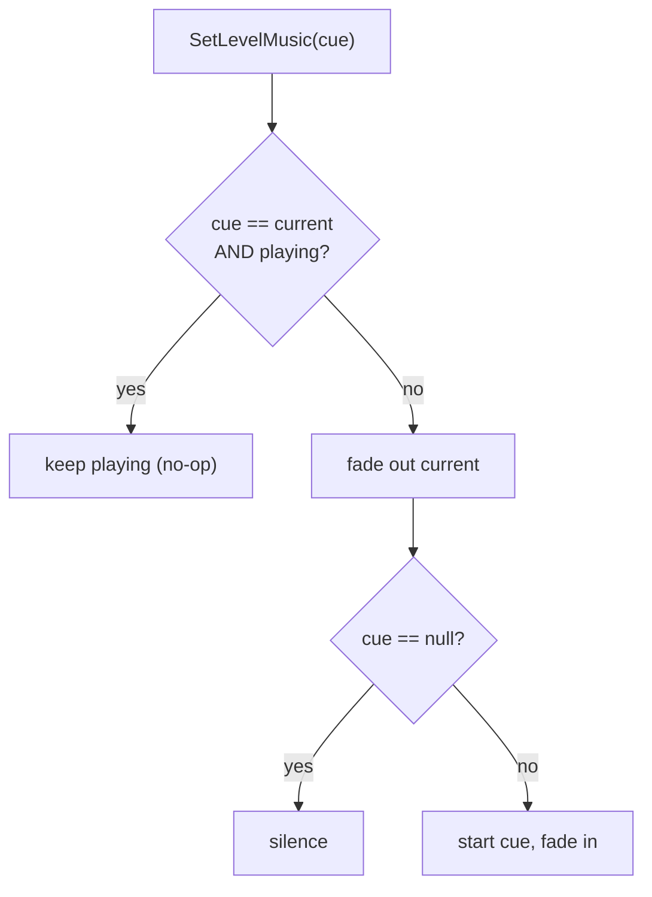

# Scene Music System Implementation Plan

> **For agentic workers:** REQUIRED SUB-SKILL: Use superpowers:subagent-driven-development (recommended) or superpowers:executing-plans to implement this plan task-by-task. Steps use checkbox (`- [ ]`) syntax for tracking.

**Goal:** Make scene music persistent across scene loads — same track keeps playing, different track fades out then fades in — owned by the central `AudioService` instead of a per-scene `AudioSource`.

**Architecture:** Each scene/menu declares a music `AudioCue` via a small per-scene component; the persistent `AudioService` (`G.Audio`) owns the single live music loop and decides keep-vs-fade. Fade durations live on `MainConfig` (the service is created dynamically and cannot use serialized inspector fields). A one-shot Editor tool migrates the existing scenes off their raw `Music` AudioSource.

**Tech Stack:** Unity 2022 (URP, 2D), C#, Unity Audio (`AudioSource` + `AudioMixerGroup`), `UnityEditor` scripting for the migration tool.

## Verification Approach (read first)

This project has **no game-code test framework** (only Unity package tests exist) and the
behavior here is runtime audio + coroutines that cannot be meaningfully unit-tested. Per
`AGENTS.md` (priority: do not break gameplay; do not break serialized data) verification is:

1. **Offline compile-check** after each code task — reuse Unity's Bee response file with the
   bundled Roslyn compiler so we catch compile errors without opening Unity. Command template
   (run from repo root in git-bash):

   ```bash
   # Runtime assembly (AudioService, MainConfig, LevelEntryPoint, MainMenuLauncher):
   RSP=$(ls Library/Bee/artifacts/*.dag/Assembly-CSharp.rsp | head -1)
   # Editor assembly (migration tool):
   # RSP=$(ls Library/Bee/artifacts/*.dag/Assembly-CSharp-Editor.rsp | head -1)
   sed -E 's#-out:[^ ]+#-out:Temp/obcompile/out.dll#; s#-refout:[^ ]+#-refout:Temp/obcompile/ref.dll#' "$RSP" > Temp/obcompile.rsp
   mkdir -p Temp/obcompile
   UNITY="C:/Program Files/Unity/Hub/Editor"   # adjust to your install; find the version dir below
   VER=$(ls "$UNITY" | head -1)
   # NOTE: pick the Unity version that matches this project (e.g. 2022.3.12f1), not just the first listed.
   DATA="$UNITY/$VER/Editor/Data"
   MSYS2_ARG_CONV_EXCL="*" "$DATA/NetCoreRuntime/dotnet.exe" exec \
     "$DATA/DotNetSdkRoslyn/csc.dll" -nostdlib -noconfig "@Temp/obcompile.rsp"
   ```
   Expected: no errors referencing the files changed in the task. (Pre-existing errors in
   unrelated files may appear — filter by filename.) If the `.dag` rsp does not exist yet, open
   Unity once to generate it, or fall back to manual Editor compile.

2. **Manual Editor play-test** at the end (Task 7) — the behavioral acceptance checks.

Each "Commit" step is a **review checkpoint**: the user commits manually (project rule:
no auto-commit). Suggested commit messages are provided.

---

## File Structure

- **Modify** `Assets/Game/Configs/MainConfig.cs` — add `musicFadeOutTime` / `musicFadeInTime`.
- **Modify** `Assets/Game/Core/Audio/AudioService.cs` — keep-vs-fade transition, fade-in, read config in `Init()`.
- **Modify** `Assets/Game/Core/Components/SceneManagement/LevelEntryPoint.cs` — stop clearing music on destroy.
- **Modify** `Assets/Game/UI/MainMenu/MainMenuLauncher.cs` — route menu music through `SetLevelMusic`.
- **Create** `Assets/Game/Editor/Tools/SceneMusicMigration.cs` — one-shot migration menu command.
- **Create** `docs/system/scene-music.md` — system write-up.

`IAudioService` needs **no** change — all required methods (`SetLevelMusic`, `StartLevelMusic`,
`StopLevelMusic`, `ClearLevelMusic`) already exist; only their behavior changes.

---

### Task 1: Music fade settings on MainConfig

**Files:**
- Modify: `Assets/Game/Configs/MainConfig.cs`

- [ ] **Step 1: Add the music fade fields**

In `MainConfig.cs`, add a new section after the existing `[Header("Audio")]` block (after `public DialogSoundLibrary DialogSoundLibrary;`):

```csharp
        [Header("Music")]
        [Tooltip("Seconds to fade the current track out before a different track starts.")]
        [Min(0f)]
        public float musicFadeOutTime = 0.5f;

        [Tooltip("Seconds for a newly started track to fade in to its target volume.")]
        [Min(0f)]
        public float musicFadeInTime = 0.5f;
```

- [ ] **Step 2: Compile-check**

Run the runtime offline compile-check (see Verification Approach).
Expected: no errors in `MainConfig.cs`.

- [ ] **Step 3: Set values on the MainConfig asset (Unity Editor step — manual)**

Open `Resources/Configs/MainConfig` in the Inspector and confirm the new **Music** fields show
`Fade Out Time = 0.5` and `Fade In Time = 0.5`. Adjust to taste. (Field defaults apply
automatically; this step just verifies the asset serialized the new fields.)

- [ ] **Step 4: Commit (review checkpoint)**

Suggested message: `PIR-XX Add music fade settings to MainConfig`

---

### Task 2: Keep-vs-fade music transitions in AudioService

This is the core behavior change. Replace the music-control region with keep-vs-fade logic,
add an inline fade-in, and read the fade durations in `Init()`.

**Files:**
- Modify: `Assets/Game/Core/Audio/AudioService.cs`

- [ ] **Step 1: Add fields**

Find the existing music fields (around line 38):

```csharp
        private AudioCue currentMusicCue;
        private IAudioLoopHandle musicHandle;
```

Replace with:

```csharp
        private AudioCue currentMusicCue;
        private IAudioLoopHandle musicHandle;

        // Music transition tuning, populated from MainConfig in Init().
        private float musicFadeOutTime = 0.5f;
        private float musicFadeInTime = 0.5f;

        // Active fade-out-then-fade-in coroutine; cancelled when a new transition starts.
        private Coroutine musicTransitionRoutine;
```

- [ ] **Step 2: Read fade durations in Init()**

Find `Init()` (around line 61):

```csharp
        public void Init() {
            if (G.Config != null) {
                defaultMixerGroup = G.Config.SfxMixerGroup;
            }
        }
```

Replace with:

```csharp
        public void Init() {
            if (G.Config != null) {
                defaultMixerGroup = G.Config.SfxMixerGroup;
                musicFadeOutTime = G.Config.musicFadeOutTime;
                musicFadeInTime = G.Config.musicFadeInTime;
            }
        }
```

- [ ] **Step 3: Replace the music-control methods**

Find this block (around lines 167-195):

```csharp
        public void SetLevelMusic(AudioCue cue) {
            currentMusicCue = cue;
            StartLevelMusic();
        }

        public void ClearLevelMusic(float fadeOutSeconds = 0.25f) {
            StopLevelMusic(fadeOutSeconds);
            currentMusicCue = null;
        }

        public void StopLevelMusic(float fadeOutSeconds = 0.25f) {
            if (musicHandle == null) {
                return;
            }

            musicHandle.Stop(fadeOutSeconds);
            musicHandle = null;
        }

        public void StartLevelMusic() {
            // Always drop a previous handle so we end up with a single active loop.
            StopLevelMusic(0f);

            if (currentMusicCue == null) {
                return;
            }

            musicHandle = PlayLoopAt(currentMusicCue, Vector3.zero, is3D: false);
        }
```

Replace with:

```csharp
        public void SetLevelMusic(AudioCue cue) {
            // Requirement: the same track must keep playing across scene loads without
            // restarting. If the requested cue is already the live track, do nothing.
            if (cue == currentMusicCue && IsMusicPlaying()) {
                return;
            }

            currentMusicCue = cue;
            BeginMusicTransition(cue);
        }

        public void ClearLevelMusic(float fadeOutSeconds = 0.25f) {
            StopLevelMusic(fadeOutSeconds);
            currentMusicCue = null;
        }

        public void StopLevelMusic(float fadeOutSeconds = 0.25f) {
            // Cancel any pending fade-in so a queued track does not resurrect after a stop.
            if (musicTransitionRoutine != null) {
                StopCoroutine(musicTransitionRoutine);
                musicTransitionRoutine = null;
            }

            if (musicHandle == null) {
                return;
            }

            musicHandle.Stop(fadeOutSeconds);
            musicHandle = null;
        }

        public void StartLevelMusic() {
            // Explicit restart of the assigned cue (e.g. same-scene respawn). Unlike
            // SetLevelMusic this does not honor the "same track keeps playing" guard.
            if (currentMusicCue == null) {
                return;
            }

            BeginMusicTransition(currentMusicCue);
        }

        /// <summary>
        /// True when a music loop is currently assigned and its source is still alive.
        /// </summary>
        private bool IsMusicPlaying() {
            return musicHandle != null && musicHandle.IsValid;
        }

        /// <summary>
        /// Starts a fresh fade-out-then-fade-in transition to the given cue, cancelling any
        /// transition already in flight. A null cue means "fade to silence".
        /// </summary>
        private void BeginMusicTransition(AudioCue cue) {
            if (musicTransitionRoutine != null) {
                StopCoroutine(musicTransitionRoutine);
                musicTransitionRoutine = null;
            }

            musicTransitionRoutine = StartCoroutine(MusicTransitionRoutine(cue));
        }

        private IEnumerator MusicTransitionRoutine(AudioCue cue) {
            // Sequential fade: fully fade out the current track before starting the new one.
            if (musicHandle != null) {
                var handleToStop = musicHandle;
                musicHandle = null;
                handleToStop.Stop(musicFadeOutTime);

                if (musicFadeOutTime > 0f) {
                    yield return new WaitForSecondsRealtime(musicFadeOutTime);
                }
            }

            if (cue == null) {
                musicTransitionRoutine = null;
                yield break;
            }

            musicHandle = PlayLoopAt(cue, Vector3.zero, is3D: false);

            // Fade-in is inline so cancelling musicTransitionRoutine also cancels the fade.
            var internalHandle = musicHandle as AudioLoopHandle;
            var source = internalHandle != null ? internalHandle.Source : null;

            if (source != null && musicFadeInTime > 0f) {
                source.volume = 0f;
                float t = 0f;

                while (t < musicFadeInTime) {
                    t += Time.unscaledDeltaTime;
                    source.volume = Mathf.Lerp(0f, cue.Volume, Mathf.Clamp01(t / musicFadeInTime));
                    yield return null;
                }

                source.volume = cue.Volume;
            }

            musicTransitionRoutine = null;
        }
```

(Note: `AudioLoopHandle` is the private nested class already defined in this file; its
`Source` property is `internal`, so it is accessible here.)

- [ ] **Step 4: Compile-check**

Run the runtime offline compile-check.
Expected: no errors in `AudioService.cs`. In particular confirm `AudioLoopHandle` / `.Source`
resolve (they are defined later in the same file) and `IEnumerator` is in scope
(`System.Collections` is already imported at the top of the file).

- [ ] **Step 5: Commit (review checkpoint)**

Suggested message: `PIR-XX Keep same music across scenes, fade between different tracks`

---

### Task 3: LevelEntryPoint stops owning playback teardown

Music now survives scene unload (the persistent service holds it), so the per-scene component
must NOT stop music when the scene is destroyed — otherwise same-track continuity breaks.

**Files:**
- Modify: `Assets/Game/Core/Components/SceneManagement/LevelEntryPoint.cs`

- [ ] **Step 1: Remove the OnDestroy clear and update the class doc**

Replace the whole file body of `LevelEntryPoint.cs` with:

```csharp
using Core.Audio;
using Game.Core.Bootstrap;
using UnityEngine;

namespace Game.Core.Components.SceneManagement {
    /// <summary>
    /// Per-scene hook that tells the central audio service which music cue this scene wants.
    /// Music ownership (play/stop/fade) lives on <c>G.Audio</c>, which persists across scene
    /// loads — so this component intentionally does NOT stop music on teardown. The next
    /// scene's LevelEntryPoint decides whether to keep the same track or fade to a new one.
    /// Assign a null cue to request silence for this scene.
    /// </summary>
    public class LevelEntryPoint : MonoBehaviour {
        [SerializeField]
        private AudioCue levelMusic;

        private void Start() {
            G.Audio.SetLevelMusic(levelMusic);
        }
    }
}
```

(Note: `Start()` now always calls `SetLevelMusic`, including with a null `levelMusic`, so a
scene that wants silence fades the previous track out. `OnDestroy` is removed entirely.)

- [ ] **Step 2: Compile-check**

Run the runtime offline compile-check.
Expected: no errors in `LevelEntryPoint.cs`.

- [ ] **Step 3: Commit (review checkpoint)**

Suggested message: `PIR-XX LevelEntryPoint no longer stops music on scene teardown`

---

### Task 4: Route main-menu music through the central service

Today `MainMenuLauncher` plays its music on a private handle via `PlayLoopAt`. Once gameplay
music is persistent, that would let gameplay music play on top of menu music. Route the menu
through `SetLevelMusic` so all music shares one handle.

**Files:**
- Modify: `Assets/Game/UI/MainMenu/MainMenuLauncher.cs`

- [ ] **Step 1: Replace the private-handle music with SetLevelMusic**

In `MainMenuLauncher.cs`, remove the `musicHandle` field and the `OnDestroy` method, and change
`Awake`. Specifically:

Remove:

```csharp
        private IAudioLoopHandle musicHandle;

        private void Awake() {
            if (mainMenuMusic != null) {
                musicHandle = G.Audio.PlayLoopAt(mainMenuMusic, transform.position, false);
            }
        }
```

Replace with:

```csharp
        private void Awake() {
            // Route through the central music service so menu music shares the single
            // persistent handle (prevents gameplay music playing over the menu).
            G.Audio.SetLevelMusic(mainMenuMusic);
        }
```

Remove the now-unused `OnDestroy`:

```csharp
        private void OnDestroy() {
            if (musicHandle != null) {
                musicHandle.Stop();
                musicHandle = null;
            }
        }
```

Leave `mainMenuMusic`, `mainMenuDelay`, `Start()`, and `ShowMainMenu()` unchanged.

- [ ] **Step 2: Remove the now-unused using if it dangles**

`using Core.Audio;` is still needed for `AudioCue`. Keep it. If the compiler warns that
`IAudioLoopHandle` is unused, that is fine — no `using` needs removal (it lives in the same
`Core.Audio` namespace).

- [ ] **Step 3: Compile-check**

Run the runtime offline compile-check.
Expected: no errors in `MainMenuLauncher.cs`.

- [ ] **Step 4: Commit (review checkpoint)**

Suggested message: `PIR-XX Route main-menu music through central audio service`

---

### Task 5: Editor migration tool

A one-shot Editor menu command that converts each gameplay scene's raw `Music` AudioSource into
a `LevelEntryPoint` referencing the matching `AudioCue`. Idempotent and safe to re-run.

**Files:**
- Create: `Assets/Game/Editor/Tools/SceneMusicMigration.cs`

- [ ] **Step 1: Create the migration tool**

Create `Assets/Game/Editor/Tools/SceneMusicMigration.cs`:

```csharp
using System.Collections.Generic;
using Core.Audio;
using Game.Core.Components.SceneManagement;
using UnityEditor;
using UnityEditor.SceneManagement;
using UnityEngine;
using UnityEngine.SceneManagement;

namespace Game.Editor.Tools {
    /// <summary>
    /// One-shot migration: replaces each scene's raw "Music" GameObject (an AudioSource playing
    /// a clip directly) with a LevelEntryPoint that references the matching AudioCue, so music is
    /// owned by the central AudioService instead of a per-scene AudioSource.
    /// Idempotent: scenes already carrying a LevelEntryPoint are skipped.
    /// </summary>
    public static class SceneMusicMigration {
        private const string ScenesRoot = "Assets/Game/Scenes";
        private const string MusicObjectName = "Music";

        [MenuItem("Tools/Audio/Migrate Scene Music")]
        public static void Migrate() {
            // Build clip GUID -> AudioCue map from all cue assets.
            var clipGuidToCue = BuildClipToCueMap(out var ambiguousClipGuids);

            var sceneGuids = AssetDatabase.FindAssets("t:Scene", new[] { ScenesRoot });
            int migrated = 0;
            int skippedAlready = 0;
            var unmatched = new List<string>();

            foreach (var sceneGuid in sceneGuids) {
                var scenePath = AssetDatabase.GUIDToAssetPath(sceneGuid);
                var scene = EditorSceneManager.OpenScene(scenePath, OpenSceneMode.Single);

                var existingEntry = FindFirstInScene<LevelEntryPoint>(scene);
                if (existingEntry != null) {
                    skippedAlready++;
                    continue;
                }

                var musicGo = FindGameObjectByName(scene, MusicObjectName);
                if (musicGo == null) {
                    // No music object: nothing to migrate (scene plays no music).
                    continue;
                }

                var source = musicGo.GetComponent<AudioSource>();
                if (source == null || source.clip == null) {
                    unmatched.Add($"{scenePath}: 'Music' object has no AudioSource/clip");
                    continue;
                }

                var clipPath = AssetDatabase.GetAssetPath(source.clip);
                var clipGuid = AssetDatabase.AssetPathToGUID(clipPath);

                if (ambiguousClipGuids.Contains(clipGuid)) {
                    unmatched.Add($"{scenePath}: clip '{source.clip.name}' matches multiple cues — wire by hand");
                    continue;
                }

                if (!clipGuidToCue.TryGetValue(clipGuid, out var cue)) {
                    unmatched.Add($"{scenePath}: clip '{source.clip.name}' matches no AudioCue — wire by hand");
                    continue;
                }

                // Reuse the existing 'Music' GameObject: drop the AudioSource, add LevelEntryPoint.
                Object.DestroyImmediate(source, allowDestroyingAssets: false);
                var entry = musicGo.AddComponent<LevelEntryPoint>();

                var so = new SerializedObject(entry);
                so.FindProperty("levelMusic").objectReferenceValue = cue;
                so.ApplyModifiedPropertiesWithoutUndo();

                EditorSceneManager.MarkSceneDirty(scene);
                EditorSceneManager.SaveScene(scene);
                migrated++;
                Debug.Log($"[SceneMusicMigration] {scenePath}: Music AudioSource -> LevelEntryPoint ({cue.name})");
            }

            Debug.Log($"[SceneMusicMigration] Done. Migrated {migrated}, already-migrated {skippedAlready}, needs-manual {unmatched.Count}.");
            foreach (var line in unmatched) {
                Debug.LogWarning($"[SceneMusicMigration] {line}");
            }
        }

        /// <summary>
        /// Maps each clip GUID referenced by an AudioCue to that cue. Clip GUIDs referenced by
        /// more than one cue are returned in <paramref name="ambiguous"/> and excluded from the map.
        /// </summary>
        private static Dictionary<string, AudioCue> BuildClipToCueMap(out HashSet<string> ambiguous) {
            var map = new Dictionary<string, AudioCue>();
            ambiguous = new HashSet<string>();

            var cueGuids = AssetDatabase.FindAssets("t:AudioCue");
            foreach (var cueGuid in cueGuids) {
                var cuePath = AssetDatabase.GUIDToAssetPath(cueGuid);
                var cue = AssetDatabase.LoadAssetAtPath<AudioCue>(cuePath);
                if (cue == null) {
                    continue;
                }

                var so = new SerializedObject(cue);
                var clipsProp = so.FindProperty("clips");
                if (clipsProp == null) {
                    continue;
                }

                for (int i = 0; i < clipsProp.arraySize; i++) {
                    var clip = clipsProp.GetArrayElementAtIndex(i).objectReferenceValue as AudioClip;
                    if (clip == null) {
                        continue;
                    }

                    var clipPath = AssetDatabase.GetAssetPath(clip);
                    var clipGuid = AssetDatabase.AssetPathToGUID(clipPath);

                    if (map.ContainsKey(clipGuid) && map[clipGuid] != cue) {
                        ambiguous.Add(clipGuid);
                    } else {
                        map[clipGuid] = cue;
                    }
                }
            }

            return map;
        }

        private static GameObject FindGameObjectByName(Scene scene, string name) {
            foreach (var root in scene.GetRootGameObjects()) {
                if (root.name == name) {
                    return root;
                }

                var t = root.transform.Find(name);
                if (t != null) {
                    return t.gameObject;
                }
            }

            return null;
        }

        private static T FindFirstInScene<T>(Scene scene) where T : Component {
            foreach (var root in scene.GetRootGameObjects()) {
                var found = root.GetComponentInChildren<T>(includeInactive: true);
                if (found != null) {
                    return found;
                }
            }

            return null;
        }
    }
}
```

Note on assembly: editor scripts under `Assets/Game/Editor/` compile into the editor assembly.
Confirm there is an editor asmdef covering this folder (check for an existing `.asmdef` under
`Assets/Game/Editor/`). If `AudioCue` / `LevelEntryPoint` are in a separate runtime asmdef, add
their assembly names to that editor asmdef's `references`. If `Assets/Game` uses the default
`Assembly-CSharp` (no asmdefs), no reference wiring is needed.

- [ ] **Step 2: Compile-check (editor assembly)**

Run the **editor** offline compile-check (use `Assembly-CSharp-Editor.rsp` in the template).
Expected: no errors in `SceneMusicMigration.cs`. Confirm `LevelEntryPoint`, `AudioCue`,
`EditorSceneManager` resolve.

- [ ] **Step 3: Commit (review checkpoint)**

Suggested message: `PIR-XX Add scene music migration editor tool`

---

### Task 6: System documentation

**Files:**
- Create: `docs/system/scene-music.md`

- [ ] **Step 1: Write the system doc**

Create `docs/system/scene-music.md`:

````markdown
# Scene Music

Scene background music is owned by the central `AudioService` (`G.Audio`), which persists across
scene loads. A scene declares which track it wants; the service decides whether to keep the
current track playing or fade to a new one.

## Pieces

- **`LevelEntryPoint`** (`Assets/Game/Core/Components/SceneManagement/LevelEntryPoint.cs`) — a
  per-scene component holding the scene's music `AudioCue`. On `Start()` it calls
  `G.Audio.SetLevelMusic(cue)`. Assign `None` for a silent scene. It does **not** stop music on
  destroy — music must survive the unload so the next scene can keep the same track.
- **`AudioService`** — owns the single live music loop (`musicHandle`) and the assigned cue
  (`currentMusicCue`). Fade durations come from `MainConfig`.
- **`MainConfig`** — `musicFadeOutTime` / `musicFadeInTime` (seconds).
- **`MainMenuLauncher`** — the menu is just another music context; it also calls
  `SetLevelMusic`.

## Behavior



- **Same track across scenes** → keeps playing (the no-op guard).
- **Different track** → sequential fade: current fades out, then new fades in.
- **Null cue** → fades to silence.

## API surface (`IAudioService`)

- `SetLevelMusic(cue)` — assign + transition (honors the keep-same-track guard).
- `StartLevelMusic()` — explicit restart of the assigned cue (e.g. same-scene respawn).
- `StopLevelMusic(fade)` — duck: stop the loop, remember the cue.
- `ClearLevelMusic(fade)` — stop and forget the cue (cutscene teardown).

## Extending later

Event-driven music (combat stingers, zone triggers, timers) should call the same
`AudioService` methods rather than touching `AudioSource` directly — the service is the single
owner of the music handle.

## Migration

`Tools > Audio > Migrate Scene Music` (`Assets/Game/Editor/Tools/SceneMusicMigration.cs`) was
the one-shot tool that converted scenes from a raw `Music` AudioSource to a `LevelEntryPoint`.
Keep it for any scenes added before the convention took hold.
````

- [ ] **Step 2: Commit (review checkpoint)**

Suggested message: `PIR-XX Document scene music system`

---

### Task 7: Run migration and verify (Unity Editor — manual)

**Files:** none (Editor actions + play-test)

- [ ] **Step 1: Verify music cue mixer routing**

In the Inspector, confirm each music `AudioCue` in `Assets/Game/Content/Music/`
(`LazySailingCue`, `SunlitAdventuresCue`, `MainMenuThemeCue`, `VengefulSpirit`) has its
`mixerGroup` set to the **Music** group (not SFX). `DeathJingleCue` is a one-shot and may stay
on its current routing. (`LazySailingCue` and `SunlitAdventuresCue` are already on the Music
group; verify the rest.)

- [ ] **Step 2: Run the migration tool**

In Unity: **Tools → Audio → Migrate Scene Music**. Read the Console summary. For every scene
listed under "needs-manual", open it and either add a `LevelEntryPoint` with the correct cue by
hand or confirm it intentionally has no music. Re-run the tool until only intended scenes remain
unmatched.

- [ ] **Step 3: Confirm no raw Music AudioSources remain**

Search the migrated scenes (or re-run the tool — already-migrated scenes are skipped). Each
gameplay scene should now have a `LevelEntryPoint` with a `levelMusic` cue and no `AudioSource`
on the former `Music` object. Review the scene `.unity` diffs.

- [ ] **Step 4: Behavioral play-test (acceptance)**

In Play mode, verify:
- Enter a scene → its track starts (fades in).
- Move to a scene with the **same** track → music does **not** restart (continuous).
- Move to a scene with a **different** track → old fades out, then new fades in.
- Die + respawn in the same scene → music ducks then returns.
- Gameplay → main menu → menu music replaces gameplay music (no overlap / double audio).
- Trigger a cutscene that sets music (ship departure / boss intro) → its music plays and clears.

- [ ] **Step 5: Commit (review checkpoint)**

Suggested message: `PIR-XX Migrate scenes to central music; remove per-scene AudioSource`

---

## Self-Review Notes

- **Spec coverage:** Req 1 (Task 3 `Start`→`SetLevelMusic`), Req 2 (Task 2 keep guard +
  Task 3 no-OnDestroy-clear), Req 3 (Task 2 sequential fade). Menu leak (Task 4). Migration
  (Tasks 5, 7). Tuning on `MainConfig` (Task 1). Docs (Task 6). Mixer-routing risk (Task 7
  Step 1).
- **Naming consistency:** `musicFadeOutTime` / `musicFadeInTime`, `musicTransitionRoutine`,
  `BeginMusicTransition`, `MusicTransitionRoutine`, `IsMusicPlaying` used identically across
  Tasks 1–2. `levelMusic` serialized property name matches the field read by the migration tool
  (Task 5 `so.FindProperty("levelMusic")`) and the existing field in `LevelEntryPoint`.
- **No placeholders:** all code shown in full.
````
