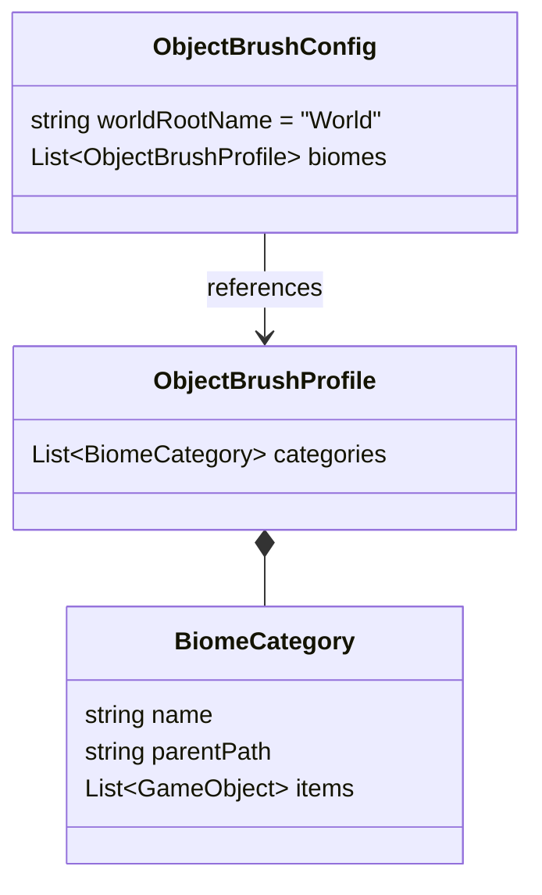
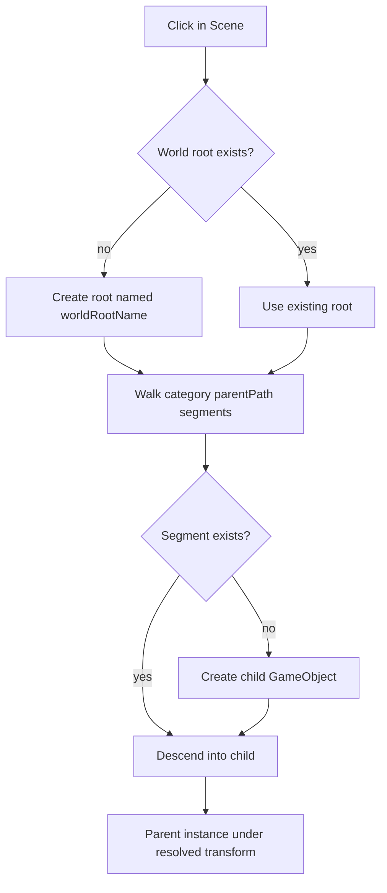

# Object Brush — Biomes + World-Root Parenting

- **Date:** 2026-05-27
- **Status:** Approved (design)
- **Area:** `Assets/Game/Editor/ObjectBrush` (editor tooling only — no runtime/gameplay impact)

## Context

The Object Brush is an editor window for painting prefab instances into the Scene
view. Today a single `ObjectBrushWindow` does everything: brush toggle, biome
profile load/save, brush settings, a "Category Names & Parents" overview list, and
the palette accordion.

Parenting is currently driven by scene `Transform` references: each category has a
`defaultParent`, with a window-level `globalParent` fallback. These references are
persisted **per scene** into `Assets/Editor/ObjectBrushSceneSettings.asset`, keyed by
scene path → category name → hierarchy path.

Biomes (`ObjectBrushProfile` assets) store a flat list of categories (name + prefab
items) and are loaded one at a time, replacing the window's current palette.

## Goals

1. Move category/structure configuration into a **separate window** so the main
   window maximizes space for the palette list.
2. Replace per-scene parent bindings with a **name-based "World root" convention**
   shared across all scenes (no per-scene settings).
3. Add a **biome nesting level** to the palette so multiple biome assets can be
   referenced and shown at once, instead of loading one biome at a time.

## Decisions

These were settled during brainstorming:

- **Old per-scene parent system:** fully removed (`defaultParent`, `globalParent`,
  and the per-scene settings asset).
- **Category → World child mapping:** configurable **nested path** relative to the
  World root (e.g. `Interactive` or `Interactive/Barrels`). Empty path falls back to
  the category name.
- **Biome scope:** palette-organization only. The biome name never enters the scene
  hierarchy; placement always targets `World/<category-path>`.
- **Editing model:** referenced biome assets are edited **directly/live**
  (`SerializedObject` + `SetDirty`, undo-able). No Load/Save copy step.
- **Window split:** prefab-slot assignment stays in the **main palette window**; the
  separate window handles structure (biomes, categories, parent paths, order).
- **Storage:** a **new shared project asset** holds the World root name + the list of
  referenced biome assets. Replaces `ObjectBrushSceneSettings`.

## Data model

**`ObjectBrushProfile`** (biome asset) — gains `parentPath` on each category:

- Biome name = the asset's file name (no extra field).
- `parentPath` is relative to the World root; supports nesting via `/`.
- Empty `parentPath` ⇒ resolves to the category `name`. Existing profile assets
  therefore keep working with no manual edits (additive, backward-compatible field).

**`ObjectBrushConfig`** (new shared asset) at `Assets/Editor/ObjectBrushConfig.asset`,
auto-created on first use (same create-or-load pattern the tool already uses):

- `worldRootName` (default `"World"`).
- `biomes` — referenced `ObjectBrushProfile` assets, all active simultaneously.

## Windows & responsibilities

Both windows load `ObjectBrushConfig` by fixed path and edit the config and biome
assets directly. They re-read on repaint so they stay in sync.

### Config window — `ObjectBrushConfigWindow`

Menu `Tools/Object Brush Configuration`, plus a "Configure…" button on the main
window. Structure only:

- World Root Name field.
- Biome list: add (assign a profile asset), remove.
- Per biome: add / remove / rename / reorder categories, and edit each category's
  `parentPath`.

### Main palette window — `ObjectBrushWindow` (existing)

- Top bar: Enable Brush toggle + active-prefab label + Configure… button.
- Brush settings foldout: Snap to Grid, Grid Size. (`globalParent` removed.)
- Filter field (filters items by prefab name, as today).
- Palette accordion: **Biome → Category → item grid**. Assign / clear / add / remove
  prefab slots here; clicking a slot sets the active brush.

Brush state (enabled, snap, grid size, filter text, active selection) remains
window-local serialized state.

## Placement logic

- Find a root GameObject named `worldRootName` in the active scene; create it if
  missing.
- Walk the active category's `parentPath` segment by segment under the root, creating
  any missing GameObjects.
- Parent the new instance under the resolved transform.
- Every created object (instance + intermediate parents) is registered with `Undo`.
- Grid snapping and `Name_N` auto-numbering are unchanged.
- If `worldRootName` is empty, the path resolves directly at scene root.

## Migration / breaking changes

- `ObjectBrushSceneSettings` class is **deleted** (the file is renamed to
  `ObjectBrushConfig.cs`). Two stale per-scene assets are removed:
  `Assets/Editor/ObjectBrushSceneSettings.asset` (the one the tool actually used —
  current scene paths, uniform `World/<category name>` mapping) and
  `Assets/Game/Editor/ObjectBrushSceneSettings.asset` (obsolete scene paths). Existing
  per-scene parent bindings are discarded — intentional, this is the point of goal 2.
  The active mapping was uniformly `World/<category name>`, which the empty-path
  fallback reproduces, so existing biome profiles need no manual `parentPath` edits.
- `ObjectBrushProfile` gains `parentPath` (additive; old assets deserialize with an
  empty path ⇒ category-name fallback).
- `globalParent` and per-category `defaultParent` are removed from the window.

## Files touched

- `ObjectBrushProfile.cs` — add `parentPath` to `BiomeCategory`.
- `ObjectBrushSceneSettings.cs` → `git mv` to `ObjectBrushConfig.cs`, rewritten as the
  new shared config (move `.meta` together).
- `Assets/Editor/ObjectBrushSceneSettings.asset` + `.meta` — `git rm`.
- `Assets/Game/Editor/ObjectBrushSceneSettings.asset` + `.meta` — `git rm` (stale copy).
- `ObjectBrushWindow.cs` — remove scene-binding + parent-Transform code, read biomes
  from config, two-level palette, new placement logic.
- New `ObjectBrushConfigWindow.cs` — the structure-editing window.
- New `ObjectBrushUtility.cs` — shared config load/create + World-root resolution used
  by both windows.

## Non-goals / out of scope

- No biome level in the scene hierarchy (palette-only).
- No change to brush feel: snapping, raycasting, preview, and auto-numbering behavior
  stay as-is.
- No runtime/gameplay code is touched.
