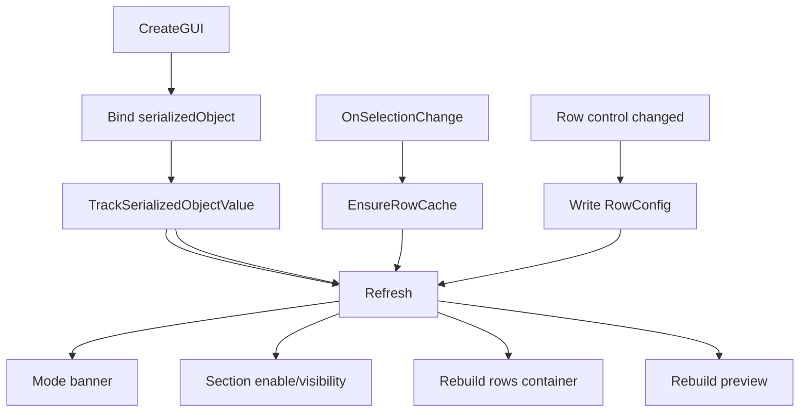

# Sprite Tools — UI Toolkit rewrite

**Date:** 2026-06-01
**Status:** Approved design
**Scope:** Rewrite the Sprite Tools batch pivot + naming window from IMGUI to UI Toolkit.

## Goal

Replace the IMGUI front-end of the Sprite Tools batch pivot/naming window with a UI
Toolkit implementation that follows common UI Toolkit and Unity editor-tool best
practices. The window is treated as a POC of a standalone product, so the rewrite aims
for an idiomatic, maintainable UI layer rather than matching any other tool's
conventions in this project.

The **Core** logic (`SpriteNaming`, `SpriteSheetRows`, `SpriteImportOps`) was already
written to be UI-agnostic and is **not** changed. Only the view layer is rewritten.

## Locked decisions

| Decision | Choice |
| --- | --- |
| Existing IMGUI window | **Replace entirely** — delete `SpritePivotBatchTool.cs`, move the `[MenuItem]` to the new window |
| UI construction | **UXML + USS + C# controller** (idiomatic separation of markup, style, logic) |
| Data binding | **Hybrid** — SerializedObject binding for static controls, manual rendering for the dynamic per-row list |
| Behavior fidelity | **Faithful 1:1 behavior** + small, idiomatic UX polish (live preview, reactive enable-states) |

## Binding rationale

An `EditorWindow` is a `ScriptableObject`, so its `[SerializeField]` fields already
persist across domain reloads and editor restarts. UI Toolkit binds directly to those
fields:

- **Static settings** (operation toggles, pivot preset, unit mode, custom pivot,
  numbering) → **SerializedObject binding** via `binding-path` in UXML plus a single
  `rootVisualElement.Bind(serializedObject)`. Two-way sync is automatic; no per-control
  callback boilerplate; state survives reloads.
- **Dynamic per-row list** (rows are re-detected on every selection change) → **manual
  rendering**. Static binding paths assume a stable structure, which rows do not have,
  so rows use a small serializable model rebuilt on selection and a hand-instantiated
  row template.

Reactivity (live preview, enable/disable groups) is driven by a single
`TrackSerializedObjectValue` callback that calls one `Refresh()`.

## File layout

```
Assets/Game/Editor/SpriteTools/
  Core/                              ← unchanged (SpriteNaming, SpriteSheetRows, SpriteImportOps)
  UI/
    SpritePivotBatchWindow.cs        ← EditorWindow controller (CreateGUI, selection, Apply)
    SpritePivotBatchWindow.uxml      ← window layout
    SpritePivotBatchWindow.uss       ← theme-aware styles
    RowView.uxml                     ← one-row template (label, name field, optional pivot line)
```

`SpritePivotBatchTool.cs` and its `.meta` are removed; the `[MenuItem]` for
`Tools/Sprites/Batch Pivot (Sprite Editor Style)` moves to `SpritePivotBatchWindow`.
The new window calls the same Core APIs the IMGUI window called.

## Controller & data model

`SpritePivotBatchWindow : EditorWindow`.

**Serialized state** (same fields as today, each bound via UXML `binding-path`):
`changePivot`, `pivotPreset`, `unitMode`, `customPivot`, `eachRowOwnPivot`,
`changeNames`, `renameBaseName`, `renameStartIndex`, `renamePadWidth`.

**Row model** replaces the three index-parallel lists
(`rowNames` / `rowPivotPresets` / `rowCustomPivots`) with one typed list:

```csharp
[Serializable]
private sealed class RowConfig {
    public string name;
    public SpriteAlignment alignment;
    public Vector2 customPivot;
}
```

Non-serialized `cachedRows` (`List<List<SpriteCell>>`) and `cachedRowTexturePath` are
ported as-is. `EnsureRowCache` populates `List<RowConfig>` instead of three lists.

**Lifecycle:**

- `CreateGUI()` — load UXML/USS, query elements, `Bind(serializedObject)`, register
  callbacks, run the first `Refresh()`.
- `OnSelectionChange()` — recompute mode, `EnsureRowCache`, `Refresh()`.
- `Refresh()` — the single place that reads current mode + state and updates the mode
  banner, section visibility/enabled-state, the rows container, and the live preview.



## UXML layout, styling & UX polish

`SpritePivotBatchWindow.uxml` regions, shown/enabled by `Refresh()`:

- **Mode banner** — `Flat (N sprites)` / `Per-row — file.png` / `Nothing selected`.
- **Operation toggles** — `Change Pivot`, `Rename`, plus the nested
  `Each row with own pivot` in per-row mode.
- **Pivot section** — preset `EnumField` + custom-pivot row (unit `EnumField` + X/Y
  `FloatField`s) that enables only when the preset is `Custom`.
- **Rows section** (per-row only) — a container populated with `RowView.uxml`
  instances, one per detected row. Each row shows `Row r (count)` + name field, and,
  when "own pivot" is on, a second indented line with preset + unit + X/Y.
- **Numbering** — `Start Index` + `Pad Width` `IntField`s.
- **Apply** button — disabled when neither operation is checked.
- **Preview** — scrollable, rebuilt live; reuses `BuildName` / `PivotPreviewText`
  logic for the `current → new` lines.
- **Help** — `HelpBox` with the existing guidance text.

`SpritePivotBatchWindow.uss` is minimal and theme-aware: it uses Unity's built-in USS
variables (e.g. `var(--unity-colors-helpbox-background)`) so it renders correctly in
both dark and light editor themes. Only layout/spacing/indent classes — no hardcoded
colors.

**UX polish (within approved scope, all low-risk):**

- Preview and enable-states update live as the user types/toggles.
- Disabled sections stay visible but greyed (`SetEnabled`) instead of vanishing, so the
  layout does not jump.
- Custom-pivot fields enable/disable reactively off the preset.

No new features and no change to Apply behavior.

## Apply orchestration

Ported unchanged from the IMGUI window (already UI-agnostic):

- `Apply()` keeps the **pivot-before-rename ordering** (renaming changes sprite names,
  which would otherwise break the pivot pass's name-based matching).
- `ApplyUniformPivot` / `ApplyPerRowPivot` / `RenameFlat` / `RenamePerRow` /
  `RunRenames` — same bodies, same `StartAssetEditing` / `StopAssetEditing` batching,
  same `Debug.Log` summaries.
- `DetermineMode` / `CollectSelectedSpritesOrdered` / `CollectSelection` /
  `GetSelectedTexturePath` / `EnsureRowCache` — ported as-is (only `EnsureRowCache`
  changes to populate `List<RowConfig>`).

The risk surface is the UI layer only; asset-mutation runs the same code paths as
today.

## Verification

- **Compile check** offline via the bundled `csc` + `.rsp` method (no Unity launch
  required) to confirm the new files build.
- **Manual smoke test** (Unity Editor steps, listed in the final report):
  1. Open `Tools/Sprites/Batch Pivot (Sprite Editor Style)`.
  2. Flat mode: select Sprite sub-assets, set pivot + base name, confirm the preview
     updates live, Apply, verify names/pivots.
  3. Per-row mode: select a whole multi-sprite texture, rename rows, toggle "own
     pivot", Apply, verify per-row names/pivots and that references survive.
- No automated UI tests — `EditorWindow` view logic is not meaningfully unit-testable,
  and Core (the testable part) is unchanged.

## Risks & follow-ups

- UXML/USS assets need fresh `.meta` files generated by Unity on first import; the
  `[MenuItem]` path is preserved so existing muscle memory / any external references to
  the menu still work.
- The window's saved layout/state is keyed by the type name; renaming
  `SpritePivotBatchTool` → `SpritePivotBatchWindow` resets any persisted window state
  (position/size only — no asset data).
