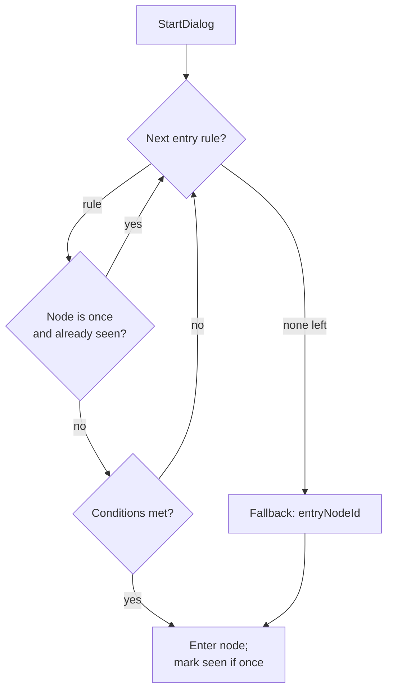

# Dialog Conditional Entry — Design

## Problem

The current dialog system always opens a conversation at a fixed `entryNodeId`.
Branching (`DialogCondition`) exists only at the **choice** level, so an NPC says
the same opening lines every time. The draft in `docs/drafts/dialogs.md` requires
NPC openings that vary by state:

1. **First vs. repeat talk** — the first conversation is an introduction shown once;
   every later conversation uses a common dialog.
2. **One-shot reaction to the sabre** — after the player equips the sabre, the NPC
   plays a one-time reaction, then never again.
3. **Quest-dependent openings** — the opening changes with quest progress
   (e.g. Captain Clack: start quest / remind / complete).

## Core insight

All three requirements are the same missing primitive: **choosing which node a
dialog enters, based on player state.** One-shot behaviour, item/equip checks, and
quest state are then all expressible with mechanisms that already exist (flags,
conditions, actions) plus built-in seen-node tracking.

## Design

### 1. Conditional entry rules

`DialogDef` gains an ordered list of entry rules. On `StartDialog`, the service
walks the rules top-to-bottom and enters the **first rule that both**:

- passes its conditions, **and**
- is not a spent one-shot (target node marked `once` and already seen).

If no rule matches, it falls back to the existing `entryNodeId`. Existing dialog
files with no `entryRules` keep working unchanged.

### 2. One-shot replicas — `once` + built-in seen tracking

- `DialogNode` gains `bool once`.
- When the service **enters** a node marked `once`, it records that node's global
  key (`"<dialogId>.<nodeId>"`) into `PlayerState.seenDialogNodes`.
- Entry resolution automatically **skips** any rule whose target node is `once`
  and already seen.

The designer only marks the node `once` and orders the rule above the fallback —
no hand-managed flag pairs.

### 3. Quest-dependent replicas — flags

Reuse the existing `SetFlag` / `ClearFlag` actions and `FlagSet` / `FlagNotSet`
conditions. A quest is modelled as named flags (e.g. `quest_skull_started`). The
intro node sets the flag in its `onEnterActions`; later rules gate on it. No
dedicated quest subsystem.

### 4. Sabre reaction

The first sabre pickup is added to inventory then immediately removed, setting the
persisted `PlayerState.IsArmed` bool (`PlayerController.OnInventoryChanged`). So the
sabre is **not** an inventory item at rest — a new `IsArmed` condition is required.

The sabre rule: target node `once: true`, condition `IsArmed`. Shown once after the
player equips the sabre, then skipped → falls through to the common node.

## Resolution flow



## Data-model changes

All changes are additive and backward-compatible.

| File | Change |
|---|---|
| `DialogDef.cs` | Add `DialogEntryRule[] entryRules`; keep `entryNodeId` as fallback |
| **new** `DialogEntryRule.cs` | `{ string nodeId; DialogCondition[] conditions; }` |
| `DialogNode.cs` | Add `bool once` |
| `DialogCondition.cs` | Add `ConditionType.IsArmed` (no params) |
| `PlayerState.cs` | Add `List<string> seenDialogNodes` + `HasSeenNode(key)` / `MarkNodeSeen(key)` |
| `DialogService.cs` | Add `ResolveEntryNode()`; evaluate `IsArmed`; mark-seen inside `EnterNode` |
| `PlayerStateSaver.cs` | Persist `flags` and `seenDialogNodes` via `SetString` (also closes the existing flags-not-saved gap) |

No changes to `DialogParser` (`JsonUtility` handles the new `bool` and array;
`IsArmed` is picked up by the existing enum-name regex), the UI layer, or
`DialogNPC`.

### `ResolveEntryNode()` behaviour

```csharp
private string ResolveEntryNode() {
    var state = G.Game.playerState;
    if (currentDialog.entryRules != null) {
        for (int i = 0; i < currentDialog.entryRules.Length; i++) {
            var rule = currentDialog.entryRules[i];
            var node = FindNode(rule.nodeId);
            if (node == null) {
                continue;
            }

            if (node.once && state.HasSeenNode(SeenKey(rule.nodeId))) {
                continue;
            }

            if (AreConditionsMet(rule.conditions, state)) {
                return rule.nodeId;
            }
        }
    }

    return currentDialog.entryNodeId;
}
```

`EnterNode` marks the node seen after resolving it:

```csharp
if (currentNode.once) {
    G.Game.playerState.MarkNodeSeen(SeenKey(currentNode.nodeId));
}
```

`SeenKey(nodeId)` returns `$"{currentDialog.dialogId}.{nodeId}"` so node ids stay
unique across dialogs.

### Persistence

`PlayerState.flags` and `PlayerState.seenDialogNodes` are persisted by
`PlayerStateSaver` as newline-joined strings via `IStateWriter.SetString` and
restored via `TryGetString`. Within a play session both already survive scene
travel because `GameManager` is `DontDestroyOnLoad`; this change makes them
survive save/restore as well, matching how `IsArmed`, stats, and health are
already handled.

## Worked example — Rikko

```text
entryRules:
  1. intro          (once)             # introduction, first time only
  2. sabre_reaction (once, IsArmed)    # one-shot reaction after equipping sabre
  3. common         (no conditions)    # default, every other time
```

- `intro` and `sabre_reaction` each chain into `common` via the existing
  empty-`textKey` auto-continue choice.
- `common` holds the shop choice (`OpenShop`).
- `intro` is ordered first so it always plays before the sabre reaction, even if
  the player somehow equips the sabre before first meeting Rikko.

## Worked example — Captain Clack

```text
entryRules:
  1. final     (HasItem GoldenSkull)        # completion, highest priority
  2. intro     (once; sets quest_skull_started on enter)
  3. reminder  (FlagSet quest_skull_started)
  fallback: intro
```

- First meeting (no skull): rule 1 fails, `intro` plays once and sets the quest
  flag.
- Later (no skull): `intro` is spent, `reminder` plays.
- With the skull: `final` plays, completes the quest (gives reward / sets
  `quest_skull_done`).

Authoring the Captain Clack JSON and its L10n keys is implementation content; the
structure above is the contract.

## Scope (YAGNI)

- No dedicated quest system — quests are flags.
- No `NodeSeen` / node-level condition graph — `once` plus entry-rule conditions
  cover every case in the draft.
- Only `IsArmed` is added (not `IsNotArmed`); the symmetric variant is a trivial
  later addition if needed.

## Risks / follow-ups

- **Serialized data:** all new fields are additive; existing dialog JSON and saved
  blobs remain valid (missing keys fall back to defaults).
- **Save format:** persisting `flags`/`seenDialogNodes` adds two new save keys;
  older saves without them simply start empty.
- **Content work:** restructuring `rikko.json`, adding `captainclack.json`, and the
  associated L10n keys are separate implementation tasks tracked in the plan, along
  with a `docs/system/dialog-system.md` write-up describing the final system.
