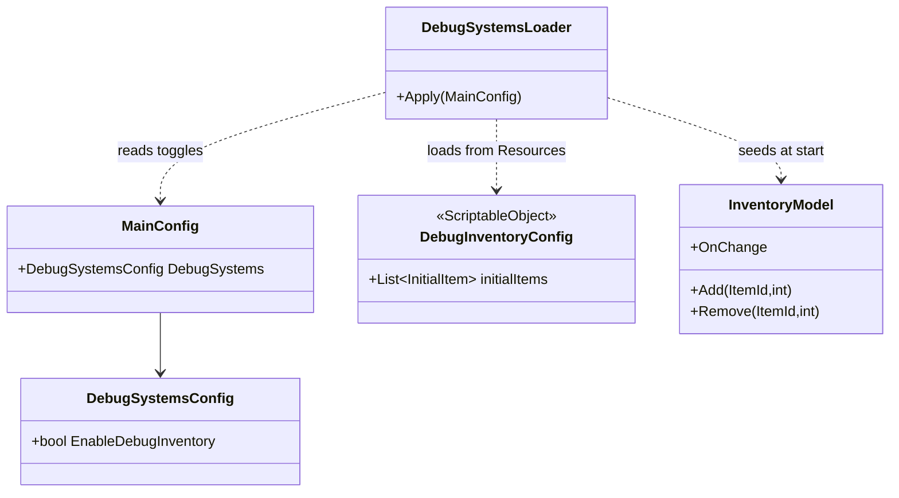
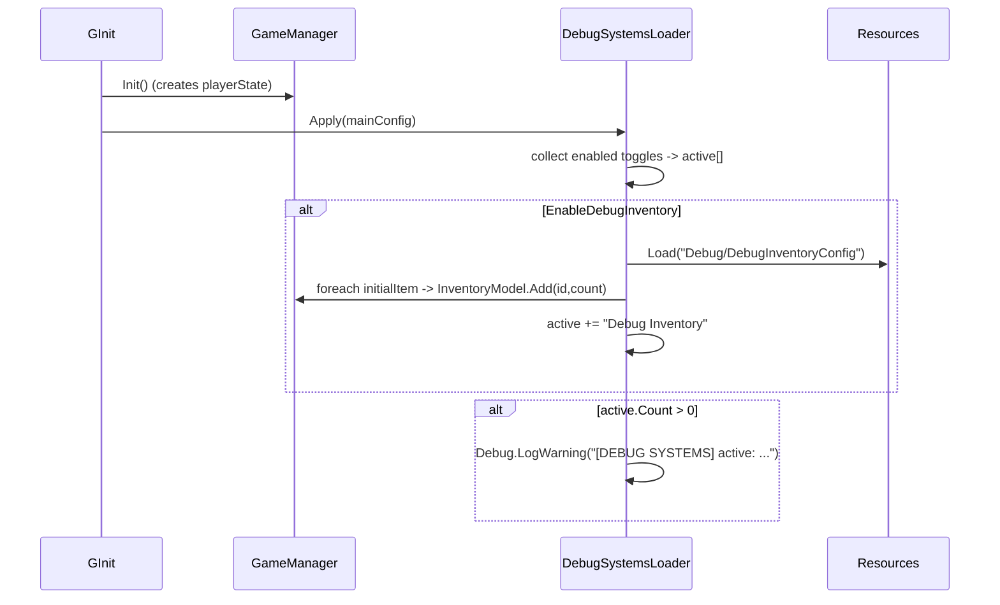

# Debug Inventory System — Design

Date: 2026-06-12
Status: Approved (pending spec review)

## Goal

Provide a debug-only inventory tool that lets a developer:

1. **Edit time** — define a list of initial items that are seeded into the player's
   inventory when the game starts.
2. **Play time** — view and mutate the *live* player inventory directly from the
   Inspector. Items picked up in-game appear immediately; items added/removed in the
   Inspector behave as if the player picked them up / dropped them.

The tool must be trivially toggleable (production vs. debug) and must loudly announce
itself at runtime so it is never accidentally left enabled in a build.

This replaces the existing `DebugInitialInventory` MonoBehaviour, which only covered the
edit-time seeding half and required a component in every scene.

## Key decisions

- **ScriptableObject, not a scene component.** No per-scene wiring; one asset holds the
  initial-items list.
- **Enablement lives in `MainConfig`, not on the SO.** A "Debug Systems" block in
  `MainConfig` carries an `EnableDebugInventory` checkbox. The SO itself has *no*
  on/off toggle (this supersedes the original per-SO toggle idea, to avoid two competing
  switches). The SO editor shows a hint pointing to the MainConfig toggle plus a live
  read-only status indicator.
- **Loaded from `Resources/Debug/` only when enabled.** If the toggle is off, nothing is
  loaded and nothing happens — identical to production behavior.
- **Seed once at game start**, right after the player state is created. No re-seeding on
  respawn / checkpoint restore.
- **Loud runtime warning.** When any debug system is active, a single warning is logged
  listing all active debug systems, so they are not forgotten before a build. A
  compile-macro auto-disable for production builds is explicitly **out of scope** for now
  (future follow-up).
- **Editor lives next to its implementation** in a dedicated folder so the whole feature
  can be relocated as a unit. Uses the project's `Editor` special-folder convention
  (no asmdefs exist under `Assets/Game`).

## Architecture

### Components



### Data model

```csharp
// DebugInventoryConfig.cs — runtime ScriptableObject
[CreateAssetMenu(...)]
public sealed class DebugInventoryConfig : ScriptableObject {
    [Serializable]
    public struct InitialItem {
        public ItemId itemId;
        public int count;
    }

    [SerializeField] private List<InitialItem> initialItems = new();
    public IReadOnlyList<InitialItem> InitialItems => initialItems;
}
```

The asset is created manually in `Assets/.../Resources/Debug/`, giving the load path
`"Debug/DebugInventoryConfig"`.

### MainConfig change

Add a nested serializable config under the existing `[Header("Debug")]` section,
structured so future debug-system toggles slot in beside it. `EscQuitsImmediately`
is left untouched.

```csharp
[Serializable]
public class DebugSystemsConfig {
    public bool EnableDebugInventory;
}

// in MainConfig, under [Header("Debug")]:
public DebugSystemsConfig DebugSystems = new();
```

### Runtime flow



- `DebugSystemsLoader.Apply(mainConfig)` is called from `GInit.Awake` immediately after
  `G.Game.Init()` (the moment `playerState.InventoryModel` first exists).
- If the inventory toggle is off, the loader skips the Resources load entirely.
- If the SO is enabled but missing from Resources, log an error and continue (non-fatal).
- The warning is emitted once, only when at least one debug system is active.

### Custom editor (IMGUI)

A single `UnityEditor.Editor` for `DebugInventoryConfig`, in
`DebugInventory/Editor/DebugInventoryConfigEditor.cs`, guarded by `#if UNITY_EDITOR`.
It switches its data source based on `Application.isPlaying`:

| Element | Edit mode | Play mode |
|---|---|---|
| Hint + status box | "Enable via MainConfig → Debug Systems → Enable Debug Inventory" + ✅/⚠️ current state | same |
| Item rows: icon · name · count (all readonly) | from `initialItems` | from live `G.Game.playerState.InventoryModel` |
| Per-row compact `X` remove + `Clear All` button | mutate `initialItems` (SerializedProperty + Undo + SetDirty) | `InventoryModel.Remove(id,count)` / `RemoveAll` |
| Add row: item dropdown + count int field + `Add` | append to `initialItems` | `InventoryModel.Add(id,count)` |

- Item icons via `DefsFacade.I.Items.Get(id).Icon`; the displayed "name" is the item `Id`
  (no separate display-name field exists on `ItemDef`).
- The Add dropdown is populated from `DefsFacade.I.Items.GetAllIds()`.
- Live play-mode updates: override `RequiresConstantRepaint() => Application.isPlaying`
  so in-game pickups/drops reflect immediately without manual refresh.
- Editing the SO list in play mode is intentionally disabled as a *source* — play mode
  always shows/edits the live model, never the serialized `initialItems`.

## File plan

New:
- `Assets/Game/Core/DebugTools/DebugInventory/DebugInventoryConfig.cs`
- `Assets/Game/Core/DebugTools/DebugInventory/Editor/DebugInventoryConfigEditor.cs`
- `Assets/Game/Core/DebugTools/DebugSystemsLoader.cs`

Edit:
- `Assets/Game/Configs/MainConfig.cs` — add `DebugSystemsConfig` block.
- `Assets/Game/Core/Bootstrap/GInit.cs` — one `DebugSystemsLoader.Apply(mainConfig)` call.

Delete:
- `Assets/Game/Core/DebugTools/DebugInitialInventory.cs` (+ `.meta`) via `git rm`.

## Manual Unity steps

- Create the `DebugInventoryConfig` asset under `Assets/.../Resources/Debug/`.
- Remove the `DebugInitialInventory` component from any scene that still references it
  (scene YAML is not edited by hand).
- Enable the system via `MainConfig → Debug → Debug Systems → Enable Debug Inventory`
  when debugging.

## Risks / follow-ups

- The debug SO ships inside `Resources` (always built). Mitigated by the runtime warning;
  a compile-macro auto-disable is a future follow-up.
- Removing `DebugInitialInventory` from scenes is manual; missing it leaves a harmless
  null component reference until cleaned up.
- A short system write-up will be added at `docs/system/debug-inventory.md` during
  implementation (per project documentation convention).

## Out of scope

- Compile-macro / build-stripping of debug systems.
- A registry/plugin framework for debug systems beyond the single `EnableDebugInventory`
  toggle (kept minimal; extend when a second system appears).
- Persisting play-mode inventory edits back into the SO.
