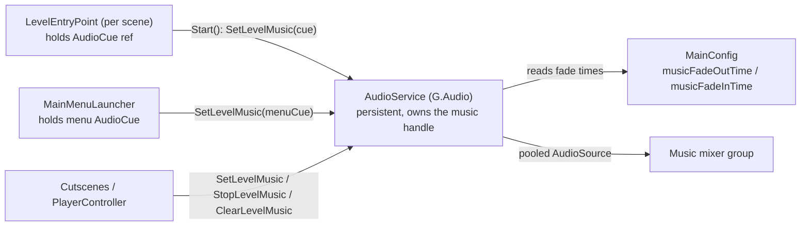

# Scene Music System — Design

Date: 2026-06-13
Status: Approved for planning

## Problem

Every gameplay scene contains a `Music` GameObject with a raw `AudioSource`
(`PlayOnAwake = 1`, `Loop = 1`) referencing a music clip directly. Because the
AudioSource lives inside the scene, it is destroyed and recreated on every scene
load, so the music **restarts from the beginning on every scene entry — even when
the next scene uses the same track**. There is no fade between different tracks.

## Goals

1. **Each scene declares its music.** When the player spawns in a scene, that
   scene's assigned track starts playing.
2. **Same track persists across scenes.** If the player transitions to a scene
   whose music is the same as the current one, the music keeps playing without
   restarting.
3. **Different track fades.** If the new scene's track differs, the current track
   fades out and the new one fades in (sequential fade: out fully, then in).

## Non-Goals (v1)

- No trigger-/timer-/event-based music changes (combat stingers, zone triggers,
  etc.). The design keeps a clean central seam so these can be added later, but
  they are out of scope for this version.
- No true simultaneous crossfade. Transition is **sequential** (fade out, then
  fade in), per decision.
- No new music asset type. Tracks remain `AudioCue` ScriptableObjects, which
  already exist for every track.

## Current State (discovered)

A central, partially-built level-music system already exists and is the
foundation we build on:

- `AudioService` (`G.Audio`, `Assets/Game/Core/Audio/AudioService.cs`) is a
  persistent service (created by `GInit`, kept alive across scene loads via
  `AppBootstrap` `DontDestroyOnLoad`). It already has
  `SetLevelMusic / StartLevelMusic / StopLevelMusic / ClearLevelMusic` and owns a
  single `musicHandle` plus `currentMusicCue`.
- `LevelEntryPoint` (`Assets/Game/Core/Components/SceneManagement/LevelEntryPoint.cs`)
  is a per-scene component holding an `AudioCue` reference (a "track reference").
  On `Start()` it calls `G.Audio.SetLevelMusic(cue)`; on `OnDestroy()` it calls
  `ClearLevelMusic()`.
- **The gameplay scenes do not use `LevelEntryPoint`** — they still use the raw
  `Music` AudioSource. So the migration was never finished.
- Music tracks are already authored as `AudioCue` assets in
  `Assets/Game/Content/Music/` (`LazySailingCue`, `SunlitAdventuresCue`,
  `MainMenuThemeCue`, `VengefulSpirit`, `DeathJingleCue`).
- Cutscenes (`ShipDepartureCutscene`, `BossIntroCutscene`) and `PlayerController`
  (death/respawn) already drive music through the `G.Audio` level-music API.
- The **main menu** (`MainMenuLauncher`) plays its music through a *separate*
  path: `G.Audio.PlayLoopAt(...)` with its own private handle, independent of the
  level-music system.

Scene loads are `LoadSceneMode.Single` via `SceneTravelService`: the outgoing
scene (and its objects' `OnDestroy`) is torn down, then the incoming scene's
`Awake`/`Start` run.

## Architecture



Three responsibilities, cleanly separated:

1. **Per-scene track declaration** — `LevelEntryPoint` (and the menu) only say
   *which* cue the scene wants. They do not own playback.
2. **Music ownership / transitions** — `AudioService` owns the single live music
   loop and decides keep vs. fade. This is the central seam future event-based
   music would also call into.
3. **Tuning** — `MainConfig` holds fade durations (the service is created
   dynamically, so it cannot use serialized inspector fields — per the project's
   service-configuration rule).

## Detailed Behavior

### `SetLevelMusic(cue)` — the core change

Today `SetLevelMusic` always stops and restarts. New logic:

```
SetLevelMusic(cue):
    if cue == currentMusicCue AND music is actually playing:
        return                          # Req 2: same track keeps playing
    currentMusicCue = cue
    BeginTransition(cue)                # cancels any in-flight transition first

BeginTransition(cue):                   # single coroutine, stored so it can be cancelled
    if a music loop is currently playing:
        fade it out over musicFadeOutTime
        wait for fade-out to finish
    if cue != null:
        start cue as a non-spatial loop at volume 0
        fade in to cue volume over musicFadeInTime
```

- "music is actually playing" = `musicHandle != null && musicHandle.IsValid`
  (and its source is playing). This guard is what makes the death/respawn flow
  correct: death calls `StopLevelMusic` (handle stops, `currentMusicCue` kept);
  when the same cue is later re-assigned but is *not* playing, it restarts
  instead of no-op'ing into silence.
- A `null` cue means "this context wants silence" — fade out, leave nothing
  playing, `currentMusicCue = null`.
- Overlapping calls: a stored reference to the active transition coroutine is
  stopped before starting a new one, and any in-flight fade is cancelled, so
  rapid scene changes never stack fades or leak handles.

### `StartLevelMusic()` / `StopLevelMusic()` / `ClearLevelMusic()`

- `StartLevelMusic()` stays an **explicit restart** of `currentMusicCue` from the
  beginning (used by same-scene respawn). Now starts with a fade-in.
- `StopLevelMusic(fade)` stays a duck (stop handle, keep `currentMusicCue`).
- `ClearLevelMusic(fade)` stays stop + forget cue (used by cutscene teardown).

### Fade-in (new)

`AudioService` currently only fades **out** (`FadeOutAndStop`). Add a symmetric
fade-**in** for loops: start the source at volume 0 and ramp to the cue's volume
over `musicFadeInTime` using `Time.unscaledDeltaTime` (so it is unaffected by
pause / time scale, matching the existing fade-out).

### `LevelEntryPoint` change

Remove the `OnDestroy → ClearLevelMusic()` call. Music is owned by the
persistent service and must survive the scene unload so the next scene can decide
keep vs. fade. `Start()` still calls `SetLevelMusic(levelMusic)`; assigning
`None` means the scene wants silence.

### `MainMenuLauncher` change

Route menu music through the central path instead of a private handle:

- `Awake()`: `G.Audio.SetLevelMusic(mainMenuMusic)` (was `PlayLoopAt` into a
  private `musicHandle`).
- Remove the private `musicHandle` field and the `OnDestroy → musicHandle.Stop()`.

This prevents gameplay music (now persistent) from playing on top of menu music,
and means menu↔gameplay transitions get the same keep/fade behavior for free. The
`mainMenuDelay` (UI timing) is unchanged.

### `MainConfig` additions

```csharp
[Header("Music")]
public float musicFadeOutTime = 0.5f;
public float musicFadeInTime = 0.5f;
```

`AudioService.Init()` (already called from `GInit` after `G.Config` is set) reads
these into private fields. Defaults are used if `G.Config` is null.

## Editor Migration Tool

A one-shot Editor menu command — `Tools > Audio > Migrate Scene Music` — converts
gameplay scenes from the raw `Music` AudioSource to a `LevelEntryPoint` + cue.

For each scene under `Assets/Game/Scenes` (excluding the main-menu scene, which is
handled by the `MainMenuLauncher` code change):

1. Open the scene.
2. Find the `Music` GameObject and read its `AudioSource.clip`.
3. Map that clip to its matching `AudioCue` by scanning all `AudioCue` assets and
   matching on the clip the cue references (read via `SerializedObject`, so no
   change to `AudioCue`'s public API is needed).
4. Add a `LevelEntryPoint` (on the `Music` GameObject, then renamed, or on a new
   `SceneMusic` GameObject) with `levelMusic` set to the matched cue.
5. Remove the raw `AudioSource` (and the old `Music` object if a new one is used).
6. Save the scene.
7. Print a summary: scenes migrated, and any scene whose clip matched **zero** or
   **multiple** cues (skipped, flagged for manual handling).

The tool is idempotent (skips scenes already migrated) and makes no change when a
clip cannot be unambiguously mapped, so it is safe to run and re-run while
reviewing the diff.

## Compatibility

- **Cutscenes** (`ShipDepartureCutscene`, `BossIntroCutscene`): already use
  `SetLevelMusic`/`ClearLevelMusic` with their own cues → different cue → normal
  fade. `ClearLevelMusic` still fades out and forgets the cue. Unchanged.
- **Death / respawn** (`PlayerController`): `StopLevelMusic` ducks, `StartLevelMusic`
  restarts (same scene); cross-scene respawn re-assigns via the new scene's
  `LevelEntryPoint`. The "actually playing" guard preserves both.
- **Pixel-perfect / gameplay feel**: audio-only change; no camera, physics, or
  timing impact.

## Risks & Manual Steps

- **Music cue mixer routing**: each music `AudioCue` must route to the *Music*
  mixer group (the pooled loop uses `cue.MixerGroup`, falling back to the SFX
  group). Verify every music cue has its `MixerGroup` set; fix any that don't.
  (Manual / verify step.)
- **Scene edits**: the migration touches ~30 scenes. Review the diff and play-test
  a representative transition (same-track and different-track) before committing.
- **Clip→cue ambiguity**: a clip used by no cue or several cues is skipped by the
  tool and must be wired by hand; the tool reports these.
- Per project rules: no auto-commit; `.meta` files for any new scripts are created
  by Unity and committed alongside.

## Verification

- Enter scene A (track X) → music plays from start.
- A → B where B uses track X → music does **not** restart (continues seamlessly).
- B → C where C uses track Y → X fades out, then Y fades in.
- Die and respawn (same scene) → music ducks then returns.
- Gameplay → main menu → menu music replaces gameplay music (no overlap).
- Cutscene (ship departure / boss intro) music still triggers and clears.

## Deliverables

- `AudioService` behavior changes (keep/fade logic, fade-in, `Init` reads config).
- `LevelEntryPoint` `OnDestroy` change.
- `MainMenuLauncher` central-path change.
- `MainConfig` music fade fields.
- Editor migration tool.
- System write-up at `docs/system/scene-music.md`.
