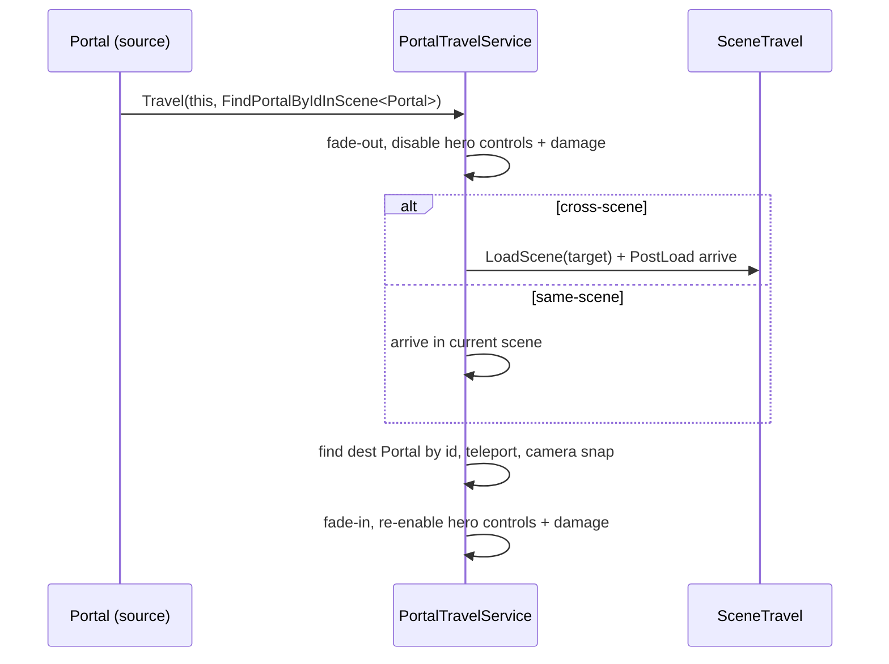

# Portal cross-scene teleport — design

## Goal

The `Portal` prefab currently teleports the player to another point in the **same**
scene (instant, no fade). Extend it so a portal can **also** send the player to a
point in **another scene**. Teleport stays **one-way**.

## Decisions (locked during brainstorming)

1. **Reuse the existing portal framework** (`PortalTravelService` / `IPortal` /
   `PortalLink`) rather than bolting a separate cross-scene path onto the old
   `PortalController`. Cross-scene travel cannot use a direct object reference (the
   destination lives in a scene that is not loaded yet), so it must be resolved by
   **id** after the scene loads — which `PortalTravelService` already does.
2. **Unify into a single `Portal` component** (mirroring `Entrance`). The shared
   editor tooling (validator, change-id window, gizmos, scene-reference repair)
   assumes a *single-type* model where each portal instance both carries a link and
   is itself an addressable destination. A two-type `Portal` + passive `PortalDest`
   split fights that tooling, so `PortalDestController` is retired.
3. **Always fade.** Both same-scene and cross-scene travel use the default
   `PortalTravelService` 0.25s fade-out → fade-in, for consistency with
   Door/Entrance. (Note: this changes the old instant same-scene feel.)

## Component model

`Portal` is one component that is **both** a trigger-with-a-link **and** an
addressable spawn destination:

- **Source** — a `Portal` whose `link` targets another portal (same scene or
  another scene).
- **Destination** — a `Portal` with **no link**; inert when stepped on.
- **One-way is intrinsic** — A links to B, B has no link back. (Two-way is simply
  giving B a link to A.)

This matches how `Entrance` already works; `Portal` is the simpler, non-cinematic
sibling (no `Facing2D`, no walk-in/walk-out hooks).

## Assembly / placement

No `.asmdef` files exist under `Assets/Game` — everything compiles into
`Assembly-CSharp` (editor scripts under `Editor/` folders into
`Assembly-CSharp-Editor`). Moving files is reference-safe **as long as `.meta`
GUIDs are preserved**.

New home (next to `Doors/` and `Entrance/`):

```
Assets/Game/Features/Portals/Portal/
    Portal.cs
    Portal.prefab
    PortalDest.prefab
    Editor/
        PortalRegistration.cs
        PortalEditor.cs
```

## Runtime: `Portal.cs`

Moved from `Assets/Game/Features/Interactive/Portal/PortalController.cs`
**preserving its `.meta` GUID** (`c1f6186e443be4e4993b739c391d2a4a`) so
`Portal.prefab` and the `IntroLevel` instance keep their `m_Script` reference.
Class renamed `PortalController` → `Portal` (file renamed to `Portal.cs` so
filename == class name), namespace `Prefabs.Interactive.Portal` →
`Game.Features.Portals.Portal`. Namespace is not serialized, so this is safe.

```csharp
[RequireComponent(typeof(Collider2D))]
public sealed class Portal : MonoBehaviour, IPortal {
    [SerializeField, HideInInspector] private string portalId;   // per-scene autoincrement
    [SerializeField] private PortalLink link;                    // target scene + target portal id
    [SerializeField] private Transform entryPoint;               // optional spawn override
    [SerializeField] private UnityEvent onEntered;               // optional arrival hook

    string IPortal.Id => portalId;
    SceneReference IPortal.TargetScene => link.TargetScene;
    string IPortal.TargetId => link.TargetId;

    public Vector3 GetEntryPosition() =>
        entryPoint != null ? entryPoint.position : transform.position;

    public void NotifyEntered() => onEntered?.Invoke();

    private void OnTriggerEnter2D(Collider2D other) {
        if (!other.CompareTag("Player")) {
            return;
        }

        // Inert-destination guard: a Portal with no link is a pure spawn point.
        // Without this, stepping on a destination Portal would fire a pointless
        // fade-out/fade-in with no teleport.
        if (string.IsNullOrEmpty(link.TargetId)) {
            return;
        }

        if (PortalTravelService.IsTraveling) {
            return;
        }

        PortalTravelService.Travel(this, PortalUtils.FindPortalByIdInScene<Portal>);
    }
}
```

- `OnValidate` per-scene autoincrement of `portalId` + `EditorSetPortalId` — copied
  from `Entrance` (prefab asset clears its id; instances inherit-then-reassign).
- Gizmos: entry marker + link line (same-scene line to target collider; short
  upward stub + label for cross-scene) — adapted from `Entrance`.

### Why no hooks

`Entrance` passes `PortalTravelHooks` only for its cinematic walk. `Portal` passes
none, so `PortalTravelService` runs its default path: fade-out → (load if
cross-scene) → teleport to dest `GetEntryPosition()` → camera snap → fade-in. This
already satisfies "always fade" with zero new travel logic.

## Runtime flow



## Editor tooling (mirrors `Entrance`, no framework changes)

- **`PortalRegistration.cs`** — `[InitializeOnLoad]` registering
  `PortalKind(typeof(Portal), "Portal", GetPortalsInScene<Portal>,
  FindPortalByIdInScene<Portal>)`. This single registration lights up the link
  dropdown (`PortalLinkDrawer`), validator, change-id window, and scene-reference
  repair automatically.
- **`PortalEditor.cs`** — `[CustomEditor(typeof(Portal))]`: id foldout via
  `PortalInspectorFoldout.DrawIdFoldout(...)` + `DrawPropertiesExcluding(serializedObject,
  "m_Script", "portalId")`.
No play-mode/build validation menu is added for `Portal` (skipped by decision); the
shared `PortalValidator` still runs through the kind registration where invoked
generically.

## Prefabs & migration (manual Unity Editor steps)

Scene/prefab YAML is **not** hand-edited; the following are manual steps:

1. **`Portal.prefab`** — `git mv`-d (with `.meta`) into the new folder; keeps the
   preserved-GUID component (now `Portal`); set its new serialized fields.
2. **`PortalDest.prefab`** — `git mv`-d (with `.meta`) into the new folder.
   `PortalDestController` is deleted, so this prefab is converted to a `Portal`
   configured as a pure destination (no link). (Its trigger collider stays but is
   inert thanks to the empty-link guard.)
3. **`IntroLevel.unity`** — re-wire the one existing pair: set the source Portal's
   `link` (Target Scene = IntroLevel, Target = the destination Portal's id via the
   inspector dropdown). The old `portalDest` object-reference data is dropped
   (harmless orphan in the YAML until the instance is re-saved).

## Files

**Move (preserve `.meta` GUID, `git mv` each file and its `.meta` together):**
- `Assets/Game/Features/Interactive/Portal/PortalController.cs`
  → `Assets/Game/Features/Portals/Portal/Portal.cs`
- `Assets/Game/Features/Interactive/Portal/Portal.prefab`
  → `Assets/Game/Features/Portals/Portal/Portal.prefab`
- `Assets/Game/Features/Interactive/Portal/PortalDest.prefab`
  → `Assets/Game/Features/Portals/Portal/PortalDest.prefab`

**Delete (`git rm` `.cs` and `.cs.meta` together):**
- `Assets/Game/Features/Interactive/Portal/PortalDestController.cs`

**Create:**
- `Assets/Game/Features/Portals/Portal/Editor/PortalRegistration.cs`
- `Assets/Game/Features/Portals/Portal/Editor/PortalEditor.cs`

**Rewrite in place (moved file):**
- `Portal.cs` — full unified component per above.

## Risks & notes

- Deleting `PortalDestController` breaks `PortalDest.prefab` + `IntroLevel` **until
  re-wired** — the manual steps above are required before the scene works again.
- "Always fade" adds a 0.25s fade to same-scene teleports (intended per decision).
- `portalId` uniqueness within a scene is enforced by `OnValidate` autoincrement +
  the validator, exactly as for `Entrance`.
- `Portal` and `Entrance` link namespaces are independent: a Portal can only target
  a Portal (the kind registration filters the dropdown by `Portal`).
```

