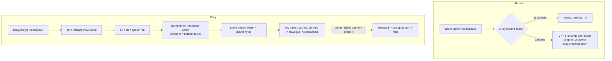

# Barrel Dragging

Barrels (`Assets/Game/Features/Dynamic`) are a **puzzle obstacle** the player can push and
pull. The player presses **C (Interact)** next to a grounded barrel and, while holding C,
drags it. Barrels stack, block movement, and only ever fall **straight down** — they never
receive a horizontal impulse.

This document describes the **kinematic, raycast-driven** model that replaces the original
physics-joint implementation, why it exists, and how each component fits together.

Related files:
- `Assets/Game/Features/Props/Barrel/DraggableBarrel.cs`
- `Assets/Game/Features/Props/Barrel/BarrelMotor.cs`
- `Assets/Game/Features/Props/Barrel/BarrelHighlighter.cs`
- `Assets/Game/Features/Hero/Abilities/DragAbility.cs`
- `Assets/Game/Features/Hero/PlayerController.cs`
- `Assets/Game/Core/Utils/MultiRayCaster.cs`

---

## Behaviour Rules

1. A barrel is a physical obstacle.
2. The player presses **C** next to a barrel and pushes/pulls it while holding **C**.
3. A dragged barrel stops when it meets another obstacle (wall or barrel).
4. **Stacks:** a barrel resting on the dragged barrel is carried too. If the upper barrel
   meets an obstacle it stops; if the lower barrel can still move, it slides out from under
   the upper one and the upper barrel falls. A stack of **3** is too heavy to drag (whether
   it's three in a column or one base with two on top).
5. Barrels fall **only vertically** — no horizontal impulse, ever. This is a puzzle, not a
   physics toy.

---

## Why Not Physics

The original implementation used a **dynamic `Rigidbody2D`** per barrel, a `FixedJoint2D`
to attach the barrel to the player, a second `FixedJoint2D` between stacked barrels, and
friction/force to limit drag speed. Grounding used short downward raycasts. Delegating
motion to the solver while a raycast layer tried to second-guess it produced five issues:

| # | Symptom | Root cause |
|---|---------|-----------|
| 1 | Barrel **hangs on a ledge edge** — raycasts say "airborne" but it doesn't fall. | The solver keeps a corner resting on the ledge; raycasts and solver disagree. |
| 2 | Drag speed is **hard to control** (tuned via friction/mass, not a number). | Speed is an emergent physics property, not a parameter. |
| 3 | **Push-off is unreliable** — sometimes not enough force to slide the lower barrel out from under the upper. | Force-threshold tuning between joint break and friction. |
| 4 | **Joints break** under extra force. | `FixedJoint2D.breakForce` is a tuning knife-edge. |
| 5 | **Joint lost on fall** — pushing a barrel off a 1-block ledge breaks the joint mid-fall, forcing a re-press of C even when it lands within reach. | The drag link is physical, so a fall snaps it. |

All five come from letting the solver own motion. The in-code TODOs in `MultiRayCaster.cs`
and `PlayerController.cs` already point at the fix: go kinematic and move barrels manually.

---

## The Kinematic Model

Each barrel uses a **Kinematic `Rigidbody2D`**. The solver no longer moves it; we do, via
collider casts. Two ownership rules keep it simple:

- **Vertical motion** (gravity / falling) is owned by each barrel's own `BarrelMotor`.
- **Horizontal motion** only happens while dragging, and is owned entirely by the
  `DragAbility` coordinator (the "convoy").

A kinematic body still blocks and supports dynamic bodies, so the player is stopped by an
idle barrel and can stand on top of one — exactly the obstacle behaviour we want, with no
chance of the player accidentally shoving a barrel.

### Grounding & the fall trigger

A barrel is grounded if **any** of its three base rays (left / center / right edge) hit
ground. It falls only when **all three miss** — i.e. its base is fully past the edge. This
matches the original semantics but, because the same system that decides "airborne" is also
the one that moves the barrel, there is no solver left to overrule it: **problem #1 is gone**.

When grounded, a barrel also **settles** — it snaps down to a consistent sub-pixel `SkinWidth`
gap rather than resting anywhere up to a full ray-length above the surface. That residual gap
was what showed as a stray pixel between a fallen barrel and the ground; settling makes the
rest height consistent, and the skin is kept well under a pixel so it renders flush.

**The obstacle mask must include both the ground layer AND the barrel layer**
(`Ground` + `DynamicObjects`). With only `Ground`, a barrel detects the floor but *not*
other barrels, so barrels won't stack — a barrel-only check passes, a stacking check fails.
The mask lives on `BarrelMotor.obstacleMask` (see below).

### `BarrelMotor` (new)

Owns the barrel's vertical motion, the obstacle `LayerMask` (`obstacleMask`, falling back to
`Ground` + `DynamicObjects` by name if unset), and exposes a controlled horizontal step. It
is the barrel's single ground authority — there is no separate `GroundCheckComponent` on the
barrel anymore (the Hero already used a direct `MultiRayCaster`; the barrel now matches that
pattern). `DraggableBarrel` reads the mask via `motor.ObstacleMask`.

- `FixedUpdate`: decide grounded with a **3-ray downward `MultiRayCaster`** (the same
  raycast checker the player uses — `MultiRayCaster.CreateGroundChecker`). Raycasts reliably
  detect a surface a barrel rests flush against; a shape-cast is ambiguous at zero distance,
  which otherwise makes a barrel resting on another barrel — or one pushed flush against
  another — flicker its grounded state. If grounded, vertical velocity is zero. If airborne,
  accumulate fall speed, then `Rigidbody2D.Cast` **down** to find the surface and rest a
  sub-pixel `skinWidth` short of it (never exactly flush), or `MovePosition` down by the full
  step. Shape-casts are kept only for this clearly-above landing snap and for horizontal
  clamping, where zero-distance ambiguity doesn't arise.
- `bool TryStepHorizontal(float dx, params Collider2D[] exclude)`: cast the barrel collider
  horizontally by `dx` (mask = ground + barrel layers, excluding the passed convoy members),
  clamp to the first hit, `MovePosition` by the allowed amount, and return the distance
  actually moved.
- `IsGrounded` passthrough and a flag for "currently falling", so the coordinator knows when
  a dragged barrel is mid-air.

Tuning fields are expressed in intuitive units (`maxFallSpeed` in units/s, and
`timeToMaxFallSpeed` in seconds rather than a raw acceleration), consistent with the
project's tuning-units convention. The fall **sound** is triggered via `OnLanded`, driven by
actual movement; the drag sound is gated on real horizontal movement.

Movement clamping reuses the built-in `Rigidbody2D.Cast` / `Collider2D.Cast` (respects real
collider shape); the binary grounded check reuses `MultiRayCaster`.

### `DraggableBarrel`

Thin identity/state component: exposes `Body`, `Collider`, `IsGrounded`,
`GetDraggablesAbove<T>()` (used to measure stack height), and highlight passthrough. It no
longer contains any joint logic — all the `FixedJoint2D` code, break-force fields, and
reactive-force debug readouts are removed. Vertical motion is delegated to `BarrelMotor`.

---

## Drag Coordination — the Convoy

`DragAbility` is the single owner of horizontal motion during a drag. It keeps the existing
interaction wiring (the `IInteractionProvider` candidate/handle flow, hover highlights,
`CountBarrelsAboveSorted`, the `MaxBarrelsOnTop` weight rule, and the
`interactPoint` / `interactRadius` detection). Only the motion mechanism changed: **no
joints**, a per-`FixedUpdate` lockstep step instead.

### Starting a drag

On Interact, the coordinator builds the convoy:
- `draggedBottom` = the barrel at the interact point.
- `draggedTop` = the single barrel resting on it, if any.
- **3+ barrels** → rejected (too heavy), with the alert highlight (unchanged rule).

It records the horizontal offset between the player's grab point and the bottom barrel.

### Each `FixedUpdate` (motion runs in FixedUpdate to match kinematic `MovePosition`)

1. `dir` = horizontal Interact-move input (`-1 / 0 / +1`).
2. `speed` = `dragSpeedSingle` for one barrel, `dragSpeedStacked` (slower) for two — drag
   speed is now a literal units/sec number (**problem #2 solved**).
3. `dx = dir * speed * Time.fixedDeltaTime`.
4. Clamp `dx` by horizontal casts of **both** the player collider and the bottom barrel
   (each excluding the other convoy members). `allowedDx = min`. If either is blocked, both
   stop — that's the lockstep guarantee.
5. Move the bottom barrel by `allowedDx`; set `playerRb.velocity.x = allowedDx / dt` (the
   player stays a dynamic body so its own gravity keeps working on Y). Because both move by
   the same `allowedDx`, the recorded offset is preserved with no joint.
6. Top barrel: it is carried by stepping it `allowedDx`, clamped by its *own* obstacles. If
   something blocks it, it simply stays put (moves 0) while the bottom slides under it — being
   blocked does **not** detach it. It is released only once the bottom has slid out from under
   it (the bottom's upward stacking check no longer finds it on top), at which point its own
   `BarrelMotor` lets it fall — realizing "push the lower barrel out from under the upper, the
   upper falls" (**problem #3 solved**, with no force tuning). There are no joints to snap
   (**problem #4 solved**).

### Falling barrels & reach (problem #5)

Interact is held the whole time; two rules govern a barrel whose Y changes while held:

1. **While the barrel's Y is changing it cannot be pushed.** Whenever the dragged barrel is
   airborne (falling off an edge, or after a bump) the horizontal step is forced to 0 — it only
   drops straight down (never gets a horizontal impulse) and the player is held still. The drag
   is **kept alive** through this; reach is not judged mid-fall.
2. **Reach is decided only once the barrel has settled (grounded).** When it lands, the
   coordinator checks `IsWithinReach` — the barrel's collider vs `interactPoint` within
   `interactRadius`, the *same* overlap test used to grab:
   - grab point still intersects the barrel → the drag **resumes automatically** (Interact is
     still held), no re-press;
   - it has dropped out of reach (e.g. it fell to the floor while the player stays up on a
     stack) → the drag **stops**.

   The settle (below) stops a held barrel from hopping a pixel, so a tiny bump settles back in
   reach and the drag continues; only a real drop-away ends it.

Because the link is a logical reference (no joint), a barrel that merely dips and stays within
the grab radius keeps being dragged with no re-press. The drag also ends on Interact released,
Jump pressed, or the player leaving the ground.

### Player coupling

The player remains a dynamic `Rigidbody2D` (for gravity and its own wall collisions), but
its **horizontal** movement is suspended while dragging: `PlayerController.CheckHorizontalMovement`
early-returns when `isDragging`, and the coordinator drives `velocity.x` instead. Facing is
already locked toward the barrel by `SetDragMode`. This is the only change to the player
controller and it is fully gated behind `isDragging`; normal movement, jump, and grounding
are untouched.

The drag ends if the player leaves the ground, but with a short **coyote grace**
(`GroundLossGrace`): the barrel colliders are narrower than their sprites, so walking a row of
barrels flickers the player's ground check into the gaps between colliders for a frame or two.
Dropping the drag on that one-frame flicker is what made a pull "suddenly let go" mid-row;
only a sustained loss of footing (the player actually walked off and is falling) ends it.

The player's collider is added to the convoy's cast-exclusion list (`RebuildConvoyColliders`),
so it never blocks the barrel's movement cast. Without this, **pulling** fails: the player
leads the pull and the barrel's cast in the pull direction runs straight into the player
(pushing works because the player trails behind).

The horizontal clamp also leaves a sub-pixel **skin** gap (like the vertical landing): a
barrel stops just short of a wall/barrel rather than exactly flush. This matters because
`Rigidbody2D.Cast` reports a flush/overlapping obstacle at distance 0 in *every* direction —
so a barrel pushed dead-flush against a wall could no longer be pulled away (its
pull-direction cast saw the wall at distance 0). The skin keeps it clear.

---

## How Each Problem Is Solved

| # | Resolution |
|---|-----------|
| 1 | Grounded-state and motion are one system; all-rays-miss ⇒ we move it down. No solver to overrule the raycasts. |
| 2 | Speed is a units/sec Inspector value (`dragSpeedSingle` / `dragSpeedStacked`). |
| 3 | Per-barrel cast: top blocked ⇒ left behind ⇒ falls; bottom continues. No force threshold. |
| 4 | There are no joints. |
| 5 | The drag link is a reference, not a joint: a falling barrel can't be pushed (horizontal step = 0) and the drag drops as soon as the grab point no longer overlaps the barrel. |

---

## Editor Setup

Both barrel prefabs use `DraggableBarrel` and must be migrated in the **Inspector** (not by
hand-editing prefab YAML):

- `Assets/Game/Features/Props/Barrel/Barrel.prefab`
- `Assets/Game/Features/Props/Barrel/BarrelDestructable.prefab`

For each:
1. `Rigidbody2D` **Body Type = Kinematic**. The old `Freeze Position X` constraint is no
   longer used (the solver doesn't move a kinematic body) and can be cleared.
2. On **`BarrelMotor`**, set **`Obstacle Mask` = Ground + DynamicObjects**. This is the most
   important step: with only `Ground`, barrels detect the floor but not each other and won't
   stack. (If left empty the code falls back to those two layers by name.) Tune
   `Max Fall Speed` / `Time To Max Fall Speed` if desired.
3. **Remove the `GroundCheckComponent`** — the barrel no longer uses it (the mask moved to
   `BarrelMotor`, which now owns grounding). `DraggableBarrel` no longer requires it, so Unity
   won't re-add it.
4. The legacy thin **top capsule collider** is no longer needed and can be **deleted** — the
   code is capsule-agnostic (`BodyColliders` is gathered via `GetComponents<Collider2D>()`).
   If rounded corners are still wanted, prefer the `BoxCollider2D` **Edge Radius** (it enlarges
   the collider on all sides, so compensate the box size). Keep the layer (11), the
   `BarrelHighlighter`, and the save components.

On the Hero (`DragAbility`), set **`Drag Speed Single`** (default 3 units/s) and **`Drag
Speed Stacked`** (default 2 units/s). These replace the old unused `dragSpeedMultiplier`,
whose serialized value is dropped automatically.

---

## Notes & Risks

- A kinematic barrel still blocks and supports the dynamic player — verify the player can
  stand on a barrel and is stopped by an idle one.
- Save components (`StateRoot` tier, transform/destruction savers) are unaffected by body
  type. See [state-saving.md](state-saving.md).
- Interpolation is already off project-wide (required for raycast accuracy), so `MovePosition`
  on barrels introduces no sub-pixel wobble — pixel-perfect presentation is preserved.