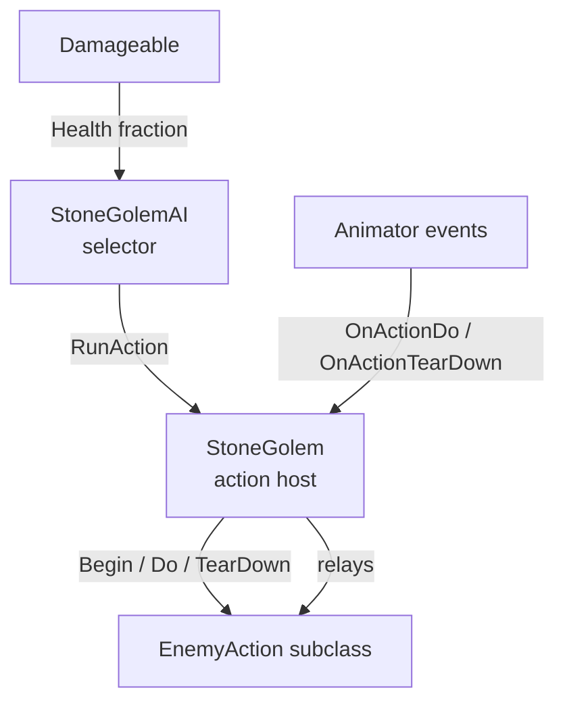
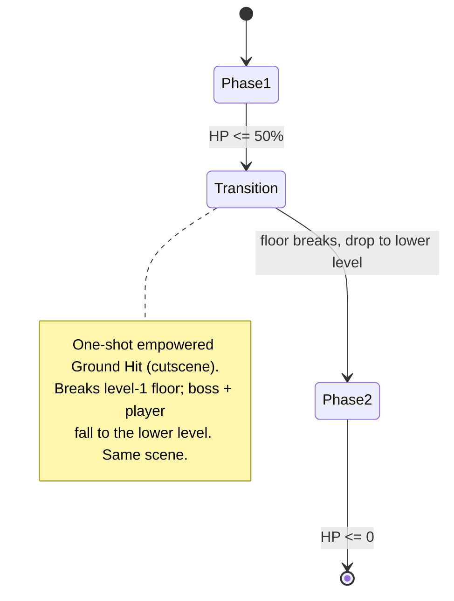

# Stone Golem Boss

Design and requirements doc for the Stone Golem — a two-phase boss fought in a single room
that breaks apart partway through the fight. This document is the bridge between the rough
draft (`docs/drafts/boss-golem.md`) and implementation: it records what is decided, what is
built, and **every value still needed**. Open values are tagged **`NEEDS-INPUT`**; the boss
is not done until those are filled and the marked sections implemented.

Code lives under `Assets/Game/Features/Bosses/StoneGolem/`. The boss reuses the same action /
selector architecture as the existing actions and mirrors the phase pattern of the
`VengefulSpirit` boss (`Assets/Game/Features/Bosses/VengefulSpirit/`).

---

## Design Pillars

- **Two phases, one room.** The fight starts on the upper level (level 1, with two stone
  platforms on level 2). At 50% HP the golem smashes the floor and everyone drops to a lower
  level for phase 2.
- **Fairness — the player always gets openings.** Every attack ends in a recovery window where
  the golem is idle/vulnerable, and several attacks (hand, melee) deliberately leave the golem
  exposed. This is the core reason the draft exists: never trap the player with no chance to hit.
- **Readable telegraphs.** Each attack has a windup the player can react to before damage lands.

---

## Architecture (reused, not new)



- **`EnemyAction`** (`_Shared/EnemyAction.cs`) — four-step lifecycle (Begin → Do → TearDown →
  Complete) with a `maxDuration` safety cap. Every attack is a subclass component.
- **`StoneGolem`** (`StoneGolem.cs`) — action host: owns the action components, runs one at a
  time, relays animation events, exposes locomotion (`MoveTowards`, `FaceTowards`, `StopMoving`).
- **`StoneGolemAI`** (`StoneGolemAI.cs`) — selector: on a cadence picks the next action by range
  / conditions. Will grow a **phase** concept (see below), modeled on `VengefulSpiritAI`.
- **`Damageable`** (`Core/Components/Damage/Damageable.cs`) — HP, `OnHealthChanged`,
  `IsHitThisFrame`. Source of both the phase trigger and the reactive-melee signal.

### Reuse map

| Need | Reuse | Location |
|---|---|---|
| Phase transition at HP fraction | `VengefulSpiritAI.UpdatePhase` pattern | `VengefulSpirit/VengefulSpiritAI.cs:183` |
| "Player just hit the boss" signal | `Damageable.IsHitThisFrame` | `Core/Components/Damage/Damageable.cs` |
| Smooth fly between platform points | `G.Tween` (TweenService) | `G.cs` |
| Phase-2 grapple anchors | `GrapplingHookAnchor` | `Hero/GrapplingHook/` |
| Boss health bar engage | `G.BossFight` (BossFightService) | `G.cs` |
| Breakable platforms / destruction | `DestructionStateSaver` | see `docs/system/state-saving.md` |
| Player reference | `G.Hero.Controller.transform` | `G.cs` |

---

## Attack Roster

| # | Attack | Phase | Status | Player counter-play |
|---|---|---|---|---|
| 1 | Melee (reactive counter) | 1 + 2 | **rework in progress** | back off / jump during cooldown, hit back |
| 2 | Flying hand | 1 + 2 | **rework in progress** | dodge the homing hand, rush in while it's away |
| 3 | Laser beam | 1 + 2 | **rework in progress** | run from the sweep, close in after it stops |
| 4 | Ground hit | 1 + 2 | **action built** (slam + stones); AI select/positioning deferred | avoid slam + falling stones |
| 5 | Empowered ground hit (transition cutscene) | 1→2 | **built** (wire breakObjects + breakPoint) | scripted; survive the drop |
| 6 | Laser cross | 2 | **built** (wire center point + beam prefab) | run, hook over the rotating beams |
| 7 | Stone wave | 2 | **built** (wire spike prefab + ground mask) | jump/hook over the spike waves |

---

## Phase System



- **Trigger:** poll `Damageable.Health / maxHealth`; cross **0.5** once (`phaseShiftDone` latch),
  exactly like `VengefulSpiritAI`. Wait for the current action to finish (`WaitWhile IsBusy`),
  then run the transition cutscene, then enter phase 2.
- **Transition is a scripted cutscene** (attack #5): the golem performs an empowered Ground Hit
  that breaks the **level-1 floor**; the golem and the player **fall to the lower level** of the
  same room. This empowered variant is used **only** for the transition (never rolled by the AI).
- **Phase 1 pool:** Melee, Flying hand, Laser beam, Ground hit.
- **Phase 2 pool:** all of phase 1 **+ Laser cross + Stone wave**.
- `NEEDS-INPUT`: whether **Ground hit** stays in the phase-2 pool (draft ties it to "phases with
  obstacles" — the lower level may have none). Default assumption: **dropped in phase 2.**.
   INPUT: yes, **Ground hit** stays. Phase 2 room will have just one level, no platforms above, so ground
   hit will be actual and more dangerous. 
- `NEEDS-INPUT`: per-phase cadence (phase 1 / phase 2 seconds between picks). Default `1.5 / 1.0`. INPUT: yes,
   let's start with this values.
- `NEEDS-INPUT`: cutscene specifics — is the lower level pre-built in the scene below the start
  room? camera move during the drop? is player control locked during the cutscene? does
  `G.BossFight` stay engaged across the transition?
   INPUT: yes. the second room is prebuild and just below the first room. camera won't show it as we'll use
   camera confiner. When the floor is broken, player will fall to the lower level, I'll switch to confiner of
   larger size and camera will properly show lover level. during drop player control will be locked.

---

## Arena & Movement (Phase 1)

Phase 1 is the upper area: ground **level 1** plus two stone **platforms (level 2)**.

- **Landing / action points:** draft specifies **3 points on level 1** (ground-hit + takeoff
  spots) and **4 points on level 2** (2 per platform). `NEEDS-INPUT`: how these are authored —
  proposal is a small **`GolemAnchorPoint` marker component** placed on empty Transforms in the
  scene, collected by the AI (mirrors how `GrapplingHookAnchor` markers are placed). Confirm, and
  provide point positions or place the markers in-scene. INPUT: yes, this will be empty object with marker
  component. Similar way as it's done for Skeleton boss fight.
- **"Flying / jumping" between levels:** the golem moves to a takeoff point and rises/descends
  smoothly "by magic," not a physics jump. Proposal: drive position with **`G.Tween`** on an eased
  arc. `NEEDS-INPUT`: arc duration, easing, arc height; whether gravity/`Rigidbody2D` is disabled
  during the flight. INPUT: yes, if necessary, we can disable gravity. and yes, we can use tween. let's use 2
  seconds duration of moving between level 1 and 2.
- **Ground locomotion** within a level stays the existing `MoveTowards` walk (`moveSpeed`,
  currently 4).
- **IMPLEMENTED:** `StoneGolemAnchorPoint` marker (Level1/Level2 + gizmo) placed in-scene and wired
  into `StoneGolemAI.anchors[]`. `StoneGolem.FlyTo` (gravity off → `MoveTo` → gravity on) does the
  level change. The AI (rewritten to weighted per-phase pools) positions before each attack: match
  the player's level for Melee/Hand/Beam (fly up/down to the nearest anchor on that level; melee also
  chases), fly to the nearest **Level1** anchor for Ground Hit (slam is level-1 only); Laser Cross /
  Stone Wave self-position. Player/golem level = Y vs the lowest Level2 anchor (no Level2 anchors →
  everything is level 1, e.g. phase 2). See the wiring checklist for setup.

---

## Attack Specs

Conventions: timings are seconds; tuning fields are Inspector-exposed and expressed as
**seconds-to-effect** where applicable (`speedBuildUpTime`, not an acceleration rate). `NEEDS-INPUT`
marks an unset value; the listed number after it is the proposed default I will use for tuning the
three reworked actions unless overwritten.

### Shared fairness / pacing
- Boss max HP — `Damageable.maxHealth` — `NEEDS-INPUT`. INPUT: 100. 
- Player hits-to-kill / target fight length — `NEEDS-INPUT`. INPUT: what does it mean? fight length ideally 3-5 minutes.
- Per-attack damage to player & knockback — `NEEDS-INPUT` per attack below. INPUT: for not each attack deals 1 damage.
  all attacks do knockback.
- **Post-attack opening:** after each attack the golem stays idle/vulnerable for a recovery
  window. `NEEDS-INPUT` (default ~0.8–1.2 s). INPUT: yes. let's start from 0.8-1.2s, then I'll tune it after playtesting.
  **RESOLVED:** no separate coded idle window. Openings come from the cadence gap, the hand-away
  vulnerability, and each attack's animation recovery frames (cadence + animation).

### 1. Melee — reactive counter `(rework)`
Boss swings only **in response to the player attacking it at close range**, gated by a cooldown
so the player always has a safe window.

- **Trigger:** `Damageable.IsHitThisFrame` **AND** the player overlaps the golem's `meleeTriggerArea`
  collider **AND** melee off cooldown. `NEEDS-INPUT`: confirm "player attacking" == "boss took a hit
  this frame". INPUT: yes.
- Range-picked melee is **kept** as a pool attack: when chosen the golem moves toward the player and
  swings once the player enters the trigger area.
- **Pursuit (`PursuePlayer`) re-plans while chasing.** Rather than committing to one route, the melee
  pursuit recomputes the destination from the player's **live** position at every node arrival and on
  a short `repathInterval`, so it follows the player to a new platform instead of landing where the
  player started. It steers straight at the player while on the same walkable segment (path is all
  Move edges) and only consults the graph — walk to takeoff + parabolic Jump / HorzJump — to cross
  between segments. Hand / Beam still do a single `TravelToPlayerLevel` graph hop (they're ranged).
  See "Golem level 1 movement graph" below.
- **Reach is decided by the `MeleeTriggerArea` collider, not a distance field** (per the latest
  change): the golem faces the player, then tests `meleeTriggerArea.Distance(playerCollider).isOverlapped`
  (`Physics2D.SyncTransforms()` first, since the trigger flips with facing and 2D physics does not
  auto-sync). This drives both the reactive counter and the chase stop, replacing the old
  `reactiveRange` / `meleeRange`. Size/offset the box for the desired reach.
- Tunables: windup/telegraph (def 0.3 s), cooldown = the guaranteed opening (def 1.5 s),
  recovery (def 1.0 s), damage, knockback — all `NEEDS-INPUT`. INPUT: there's animation
  and damage window is opened closed to the end, so no need to add recovery and wind up. animation will be started and this is the telegraph.
  **RESOLVED:** no windup/recovery fields (the clip is the telegraph; the damage window is
  driven by `OnActionDo`/`OnActionTearDown` animation events). One **shared `meleeCooldown` (def
  1.5 s)** gates BOTH the reactive counter and the pool-picked melee, so the player always gets a
  guaranteed safe window.
- Files: `Actions/StoneGolemMeleeAction.cs`, `StoneGolemAI.cs`.

### 2. Flying hand — homing + return `(rework)`
The golem launches its hand; it accelerates toward the player with a **capped turn rate** (so it
is dodgeable), embeds on impact, then flies back. **While the hand is away the golem is idle and
vulnerable** — the player's main melee opening.

- Launch: `initialSpeed`, `speedBuildUpTime` (seconds-to-max), `maxSpeed` — `NEEDS-INPUT`. INPUT: let it be 15, should be configurable.
- `turnRateDegPerSec` (def 120) — `NEEDS-INPUT`. INPUT: it should be small, so it turns slowly, otherwise it will always hit the player.
- Homing target: player current position (no lead) — `NEEDS-INPUT` confirm. INPUT: you know, let's simplify it. no homing for the first vertsion.
  Right before hand launch (ShootHand method), we should detect player position and this will be the target point.
  Also note that this action should be selected only if player is in sight at the moment, otherwise boss will look silly.
- On ground/wall hit: stop, embed for `returnDelay` (def 1–2 s), return to the hand socket at
  `returnSpeed`. Damages on the return leg? — `NEEDS-INPUT`. INPUT: yes.
  **RESOLVED:** if it reaches the captured point / open air without hitting ground or wall, it
  keeps flying in the launch direction until it hits ground/wall **or** travels `maxRange`, then
  embeds & returns. `returnDelay` def 1.5 s, `returnSpeed` def 15, `maxRange` tunable. Damages on
  both the outgoing and return legs.
- Boss vulnerable/idle until the hand returns — confirm. INPUT: yes, vulnerable.
- Trigger band ("medium range"): `handMinRange`–`handMaxRange` (def 4–10) — `NEEDS-INPUT`. INPUT: there's a
  HandShootArea collider in child object. 
- damage, knockback — `NEEDS-INPUT`. INPUT: yes.
- Files: `StoneGolemProjectile.cs`, `Actions/StoneGolemProjectileShootAction.cs`.

### 3. Laser beam — aim-ahead + sweep `(rework)`
Fires from any distance. The beam first points **slightly ahead of** the player, then **sweeps
toward** the player over ~2 s and **holds**, so the player can run out of it and then close in.

- **RESOLVED — simplified, no player tracking.** The beam does not aim at the player. It fires in
  the golem's **facing** direction and sweeps a **fixed arc**: it starts aimed `startAngleDeg`
  **45° below** horizontal and rotates up by `sweepArcDeg` **90°** (ending 45° above horizontal)
  over `sweepTime`, then holds. All three (`startAngleDeg` = -45, `sweepArcDeg` = 90, `sweepTime`
  = 2 s) are configurable. The golem faces the player at fire time, so the arc covers the ground
  in front and rises; the player runs out from under it and closes in once it has swept up.
- `sweepTime` (def 2 s), hold/finish duration — `NEEDS-INPUT`. INPUT: yes, configurable.
- Telegraph before damaging (the "start" clip) — def 0.5 s, `NEEDS-INPUT`. INPUT: animation is the telegraph. boss will stand, start animation, then laser starts animation and then fires - it takes about a second, so no extra telegraph needed.
- Damage model: continuous, tick every `NEEDS-INPUT` s for `NEEDS-INPUT` damage. INPUT: continuous, no special case, as player has invincibility frames after hit.
- `collideWithGround` (existing bool): phase-1 beam **clips to ground** (default true) —
  `NEEDS-INPUT` confirm. INPUT: yes. let's try with ground collision.
- Cleanup: remove leftover `Debug.Log` in `StoneGolemBeam.FixedUpdate`/`OnAnimFrame`.
- Files: `Beam/StoneGolemBeam.cs`, `Actions/StoneGolem(Beam|Projectile)ShootAction.cs`.

> Code note: there appear to be two beam paths (`StoneGolemBeamShootAction` and a shared
> `StoneGolemProjectileShootAction` instance), and the prefab `beamShoot` slot was reported
> unwired. Standardize on one driver and confirm wiring before tuning. INPUT: StoneGolemBeamShootAction is the primary action,
> StoneGolemProjectileShootAction is from initial implementation and not it's responsible for hand projectile.

### 4. Ground hit `(not built)`
Golem balls into a stone, hammer-slams the ground; stones fall from above. In phase 1 it can
break stone platforms.

- `NEEDS-INPUT`: ball-up/telegraph time, slam timing, falling-stone pattern (count, spread,
  spawn height, fall speed), slam damage + falling-stone damage, knockback. INPUT: ball up time is 1 sec, animation should end
  by that time (isImmune = true anim trigger).
- `NEEDS-INPUT`: which platforms are breakable and whether breaking reuses `DestructionStateSaver`. INPUT: no state saving.
  for simplicity let's make only level 1 floor breakable, but only during phase 2 transition. if needed, level 2 breakable will implement later.
  no state saving, so if player dies, scene is reloaded, player is respawned at same position and boss fight continues.
- `NEEDS-INPUT`: which animations/sprites exist vs. must be authored. INPUT: Immune animation clip. it's triggered by
  isImmune bool = true. returns to idle when isImmune = false. in immune state, golem performs slam and is still vulnerable to player attacks.
  (Superseded: ball form now always goes through `StoneGolem.SetImmune`, which swaps to the small ball
  collider — "immune" is just the animation asset's name. See "Slam primitive & ball state" below.)
- **OPEN — still needed to build Ground Hit (the INPUT above only covered ball-up time):**
  - Falling stones: count per slam, horizontal spread/area, spawn height, fall speed. ANSWER: let it be
     configurable we'll start with 5 stones, horizontal spread - full width of the room (we can put an object -
     spawn area or something - your advice needed here, it will also define where there will be spawned.
     fall speed - follow physics. if necessary, I'll tune gravity. 
  - Does the *regular* (non-transition) Ground Hit spawn falling stones, or is it slam-only? ANSWER: vice versa.
    regular slam transitions stones, transition slam - not.
  - Slam: confirm damage = 1; is there an AoE/shockwave at the impact point, or do only the falling
    stones threaten the player? ANSWER: no AoE, only stones.
  - On player death (no state-saving), does the whole fight reset (boss → 100 HP, phase 1)? ANSWER: yes. player
    will respawn before the boss entrance at a bonfire (not added yet).
  - Falling-stone sprite/prefab — does one exist already, or must it be authored? ANSWER:
    use `Assets/Game/Features/Bosses/StoneGolem/Stones/FallingStone.prefab`
- **IMPLEMENTED (action mechanic):** `Actions/StoneGolemGroundHitAction.cs` runs a timer-driven
  coroutine — `golem.SetImmune(true)` (ball form, small collider) → collapse (`collapseTime`) →
  `slamCount` (default 3) cycles of raise (`raiseHeight`/`raiseTime`, ease-out "float up") → hang →
  physics slam (`golem.SlamToGround(slamSettings)` — see "Slam primitive & ball state") → stones
  raining concurrently with the next raise → recover → `golem.SetImmune(false)` → complete, so the
  whole maneuver reads as one big action. The action's `maxDuration` must cover all cycles.
  Vertical raise uses the host helpers `StoneGolem.SetGravityActive` + `MoveByVertical`.
  `Stones/FallingStone.cs` gives the stone physics-fall cleanup (despawn on ground/lifetime).
  `spawnArea` is a **room/scene collider**, not a golem child.
  Deferred: AI selection + moving to a level-1 point (arena step).

### 5. Empowered ground hit — transition cutscene `(not built)`
One-shot, scripted at 50% HP (see Phase System). Breaks the level-1 floor; boss + player drop to
the lower level. Not part of the AI pool.

- `NEEDS-INPUT`: full cutscene spec (see Phase System open items) — floor-break visuals, drop
  choreography, camera, control lock, landing, re-engage. INPUT: animation clip is the same as for Ground Hit.
  Golem goes to the closes point on level 1, then IsImmune = true, then raises above the floor to the upper part
  of the screen, but still visible, then starts increasingly shaking, 3 sec, then raises a bit higher again, dramatic
  pause 1 sec and then furiously goes down to the floor, smashes it, froor is destroyed (not implemented yet) and
  player falls down. All platforms are destroyed, so player has no place to run. there's a hook anchor in phase 1,
  and it also will be destroyed, so player falls down in any case.
- **OPEN — still needed to build the cutscene:**
  - How are the destroyed objects referenced? The cutscene needs the level-1 floor object(s), the
    two platforms, and the phase-1 hook anchor. Will you wire these as references on the cutscene
    action, or should it find them at runtime (e.g. by tag/layer)? ANSWER: I'll make them either as game object
    which mimic ground tiles, or a separate layer of tilemap, which will disappear and particles created where
     solid tiles were - what's the more logical, preferred approach?
  - "Floor is destroyed (not implemented yet)" — destroying it = disabling the collider + hiding the
    sprite (a SetActive(false) on the floor object), or a fancier break-apart effect? ANSWER: currently something
    very simple - disable it, then show some spawned affect in place of it. 
  - Raise/shake/drop motion: driven by `G.Tween` like the level-1↔2 flight? Confirm the upper "still
    visible" height is just a tween target you'll place/tune. ANSWER: yes
- **IMPLEMENTED:** `Actions/StoneGolemGroundBreakAction.cs` — one-shot, wired into
  `StoneGolemAI.phaseTransitionAction` (runs automatically at 50% HP). Timeline: walk to `breakPoint`
  (`golem.WalkTo` — ramped velocity like the hero, no ground lerp)
  → collapse (`golem.SetImmune(true)`) → raise → growing `ShakeHorizontal` (3 s) → extra lift →
  pause → physics slam onto the still-intact floor (`golem.SlamToGround(slamSettings)`, tuned with
  a bigger gravity scale for a more furious fall; impact fires the action's shake/sound) → disable
  `breakObjects[]` (floor tilemap layer + platforms + hook anchor, `SetActive(false)`) + spawn
  `breakEffectPrefab` debris → lock player control (`G.Hero.Controller.SetControlsEnabled`) → golem
  gravity restored so it falls too → unlock after `dropLockTime`. Motion reuses the host
  `SetGravityActive`/`MoveTo`/`MoveByVertical`/`ShakeHorizontal` helpers. Floor destruction is
  `SetActive(false)` + debris (chosen: separate Tilemap layer). Camera confiner swap stays in-scene.

### 6. Laser cross `(not built, phase 2)`
Golem flies to room center, fires 4 beams at 90°, they rotate, stop after 180°, golem returns.

- `NEEDS-INPUT`: fly-to-center timing, beam length, rotation speed, rotation total (confirm 180°),
  damage model, return timing. Likely reuses `StoneGolemBeam` (with `collideWithGround` off).
  INPUT: make all timings configurable. beam length = 20, but it will collide ground. rotation speed - 30 degrees per second, configurable.
  total rotation = 180 degrees, configurable. damage model - continuous. after beams stop and finish, golem stands for 1 second in place,
  then flies down within 2 seconds. yes, reuse StoneGolemBeam, 4 instances, just rotathe them accordingly.
- **IMPLEMENTED:** `Actions/StoneGolemLaserCrossAction.cs` — fly to `centerPoint` → spawn `beamCount`
  (4) `StoneGolemBeam` under a world pivot via the new `StoneGolemBeam.SetManagedAim` (externally-aimed
  mode, no self-sweep) → rotate the pivot `totalRotationDeg` (180) at `rotationSpeed` (30°/s) → beams
  finish → hold `standAfterTime` → fly back to start. Reuses the single beam prefab. ⚠️ set the
  action's `maxDuration` high enough (≈12 s) or 0, since the maneuver is long. `laserCross` slot added
  to `ActionRefs`. AI selection deferred to the per-phase-pool step.

### 7. Stone wave `(not built, phase 2)`
Golem glows several seconds; spikes rise from the ground in traveling waves.

- `NEEDS-INPUT`: glow/telegraph duration, wave count, spacing, travel speed, spike damage,
  spike up/down timing, knockback. INPUT: 
  glow duration = 2 seconds, wave count = 3, spacing = 1 second, travel speed = 5 units per second,
  spike damage = 1, spike up/down timing = 1 second (will be pixel animation), knockback as usual.
- **OPEN — still needed to build Stone Wave:**
  - Wave origin/direction: spikes emanate from the golem outward in BOTH directions at once, or a
    single front sweeping across the room from one side? ANSWER: both directions.
  - Spike spatial interval: how far apart along the ground are consecutive spikes as the front travels
    (e.g. one every 1 unit)? ANSWER: until they collide walls (Ground tilemap).
  - Is the golem standing still and vulnerable while glowing (the telegraph)? ANSWER: yes. stands still,
    flashes and vulterable.
  - Spike prefab: none exists with a rise/retract animation (only static `Hazards/Spikes.prefab` /
    `WoodSpike`). Will you author a `Spike` prefab (sprite + up/down anim + `Damager` + auto-despawn),
    like `FallingStone`? Path? ANSWER: I've added StoneSpikes prefab
  - Spikes rise at the golem's ground Y (phase-2 room is one flat level) — correct? ANSWER: yes. maybe slightly
    aside from golem just not to overlap with spikes. 
- **IMPLEMENTED:** `Actions/StoneGolemStoneWaveAction.cs` — golem stands still + glows (`glowDuration`
  2 s, vulnerable) → emits `waveCount` (3) waves `waveSpacing` (1 s) apart. Each wave sends two fronts
  out from the golem (both directions): a `spikePrefab` (StoneSpikes) every `spikeSpacing` (1) starting
  `spikeStartOffset` from the golem, advancing at `travelSpeed` (5 u/s), until a Ground-layer raycast
  hits a wall. Spikes rise at the probed ground Y and self-animate/despawn. `stoneWave` slot added to
  `ActionRefs`. ⚠️ Set the StoneSpikes animator to **destroy-on-complete** so spent spikes clean up.
  AI selection deferred to the per-phase-pool step.

---

## Engagement & Intro

- `NEEDS-INPUT`: does the golem need an intro cutscene (model: `VengefulSpirit/BossIntroCutscene`)
  and at what moment does `G.BossFight` engage the health bar? Yes. it will be behind stone wall (just an object),
  when user picks up fake skull, stone wall will be destroyed and golem will become seen in Immune state. then
  it exits immune state and fight starts.
- **IMPLEMENTED (simplified — offscreen drop-in, no wall):** `StoneGolemIntro` holds the golem
  offscreen in the ball state (set by `StoneGolem.Awake`, gravity zeroed) with `StoneGolemAI`
  disabled. The fake-skull pickup's UnityEvent calls `Begin()`, which slams the golem down onto the
  arena floor (`golem.SlamToGround(slamSettings)`), holds `revealHold`, engages
  `G.BossFight.EngageBoss(golem.Damageable)`, calls `golem.SetImmune(false)` (un-ball rise), and
  enables the AI. Replays blocked. Modelled on `VengefulSpirit/BossIntroCutscene`.

## Slam primitive & ball state

The slam is a controller-level atomic capability, not action logic: `StoneGolem.SlamToGround(SlamSettings)`
free-falls the balled golem (gravity scale from the settings) until a `Ground`-layer collision, then
fires the per-call impact effects (camera shake + `AudioCue`), with a hard timeout so a missed
collision can never soft-lock a cutscene. Three callers share it — the intro drop,
`StoneGolemGroundHitAction`, and `StoneGolemGroundBreakAction` — each holding its own serialized
`SlamSettings` (speed / shake / sound), following the rule "atomic body capabilities on the host,
tactical tuning on the pattern".

Ball state is owned by `StoneGolem.SetImmune` ("immune" is just the animation asset's name):
- **Ball up** applies immediately: `isImmune` anim bool, small ball collider on, gravity zeroed.
- **Un-ball** is animation-driven: the golem first lifts (`unballLiftTime`) by a computed delta so
  the taller normal collider clears the ground, then swaps colliders + restores gravity when the
  un-ball clip fires the `OnUnballFinished` animation event (with `unballEventTimeout` as a
  fallback so a missing event can't leave it stuck on the ball collider).

---

## Open Items Checklist

**Resolved (ready to build):**
- [x] Boss max HP (100), per-attack damage (1) + knockback (all), cadence (1.5 / 1.0)
- [x] Post-attack opening: rely on cadence + animation (no coded window)
- [x] Melee: reactive (hit-this-frame + range + cooldown) **and** range-picked; shared 1.5 s cooldown; no windup/recovery fields
- [x] Hand: speed 15, no homing (capture target at launch), fly-on to ground/wall/maxRange, return-leg damages, `HandShootArea` gates selection, boss vulnerable while away
- [x] Beam: fixed `-45°→+45°` 90° sweep in facing dir over sweepTime, hold, continuous damage (player i-frames), ground-clip on, driver = `StoneGolemBeamShootAction`
- [x] Phase: cadence 1.5/1.0; Ground hit stays in phase 2
- [x] Transition cutscene choreography + confiner-swap/control-lock approach
- [x] Arena anchors (Skeleton-boss-style markers); fly tween 2 s, gravity-off ok

**Still open (later phases, NOT blocking the 3-action tuning):**
- [ ] Hand: `returnDelay`/`returnSpeed`/`maxRange` final values (using 1.5 s / 15 / tunable)
- [ ] Beam: hold-after-sweep duration value
- [ ] Player death + no state-saving: does the whole fight reset (boss → 100 HP / phase 1)?
- [ ] Ground hit: falling-stone pattern (count, spread, spawn height, fall speed); does the regular ground hit spawn stones?
- [ ] Transition: scene references for level-1 floor object(s), the two platforms, phase-1 hook anchor
- [ ] Laser cross: fly-to-center duration; "room center" anchor; rotation direction
- [ ] Stone wave: wave direction/origin; spike spatial spacing; golem still+vulnerable while glowing?
- [ ] Intro: exact `G.BossFight` engage moment; skull pickup trigger (existing or new?)
- [ ] Player melee damage-per-hit (to sanity-check the 3–5 min fight target)
- [ ] Which animations/sprites already exist for attacks #4–#7

---

## Implementation Order (suggested)

1. ✅ **Tune the 3 reworked actions** (Melee/Hand/Beam) — Part A. Done.
2. ✅ **Phase scaffold** in `StoneGolemAI`: `StoneGolemPhase` enum, 50%-HP latched trigger, per-phase
   cadence (`phase1Cadence`/`phase2Cadence`), and a serialized `phaseTransitionAction` hook that runs
   once on the boundary (empty until the cutscene exists). Selection stays condition-based — per-phase
   **pools** are deferred until the phase-2 attacks exist (they'd be identical today).
3. ✅ Build **Ground hit** + the **transition cutscene** (wired into `phaseTransitionAction`). Done.
4. ✅ Build phase-2 attacks: **Laser cross**, **Stone wave**. Done.
5. ✅ **Arena anchors + fly movement** + AI rewrite to weighted per-phase pools with level-matching
   positioning (`StoneGolemAnchorPoint`, `StoneGolem.FlyTo`). Done.
6. ✅ **Intro / BossFight engagement** (`StoneGolemIntro`). Done — boss is feature-complete; the rest
   is wiring + playtest tuning.

## Golem level 1 movement graph:

allowed graph of movements between point: consider we have points (nodes of graph, enumerated from left to right):
level 1: p1.1, p1.2 and p1.3
level 2: p2.1, p2.2 - both on left platform, p2.3, p2.4 - both on right platform.

between points there are several types of movements:
* move - just horizontal movement, no tween needed.
* jump - parabolic jump from lower point to higher, or from higher to lower. remove all tweens.
* horzJump - not high horizontal parabolic jump between points on the same level 2.

allowed movements (graph edges) - in general golem may move freely between points which on graph have "move" edge.
it may move or even stop between such points. but as already pointed, there are special Actions, which require
golem to move to specific point and perform action. in this case specific path should be built and followed. for example,
if golem wants to get from p1.1 to p2.4, there are cases: p1.1 -move-> p1.2 -jump-> p2.3 -move-> p2.4 - this is
the most optimal path (you may use A* algorithm or something simlper). direct movement between points which does
not have direct single edge are prohibited. for example, p1.1 -move-> p2.4 is not allowed - a path should be found.

nodes (format: `<movement type>:<destination node>`):

```
p1.1 -> move:p1.2, jump:p2.1
p1.2 -> move:p1.1, move:p1.3, jump:p2.2, jump:p2.3
p1.3 -> move:p1.2, jump:p2.4
p2.1 -> jump:p1.1, move:p2.2
p2.2 -> move:p2.1, jump:p1.2, horzJump:p2.3
p2.3 -> move:p2.4, jump:p1.2, horzJump:p2.2
p2.4 -> move:p2.3, jump:p1.3 
```

no tweens needed for general move. also jump should also look natural, probably with easing - start slow,
   then accelerate and decelerate at the end - to make feeling of heavy golem trying to fly (golem has no legs 
   and moves using some magic levitaton).

### IMPLEMENTED — navigation graph

The graph above drives all anchor repositioning (Melee, Hand, Beam, Ground Hit). No more direct
diagonal flies — the golem follows authored edges.

- **Edges are authored per-anchor.** `StoneGolemAnchorPoint` carries a `connections[]` of
  `{ target, type }` (`StoneGolemMovementType` = `Move` / `Jump` / `HorzJump`). Edges are
  **undirected** — the graph auto-mirrors each link, so wire each one once. Gizmos draw them in
  scene (white = move, green = jump, cyan = horzJump).
- **Pathfinding:** `StoneGolemNavGraph` (built once in `StoneGolemAI.Awake` from `anchors[]`) runs
  **Dijkstra** weighted by world distance. `FindPath(from, to)` returns the typed step list; the
  example `p1.1 → p1.2 → p2.3 → p2.4` is the shortest route it yields.
- **Execution** (`StoneGolemAI.ExecuteStep`): start node = the anchor nearest the golem **on its own
  level** (not the nearest of any level — under a platform a level-2 anchor can be closer in 2D and
  would route a bogus straight-up jump). Each edge is `Move` → constant-speed walk (`WalkTo`, no
  tween), `Jump` → `StoneGolem.JumpTo` with the cross-level arc, `HorzJump` → `JumpTo` with the low
  gap arc. `JumpTo` is eased in/out (`Mathf.SmoothStep`) for the heavy-levitation feel. If no route
  exists (graph not wired between the two nodes) it falls back to a direct `FlyTo` + warning.
- **One-shot vs. replanning:** `TravelTo(dest)` runs a fixed route to a chosen anchor (Ground Hit,
  Hand / Beam level match). `PursuePlayer` (melee) re-plans every node / `repathInterval` against the
  player's live position — see the Melee attack spec.
- **Tuning** (`StoneGolemAI`): `jumpDuration` / `jumpArcHeight` (cross-level), `horzJumpDuration` /
  `horzJumpArcHeight` (gap hop), `anchorArriveThreshold`, `moveEdgeTimeout`.
- Level matching (which level the player is on) is unchanged and orthogonal to topology; the graph
  only decides *how* the golem gets to the chosen destination anchor.


## General scene direction

1. Player enters the scene from EntranceUpper. May rest at bonfire to respawn at this point.
2. Player turns Helm_1, StoneDoor_Boss is opened (door state persisted), player enters scene.
3. Playert picks up SkullFake, it triggers boss-fight. Boss drops down and AI activates (make sure
   that boss gravity and AI is disabled before SkullFake is picked).
4. After boss loses 50% of health, phase 2 transition starts: boss starts animation to break floor, floor breaks, boss
   and player fall down, when floor is destroyed, confiner is changed to `CameraConfinerBig`.
   (not persisted. if players dies on any phase, fight restarts from the beginning). 
5. After boss is defeated, StoneDoor_Sanctuary opens (persisted). Boss death is also should be persisted. Confiner switches to `CameraConfinerFinal`. 
6. Player enters sanctuary and picks up GoldenSkull, it triggers opening of StoneDoor_Exit (persisted).
7. players exits the scene.
