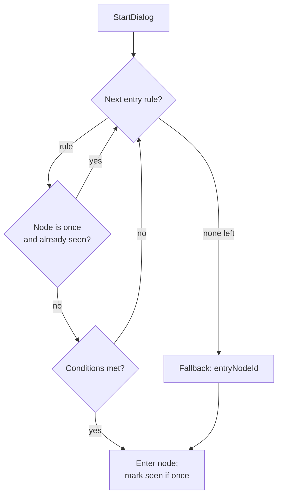

# Dialog System

Data-driven branching dialogs. Definitions live in `Assets/Game/Resources/Dialogs/<id>.json`
as locale-agnostic graphs (text is localization keys, resolved at runtime). `DialogNPC`
starts a dialog by id; `DialogService` drives it.

## Concepts

- **DialogDef** — a graph: `dialogId`, `entryNodeId` (fallback), `entryRules`, `nodes`.
- **DialogNode** — `speaker`, `once`, `lines[]`, `choices[]`, `onEnterActions[]`.
- **DialogChoice** — `textKey`, `nextNodeId`, `conditions[]`, `actions[]`.
  A single choice with an empty `textKey` auto-advances (used to chain scripted lines).
- **Entry rules** — ordered; the dialog opens at the first rule whose conditions pass and
  whose target node is not a spent one-shot. Falls back to `entryNodeId`.
- **once** — when a node marked `once` is entered, its global key `"<dialogId>.<nodeId>"`
  is recorded in `PlayerState.seenDialogNodes`; entry resolution then skips it.
- **Conditions** — `HasItem`, `DoesNotHaveItem`, `FlagSet`, `FlagNotSet`, `IsArmed`.
- **Actions** — `GiveItem`, `RemoveItem`, `SetFlag`, `ClearFlag`, `OpenShop`.
- **Quests** — modelled as flags (e.g. `quest_skull_started`, `quest_skull_done`); no
  dedicated quest subsystem.

## Resolution flow

## Code map

- `Core/Models/Dialog/` — data model (`DialogDef`, `DialogNode`, `DialogEntryRule`,
  `DialogChoice`, `DialogCondition`, `DialogAction`, `DialogLine`) + `DialogParser` / `DialogLoader`.
- `Core/Services/Dialog/DialogConditionEvaluator` — pure condition evaluation.
- `Core/Services/Dialog/DialogEntryResolver` — pure entry-node selection + `SeenKey`.
- `Core/Services/Dialog/DialogService` — runtime traversal, line/choice emission, actions, audio.
- `Features/Interactive/DialogNPC/DialogNPC` — starts a dialog by id.

## Persistence

`PlayerState.flags` and `PlayerState.seenDialogNodes` are persisted by `PlayerStateSaver`
as newline-joined strings. Within a session they also survive scene travel because
`GameManager` is `DontDestroyOnLoad`.

## Authoring a one-shot / conditional opening

1. Add the node(s); mark a node `once` if it should play at most once.
2. Add an entry rule pointing at it, with any `conditions`. Order rules most-specific first.
3. For scripted multi-speaker exchanges, chain nodes with empty-`textKey` auto-advance choices.
4. Add the referenced localization keys to the **Dialogs** string table.

See worked examples in `Resources/Dialogs/rikko.json` (intro / sabre / common) and
`captainclack.json` (quest start / reminder / completion).
