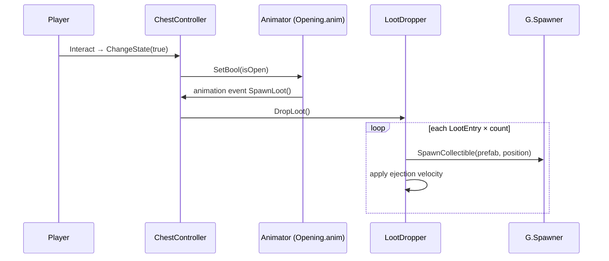

# Loot Drop

Loot drops from chests, barrels, enemies, and other loot sources are handled by
the **`LootDropper`** component (`Assets/Game/Core/Components/GameObjects/LootDropper.cs`).
Each loot source carries its own designer-defined loot list — there are no
shared loot table assets and no randomness in *what* drops (only the scatter
physics is randomized).

---

## Quick Start (designer workflow)

To define what a chest (or any loot source) drops:

1. Select the object — a chest instance in the scene, or an enemy prefab.
2. In its **`LootDropper`** component, edit the **`Loot`** list. Each entry is
   a collectible **prefab** plus a **count**, e.g.:
   - `CoinGold` × 10
   - `Diamond` × 1
3. Tune the scatter with `Initial Speed`, `Speed Random Factor`, and
   `Random Direction`.

Per-instance overrides work the usual Unity way: every chest placed in a scene
can have a unique loot list overriding the `Chest` prefab's default.

Loot prefabs must have a `Rigidbody2D` (they are ejected with physics) and are
typically `Collectable`-based pickups.

---

## API

| Method | Semantics | Used by |
|---|---|---|
| `DropLoot()` | Drops the full configured list: each entry spawns its prefab `count` times. | Chest (via `ChestController.SpawnLoot`), enemies, containers. |
| `DropLoot(int lootCount)` | Drops `lootCount` copies of the **first** entry's prefab; entry counts are ignored. For runtime-computed amounts. | `PlayerController.DropCoins` (coins lost on death), Barrel `onDeath` UnityEvent. |

Both methods no-op while `G.SceneState.IsRestoring` is true, so restored
(already-opened/destroyed) objects do not re-drop loot.

---

## Flow (chest example)

The `SpawnLoot` animation event fires mid-open (t = 0.4 s) so loot pops out as
the lid swings.

---

## Design notes

- **Deterministic by design.** A chest always drops exactly its configured
  list. If weighted/random tables are needed later, the `LootEntry` list can be
  lifted into a `LootTable` ScriptableObject without changing the consumers.
- **Reuse via prefabs, not assets.** Enemies of the same type share the loot
  list configured on their prefab; unique chests are per-instance overrides.
  This avoids managing one `.asset` per chest.
- `ChestController.isCollected` guards against double-drops within a scene
  visit; opened-state persistence across scene loads is the job of the state
  saving system (see [state-saving.md](state-saving.md)).
