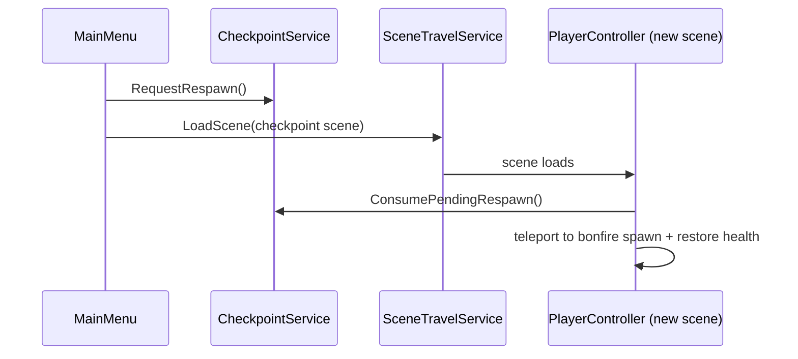

# Main Menu: Continue / New Game

When the player reaches the main menu with an in-progress game, the menu offers
**Continue** (resume from the last resting point) and **New Game** (wipe progress and
start over). Continue is shown only when a saved resting point exists.

## Persistence model

All save state lives in `DontDestroyOnLoad` services (`CheckpointService`,
`SceneStateService`, `GameManager`) and survives exiting to the main menu within the same app
run. It **also survives a full app quit and relaunch**: `SaveGameService` serializes those
services to a disk file and reloads them on launch, so a resting point can exist on a fresh
launch and **Continue** is shown. See [save-persistence.md](save-persistence.md) for the disk
layer and [state-saving.md](state-saving.md) for the underlying in-memory save system.

## "Saved game exists" detection

A saved resting point exists exactly when the player has rested at a bonfire, i.e.
`G.Checkpoint.Current.HasValue`. On launch this is populated from disk by
`SaveGameService.LoadIntoServices()` (in `GInit`) before the menu is shown. `MainMenu` checks
it in `OnEnable` (the window is freshly activated each time it is shown) and toggles the
Continue button's `GameObject` active state.

## Continue

`MainMenu.OnContinueClick()` reuses the existing cross-scene respawn path
(`PlayerController.RespawnAtCheckpointNow`):

World state (`StateRoot.Start`) is re-applied as usual. Continue does **not** wipe
session-tier state — it resumes the world as it was, repositioned to the resting point,
matching how death-respawn already behaves. Continue runs through the shared faded
transition (see [Scene transition](#scene-transition)).

## New Game and full reset

`MainMenu.OnNewGameClick()` — when a save exists it opens the `ConfirmDialog`
(`G.Config.ConfirmDialog`) configured with `ResetAndStart` as the confirm callback and a
localized prompt resolved from the `UI` string table, key
`ui.main_menu.confirm_new_game` (via `LocalizationSettings.StringDatabase.GetLocalizedString`,
falling back to the key string if the entry is missing — same pattern as `InfoSign`); with
no save it starts immediately. `ResetAndStart()` runs the shared faded transition (see
[Scene transition](#scene-transition)) and, while the screen is fully black, performs a full
in-memory reset, closes all menus, and loads the start scene. Running the reset
unconditionally means New Game always starts from the very beginning, even on a fresh launch
(the reset is idempotent there). The reset clears:

| Reset call | Clears |
|------------|--------|
| `GameManager.ResetPlayerState()` | inventory, coins, stats, flags, seen dialog (fresh `PlayerState`) |
| `CheckpointService.Reset()` | active checkpoint, discovered bonfires, pending-respawn flags |
| `SceneStateService.ResetAll()` | both session and persistent scene-state tiers |
| `SaveGameService.DeleteSave()` | the on-disk save file, so the wipe survives relaunch |

## Scene transition

Continue, New Game, and the pause menu's **Exit to Menu** all route through
`SceneTransition.FadeToScene(sceneName, options, whileFaded)`
(`Assets/Game/Core/Services/Scene/SceneTransition.cs`): it fades to black
(`G.Screen.RunWhenFadeOut`), runs the optional `whileFaded` work (New Game's reset), closes
all menus (`G.Menu.CloseAll`), loads the target scene (`G.SceneTravel.LoadScene`), then fades
back in. The work runs as a coroutine on the `DontDestroyOnLoad` `ScreenService`, so it
survives `CloseAll` destroying the calling menu — callers pass the scene name and any state
changes in rather than relying on staying alive. Fade durations are centralized in
`MainConfig` (`sceneFadeOutTime` / `sceneFadeInTime`, default 0.5s each). Fades use
`Time.realtimeSinceStartup`, so they work while a pausing menu has `Time.timeScale = 0`.

## Confirmation dialog

`Game.UI.ConfirmDialog.ConfirmDialog : AnimatedWindow` is a reusable yes/no window.
`Configure(message, onConfirm)` sets the prompt text and the confirm callback;
`OnConfirmClick()` closes the window then invokes the callback; `OnCancelClick()` just
dismisses. Opened through `MenuManager.OpenMenu`, so it participates in the normal menu
stack (Escape cancels via `CloseOnCancel`).

## Wiring (Unity Editor)

- `MainMenu.prefab`: "Start Game" renamed to **New Game**, its `onClick` re-wired to
  `MainMenu.OnNewGameClick`; a **Continue** button added (wired to `OnContinueClick`) and
  assigned to the `continueButton` field; window `FirstSelected` set to the New Game button
  (always active, so focus never lands on a hidden Continue).
- `ConfirmDialog.prefab`: confirm window with a `TMP_Text` message label (assigned to
  `messageLabel`) and Yes/No buttons wired to `OnConfirmClick` / `OnCancelClick`.
- `MainConfig` (`Resources/Configs/MainConfig`): `ConfirmDialog` field assigned to the
  `ConfirmDialog.prefab`.
- `UI` string table: add an entry with key `ui.main_menu.confirm_new_game` (for each
  locale) holding the confirmation prompt text.

## Key files

- `Assets/Game/UI/MainMenu/MainMenu.cs`
- `Assets/Game/UI/ConfirmDialog/ConfirmDialog.cs`
- `Assets/Game/Core/Services/CheckpointService.cs` (`Reset()`)
- `Assets/Game/Core/Services/SceneState/SceneStateService.cs` (`ResetAll()`)
- `Assets/Game/Configs/MainConfig.cs` (`ConfirmDialog` field)
