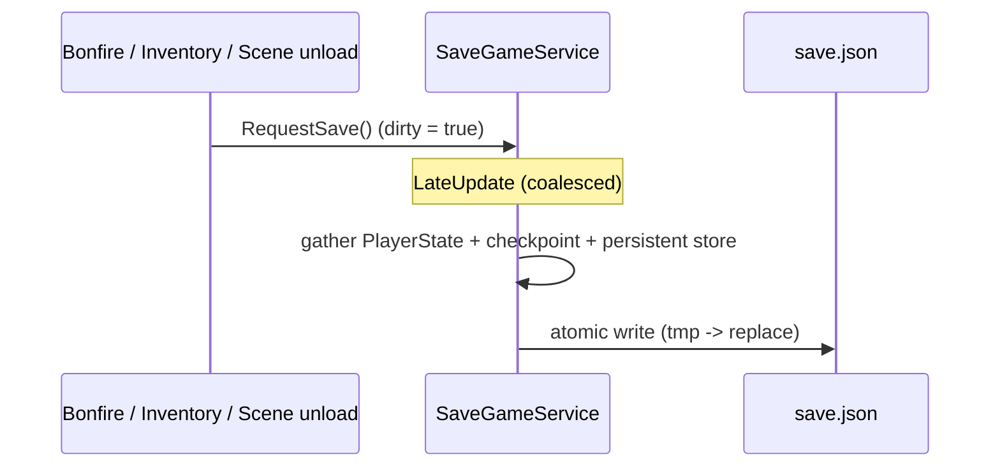

# Save Persistence (cross-session)

`SaveGameService` makes a playthrough survive a full app quit. It serializes the three
`DontDestroyOnLoad` services that already hold all save state to a single JSON file, reloads
them on launch, and deletes the file on **New Game**. No gameplay logic changes — it is a
persistence layer over the existing in-memory systems ([state-saving.md](state-saving.md),
[main-menu-continue.md](main-menu-continue.md)).

Runtime files live under `Assets/Game/Core/Services/Save/`.

---

## What is persisted

| Data | Source service | Notes |
|------|----------------|-------|
| Inventory, coins, collected items, stat levels, shop purchases, flags, seen dialog, HP, `IsArmed` | `GameManager.playerState` (`PlayerState`) | Whole `[Serializable]` object, always the **latest** value. |
| Active checkpoint + discovered bonfires | `CheckpointService` | `CheckpointRef` + the discovered-key set. |
| Permanent world state (opened doors, consumed switches, destroyed props) | `SceneStateService.persistentStore` | Persistent tier only. |

**Not persisted:** the **session tier** of scene state (weakened/killed enemies, moved
barrels). It is transient and always resets on respawn, so on Continue the hero returns to the
last bonfire with the transient world reset — exactly matching in-session death/rest behavior.
Only permanent progress and resources carry over.

## Save file

- Location: `Application.persistentDataPath/save.json` (single slot).
- Format: `JsonUtility` over `SaveData` (`SaveData.cs`), which nests `PlayerState`, the
  checkpoint, and a flattened scene-state snapshot.
- `SceneStateService`'s store is nested dictionaries of boxed primitives, which `JsonUtility`
  cannot serialize. `ExportPersistent()` / `ImportPersistent()` flatten it into
  `SceneStateSaveData` — typed lists where each field carries an `int type` tag selecting one
  of the `bool/int/float/string/vector2` columns.
- Writes are **atomic**: written to `save.json.tmp` then `File.Replace`d in, so a crash
  mid-write cannot corrupt an existing save.
- A `version` field guards the format. A missing, unreadable, or version-mismatched file is
  ignored (logged as a warning) and the game starts fresh — a bad file never blocks launch.

## When it saves

Every trigger marks the save **dirty**; a single write is flushed in `LateUpdate` (coalescing
bursts such as picking up a stack of coins), plus a best-effort flush on
`OnApplicationPause(true)` / `OnApplicationQuit` for mobile kills. Triggers:

1. **Checkpoint change** (`CheckpointService.OnCheckpointChanged`) — resting at a bonfire.
2. **Inventory change** (`InventoryModel.OnChange`) — every resource/item/coin change, so
   nothing collected is ever lost.
3. **Scene unload** (`SceneTravelService.BeforeUnload`) — flushes permanent world changes and
   stat/flag changes committed when leaving a room. Subscribed after `SceneStateService` so its
   capture runs first.

**Save is a no-op until a checkpoint exists.** Without a resting point there is nothing to
Continue to, and skipping the write keeps New Game (which clears the checkpoint) from
re-creating the file it just deleted.

## Load on launch

`GInit` creates `SaveGameService` alongside the other services and calls
`LoadIntoServices()` right after `G.Game.Init()` — before debug seeding and HUD init, so
nothing reads stale state. It applies the file over the fresh services:

- `GameManager.SetPlayerState(loaded)` — after `PlayerState.RebuildTransient()`, because
  `JsonUtility` bypasses the constructor and leaves the non-serialized panel models null.
- `CheckpointService.RestoreState(checkpoint, discovered)` — fires `OnCheckpointChanged` so
  bonfire visuals refresh; makes `Current.HasValue` true so the menu shows **Continue**.
- `SceneStateService.ImportPersistent(sceneState)` — repopulates the persistent tier; the
  session tier stays empty.

`SaveGameService.Init()` (subscriptions) is called *after* `SceneStateService.Init()` so the
BeforeUnload capture-then-save order holds.

### PlayerState rebinding

New Game and loading a save both **replace** the `PlayerState` instance (and its
`InventoryModel`). `GameManager` raises `PlayerStateChanged` on replacement;
`SaveGameService` listens and re-points its `InventoryModel.OnChange` hook at the new instance,
so the "never lose a resource" trigger keeps working after a reset or load.

## New Game

`MainMenu.ResetAndStart()` already resets all three services in memory; it now also calls
`SaveGameService.DeleteSave()`. Deleting (rather than overwriting) means that if the player
quits right after starting a New Game but before their first rest, the next launch correctly
shows no Continue. The next bonfire rest writes a fresh save.

## Key files

- `Assets/Game/Core/Services/Save/SaveGameService.cs` — the service (triggers, atomic write, load).
- `Assets/Game/Core/Services/Save/SaveData.cs` — root save DTO.
- `Assets/Game/Core/Services/SceneState/SceneStateSaveData.cs` — flattened scene-state snapshot.
- `Assets/Game/Core/Services/SceneState/SceneStateService.cs` — `ExportPersistent` / `ImportPersistent`.
- `Assets/Game/Core/Services/CheckpointService.cs` — `DiscoveredKeys` / `RestoreState`.
- `Assets/Game/Features/Hero/PlayerState.cs` — `RebuildTransient`.
- `Assets/Game/Core/Services/GameManager.cs` — `PlayerStateChanged` / `SetPlayerState`.
- `Assets/Game/Core/Bootstrap/GInit.cs` — create + load + init ordering.
- `Assets/Game/UI/MainMenu/MainMenu.cs` — `DeleteSave` on New Game.
