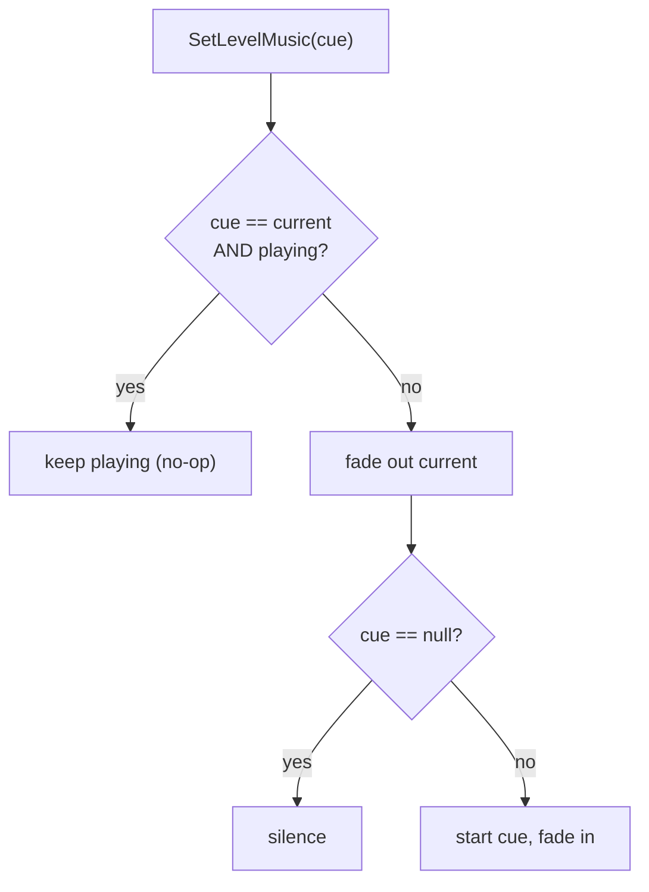
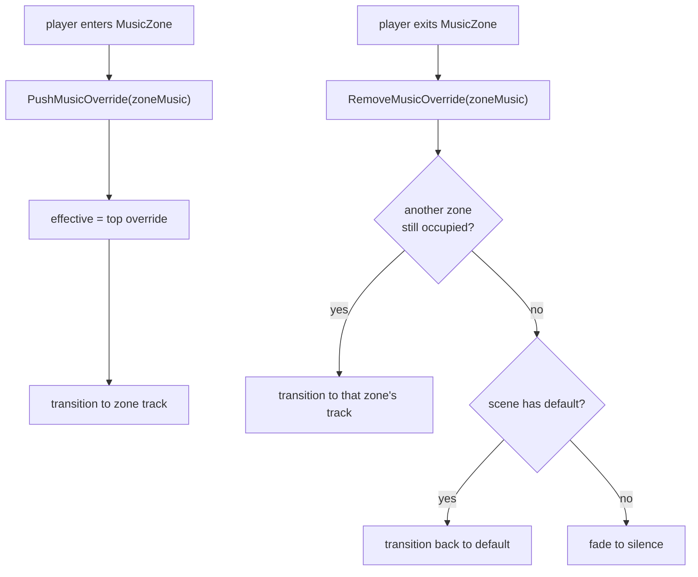

# Scene Music

Scene background music is owned by the central `AudioService` (`G.Audio`), which persists across
scene loads. A scene declares which track it wants; the service decides whether to keep the
current track playing or fade to a new one.

## Pieces

- **`LevelEntryPoint`** (`Assets/Game/Core/Components/SceneManagement/LevelEntryPoint.cs`) — a
  per-scene component holding the scene's music `AudioCue`. On `Start()` it calls
  `G.Audio.SetLevelMusic(cue)`. Assign `None` for a silent scene. It does **not** stop music on
  destroy — music must survive the unload so the next scene can keep the same track.
- **`AudioService`** — owns the single live music loop (`musicHandle`). It tracks the scene's
  base track (`defaultMusicCue`, set by `LevelEntryPoint`) and a stack of temporary zone
  overrides (`musicOverrides`). The **effective** track is the top override, or the default when
  no zone is active; `activeMusicCue` records what the live transition is playing so redundant
  restarts are skipped. Fade durations come from `MainConfig`.
- **`MusicZone`** (`Assets/Game/Core/Audio/MusicZone.cs`) — a trigger volume that overrides the
  scene music while the player is inside. On enter it pushes its `zoneMusic` cue; on a real exit
  (player leaves the collider, or the zone is disabled in a live scene) it reverts to the next
  occupied zone, the scene default, or silence (fade-out) when there is no default. Leave
  `zoneMusic` empty for a deliberate silence zone. Player overlap is ref-counted. When the zone's
  **scene unloads** it deliberately does **not** revert — see *Crossing scenes from a zone* below.
- **`MainConfig`** — `musicFadeOutTime` / `musicFadeInTime` (seconds).
- **`MainMenuLauncher`** — the menu is just another music context; it also calls
  `SetLevelMusic`.

## Behavior

- **Same track across scenes** → keeps playing (the no-op guard).
- **Different track** → sequential fade: current fades out, then new fades in.
- **Null cue** → fades to silence.

## Zone overrides

Music zones layer on top of the scene default without the scene knowing about them:

- Overrides form a **stack** — the most recently entered zone wins. Overlapping zones unwind in
  order as the player leaves each.
- A zone whose cue already matches the live track is a no-op (no restart), same as scene loads.
- A `null` zone cue is a silence override (fades the music out while inside). **Silence wins:** an
  active silence zone keeps the music off regardless of stack order, even while it overlaps a music
  zone. The music returns only once the player has left every silence zone.

### Crossing scenes from a zone

If the player crosses into a new scene while still inside a zone (e.g. a large zone containing the
entrance to the next scene), the zone must **not** revert to the old scene's default during unload —
otherwise it would briefly restart, then the new scene would start its own track. Note that during
unload the player's collider is destroyed, which fires the zone's `OnTriggerExit2D` *and*
`OnDisable`; neither must revert. Instead:

- `SceneTravelService` exposes `IsTransitioning`, true across the whole unload+load. The zone's
  revert path (`Deactivate`, reached from both trigger-exit and disable) is a no-op while a
  transition is in progress, leaving its override momentarily on the stack while the live track
  keeps playing.
- **Music changes are deferred during a transition.** `SetLevelMusic` / `PushMusicOverride` /
  `RemoveMusicOverride` go through `RequestMusicApply`, which — while `IsTransitioning` — only marks
  the music dirty instead of transitioning. `AudioService.Update` flushes it once the transition
  ends, applying the **final** effective track a single time. This matters on **return into a zone**:
  the destination's `LevelEntryPoint` sets the scene default (say A) in `Start`, then the player
  spawns inside the zone a few frames later (during the arrival cinematic) and pushes its track
  (B). Without deferral the track would thrash A→B and restart; with it, only the settled effective
  track (B) is applied, and since B is already playing it is a no-op.
- The final apply compares the effective track against what is **actually playing**
  (`activeMusicCue`). If they match — the player walked from a zone into a level with that same
  music, or back — it is a no-op and the track continues seamlessly. If they differ, it transitions
  normally.

## API surface (`IAudioService`)

- `SetLevelMusic(cue)` — set the scene default + transition (honors the keep-same-track guard).
- `PushMusicOverride(cue)` / `RemoveMusicOverride(cue)` — add/remove a zone override; the service
  transitions to whatever is effective afterwards.
- `StartLevelMusic()` — explicit restart of the live track (e.g. same-scene respawn).
- `StopLevelMusic(fade)` — duck: stop the loop, keep the assignments.
- `ClearLevelMusic(fade)` — stop and forget the default and all overrides (cutscene teardown).

## Extending later

Other event-driven music (combat stingers, timers) should call the same `AudioService` methods
rather than touching `AudioSource` directly — the service is the single owner of the music handle.

## Migration

Existing scenes were migrated from a raw `Music` AudioSource to a `LevelEntryPoint` by a
one-shot editor tool (`Tools > Audio > Migrate Scene Music`), which has since been removed. New
scenes should add a `LevelEntryPoint` with the desired music cue directly.
