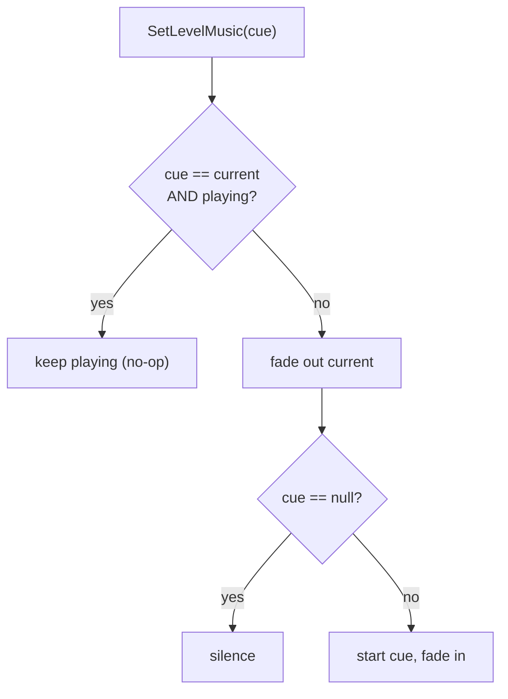

# Scene Music

Scene background music is owned by the central `AudioService` (`G.Audio`), which persists across
scene loads. A scene declares which track it wants; the service decides whether to keep the
current track playing or fade to a new one.

## Pieces

- **`LevelEntryPoint`** (`Assets/Game/Core/Components/SceneManagement/LevelEntryPoint.cs`) — a
  per-scene component holding the scene's music `AudioCue`. On `Start()` it calls
  `G.Audio.SetLevelMusic(cue)`. Assign `None` for a silent scene. It does **not** stop music on
  destroy — music must survive the unload so the next scene can keep the same track.
- **`AudioService`** — owns the single live music loop (`musicHandle`) and the assigned cue
  (`currentMusicCue`). Fade durations come from `MainConfig`.
- **`MainConfig`** — `musicFadeOutTime` / `musicFadeInTime` (seconds).
- **`MainMenuLauncher`** — the menu is just another music context; it also calls
  `SetLevelMusic`.

## Behavior

- **Same track across scenes** → keeps playing (the no-op guard).
- **Different track** → sequential fade: current fades out, then new fades in.
- **Null cue** → fades to silence.

## API surface (`IAudioService`)

- `SetLevelMusic(cue)` — assign + transition (honors the keep-same-track guard).
- `StartLevelMusic()` — explicit restart of the assigned cue (e.g. same-scene respawn).
- `StopLevelMusic(fade)` — duck: stop the loop, remember the cue.
- `ClearLevelMusic(fade)` — stop and forget the cue (cutscene teardown).

## Extending later

Event-driven music (combat stingers, zone triggers, timers) should call the same
`AudioService` methods rather than touching `AudioSource` directly — the service is the single
owner of the music handle.

## Migration

Existing scenes were migrated from a raw `Music` AudioSource to a `LevelEntryPoint` by a
one-shot editor tool (`Tools > Audio > Migrate Scene Music`), which has since been removed. New
scenes should add a `LevelEntryPoint` with the desired music cue directly.
