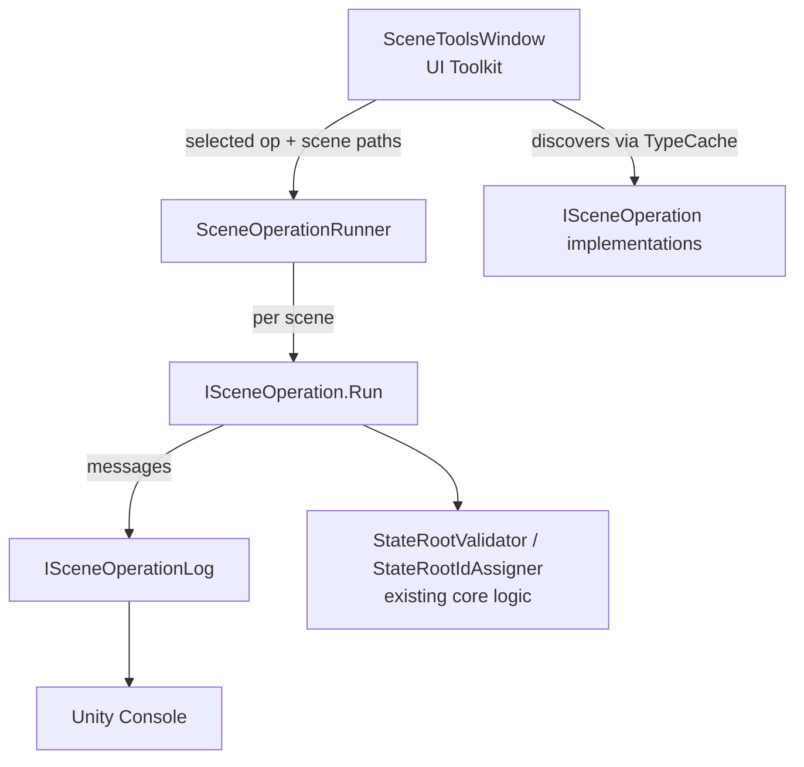

# Scene Tools Window

Editor window that runs per-scene maintenance operations (validate / fix) over one or many
scenes from a single place, replacing scattered `Tools/.../... (Open Scenes)` menu items.

Menu: **`Tools/Scene Tools`**. Editor-only; lives in `Assets/Game/Editor/SceneTools/`
(compiled into `Assembly-CSharp-Editor` because it sits under an `Editor` folder).

## Goals

- One window to pick an operation, pick scenes, run, and read results in the Console.
- Operate on **any** scene, not only the currently-open ones (open → operate → save → close).
- A reusable framework so future operations (Portals, Checkpoints, …) are a drop-in class.

First build wires only the **Scene State / StateRoot** operations. The framework is the point;
the rest migrate later.

## Architecture



### Operation contract

```csharp
public interface ISceneOperation {
    string Category { get; }     // groups ops in the dropdown, e.g. "Scene State"
    string DisplayName { get; }  // e.g. "Validate StateRoot Ids"
    bool Mutates { get; }        // false = read-only validator; true = fixer (may save)
    SceneOperationResult Run(Scene scene, ISceneOperationLog log);
}

public readonly struct SceneOperationResult {
    public readonly int Issues;   // problems found (validators)
    public readonly int Changes;  // mutations made (fixers); drives whether the scene is saved
}

public interface ISceneOperationLog {
    void Info(string message, Object context = null);
    void Error(string message, Object context = null);
}
```

Operations are discovered with `TypeCache.GetTypesDerivedFrom<ISceneOperation>()` and
instantiated (each must have a parameterless constructor). Adding an operation is a new class —
no central registry edit.

### Runner lifecycle

`SceneOperationRunner.Run(ISceneOperation op, IReadOnlyList<string> scenePaths)`:

1. If any open scene is dirty, call `EditorSceneManager.SaveCurrentModifiedScenesIfUserWantsTo()`;
   abort the run if the user cancels.
2. Snapshot the currently-open scene paths.
3. For each selected scene path (wrapped in `EditorUtility.DisplayProgressBar`):
   - If the scene is already open, use it; otherwise `OpenScene(path, OpenSceneMode.Additive)`.
   - `result = op.Run(scene, log)`; log lines are prefixed with the scene name.
   - If `op.Mutates && result.Changes > 0`, `MarkSceneDirty` then `SaveScene`.
   - If the runner opened the scene (it was not originally open), `CloseScene(scene, removeScene: true)`.
4. Restore the original open-scene set and log a summary: `N scenes, X issues, Y changes`.

Notes:
- Opening a scene in edit mode does not run `Awake`/`Start`, so inspection is side-effect free.
- Saving fires the existing `StateRootIdAssigner.OnSceneSaving` hook, so a fix run **also
  auto-assigns missing ids** as a side benefit.
- Validators never save (`Changes` stays 0), so running them over closed scenes leaves no dirt.

### Scene source

`SceneSource { BuildSettings, AllProject }`:
- **BuildSettings** — `EditorBuildSettings.scenes` (default; same source as Scene Topology / Catalog).
- **AllProject** — `AssetDatabase.FindAssets("t:Scene")` filtered to paths under `Assets/`.

Default selection on open = the currently-open scenes.

### Window (UI Toolkit)

A vertical flex layout with fixed top/bottom and a scrolling middle:

- **Toolbar (fixed, `flexShrink:0`):** Operation dropdown (grouped by Category) · Scene-source
  dropdown · Refresh.
- **Selection bar (fixed, `flexShrink:0`):** `All / None / Open`.
- **Scene tree (fills remaining, scrollable):** a `ScrollView` with `flexGrow:1, flexBasis:0`
  (the `flexBasis:0` is essential — with the default `auto` the ScrollView sizes to its content
  and pushes the footer off-screen instead of scrolling). Scenes are shown as a **collapsible
  checkbox tree** built from their paths: single-child directory chains are compressed into one
  row, ticking a directory selects/deselects every scene beneath it, and a directory's checkbox
  reflects whether all its descendant scenes are selected. Toggle state is synced with
  `SetValueWithoutNotify` to avoid feedback loops; expand/collapse state persists per directory.
- **Footer (fixed, `flexShrink:0`):** status label + Run button labeled `Run "<op>" on N scene(s)`;
  a hint warns that matching scenes will be saved when the chosen op `Mutates`.
- Output is Console-only; the status label echoes the last summary.

## StateRoot operations (first build)

- `ValidateStateRootIdsOperation` (`Mutates = false`) → `StateRootValidator.ValidateScene`,
  logging each `ValidationError` as an error with its context object; `Issues = error count`.
- `FixStateRootIdsOperation` (`Mutates = true`) → `StateRootIdAssigner.ReassignDuplicateIds`;
  `Changes = reassigned count`. Save (triggered by the runner) heals missing ids via the
  on-save hook.

## Files

```
Assets/Game/Editor/SceneTools/
  ISceneOperation.cs
  SceneOperationResult.cs
  ISceneOperationLog.cs
  SceneOperationRunner.cs
  SceneSource.cs
  SceneToolsWindow.cs
  Operations/
    ValidateStateRootIdsOperation.cs
    FixStateRootIdsOperation.cs
```

## Migration / removals

- Delete `Assets/Game/Editor/SceneState/StateRootValidationMenu.cs` — its two
  `... (Open Scenes)` menu items are now the window + operations.
- **Keep** `StateRootValidator` and `StateRootIdAssigner` (core logic, also used by the auto
  on-save assignment) and the project-level `Tools/Scene State/Rebuild Scene Catalog`
  (not per-scene; out of scope).

## Out of scope (this build)

- Migrating Portals (Doors / Entrances / Entrances Horizontal) and Checkpoints validators —
  later drop-in operations.
- In-window log panel (Console only for now).
- Per-operation custom options UI.
