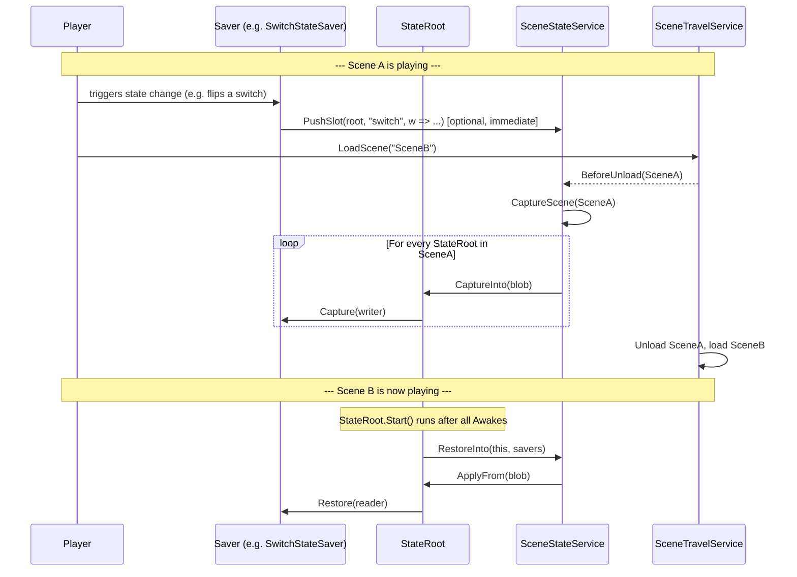

# State Saving

Scene-object state that survives scene transitions and bonfire rests is handled
by the **`SceneStateService`**, using the **`StateRoot` + saver component**
pattern. This document covers how to add state-saving to a new object, the
built-in savers available today, and the internals of the system.

Related files live under `Assets/Game/Core/Services/SceneState/` and
`Assets/Game/Editor/SceneState/`.

---

## Quick Start

To make a scene object remember a piece of state:

1. Add a **`StateRoot`** component to the GameObject.
2. Set its **`Tier`** in the Inspector (`Session` or `Persistent` — see below).
3. Add one or more **saver components** as siblings on the same GameObject
   (e.g. `TransformStateSaver`, `DestructionStateSaver`).
4. If the object is destroyed at runtime, wire `Damageable.onDeath` (or your
   equivalent destruction trigger) to **`DestructionStateSaver.MarkDestroyedAndDestroy`**
   instead of `Destroy(GameObject)`.
5. Save the scene. The Editor will auto-assign a stable `Save ID` to the new
   `StateRoot`. Run **Tools → Scene State → Rebuild Scene Catalog** after adding
   or removing scenes from build settings.

Capture and restore are then fully automatic across scene transitions.

---

## Save Tiers

Set on each `StateRoot` instance via the `Tier` field.

| Tier         | Cleared when                                       | Use for                                                  |
|--------------|----------------------------------------------------|----------------------------------------------------------|
| `Session`    | The player rests at a bonfire or dies (`ClearSessionState`). | Weakened enemies, moved barrels, transient progress.     |
| `Persistent` | Never within a playthrough.                        | Opened doors, consumed Helms, permanently destroyed props.|

Tier is per-instance, not per-prefab: the same prefab can be `Session` in one
scene and `Persistent` in another with no code changes.

Defined in `SaveTier.cs`.

---

## End-to-End Flow

The service is wired up in `GInit.cs` and subscribes to `SceneTravelService.BeforeUnload`.



Two important properties of this flow:

- **Snapshot-on-leave.** `Capture` is called per-`StateRoot` when the scene is
  about to unload. Only `StateRoot`s still alive in the scene at that moment are
  visited (`SceneStateService.FindStateRootsInScene`).
- **Push-on-event.** Savers can also push a single slot immediately via
  `G.SceneState.PushSlot(...)`. This is required for state that must survive
  even if the player force-quits before leaving the scene, and **mandatory for
  destruction** because a destroyed object is no longer present at unload time.

---

## Core Concepts

### `StateRoot` (`StateRoot.cs`)

A marker component that gives a GameObject:

- a stable **`SaveId`** (auto-assigned at scene save by `StateRootIdAssigner`),
- a **`Tier`** (`Session` / `Persistent`),
- an optional **`SkipSave`** flag for dynamically spawned instances that share a
  prefab with scene-placed saveables (e.g. dropped coins).

`StateRoot.Start()` calls `G.SceneState.RestoreInto(this, savers)` — restore
happens once per object, after all `Awake` calls in the scene have completed.

Enforces one-per-GameObject via `[DisallowMultipleComponent]`. A custom
inspector (`StateRootEditor.cs`) shows the `SaveId` as read-only.

### `IStateSaver` (`IStateSaver.cs`)

Implemented by sibling components that contribute one **slot** of state.

```csharp
public interface IStateSaver {
    string Slot { get; }                 // unique within the containing StateRoot
    void Capture(IStateWriter w);
    void Restore(IStateReader r);
}
```

`IStateWriter` / `IStateReader` are typed primitives: `bool`, `int`, `float`,
`string`, `Vector2`. Vectors are stored as `float[2]` so the blob remains
JSON-serializable (future-proofing for disk save).

`StateSaverBase` (`Savers/StateSaverBase.cs`) is the base class for all built-in
savers; it requires a sibling `StateRoot`.

### `StateBlob` (`StateBlob.cs`)

The per-object container of saved data. Layout: `slot → field → value`.

- One blob per `(sceneGuid, saveId)`.
- Stored in `SceneStateService.sessionStore` or `persistentStore` depending on
  the `StateRoot.Tier`.
- Values are primitives only — no references, no `UnityEngine.Object`.

### `SaveId` assignment

`SaveId`s are generated by `StateRootIdAssigner.cs` (editor-only,
`InitializeOnLoad`) on every scene save:

- Format: `"{PrefabName}_{N}"`, e.g. `"Thorns_3"`.
- `N` is unique within the scene.
- Existing IDs are **never** changed once assigned, so saved data stays valid
  across edits.
- Prefab assets must not carry a `SaveId`. `StateRoot.OnValidate` clears any
  that leaks in.

The user never types a Save ID. The inspector shows it read-only.

> **Duplicate IDs.** Duplicating a GameObject (Ctrl+D) copies its `saveId`, and
> the assigner only fills *empty* IDs — so two objects can end up sharing one
> save slot and overwriting each other's state. This is caught two ways:
> - On every scene save, `StateRootIdAssigner` logs a console **error** for any
>   duplicate (after assigning missing IDs).
> - `Tools ▸ Scene State ▸ Validate StateRoot Ids (Open Scenes)` runs the same
>   check on demand (`StateRootValidator.cs`).
>
> To repair flagged duplicates, either:
> - **One at a time:** select the offending instance and press **Clear** next to
>   its Save ID in the inspector, then save the scene.
> - **In bulk:** run `Tools ▸ Scene State ▸ Fix Duplicate StateRoot Ids (Open
>   Scenes)`, which reassigns a fresh unique id to every duplicate (the first
>   occurrence keeps its id), then save the scene(s).
>
> Either way the assigner's `"{PrefabName}_{N}"` scheme produces the new id.

### `SceneCatalog` (`SceneCatalog.cs`)

State is keyed by **scene asset GUID**, not scene filename, so saved data
survives scene renames and moves.

The `SceneCatalog` ScriptableObject is the edit-time map of `scenePath → GUID`.

- Created via `Assets → Create → Config → Scene Catalog`, assigned to
  `MainConfig.SceneCatalog`.
- Rebuilt by `SceneCatalogBuilder.cs`:
  - **Manually**: `Tools → Scene State → Rebuild Scene Catalog`.
  - **Before every build**: via `IPreprocessBuildWithReport`.
  - **Before entering Play mode**: via `SceneCatalogPlayModeRebuild` — this
    catches rename-then-playtest races during development.
- If a scene is not in the catalog, capture/restore is silently skipped for
  that scene and a one-time warning is logged.

---

## Built-in Savers

All live in `Assets/Game/Core/Services/SceneState/Savers/`. Each is a
`StateSaverBase` subclass and is added as a sibling of `StateRoot`.

### `TransformStateSaver`

Saves position (and optionally rotation) of physics-driven props.

- **Slot:** `"transform"`
- **Captures:** `transform.position` (Vector2). Z-rotation as a float when
  `Save Rotation` is enabled in the Inspector.
- **On restore:** zeroes `Rigidbody2D.velocity` to avoid overlap forces if the
  object is restored mid-air.
- **Suitable for:** draggable barrels, pushable crates.
- **Not suitable for:** in-flight projectiles, parented objects that move with
  a parent.

### `DestructionStateSaver`

Tracks whether a scene-placed object has been **permanently destroyed**.

- **Slot:** `"destroyed"`
- **Captures:** a single `bool` (`"d"` field).
- **On restore:** if `d == true`, immediately `Destroy(gameObject)` — the scene
  has re-instantiated the prop and we need to remove it to match saved state.
- **Default state** (no saved data) = not destroyed.

**Wiring rule:** never `Destroy()` a saveable object directly. Call
`DestructionStateSaver.MarkDestroyedAndDestroy()` instead — typically from
`Damageable.onDeath`. This flips the local flag **and** immediately pushes the
state via `G.SceneState.PushSlot`, so the destruction survives even if the
player force-quits before the next scene unload.

A bare `Destroy()` skips the saver entirely and the object will respawn.

### `DamageableStateSaver`

Saves and restores `Damageable.currentHealth`.

- **Slot:** `"damageable"`
- **Captures:** `Damageable.Health` (float, `"hp"` field).
- **Push-on-change:** subscribes to `Damageable.OnHealthChanged` and pushes the
  new HP via `PushSlot` on every change. The blob is therefore always current,
  not only on scene unload.
- **On restore:** calls `Damageable.SetHealth(hp)`.
- **Typical tier:** `Session` — weakened enemies fully heal at the bonfire.

### `SwitchStateSaver`

Saves the disabled state of a `Switch` component (single-use switches like the
Helm).

- **Slot:** `"switch"`
- **Captures:** `Switch.isDisabled` as `"disabled"` bool.
- **Snapshot-on-leave only** (no push-on-change).
- **Typical tier:** `Persistent` — once consumed, stays consumed.

### `SwitchableStateSaver`

Saves the active state of any `SwitchableBase` (e.g. `StoneDoor`).

- **Slot:** `"switchable"`
- **Captures:** `SwitchableBase.IsActive` as `"active"` bool.
- **Snapshot-on-leave only.**
- **Typical tier:** `Persistent` — opened doors stay open.

### `PlayerStateSaver`

Specialised saver attached to the hero prefab. Carries hero state across scene
reloads.

- **Slot:** `"player"`
- **Captures:** `IsArmed` flag, stat upgrade levels (Health / MeleeDamage /
  ThrowDamage), and current HP.
- **On restore:** writes stats into `G.Game.playerState`, then calls
  `controller.ApplyCurrentStats()` and `controller.Damageable.SetHealth(...)`
  so the live components reflect the restored values.
- **Tier choice** is per-hero-prefab Inspector setting.

---

## Wiring Recipes

### Destructible prop (barrel, thorns)

Components on the prefab:
- `StateRoot` — `Tier = Persistent` (kept dead forever) or `Session` (respawn
  on bonfire rest).
- `DestructionStateSaver`.

In the `Damageable` component's `On Death` UnityEvent:
- Call `DestructionStateSaver.MarkDestroyedAndDestroy` on the same GameObject.
- **Remove** any direct `Destroy` / `DestroyObjectComponent.DestroySelf` call —
  `MarkDestroyedAndDestroy` performs the destroy itself.

### Permanent door / consumed switch

Components on the prefab:
- `StateRoot` — `Tier = Persistent`.
- `SwitchableStateSaver` on the door, `SwitchStateSaver` on the switch.

No event wiring required; both savers operate snapshot-on-leave.

### Draggable barrel (resets on rest)

Components on the prefab:
- `StateRoot` — `Tier = Session`.
- `TransformStateSaver`.

### Weakened enemy

Components on the prefab:
- `StateRoot` — `Tier = Session` (full heal at bonfire) or `Persistent` (HP
  carries over forever).
- `DamageableStateSaver`.

If the enemy can also die permanently, add `DestructionStateSaver` and wire
`Damageable.onDeath → DestructionStateSaver.MarkDestroyedAndDestroy`.

### Dynamically spawned instance that shares a prefab

Set **`StateRoot.SkipSave = true`** on the spawned instance (or at spawn time).
The service skips both capture and restore for these objects so dynamic spawns
do not accidentally write to the slot of a missing scene placement.

---

## Writing a Custom Saver

Subclass `StateSaverBase` and implement `Slot`, `Capture`, and `Restore`. The
sibling `StateRoot` is enforced by `[RequireComponent]` on the base class.

```csharp
using Game.Core.Services.SceneState;
using Game.Core.Services.SceneState.Savers;
using UnityEngine;

public sealed class MyThingStateSaver : StateSaverBase {
    private MyThing thing;

    public override string Slot => "myThing";   // unique within the StateRoot

    private void Awake() {
        thing = GetComponent<MyThing>();
    }

    public override void Capture(IStateWriter w) {
        w.SetInt("level", thing.Level);
        w.SetVector2("anchor", thing.Anchor);
    }

    public override void Restore(IStateReader r) {
        if (r.TryGetInt("level", out var level)) {
            thing.Level = level;
        }
        if (r.TryGetVector2("anchor", out var anchor)) {
            thing.Anchor = anchor;
        }
    }
}
```

Guidelines:

- **Pick a short, distinctive slot key.** It must be unique within one
  `StateRoot` but can repeat across different objects.
- **Pick short field keys** (`"hp"`, `"d"`). They appear in every blob and will
  eventually be serialised to disk.
- **`TryGet*` returns false for missing keys.** Always handle that — it is the
  "no saved state yet" path on the very first visit.
- **Don't store references to scene/asset objects.** Only primitives survive
  the round-trip.
- **Decide push vs snapshot.** If the state change is rare and important
  (destruction, single-use switch consumption), push immediately via
  `G.SceneState.PushSlot`. Otherwise, snapshot-on-leave is fine.
- **Suppress side effects during restore.** `SceneStateService.IsRestoring` is
  `true` while `Restore` runs — useful if your component's setters normally
  trigger SFX, FX, or analytics events that should not fire when the saved
  state is being re-applied.

---

## Push vs Snapshot

Two ways for a saver to write into the store:

| Mechanism                    | When it runs                                | When to use                                                              |
|------------------------------|---------------------------------------------|--------------------------------------------------------------------------|
| **Snapshot** (`Capture`)     | On scene unload, for all live `StateRoot`s. | State you can read off the component at any time (HP, transform, flags). |
| **Push** (`PushSlot`)        | Immediately, in response to an event.       | Destruction, single events that must survive force-quit, or out-of-scene changes. |

`Capture` is always called on unload regardless of whether you also push. Pushes
overwrite the blob's slot field-by-field, so a later snapshot can overwrite a
pushed value — keep both writers consistent.

`DestructionStateSaver` is push-only at the moment of death (because the
object will be gone by unload time) and also implements `Capture` to round-trip
the flag when re-saving an already-destroyed (hidden) instance.

---

## Integration Touchpoints

- **`SceneTravelService.BeforeUnload`** — `SceneStateService.Init()` subscribes
  to this. Triggers `CaptureScene(scene)` for every scene transition.
- **`SceneTravelService.LoadScene(name, SceneLoadOptions { SkipStateCapture = true })`** —
  opt out of capture for destinations with no gameplay (e.g. main menu).
- **`SceneStateService.ClearSessionState()`** — called by `Bonfire.DoInteract`
  (rest) and by `PlayerController` death/respawn to clear the Session store; the
  scene then reloads and Session-tier objects return to their default state.
  It must be called immediately before the reload: the reload's `BeforeUnload →
  CaptureScene` would otherwise re-save still-present Session objects (e.g. a
  killed enemy whose corpse lingers in the scene with `destroyed = true`) back
  into the just-cleared store, so `ClearSessionState` suppresses Session-tier
  capture for that single unload pass.
- **`SceneStateService.IsRestoring`** — `true` while saved state is being
  applied to live objects. Useful for suppressing one-shot side effects in
  setters.
- **`G.SceneState.PushSlot(root, slot, writer => ...)`** — push a single slot
  field-by-field, immediately.

---

## Editor Tooling

| Tool                                                 | Where it lives                          | What it does                                                                                  |
|------------------------------------------------------|-----------------------------------------|-----------------------------------------------------------------------------------------------|
| **StateRoot custom inspector**                       | `StateRootEditor.cs`                    | Shows the auto-assigned `Save ID` read-only; **Clear** button regenerates it on next save.    |
| **Auto Save ID assignment**                          | `StateRootIdAssigner.cs`                | On every scene save, generates `"{PrefabName}_{N}"` for any `StateRoot` without an ID; logs an error on any duplicate id. |
| **Tools → Scene State → Validate StateRoot Ids**     | `StateRootValidator.cs` / `StateRootValidationMenu.cs` | On-demand check for missing or duplicate `saveId`s across all open scenes.       |
| **Tools → Scene State → Fix Duplicate StateRoot Ids**| `StateRootIdAssigner.ReassignDuplicateIds` / `StateRootValidationMenu.cs` | Reassigns a fresh unique id to every duplicate in open scenes (first keeps its id); save to persist. |
| **Tools → Scene State → Rebuild Scene Catalog**      | `SceneCatalogBuilder.cs`                | Rebuilds `SceneCatalog` from build settings.                                                  |
| **Pre-build catalog rebuild**                        | `SceneCatalogBuilder.OnPreprocessBuild` | Automatic before every player build.                                                          |
| **Pre-Play-mode catalog rebuild**                    | `SceneCatalogPlayModeRebuild`           | Catches scene renames that would otherwise break GUID lookup at the next playtest.            |

---

## Common Pitfalls and Diagnostics

| Symptom                                                                                                  | Likely cause                                                                                                                                                | Fix                                                                                                                                                              |
|----------------------------------------------------------------------------------------------------------|-------------------------------------------------------------------------------------------------------------------------------------------------------------|------------------------------------------------------------------------------------------------------------------------------------------------------------------|
| Destroyed object reappears on return.                                                                    | `Damageable.onDeath` calls raw `Destroy` instead of `DestructionStateSaver.MarkDestroyedAndDestroy`. The object is gone before `CaptureScene` runs.         | Rewire `onDeath` to call `DestructionStateSaver.MarkDestroyedAndDestroy` on the same GameObject. Remove any direct destroy call.                                  |
| Console warning: `StateRoot on '...' has no saveId — skipped.`                                            | The `StateRoot` was added but the scene was not saved afterwards.                                                                                            | Save the scene. `StateRootIdAssigner` will populate the ID.                                                                                                       |
| Console warning: `Scene '...' is not in the catalog. State capture/restore will be skipped.`              | A scene was added to build settings but the catalog was not rebuilt.                                                                                         | Run **Tools → Scene State → Rebuild Scene Catalog**. (Happens automatically before each build and before entering Play mode.)                                     |
| State never restores after entering a new scene.                                                          | `G.SceneState == null` at `StateRoot.Start` — `SceneStateService` wasn't initialised, or `MainConfig.SceneCatalog` is unassigned.                            | Verify `GInit` ran and `MainConfig.SceneCatalog` is wired in the project's `MainConfig` asset.                                                                    |
| Dynamically spawned prefab instances overwrite the saved slot of the scene-placed copy.                  | The runtime spawn carries the prefab's `StateRoot` and shares its slot accounting.                                                                          | Set `StateRoot.SkipSave = true` on the spawned instance.                                                                                                          |
| Side effects (SFX, analytics) fire when entering a scene where state is restored.                        | Component setters run normally during `Restore`.                                                                                                            | Guard with `if (G.SceneState != null && G.SceneState.IsRestoring) return;` in the setter.                                                                         |

---

## File Reference

Runtime (`Assets/Game/Core/Services/SceneState/`):
- `SceneStateService.cs` — the service: capture, restore, push, bonfire reset.
- `StateRoot.cs` — per-object marker (`SaveId`, `Tier`, `SkipSave`).
- `IStateSaver.cs` — saver interface plus `IStateWriter` / `IStateReader`.
- `StateBlob.cs` — in-memory storage per `(sceneGuid, saveId)`.
- `SaveTier.cs` — `Session` / `Persistent` enum.
- `SceneCatalog.cs` — scene-path-to-GUID lookup, ScriptableObject.
- `Savers/StateSaverBase.cs` — base class for all built-in savers.
- `Savers/TransformStateSaver.cs`
- `Savers/DestructionStateSaver.cs`
- `Savers/DamageableStateSaver.cs`
- `Savers/SwitchStateSaver.cs`
- `Savers/SwitchableStateSaver.cs`
- `Savers/PlayerStateSaver.cs`

Editor (`Assets/Game/Editor/SceneState/`):
- `StateRootIdAssigner.cs` — auto-assigns `SaveId` on scene save.
- `SceneCatalogBuilder.cs` — menu + pre-build + pre-Play-mode catalog rebuild.

Bootstrap:
- `Assets/Game/Core/Bootstrap/GInit.cs` — creates `SceneStateService` and calls
  `Init()` after `SceneTravelService` is up.
- `Assets/Game/Core/Services/Scene/SceneTravelService.cs` — owner of the
  `BeforeUnload` event that drives capture.

Custom inspector:
- `Assets/Game/Core/Services/SceneState/Editor/StateRootEditor.cs`.
